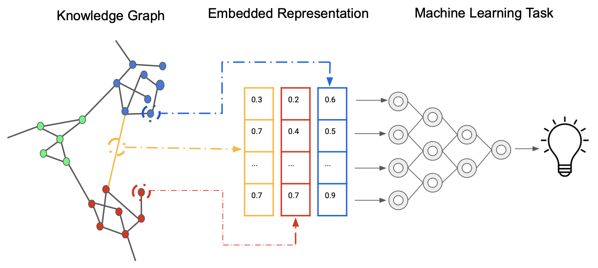

## Table of Contents

## What are graph embeddings and why are they important in machine learning?

Graph embeddings are a way to represent the nodes and edges of a graph in a lower-dimensional space, usually as vectors. Imagine you have a social network where people are connected by friendships. Graph embeddings would take all this information and turn it into numbers that a computer can easily understand and work with. These numbers, or vectors, capture important information about how the nodes (people) are connected and how they relate to each other. This makes it easier for machine learning algorithms to process and analyze the graph data.

Graph embeddings are important in machine learning because they help solve complex problems more efficiently. For example, in recommendation systems, graph embeddings can help predict what products a customer might like based on their connections to other customers and products. By turning the graph into vectors, machine learning models can find patterns and make predictions faster and more accurately. This is especially useful in large datasets where traditional methods might be too slow or impractical. Graph embeddings make it possible to apply powerful machine learning techniques to graph-structured data, which is common in many real-world applications like social networks, biological networks, and more.

## How do graph embeddings help in understanding the structure of graphs?

Graph embeddings help us understand the structure of graphs by turning the complex connections between nodes into simpler, numerical representations. Imagine a graph as a map of cities connected by roads. Graph embeddings take this map and convert it into a set of coordinates for each city, where the distance between these coordinates reflects how closely the cities are connected in the original map. This way, we can see which cities (or nodes) are similar or closely related just by looking at their coordinates.

These numerical representations, or embeddings, make it easier to spot patterns and relationships that might be hard to see in the original graph. For example, if two nodes have very similar embeddings, it means they are likely connected in similar ways to other nodes in the graph. This can help us understand the overall structure of the graph, like identifying clusters or communities within it. By using graph embeddings, we can analyze and visualize the graph's structure more effectively, making it simpler to draw insights and make decisions based on the data.

## What is the basic principle behind node2vec and DeepWalk?

Node2vec and DeepWalk are methods used to create graph embeddings. They both work by turning the paths or walks through a graph into something a computer can understand better. Imagine you're walking through a city. The paths you take can tell you a lot about how different places are connected. Node2vec and DeepWalk use these paths to learn about the graph. They do this by randomly walking through the graph many times and recording the nodes they visit. These walks are then used to train a model that predicts which nodes are likely to appear together in a walk.

The main difference between node2vec and DeepWalk is how they choose their paths. DeepWalk uses a simple random walk, which means it picks the next node to visit completely at random. Node2vec, on the other hand, uses a smarter way to walk. It can choose to explore more locally around a node or jump to more distant parts of the graph. This is controlled by two parameters, $$p$$ and $$q$$, which help decide the next step in the walk. By adjusting these parameters, node2vec can capture different aspects of the graph's structure, making its embeddings more flexible and useful for different kinds of analysis.

## Can you explain the concept of Laplacian Positional Encoding (Laplacian PE) in graph embeddings?

Laplacian Positional Encoding (Laplacian PE) is a way to turn the positions of nodes in a graph into numbers that a computer can easily use. Think of it like giving each node a unique address based on where it is in the graph. Laplacian PE uses something called the Laplacian matrix, which is a special way to look at how nodes are connected. By using the Laplacian matrix, Laplacian PE can capture how far apart nodes are from each other, not just if they are directly connected. This helps in creating embeddings that keep the graph's structure in mind.

To make Laplacian PE work, you first need to calculate the Laplacian matrix of the graph. This matrix shows how nodes are connected and how far apart they are. Then, you use this matrix to create what are called eigenvectors and eigenvalues. These are like special directions and sizes that help describe the graph's shape. By using these, Laplacian PE turns each node into a set of numbers, or an embedding, that shows its position in the graph. This way, even if two nodes are not directly connected, their embeddings can show how they relate to each other in the whole graph.

## How does TransE work and in what scenarios is it most effective?

TransE is a way to turn the connections between things in a graph into numbers that a computer can understand. It's used a lot in knowledge graphs, where you have things like people, places, and events, and the connections between them. TransE works by thinking of each thing as a point in space. If two things are connected, like "Paris" and "France" with the connection "is located in," TransE tries to make the point for "Paris" close to the point for "France." It does this by using a simple math rule: if you have a connection from thing A to thing B, the point for A plus the connection should be close to the point for B. This is written as $$h + r \approx t$$, where h is the head (A), r is the relation (connection), and t is the tail (B).

TransE is most effective in scenarios where the relationships between things are simple and can be thought of as translations in space. It works really well for knowledge graphs where you want to find new connections or predict missing ones. For example, if you know that "Paris is located in France" and "France is located in Europe," TransE can help you figure out that "Paris is located in Europe." It's simple and fast, making it great for large graphs where you need quick answers. But, TransE might not be the best choice for more complex graphs where the relationships are not so straightforward, because it assumes all connections work the same way.

## What are the key differences between LapEigen and HOPE methods for graph embeddings?

LapEigen and HOPE are two methods for making graph embeddings, but they work differently. LapEigen uses something called the Laplacian matrix to turn the graph into numbers. It looks at how nodes are connected and how far apart they are. By using the Laplacian matrix, LapEigen finds special directions and sizes called eigenvectors and eigenvalues. These help create embeddings that show where each node is in the graph, even if they're not directly connected. This method is good for capturing the overall shape of the graph.

HOPE, or High-Order Proximity preserved Embedding, takes a different approach. It tries to keep both direct connections and more complex relationships between nodes. HOPE uses something called a generalized singular value decomposition (GSVD) to make its embeddings. This method looks at how nodes are connected not just directly but also through paths of different lengths. By doing this, HOPE can capture more detailed information about the graph's structure. This makes it useful for graphs where understanding indirect connections is important.

## How does the TuckER model enhance knowledge graph embeddings?

The TuckER model makes knowledge graph embeddings better by using a special math trick called tensor factorization. Imagine you have a big box full of information about how things in a knowledge graph are connected. The TuckER model looks at this box from different angles and breaks it down into simpler pieces. By doing this, it can capture more details about the relationships between things, like people, places, and events. This means the model can understand and predict these relationships more accurately than simpler models.

TuckER uses something called a Tucker decomposition, which is like cutting a cake into smaller pieces to see its layers. This helps the model keep track of not just simple connections but also more complex ones. For example, if you know that "Paris is located in France" and "France is in Europe," TuckER can better understand that "Paris is in Europe" too. This makes it really useful for tasks like predicting missing information in knowledge graphs or answering questions about them.

## What are the advantages of using RotatE over other knowledge graph embedding methods?

RotatE is a special way to make embeddings for knowledge graphs that has some cool advantages over other methods. One big advantage is that it can handle different types of relationships between things in a graph really well. RotatE thinks of relationships as rotations in a circle. If you have a connection like "Paris is located in France," RotatE turns this into a rotation that moves the point for "Paris" to be close to the point for "France." This helps it understand not just if things are connected but how they are connected. For example, it can tell the difference between "is located in" and "is the capital of," which some other methods might mix up.

Another advantage of RotatE is that it's good at understanding relationships that go both ways. If you know that "France is the location of Paris," RotatE can easily figure out that "Paris is located in France" too. This is because the rotation for "is located in" is just the opposite of the rotation for "is the location of." This makes RotatE really useful for tasks like finding new connections or predicting missing ones in a knowledge graph. By using rotations, RotatE can capture the structure of the graph in a way that's both simple and powerful.

## How does Graph Isomorphism Network (GIN) improve upon traditional graph neural networks?

Graph Isomorphism Network (GIN) is a type of graph [neural network](/wiki/neural-network) that's better at telling different graphs apart. Imagine you have two graphs that look a bit similar but are actually different. Traditional graph neural networks might mix them up, but GIN is designed to spot the differences. It does this by using a special way to combine information from a node and its neighbors. This method, called a sum aggregator, helps GIN capture the unique structure of each graph more accurately. By using this technique, GIN can tell if two graphs are the same or different, which is really important in many tasks like classifying graphs or finding patterns in them.

One big advantage of GIN is that it's based on a math idea called the Weisfeiler-Lehman (WL) test. The WL test is like a game where you color the nodes of a graph based on their neighbors. If two graphs end up with the same colors after playing this game, they might be the same. GIN uses a similar idea to make sure its embeddings are as unique as possible for different graphs. This makes GIN more powerful and flexible than many traditional graph neural networks, which can struggle to capture the full structure of a graph. By being able to distinguish graphs better, GIN helps in tasks where understanding the exact structure of a graph is key.

## Can you describe the mechanism of Variational Graph Auto-Encoders (VGAE) in learning graph representations?

Variational Graph Auto-Encoders (VGAE) are a way to learn about graphs by turning them into numbers that a computer can understand easily. Imagine you have a graph with nodes and edges, and you want to find a way to describe each node in a simpler way. VGAE does this by using two main parts: an encoder and a decoder. The encoder takes the graph and turns each node into a set of numbers, or a vector, that tries to capture the important information about how the node is connected to others. This is done using something called a probabilistic model, which means it uses a bit of randomness to make the vectors. The decoder then takes these vectors and tries to rebuild the original graph from them. By doing this over and over, VGAE learns to make better and better vectors that represent the graph well.

The magic of VGAE happens in how it uses probabilities to make its vectors. When the encoder turns a node into a vector, it doesn't just give one set of numbers. Instead, it gives two: one that says what the numbers should be on average, and another that says how much they can vary. This is called a normal distribution, and it's written as $$q(z_i | x_i)$$, where $$z_i$$ is the vector for node $$i$$ and $$x_i$$ is the information about that node in the graph. The decoder then uses these vectors to figure out how likely it is that two nodes are connected, using a formula like $$p(A_{ij} | z_i, z_j)$$, where $$A_{ij}$$ is the edge between nodes $$i$$ and $$j$$. By training the model to make the rebuilt graph as close as possible to the original, VGAE learns to create vectors that really show what the graph is all about.

## What role do hyperbolic embeddings (HypE) play in capturing hierarchical structures within graphs?

Hyperbolic embeddings, or HypE, are a special way to turn graphs into numbers that can show how things are organized in a tree-like or hierarchical way. Imagine you have a family tree where grandparents, parents, and children are connected. HypE can take this tree and put it into a space that looks like a cone or a funnel. In this space, things that are higher up in the tree, like grandparents, are near the top of the cone, and things lower down, like children, are near the bottom. This helps computers understand and work with the tree structure better because the distances between points in the cone can show how closely related things are.

HypE is really good at capturing these hierarchical structures because it uses a type of math called hyperbolic geometry. In this geometry, the space curves in a way that lets it fit more things at the top and fewer at the bottom, just like a family tree. This means HypE can represent complex hierarchies without losing important details. For example, if you have a company with many levels of management, HypE can help show how each level is connected and how far apart they are in the company's structure. By using hyperbolic embeddings, computers can see and work with these hierarchies more easily, making it useful for tasks like organizing data or finding patterns in complex networks.

## How do advanced models like KGRefiner and ComplEx-N3-RP refine and enhance graph embeddings for complex knowledge graphs?

KGRefiner and ComplEx-N3-RP are advanced models that make graph embeddings better, especially for knowledge graphs that are really complex. KGRefiner works by looking at the graph over and over again, each time making the embeddings a bit more accurate. It does this by using a special way to check how good the embeddings are and then tweaking them to make them better. This helps KGRefiner capture not just the simple connections but also the more complicated relationships between things in the graph. For example, if you have a graph about movies, actors, and directors, KGRefiner can help understand how they all fit together, even if the connections are not straightforward.

ComplEx-N3-RP, on the other hand, uses a math trick to handle different types of relationships. It thinks of each relationship as a rotation in a special space, kind of like how RotatE works, but it can handle even more types of relationships. ComplEx-N3-RP uses something called a complex number to do this, which helps it tell the difference between different kinds of connections. For example, it can tell the difference between "acted in" and "directed" in a movie graph. By using these complex numbers, ComplEx-N3-RP can create embeddings that show a more detailed picture of the graph, making it easier to find patterns and predict new connections.