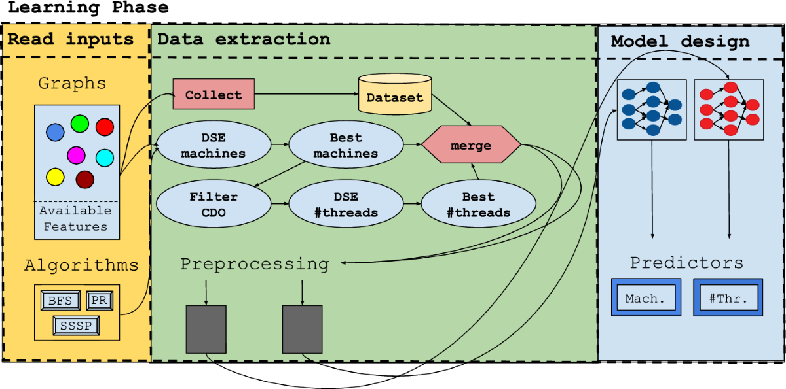

## Table of Contents

## What is Graph Execution in the context of machine learning?

Graph Execution in machine learning refers to a way of running machine learning models where the entire model is represented as a computational graph. This graph shows how data flows through different operations and how these operations are connected. Instead of running the model step-by-step, like in traditional programming, the whole graph is built first and then executed all at once. This approach can make the model run faster and use less memory because it allows for optimizations that are not possible with step-by-step execution.

A common example of graph execution is found in frameworks like TensorFlow. In TensorFlow, you define your model as a graph of operations, and then you can run this graph on different devices like CPUs or GPUs. This is different from frameworks like PyTorch, which use eager execution, where operations are run immediately as they are called. Graph execution can be more efficient for large models and complex computations because it allows the system to see the entire model at once and optimize how it runs.

## How does Graph Execution differ from traditional sequential processing?

Graph Execution and traditional sequential processing are two different ways to run a program. In traditional sequential processing, the computer follows the instructions one by one, in the order they are written. This is like following a recipe step-by-step. Each step waits for the previous step to finish before it starts. This method is straightforward and easy to understand, but it can be slow for complex tasks because it doesn't look at the whole program to find ways to make it run faster.

In contrast, Graph Execution builds a complete picture of the program as a graph before running it. This graph shows all the steps and how they connect, like a map of the entire recipe. Once the graph is built, the computer can look at it and find the best way to run all the steps at once or in the most efficient order. This can make the program run much faster and use less memory, especially for big and complicated tasks like machine learning models. By seeing the whole graph, the computer can do things like run parts of the program at the same time or save and reuse results from earlier steps.

## What are the main components of a computational graph in machine learning?

A computational graph in [machine learning](/wiki/machine-learning) is made up of nodes and edges. Nodes represent operations or variables. For example, a node might be an addition operation or a number like 5. Edges show how data moves between nodes. If you have a node for the number 5 and another node for the number 3, and an addition node, there would be edges from the 5 and the 3 to the addition node to show that you are adding them together.

The graph starts with input nodes, which are the data you put into the model. These could be things like images or numbers. The data then flows through the graph, going through different operations like multiplication or activation functions. At the end, you have output nodes, which are the results of your model, like a prediction or a classification. The graph can also have special nodes for things like loss functions, which help the model learn by telling it how far off its predictions are from the correct answers. By connecting all these nodes and edges, the graph shows the whole process of how the model works from start to finish.

## Can you explain how data flows through a computational graph?

Data flows through a computational graph starting from the input nodes. These input nodes represent the data you feed into the model, like images or numbers. From these input nodes, the data travels along the edges of the graph to different operation nodes. Each operation node performs a specific task on the data, such as adding two numbers together or applying an activation function. For example, if you have two input nodes with values 3 and 5, and an addition node connected to them, the data flows from the input nodes to the addition node, which then computes $$3 + 5$$ to give an output of 8.

After passing through various operation nodes, the data eventually reaches the output nodes. These output nodes represent the final results of your model, like a prediction or a classification. Along the way, the data might also go through nodes that represent loss functions, which help the model learn by measuring how well it's doing. The entire path that the data takes, from input to output, is determined by the edges of the graph, which show how the nodes are connected. This flow of data through the graph allows the model to process information and produce meaningful results.

## What are the advantages of using Graph Execution for machine learning models?

Graph Execution in machine learning makes models run faster and use less memory. When you use Graph Execution, the whole model is built as a graph before it runs. This lets the computer see all the steps at once and find the best way to do them. For example, it can run parts of the model at the same time or save and reuse results from earlier steps. This is different from traditional ways where the computer follows the steps one by one, which can be slow for big models.

Another advantage is that Graph Execution can work well on different types of hardware. For example, it can run on CPUs or GPUs. This is helpful because GPUs are good at doing many calculations at the same time, which can make the model run even faster. By building the whole model as a graph, the computer can use the hardware in the best way possible. This makes Graph Execution a powerful tool for running complex machine learning models efficiently.

## How does Graph Execution improve the efficiency of neural network training?

Graph Execution helps make training neural networks faster and more efficient. When you use Graph Execution, the whole [neural network](/wiki/neural-network) is built as a graph before it starts running. This lets the computer see all the steps at once and find the best way to do them. For example, it can run parts of the network at the same time or save and reuse results from earlier steps. This is different from traditional ways where the computer follows the steps one by one, which can be slow for big models.

Another way Graph Execution improves efficiency is by working well on different types of hardware. For example, it can run on CPUs or GPUs. GPUs are good at doing many calculations at the same time, which can make the training process even faster. By building the whole model as a graph, the computer can use the hardware in the best way possible. This makes Graph Execution a powerful tool for training complex neural networks efficiently.

## What are some popular frameworks that support Graph Execution?

TensorFlow is one of the most popular frameworks that supports Graph Execution. In TensorFlow, you build your model as a graph of operations before running it. This lets TensorFlow find the best way to run your model, like doing parts of it at the same time or using the hardware in the best way. For example, TensorFlow can run on both CPUs and GPUs, which helps make your model run faster.

Another framework that supports Graph Execution is Apache MXNet. Like TensorFlow, MXNet lets you build your model as a graph and then run it efficiently. MXNet is known for being flexible and fast, and it can also run on different types of hardware. This makes it a good choice for training big and complex machine learning models.

## How can Graph Execution be implemented in TensorFlow?

To implement Graph Execution in TensorFlow, you start by building your model as a graph of operations. In TensorFlow, this means defining your model using TensorFlow's API. You create nodes for inputs, operations like addition or multiplication, and outputs. These nodes are connected by edges to show how data flows through the model. For example, if you want to add two numbers, you create nodes for the numbers and an addition node, and connect them with edges. Once your graph is built, you can use TensorFlow's session to run the graph. This lets TensorFlow look at the whole graph and find the best way to run it, like doing parts at the same time or using the hardware efficiently.

Here's a simple example of how you might implement Graph Execution in TensorFlow:

```python
import tensorflow as tf

# Define the graph
a = tf.constant(3.0)
b = tf.constant(5.0)
c = tf.add(a, b)

# Create a session and run the graph
with tf.compat.v1.Session() as sess:
    result = sess.run(c)
    print(result)  # This will print 8.0
```

In this example, we define constants `a` and `b` and an addition operation `c`. We then use a session to run the graph and get the result. By building and running the model this way, TensorFlow can optimize how it runs, making it faster and more efficient, especially for big and complex models.

## What challenges might one face when optimizing a model using Graph Execution?

One challenge when optimizing a model using Graph Execution is that it can be hard to debug. When you build your model as a graph and run it all at once, it's not easy to see what's happening step-by-step. If something goes wrong, like if your model is not learning well or if it's giving the wrong answers, it can be tough to figure out where the problem is. You might need special tools or ways to look at the graph and see how the data is flowing through it. This can take time and make it harder to fix problems quickly.

Another challenge is that building and optimizing the graph can take a lot of time and memory, especially for very big and complex models. When you build the whole model as a graph, the computer needs to keep the whole graph in memory and find the best way to run it. This can use a lot of resources, and if your model is too big, you might run out of memory or have to wait a long time for the graph to be built and optimized. For example, if you have a neural network with many layers and lots of connections, the graph can get very big and complicated, making it hard to work with.

## How does Graph Execution handle dynamic computational graphs?

Graph Execution can handle dynamic computational graphs, which means the graph can change as the model runs. In traditional Graph Execution, the graph is built once and stays the same. But with dynamic graphs, parts of the graph can be added or changed while the model is running. This is helpful for models that need to do different things based on the data they see. For example, in a neural network, the graph might change if some parts of the data need more processing than others. This makes the model more flexible and able to handle different kinds of data.

One way to handle dynamic graphs in Graph Execution is by using frameworks like TensorFlow with its eager execution mode or PyTorch, which supports dynamic graphs out of the box. In TensorFlow, you can switch between graph and eager execution, which lets you build parts of the graph on the fly. In PyTorch, the graph is rebuilt every time you run the model, so it can change based on the data. This makes it easier to debug and experiment with different parts of the model. By using these tools, you can make your model more adaptable and efficient, even when the graph needs to change.

## What advanced techniques can be used to further optimize Graph Execution?

One advanced technique to optimize Graph Execution is called graph pruning. This means you can remove parts of the graph that don't need to run every time. For example, if some parts of your model only need to run when certain conditions are met, you can cut those parts out when they're not needed. This can save time and memory because the computer doesn't have to do extra work. In TensorFlow, you can use the `tf.autograph` feature to automatically optimize your graph this way, making your model run faster.

Another technique is called operation fusion. This is when you combine multiple small operations into one bigger operation. For example, if you have a series of additions and multiplications, you can combine them into one operation that does all the math at once. This can make the model run faster because it reduces the number of steps the computer needs to do. In TensorFlow, you can use the `tf.function` decorator to help the system find and fuse operations automatically. By using these techniques, you can make your model more efficient and faster to run.

## How does Graph Execution impact the scalability of machine learning models?

Graph Execution helps make machine learning models more scalable by letting the computer see the whole model at once. When you build your model as a graph, the computer can find the best way to run it, like doing parts at the same time or using the hardware in the best way. This makes the model run faster and use less memory, which is important when you're working with big datasets or complex models. For example, if you have a neural network with many layers, Graph Execution can help it run more efficiently by optimizing how the data flows through the graph.

However, there are some challenges to consider. Building and optimizing a big graph can take a lot of time and memory. If your model is very complex, the graph might be too big to handle easily. Also, if the graph needs to change while the model is running, like in dynamic graphs, it can be harder to optimize and debug. But with the right tools and techniques, like graph pruning and operation fusion, you can make your model more scalable and efficient. For example, in TensorFlow, you can use `tf.autograph` and `tf.function` to help optimize your graph and make it run better on big and complex models.