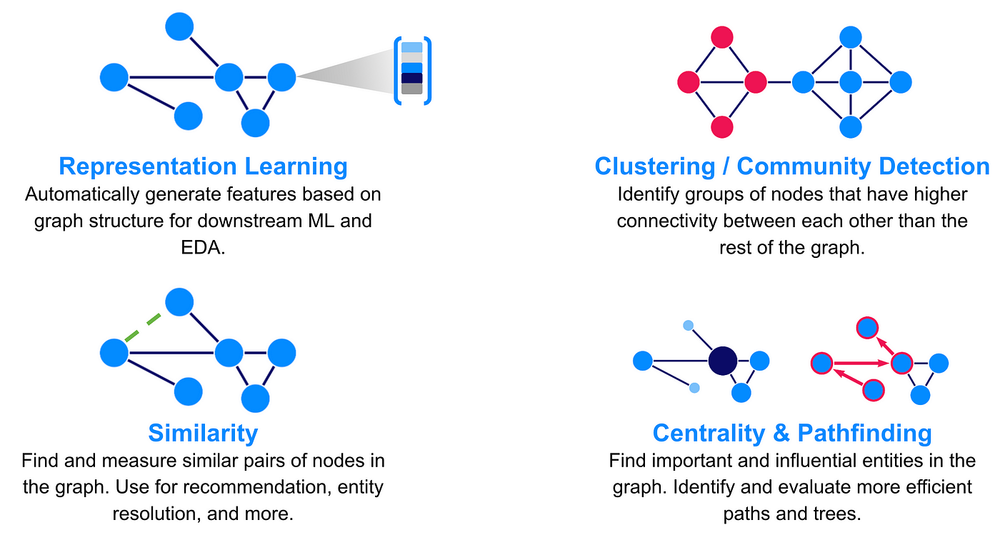

## Table of Contents

## What is a graph model in the context of machine learning?

A graph model in machine learning is a way to represent data using nodes and edges. Think of nodes as points or items, and edges as lines that connect these points. This type of model is useful for understanding relationships and patterns in data that are more complex than simple lists or tables. For example, in a social network, people can be represented as nodes, and their friendships as edges. This helps in analyzing how information spreads or how communities form.

Graph models are used in various machine learning tasks, such as classification, clustering, and recommendation systems. They are particularly good at handling data where the connections between items are important. For instance, in a recommendation system, a graph model can show how users are connected to the items they like, helping to suggest new items based on similar patterns. Algorithms like Graph Neural Networks (GNNs) are specifically designed to work with graph-structured data, making them powerful tools for these kinds of tasks.

## How do graph models differ from traditional neural networks?

Graph models and traditional neural networks handle data differently. Traditional neural networks, like feedforward or convolutional neural networks, work well with data that's organized in grids or sequences, like images or text. They process this data layer by layer, with each neuron connected to all neurons in the next layer. In contrast, graph models are designed for data that has a more complex structure, where the relationships between data points are important. In a graph, data points are represented as nodes, and the relationships between them as edges. This makes graph models great for things like social networks or molecular structures, where the connections between items matter a lot.

The key difference in how they process data comes from their structure. Traditional neural networks assume a fixed structure, where the connections between neurons are set and don't change based on the input data. For example, in a [convolutional [neural network](/wiki/neural-network)](/wiki/convolutional-neural-network), the same filter is applied across the entire image. On the other hand, graph models can adapt their structure based on the input graph. They use the edges to pass information between nodes, allowing them to capture the unique patterns and relationships in the data. This flexibility makes graph models powerful for tasks where the relationships between data points are key to understanding the problem at hand.

## What are some common applications of graph models in machine learning?

Graph models in [machine learning](/wiki/machine-learning) are often used in social network analysis. They can help understand how people connect with each other, how information spreads, and how communities form. For example, in a social media platform, graph models can show how users are linked through friendships or shared interests. This helps in tasks like recommending new friends or predicting which posts might go viral based on how users interact with each other.

Another common use of graph models is in recommendation systems. They can represent users and items as nodes, and the interactions between them as edges. This way, the model can find patterns in what users like and suggest new items that are similar to their past choices. For instance, in an online shopping site, graph models can suggest products that other users with similar tastes have bought, making the recommendations more personalized and effective.

Graph models are also used in fields like drug discovery and molecular biology. They can represent molecules as graphs, where atoms are nodes and bonds are edges. This helps in predicting how different molecules might interact with each other, which is crucial for finding new drugs. By analyzing these graphs, researchers can identify potential drug candidates faster and more accurately, speeding up the process of bringing new treatments to market.

## Can you explain the basic architecture of a Graph Convolutional Network (GCN)?

A Graph Convolutional Network (GCN) is a type of neural network designed to work with graph-structured data. In a GCN, each node in the graph has its own set of features, and the goal is to learn how these features should be updated based on the node's neighbors. The basic idea is to use the connections in the graph to pass information between nodes, allowing each node to learn from its neighbors. This process is similar to how a convolutional neural network applies filters to images, but instead of using fixed grids, GCNs use the flexible structure of the graph.

The architecture of a GCN involves layers, just like traditional neural networks. In each layer, the features of each node are updated using a function that considers both the node's current features and the features of its neighbors. This is often done using a simple formula like $$H^{(l+1)} = \sigma(\tilde{D}^{-\frac{1}{2}}\tilde{A}\tilde{D}^{-\frac{1}{2}}H^{(l)}W^{(l)})$$ where $$H^{(l)}$$ represents the features at layer $$l$$, $$\tilde{A}$$ is the adjacency matrix with added self-connections, $$\tilde{D}$$ is the degree matrix, $$W^{(l)}$$ is a weight matrix, and $$\sigma$$ is an activation function. By stacking multiple layers, the GCN can capture more complex patterns in the data, allowing it to learn from the graph structure and make predictions or classifications based on the relationships between nodes.

## How does Graph Attention Network (GAT) improve upon GCNs?

Graph Attention Networks (GATs) improve upon Graph Convolutional Networks (GCNs) by using attention mechanisms. In GCNs, every neighbor of a node gets the same amount of attention when updating the node's features. GATs change this by letting the network decide which neighbors are more important. This is done using attention scores, which help the network focus on the most relevant neighbors. This makes GATs better at handling graphs where some connections are more important than others.

The attention mechanism in GATs works by computing attention coefficients for each edge in the graph. These coefficients are calculated using a function that looks at the features of the connected nodes. The formula for this is $$e_{ij} = \text{LeakyReLU}(\mathbf{a}^T[\mathbf{W}\mathbf{h}_i \,||\, \mathbf{W}\mathbf{h}_j])$$, where $$\mathbf{h}_i$$ and $$\mathbf{h}_j$$ are the feature vectors of nodes $$i$$ and $$j$$, $$\mathbf{W}$$ is a weight matrix, and $$\mathbf{a}$$ is an attention vector. After calculating these coefficients, they are normalized using a softmax function to get the final attention scores. This allows GATs to learn and adapt to the importance of different connections in the graph, making them more flexible and powerful than GCNs.

## What is the role of GraphSAGE in handling large-scale graphs?

GraphSAGE, which stands for Graph Sample and Aggregate, is a method designed to handle large-scale graphs efficiently. Unlike traditional graph neural networks that might need to process the entire graph at once, GraphSAGE uses a sampling technique. It picks a small number of neighbors for each node instead of using all of them. This makes it much faster and able to work with huge graphs that might have millions of nodes and edges. By sampling, GraphSAGE can still learn useful information from the graph without needing to look at every single connection.

The way GraphSAGE works is by generating node embeddings, which are like short summaries of each node's information. It does this by first choosing a few neighbors for each node, then combining the features of these neighbors with the node's own features. This combination can be done in different ways, like taking the mean or using a more complex function. The formula for updating a node's embedding might look like this: $$h_v^{(k)} = \sigma(W \cdot \text{AGGREGATE}(\{h_u^{(k-1)}, \forall u \in \mathcal{N}(v)\}) + W \cdot h_v^{(k-1})$$, where $$h_v^{(k)}$$ is the new embedding for node $$v$$ at layer $$k$$, $$\sigma$$ is an activation function, $$W$$ is a weight matrix, and $$\text{AGGREGATE}$$ is the function used to combine the neighbor's embeddings. This process helps GraphSAGE learn from large graphs efficiently and effectively.

## How do Message Passing Neural Networks (MPNN) work and what are their advantages?

Message Passing Neural Networks (MPNN) are a type of graph neural network that work by passing information between nodes in a graph. Imagine you have a group of friends, and you want to know more about each friend by asking their other friends. In an MPNN, each node (friend) sends a "message" to its neighbors. These messages are based on the node's own features and the features of the edge connecting it to its neighbor. The messages are then combined and used to update the features of each node. This process can happen over several rounds, allowing information to spread across the graph. The formula for updating a node's features might look like this: $$h_v^{(t+1)} = U(h_v^{(t)}, \text{AGGREGATE}(\{M(h_v^{(t)}, h_u^{(t)}, e_{vu}), \forall u \in \mathcal{N}(v)\}))$$, where $$h_v^{(t)}$$ is the feature of node $$v$$ at time step $$t$$, $$U$$ is an update function, $$M$$ is a message function, and $$\text{AGGREGATE}$$ combines the messages from the neighbors.

The main advantage of MPNNs is their flexibility. They can handle different types of graphs, like social networks or molecular structures, because they can use different message and update functions based on the problem. This means they can learn complex patterns and relationships in the data. Another advantage is that MPNNs can be used for a wide range of tasks, from predicting the properties of molecules to recommending products in a shopping app. By passing messages between nodes, MPNNs can capture the important connections in the graph, making them powerful tools for understanding and working with graph-structured data.

## What are some advanced techniques used in Graph Transformers for processing graph-structured data?

Graph Transformers are a type of neural network that use attention mechanisms to process graph-structured data. They are inspired by the success of transformers in natural language processing, but adapted to handle the unique structure of graphs. In a Graph Transformer, each node in the graph gets a special kind of attention score that helps it focus on the most important neighbors. This is done using a self-attention mechanism, which calculates how much each node should pay attention to other nodes based on their features. The formula for computing attention in a Graph Transformer might look like $$ \text{Attention}(Q, K, V) = \text{softmax}\left(\frac{QK^T}{\sqrt{d_k}}\right)V $$, where $$Q$$, $$K$$, and $$V$$ are query, key, and value matrices derived from the node features, and $$d_k$$ is the dimension of the keys.

One advanced technique used in Graph Transformers is the use of positional encodings. In traditional transformers, positional encodings help the model understand the order of words in a sentence. For graphs, which don't have a fixed order, positional encodings are used to capture the structural information of the graph. This can be done using techniques like Laplacian eigenvectors or random walk encodings, which provide each node with a unique position in the graph. Another technique is the use of multi-head attention, which allows the model to focus on different aspects of the graph at the same time. By using multiple attention heads, Graph Transformers can capture a wider range of relationships and patterns in the data, making them more effective at tasks like node classification or graph prediction.

## How does Deep Graph Convolutional Neural Network (DGCNN) incorporate both local and global graph structures?

Deep Graph Convolutional Neural Network (DGCNN) is a type of neural network that works with graph data. It's special because it can look at both the close neighbors of a node (local structure) and the whole graph (global structure) at the same time. DGCNN does this by using a method called graph convolution to update the features of each node based on its neighbors. This helps it understand the local connections in the graph. But DGCNN doesn't stop there; it also uses a technique called sorting to arrange the nodes in a way that captures the overall structure of the graph. This sorting helps the network see the big picture, not just the small details.

To explain this a bit more, when DGCNN processes a graph, it first applies several layers of graph convolution. Each layer updates the node features by looking at the features of its neighbors. This is like asking your friends for their opinions to get a better understanding of something. The formula for updating a node's features might look like $$H^{(l+1)} = \sigma(\tilde{D}^{-\frac{1}{2}}\tilde{A}\tilde{D}^{-\frac{1}{2}}H^{(l)}W^{(l)})$$, where $$H^{(l)}$$ is the feature matrix at layer $$l$$, $$\tilde{A}$$ is the adjacency matrix with added self-connections, $$\tilde{D}$$ is the degree matrix, $$W^{(l)}$$ is a weight matrix, and $$\sigma$$ is an activation function. After these layers, DGCNN sorts the nodes based on their updated features. This sorting step helps the network see how different parts of the graph relate to each other, giving it a sense of the global structure. By combining these local and global views, DGCNN can make better predictions about the graph.

## What is the significance of Graph Isomorphism Network (GIN) in terms of expressive power?

Graph Isomorphism Network (GIN) is important because it can tell the difference between graphs that are very similar, which is something many other graph neural networks struggle with. GIN does this by using a special way of updating the features of each node in the graph. It uses a formula that lets the network learn how to combine the features of a node and its neighbors in a way that captures more details about the graph's structure. The formula for updating a node's features in GIN is $$h_v^{(k)} = \text{MLP}^{(k)} \left( (1 + \epsilon^{(k)}) \cdot h_v^{(k-1)} + \sum_{u \in \mathcal{N}(v)} h_u^{(k-1)} \right)$$, where $$h_v^{(k)}$$ is the new feature of node $$v$$ at layer $$k$$, $$\text{MLP}^{(k)}$$ is a multi-layer perceptron, and $$\epsilon^{(k)}$$ is a learnable parameter. This helps GIN to be more powerful and able to understand more about the graph than other methods.

The expressive power of GIN means it can solve problems that other graph neural networks might not be able to. For example, it can tell if two graphs are the same even if they look a bit different, like if the nodes are in a different order. This is useful in many areas, like chemistry where you might want to know if two molecules are the same even if they are drawn differently. By being able to capture more details about the graph, GIN helps in making better predictions and understanding the data more deeply.

## How do techniques like DiffPool and MinCutPool contribute to graph pooling and what are their differences?

Graph pooling is a way to make graphs smaller by combining nodes together. DiffPool and MinCutPool are two techniques that help with this. DiffPool works by using a neural network to learn how to group nodes into clusters. It does this by creating a soft assignment matrix that shows how much each node belongs to each cluster. This matrix is then used to make a smaller graph where each cluster becomes a new node. The formula for the soft assignment matrix in DiffPool might look like $$S = \text{softmax}(Z^{(l)}W^{(l)})$$ where $$Z^{(l)}$$ is the node feature matrix at layer $$l$$ and $$W^{(l)}$$ is a learnable weight matrix. This way, DiffPool can keep important information about the graph's structure even after it's been made smaller.

MinCutPool, on the other hand, focuses on keeping the connections between nodes strong. It tries to group nodes together in a way that cuts as few edges as possible. This is like trying to divide a group of friends into smaller groups while making sure they stay connected to as many friends as possible. MinCutPool uses a different method to decide how to group nodes, often using a technique called spectral clustering. While DiffPool is good at learning how to group nodes, MinCutPool is better at keeping the graph's connections intact. Both methods help make graphs smaller, but they do it in different ways based on what's most important for the task at hand.

## What are the latest developments in graph models, such as Symbolic Deep Learning and NeuroTactic, and how do they push the boundaries of graph-based machine learning?

Symbolic Deep Learning and NeuroTactic are new ways to work with graphs that are pushing the limits of what we can do with graph-based machine learning. Symbolic Deep Learning mixes traditional symbolic AI, which uses rules and logic, with [deep learning](/wiki/deep-learning), which learns from data. This mix helps the model understand and work with graphs in a more human-like way. For example, it can use logic to figure out how different parts of a graph are related, and then use deep learning to learn from the data. This makes the model better at tasks like understanding complex networks or predicting how things will change over time. By combining these two approaches, Symbolic Deep Learning can handle problems that are too hard for just one method alone.

NeuroTactic, on the other hand, is a new way to use graphs to solve problems in strategy games and other complex decision-making tasks. It uses a graph to represent the different moves and outcomes in a game, and then uses machine learning to find the best strategy. NeuroTactic can learn from past games and improve its strategy over time. This makes it very good at games where the rules are clear but the best moves are hard to find. By using graphs to map out all the possible moves and outcomes, NeuroTactic can explore a huge number of possibilities and find the best path forward. Both Symbolic Deep Learning and NeuroTactic show how graphs can be used in new and exciting ways to solve tough problems.

## References & Further Reading

[1]: Kipf, T. N., & Welling, M. (2017). ["Semi-Supervised Classification with Graph Convolutional Networks."](https://arxiv.org/abs/1609.02907) International Conference on Learning Representations (ICLR).

[2]: Hamilton, W., Ying, Z., & Leskovec, J. (2017). ["Inductive Representation Learning on Large Graphs."](https://arxiv.org/abs/1706.02216) Advances in Neural Information Processing Systems (NeurIPS).

[3]: Velickovic, P., Cucurull, G., Casanova, A., Romero, A., Liò, P., & Bengio, Y. (2018). ["Graph Attention Networks."](https://arxiv.org/abs/1710.10903) International Conference on Learning Representations (ICLR).

[4]: Gilmer, J., Schoenholz, S. S., Riley, P. F., Vinyals, O., & Dahl, G. E. (2017). ["Neural Message Passing for Quantum Chemistry."](https://arxiv.org/abs/1704.01212) International Conference on Machine Learning (ICML).

[5]: Hu, W., Liu, B., Gomes, J., Zitnik, M., Liang, P., Pande, V., & Leskovec, J. (2020). ["Strategies for Pre-training Graph Neural Networks."](https://arxiv.org/abs/1905.12265) International Conference on Learning Representations (ICLR).

[6]: Ying, R., You, J., Morris, C., Ren, X., Hamilton, W., & Leskovec, J. (2018). ["Hierarchical Graph Representation Learning with Differentiable Pooling."](https://arxiv.org/abs/1806.08804) Advances in Neural Information Processing Systems (NeurIPS).

[7]: Xu, K., Hu, W., Leskovec, J., & Jegelka, S. (2019). ["How Powerful are Graph Neural Networks?"](https://arxiv.org/abs/1810.00826) International Conference on Learning Representations (ICLR).

[8]: Bronstein, M. M., Bruna, J., LeCun, Y., Szlam, A., & Vandergheynst, P. (2017). ["Geometric Deep Learning: Going beyond Euclidean data."](https://arxiv.org/abs/1611.08097) IEEE Signal Processing Magazine.

[9]: Wu, Z., Pan, S., Chen, F., Long, G., Zhang, C., & Philip, S. Y. (2021). ["A Comprehensive Survey on Graph Neural Networks."](https://arxiv.org/abs/1901.00596) IEEE Transactions on Neural Networks and Learning Systems.