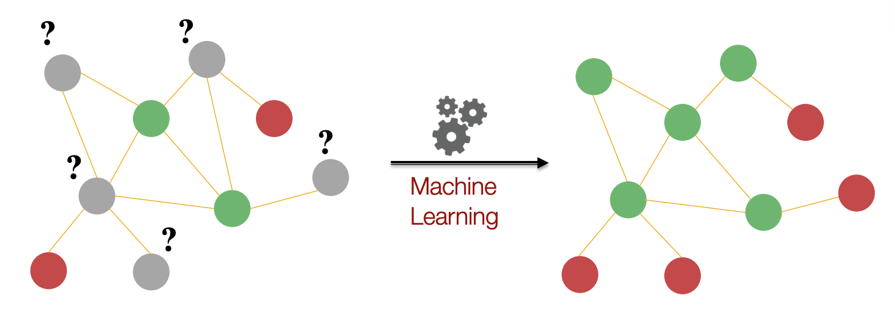

## Table of Contents

## What is Graph Representation Learning and why is it important in machine learning?

Graph Representation Learning is a way to teach computers to understand and work with data that is organized in a graph structure. A graph is like a network where things (called nodes) are connected by lines (called edges). For example, a social network can be seen as a graph where people are nodes and their friendships are edges. In Graph Representation Learning, we try to turn these graphs into numbers or vectors that computers can easily understand and use. This is done by finding ways to represent the nodes, edges, or the whole graph in a way that captures important information about their relationships and properties.

This type of learning is important in machine learning because many real-world data sets are naturally organized as graphs. For example, molecules, social networks, and transportation systems can all be represented as graphs. By using Graph Representation Learning, we can better analyze and predict things in these systems. For instance, it can help predict how a drug might interact with a protein in a molecule, or suggest new friends in a social network based on existing connections. This makes machine learning models more powerful and useful in solving complex problems where relationships between data points are crucial.

## How do Graph Neural Networks (GNNs) work in the context of Graph Representation Learning?

Graph Neural Networks (GNNs) are a type of machine learning model designed to work with graph data. They work by passing messages between the nodes of a graph. Each node starts with its own features, like a person's age or a molecule's atomic number. Then, the GNN looks at the connections (edges) between nodes and uses them to update each node's features. This process is repeated several times, allowing information to spread across the graph. By doing this, each node ends up with a new set of features that reflect not just its own properties, but also the properties of its neighbors and their connections.

The way GNNs update node features can be thought of as a simple formula. If we call the features of a node at step $$t$$ as $$h_v^{(t)}$$, the update can be described as $$h_v^{(t+1)} = \text{UPDATE}(h_v^{(t)}, \text{AGGREGATE}(\{h_u^{(t)} \mid u \in \mathcal{N}(v)\}))$$. Here, $$\mathcal{N}(v)$$ represents the neighbors of node $$v$$. The AGGREGATE function collects information from the neighbors, and the UPDATE function combines this with the node's current features to create a new set of features. This process helps the GNN learn a representation that captures the structure and relationships within the graph, making it useful for tasks like classifying nodes, predicting links, or understanding the overall graph structure.

## What are the basic types of graphs used in Graph Representation Learning?

In Graph Representation Learning, the most common types of graphs are undirected graphs and directed graphs. An undirected graph is like a network where the connections between nodes go both ways. For example, if two people are friends in a social network, the friendship goes both ways. In a directed graph, the connections have a direction, like a one-way street. This can be useful for modeling things like the flow of information or traffic, where the direction matters.

Another type of graph used in Graph Representation Learning is a weighted graph. In a weighted graph, each connection between nodes has a number, called a weight, that shows how strong or important the connection is. For example, in a transportation network, the weight could represent the distance or time it takes to travel between two places. The weights help the model understand the graph better and make more accurate predictions.

Lastly, there are also heterogeneous graphs, which are graphs where the nodes and edges can be of different types. For example, in a recommendation system, you might have users, items, and different types of interactions between them, like buying or rating. This type of graph can capture more complex relationships and is useful for tasks where different kinds of data need to be considered together.

## Can you explain the concept of node embedding in Graph Representation Learning?

Node embedding in Graph Representation Learning is a way to turn the nodes of a graph into numbers or vectors that a computer can understand easily. Imagine each node in a graph as a person in a social network. Each person has their own features, like age or interests, but they also have friends who influence them. Node embedding tries to capture not just the person's own features, but also how they are connected to others. By doing this, we can represent each person (node) as a vector that shows their place in the network, making it easier for computers to analyze and predict things about them.

The process of creating these embeddings often involves using Graph Neural Networks (GNNs). GNNs work by passing messages between nodes, updating each node's features based on its neighbors. If we call the features of a node at step $$t$$ as $$h_v^{(t)}$$, the update can be described as $$h_v^{(t+1)} = \text{UPDATE}(h_v^{(t)}, \text{AGGREGATE}(\{h_u^{(t)} \mid u \in \mathcal{N}(v)\}))$$. Here, $$\mathcal{N}(v)$$ represents the neighbors of node $$v$$. The AGGREGATE function collects information from the neighbors, and the UPDATE function combines this with the node's current features to create a new set of features. This way, the final embedding of a node reflects both its own properties and the structure of the graph around it, making it very useful for tasks like predicting friendships or recommending products based on social connections.

## How does Contrastive Learning apply to Graph Representation Learning?

Contrastive Learning in Graph Representation Learning helps to make the node embeddings better by comparing them. The idea is to pull together embeddings of nodes that are similar or connected, and push apart those that are different or not connected. This is done by creating pairs of nodes: positive pairs, where the nodes are related (like two friends in a social network), and negative pairs, where the nodes are not related. By training the model to recognize these differences, it learns to create embeddings that capture the important features and relationships in the graph.

In practice, this is achieved by using a loss function that encourages the model to minimize the distance between positive pairs and maximize the distance between negative pairs. A common way to do this is with a contrastive loss, like the InfoNCE loss, which can be written as $$ \mathcal{L} = -\log \frac{\exp(\text{similarity}(z_i, z_j) / \tau)}{\sum_{k=1}^{N} \exp(\text{similarity}(z_i, z_k) / \tau)} $$. Here, $$z_i$$ and $$z_j$$ are the embeddings of a positive pair, $$z_k$$ are the embeddings of other nodes (including negative pairs), and $$\tau$$ is a temperature parameter. By using this loss, the model learns to create embeddings that are good at distinguishing between related and unrelated nodes, making them useful for tasks like node classification or link prediction.

## What is the role of AWARE in enhancing Graph Representation Learning?

AWARE, which stands for Adversarial Walk-based Representation Learning, is a method that helps improve how we learn from graph data. It does this by using a special way of exploring the graph called "random walks." These walks help the model understand the structure of the graph better. AWARE also uses a trick called "adversarial training," where it tries to fool itself to get better at learning. This makes the model's understanding of the graph more accurate and useful for tasks like finding similar nodes or predicting connections.

In AWARE, the model learns by trying to predict where a random walk will go next. This helps it understand the important paths and connections in the graph. The adversarial part comes in when the model tries to create fake walks that look real, and then tries to tell the difference between the real and fake walks. This back-and-forth makes the model's predictions stronger. By using AWARE, we can create better node embeddings that capture the graph's structure more effectively, making it easier to solve problems in areas like social networks or recommendation systems.

## How does SPIN improve upon traditional Graph Neural Networks?

SPIN, which stands for Scalable Polynomial-based INductive learning, is a way to make Graph Neural Networks (GNNs) better and faster. Traditional GNNs can be slow and hard to use on big graphs because they need to look at all the connections between nodes many times. SPIN fixes this by using a special math trick called polynomials. Instead of looking at all the connections over and over, SPIN uses these polynomials to quickly figure out how nodes are related. This makes SPIN much faster and able to handle bigger graphs.

Another way SPIN improves on traditional GNNs is by making it easier to use the model on new graphs. Traditional GNNs often need to be trained again from scratch when you want to use them on a different graph. SPIN, on the other hand, can learn from one graph and then be used on another without starting over. This is called "inductive learning." By using polynomials and being able to work on new graphs easily, SPIN makes Graph Representation Learning more useful and efficient for real-world problems.

## What are the key features and applications of GraphSAINT in large-scale graph learning?

GraphSAINT is a method that makes it easier and faster to learn from very big graphs. It does this by breaking the big graph into smaller pieces, called subgraphs, and then learning from these smaller pieces one at a time. This way, the computer doesn't have to look at the whole graph all at once, which can be slow and use a lot of memory. GraphSAINT also uses a special way to choose these subgraphs so that the model learns important information about the whole graph. This makes GraphSAINT very good at handling large-scale graphs without losing important details.

GraphSAINT has many uses in areas where graphs are big and complex. For example, it can help in social networks to find patterns and suggest new friends. It can also be used in biology to study how different parts of a cell interact, or in recommendation systems to suggest products based on what similar users have liked. By breaking down the graph into manageable pieces, GraphSAINT makes it possible to use graph learning in these areas more efficiently and effectively.

## How does GraphCL utilize contrastive learning for graph representation?

GraphCL, or Graph Contrastive Learning, uses a special way of learning called contrastive learning to make graph representations better. It does this by creating different versions of the same graph and then comparing them. Imagine taking a picture and then making a few changes to it, like flipping it or adding some noise. GraphCL does something similar with graphs. It creates two different versions of the graph, called views, by changing things like the way nodes connect or the features of the nodes. Then, it tries to make the embeddings of these two views similar, because they come from the same original graph. This helps the model learn what's important about the graph's structure and features.

To do this, GraphCL uses a loss function that pushes the embeddings of the two views closer together while also pulling them away from embeddings of other graphs. A common way to do this is with a contrastive loss, like the InfoNCE loss, which can be written as $$ \mathcal{L} = -\log \frac{\exp(\text{similarity}(z_i, z_j) / \tau)}{\sum_{k=1}^{N} \exp(\text{similarity}(z_i, z_k) / \tau)} $$. Here, $$z_i$$ and $$z_j$$ are the embeddings of the two views from the same graph, $$z_k$$ are embeddings from other graphs, and $$\tau$$ is a temperature parameter. By using this loss, GraphCL helps the model create embeddings that capture the important parts of the graph, making them useful for tasks like classifying nodes or predicting links between them.

## What is the significance of APPNP in the field of Graph Representation Learning?

APPNP, which stands for Approximate Personalized Propagation of Neural Predictions, is an important method in Graph Representation Learning because it helps make predictions on graphs more accurate and faster. Traditional Graph Neural Networks (GNNs) can be slow because they need to look at all the connections between nodes many times. APPNP fixes this by using a special trick called "propagation." It starts with the features of each node and then spreads these features across the graph in a way that's quick and doesn't need to look at all the connections over and over. This makes APPNP much faster and able to handle bigger graphs without losing important details.

Another big advantage of APPNP is that it helps the model focus on the most important parts of the graph for making predictions. It does this by using something called "personalized PageRank," which is a way to weigh the importance of different nodes based on how they are connected. By using this, APPNP can create better node embeddings that capture the graph's structure more effectively. This makes it useful for tasks like classifying nodes or predicting links between them, making Graph Representation Learning more powerful and efficient for real-world problems.

## Can you describe the methodology and impact of iGCL on graph learning tasks?

iGCL, which stands for Invariant Graph Contrastive Learning, is a method that makes graph learning better by focusing on the parts of the graph that stay the same even when you change other things. It does this by creating different versions of the graph, called augmentations, and then trying to make the embeddings of these versions similar. The key idea is to find the parts of the graph that don't change much when you make these changes. This helps the model learn what's really important about the graph's structure and features, making its predictions more accurate and reliable.

The impact of iGCL on graph learning tasks is significant because it helps the model be more robust. This means the model can work well even if the graph changes a bit, like if some connections are added or removed. By focusing on the parts of the graph that stay the same, iGCL helps the model perform better on tasks like classifying nodes or predicting links between them. This makes iGCL very useful in real-world situations where graphs can change over time, like in social networks or biological systems.

## How do advanced techniques like DeepDrug apply Graph Representation Learning in drug discovery?

DeepDrug uses Graph Representation Learning to help find new drugs faster and better. It does this by turning the structure of molecules into graphs, where atoms are nodes and the bonds between them are edges. Then, it uses Graph Neural Networks (GNNs) to learn about these graphs. GNNs look at how the atoms are connected and use this information to create embeddings, which are like special codes that show what the molecule is like. By doing this, DeepDrug can predict how a molecule might work as a drug, like if it will be good at fighting a disease or if it might have side effects.

The impact of DeepDrug in drug discovery is big because it can look at a lot of molecules quickly and find the ones that might work best. This saves time and money compared to traditional ways of finding drugs, which can take years and cost a lot. By using Graph Representation Learning, DeepDrug can also find patterns in how different molecules work, helping scientists understand more about how drugs interact with the body. This makes the whole process of finding new drugs more efficient and effective.