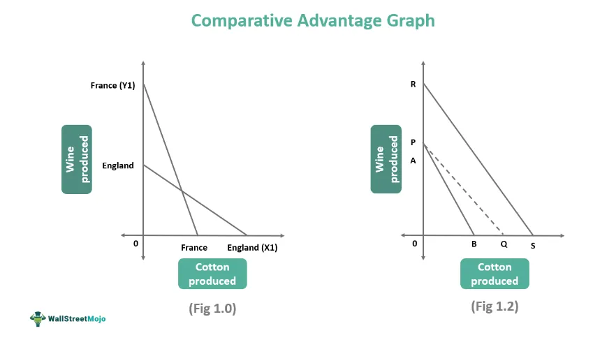

In the evolving landscape of finance, algorithmic trading has become a cornerstone strategy for traders and financial institutions. It leverages advanced computer algorithms to automate and optimize the process of buying and selling financial instruments. A notable development in this field is the application of graph theory, which is increasingly utilized to enhance the analytical capabilities of these algorithms.

Graph theory, a branch of mathematics dealing with networks of interconnected nodes and edges, provides a robust framework for modeling complex relationships inherent in financial markets. This capability is particularly useful for identifying intricate patterns and predicting market movements that may not be readily visible through traditional statistical methods. By representing market data as graphs, traders can gain deeper insights into the underlying dynamics governing asset prices and trading behaviors.



This article explores the integration of graph theory into algorithmic trading strategies. It aims to elucidate how concepts such as vertices and edges can be harnessed to develop more consistent and profitable trading algorithms. By analyzing data through the lens of graph theory, traders are able to visualize and quantify relationships within market datasets, allowing for more precise and informed decision-making.

Ultimately, our goal is to demystify the use of graph concepts in creating trading algorithms that are not only more effective but also capable of adapting to the ever-changing complexities of financial markets. Through this integration, algorithmic trading stands to gain a substantial advantage in both predictive accuracy and operational efficiency.

## Table of Contents

## Understanding Graph Theory

Graph theory is a branch of mathematics that studies graphs, which are structures composed of vertices (also known as nodes) and edges (lines connecting these vertices). These elements are used to model and examine pairwise relationships between entities, making graph theory a versatile tool in various fields, including [algorithmic trading](/wiki/algorithmic-trading).

In its simplest form, a graph $G$ is defined as an ordered pair $G = (V, E)$, where $V$ is a set of vertices and $E$ is a set of edges, which are 2-element subsets of $V$. In the context of financial data, vertices might represent individual stocks, and edges might symbolize various types of relationships or interactions between these stocks, such as correlations in price movements or transactional connections in trading networks.

The application of graph theory in algorithmic trading allows for the visualization and analysis of complex datasets. By representing trading variables and their interactions as graphs, traders can visualize intricate relationships that would be difficult to discern with traditional data analysis techniques. For instance, a trader might represent stocks as nodes and significant correlations in their performances as edges. This graphical representation can uncover network structures within market data, identifying influential stocks and potential market influencers.

Algorithms leveraging graph theory often utilize techniques like clustering, where nodes are grouped based on similarity or connectivity, or pathfinding, where the optimal route through a network is determined. These techniques can help identify hidden structures within market data, such as clusters of highly correlated stocks or optimal pathways for trade execution in electronic trading networks.

Graph theory's capacity to model pairwise relationships is not limited to static analysis. Dynamic graphs, where the structure can change over time, are particularly relevant for financial markets that evolve rapidly. Such dynamic modeling can provide deeper insights into the temporal aspects of market interactions and lead to more robust algorithmic trading strategies.

By applying graph theory, traders can better capture the complexity inherent in financial markets, translating complex systemic interactions into actionable insights. This enables the creation of more adaptive and resilient trading algorithms that can react to and anticipate shifts in market dynamics.

## Algorithmic Trading Basics

Algorithmic trading uses computer algorithms to automate the execution of trading strategies for buying and selling securities within financial markets. These algorithms are designed to execute orders based on a set of pre-defined instructions, which can include timing, price, quantity, or any mathematical model. By systematically carrying out trades without the need for human intervention, algorithmic trading aims to increase the efficiency and speed at which orders are executed.

One of the core components of algorithmic trading is the reliance on pre-defined rules and strategies. These strategies often involve complex calculations, statistical functions, and mathematical models. For instance, a simple version of an algorithmic trading strategy might be to buy a stock when its 50-day moving average surpasses its 200-day moving average, a popular signal in technical analysis. This approach attempts to capture profits from trends in price data.

Algorithmic traders often leverage historical data to predict future market actions. This involves [backtesting](/wiki/backtesting) strategies against historical periods to evaluate their effectiveness. The historical data set provides traders with the ability to simulate the performance of an algorithmic strategy and optimize it before live execution in the market. A well-backtested strategy may incorporate measures such as Sharpe ratio to assess performance, ensuring that risk considerations are factored into the trading process.

Understanding these foundational concepts of algorithmic trading is crucial to appreciating the integration of advanced mathematical theories, such as graph theory, into these strategies. Graph theory can enhance algorithmic trading by providing additional analytical capabilities to interpret and model the interactions and relationships among various trading variables. As a result, algorithmic trading not only increases execution efficiency but also opens the door to more sophisticated trading strategies through advanced data analysis techniques.

## Application of Graph Theory in Algorithmic Trading

Graph theory enhances algorithmic trading by offering sophisticated tools to identify hidden patterns within complex financial datasets through network analysis. A pivotal contribution to this field comes from the use of visibility graphs, which are derived from time series data. By transforming sequential market data into visual network forms, visibility graphs provide an innovative method for pattern detection in market movements.

In more detail, a visibility graph is constructed by treating data points in a time series as nodes, while edges are established between nodes if a straight line can be drawn between data points without intersecting any intermediate data points. This methodology is valuable for depicting the inherent structures and correlations present in financial time series.

For instance, consider a time series $S = (s_1, s_2, \ldots, s_n)$. In a visibility graph, two distinct points $s_i$ and $s_j$ have a connecting edge if, for every data point $s_k$ where $i < k < j$, the condition:

$$
s_k < s_i + \frac{s_j - s_i}{j - i} \times (k - i)
$$

is satisfied. This condition ensures that a "line of sight" exists between $s_i$ and $s_j$.

Once the visibility graph is constructed, traders can apply network science metrics to analyze the complexity and dynamics of the financial markets. These metrics include centrality measures, clustering coefficients, and path lengths among others, which can offer insights into the critical nodes or sectors, potential vulnerabilities, and connectivity within the market network.

Python's NetworkX library is often employed for such analyses, facilitating the computation of complex network metrics. Here's a simple Python snippet to illustrate how a visibility graph can be implemented using NetworkX:

```python
import networkx as nx
import numpy as np

def visibility_graph(time_series):
    n = len(time_series)
    G = nx.Graph()

    for i in range(n):
        G.add_node(i)
        for j in range(i+1, n):
            if all(time_series[k] < time_series[i] + (time_series[j] - time_series[i]) * (k - i) / (j - i) 
                   for k in range(i+1, j)):
                G.add_edge(i, j)

    return G

# Example of use
time_series_data = np.random.rand(100)
graph = visibility_graph(time_series_data)
```

This transformation empowers traders to apply a new set of analytical tools to interpret market dynamics comprehensively. By leveraging visibility graphs and network metrics, traders gain robust mechanisms to uncover non-trivial patterns and interdependencies that traditional time series analyses might not reveal. This approach not only aids in detecting trends but also enhances prediction accuracy, thereby providing a substantial edge in algorithmic trading strategies.

## Practical Examples and Tools

One practical application of graph theory in algorithmic trading is the use of visibility graphs to analyze historical price movements and construct predictive trading signals. Visibility graphs are derived from time series data and transform market information into visual networks. This transformation is achieved by plotting the time series as a series of nodes (representing time points) and connecting these nodes based on certain criteria related to the visibility of values over time.

For instance, a horizontal visibility graph connects each node to its nearest neighbors (both past and future) that can 'see' each other, meaning there are no other intervening nodes with values higher than those two nodes in the sequence. This graphical representation allows traders to uncover hidden temporal patterns and correlations in the historical data that might not be evident through traditional statistical methods.

Tools like NetworkX, a Python library for studying the structure and dynamics of complex networks, are commonly employed by traders to build and analyze these visibility graphs. Traders can utilize NetworkX to apply algorithms that compute various network metrics, such as degree centrality, betweenness centrality, and clustering coefficients. These metrics provide insights into the importance and interconnectedness of different time points within the market data, which can be crucial for making informed trading decisions.

A practical example of implementing graph-based analysis using Python and NetworkX could look like this:

```python
import networkx as nx
import numpy as np

# Generate a time series data
time_series = np.random.rand(100)

# Create a visibility graph
G = nx.Graph()

# Populate the graph with nodes corresponding to data points
for i, value in enumerate(time_series):
    G.add_node(i, value=value)

# Connect nodes based on horizontal visibility
for i in range(len(time_series)):
    for j in range(i+1, len(time_series)):
        if all(time_series[k] < min(time_series[i], time_series[j]) for k in range(i+1, j)):
            G.add_edge(i, j)

# Example network metric calculation
betweenness = nx.betweenness_centrality(G)
print(betweenness)
```

Traders often employ rolling windows to calculate these network metrics dynamically over time. By computing these metrics in a rolling window, they can derive indicators that reflect the evolving structure of the market network. For instance, changes in the centrality measures can signal shifts in market sentiment or [volatility](/wiki/volatility-trading-strategies), thus aiding in the development of more proactive trading strategies. 

However, the effective use of these tools requires a solid understanding of both graph theory and the specific dynamics of the financial markets. Despite these complexities, the potential for graph-based analysis to generate unique insights into market behaviors makes it a valuable addition to the algorithmic trader's toolkit.

## Advantages and Challenges

Integrating graph theory into trading algorithms provides significant advantages, primarily through the efficient processing of complex relational data. By transforming market data into network structures, traders can explore intricate relationships and dependencies between various financial assets. This approach allows for the identification of hidden patterns and correlations that might remain obscured under traditional linear analysis methods. The ability to visualize trading dynamics as graphs facilitates a deeper understanding of market behaviors and enhances decision-making capabilities by highlighting influential nodes and critical connections within financial networks.

However, this integration presents several challenges that traders must address. One of the primary concerns is ensuring the accurate modeling of financial networks. Constructing graphs that truly reflect market conditions requires a deep understanding of the underlying financial systems and the ability to suitably simplify these structures without losing essential information. Poorly designed graph models may lead to misleading conclusions, compromising the effectiveness of trading strategies.

Another significant challenge is the computational cost associated with processing large datasets. Financial markets generate vast amounts of data in real-time, leading to the need for highly efficient computational techniques to handle and analyze these volumes. Graph-based algorithms, especially when dealing with massive datasets, can be computationally intensive. This necessitates the use of optimized algorithms and high-performance computing resources to ensure timely decision-making capabilities. 

Traders are tasked with balancing the complexity of graph models against the need for computational efficiency. While more detailed models may capture a greater degree of nuance, they also require increased computational power and processing time, which could negate the advantages of real-time trading. Thus, finding the optimal balance between model precision and computational feasibility is critical to maximizing the benefits of graph theory in algorithmic trading.

In summary, while graph theory offers a powerful toolkit for enhancing trading strategies through advanced data analysis, it also demands meticulous design and resource management to overcome its inherent challenges.

## Conclusion

Graph theory in algorithmic trading offers promising potential for uncovering intricate patterns that traditional methods might miss. By applying mathematical concepts of graphs, traders can move beyond linear data analysis and explore complex relational structures within market data. This shift enables the identification of sophisticated patterns and interconnected market signals that were previously concealed in traditional analytical approaches.

As technology advances, the fusion of graph theory and algorithmic trading will likely offer even more sophisticated tools for traders. Enhanced computational power and advanced algorithms will facilitate the processing of more extensive and intricate datasets, allowing for a deeper understanding of market behaviors. Automated systems utilizing graph-based algorithms can efficiently detect null nodes, identify clusters, and analyze paths, thereby providing richer insights into market dynamics.

By embracing these innovations, traders stand to gain a competitive edge in understanding and capitalizing on market dynamics. The ability to anticipate market movements through the structural analysis of financial networks not only enhances predictive accuracy but also aids in risk management and strategic decision-making. As graph theory continues to integrate with trading technologies, the future holds potential for even more advanced models that could revolutionize trading practices, making them more responsive to the ever-changing financial landscape.

## References & Further Reading

[1]: Newman, M. E. J. (2010). ["Networks: An Introduction."](https://academic.oup.com/book/27303) Oxford University Press.

[2]: Lopez de Prado, M. (2018). ["Advances in Financial Machine Learning"](https://www.amazon.com/Advances-Financial-Machine-Learning-Marcos/dp/1119482089). Wiley.

[3]: Westerhoff, F. H., & Reitz, S. (2005). ["Nonlinearities and Cyclical Behavior: The Role of Chartists and Fundamentalists."](https://www.econstor.eu/bitstream/10419/72645/1/03_10.pdf) Southern Economic Journal, 72(1), 56-82.

[4]: Barabási, A. L. (2016). ["Network Science."](https://assets.cambridge.org/97811070/76266/frontmatter/9781107076266_frontmatter.pdf) Cambridge University Press.

[5]: Jansen, S. (2020). ["Machine Learning for Algorithmic Trading: Predictive models to extract signals from market and alternative data for systematic trading strategies with Python."](https://www.amazon.com/Machine-Learning-Algorithmic-Trading-alternative/dp/1839217715) Packt Publishing.

[6]: Aronson, D. R. (2006). ["Evidence-Based Technical Analysis: Applying the Scientific Method and Statistical Inference to Trading Signals."](https://www.amazon.com/Evidence-Based-Technical-Analysis-Scientific-Statistical/dp/0470008741) Wiley.

[7]: Chan, E. P. (2009). ["Quantitative Trading: How to Build Your Own Algorithmic Trading Business."](https://github.com/ftvision/quant_trading_echan_book) Wiley.