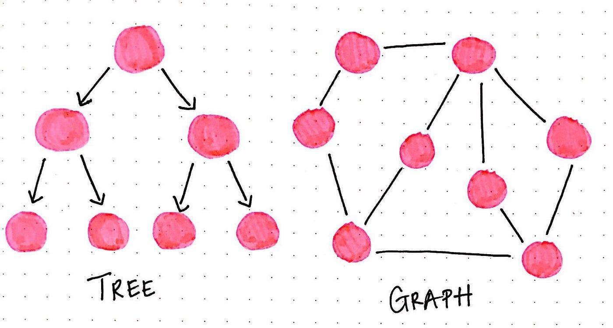

## Table of Contents

## What is graph theory?

Graph theory is a branch of mathematics that studies the connections between things. It uses a structure called a graph, which is made up of points called vertices or nodes, and lines called edges that connect these points. Think of a graph like a map where cities are the vertices and the roads between them are the edges. Graph theory helps us understand and solve problems about how things are connected, like social networks, transportation systems, or the internet.

In graph theory, we can ask and answer many interesting questions. For example, we might want to know the shortest path between two points, or how to connect all the points using the least amount of lines. These questions have real-world applications, like finding the quickest route for a delivery truck or designing efficient computer networks. Graph theory also helps us understand more abstract concepts, like the structure of molecules or the relationships between different pieces of data. By studying graphs, we can learn a lot about the world around us and make better decisions.

## What are the basic components of a graph?

A graph has two main parts: vertices and edges. Vertices are like points or dots on a page. They represent things like cities, people, or any items you want to connect. Edges are the lines that connect these vertices. They show how the things are related or connected, like roads between cities or friendships between people.

Sometimes, graphs can have more details. For example, edges can have weights, which are numbers that show how strong or important a connection is. A road might have a weight that shows its length or the time it takes to travel it. Graphs can also be directed, meaning the edges have arrows that show the direction of the connection, like one-way streets or emails sent from one person to another. These extra details help make graphs more useful for solving real-world problems.

## How do you represent a graph mathematically?

A graph can be represented mathematically using sets. One set is for the vertices, and another set is for the edges. The set of vertices, often called V, lists all the points in the graph. The set of edges, often called E, lists all the connections between the vertices. For example, if we have a graph with three vertices A, B, and C, and edges connecting A to B and B to C, we can write V = {A, B, C} and E = {{A, B}, {B, C}}. This way, we can clearly see what's in the graph and how the vertices are connected.

Sometimes, we need more details in our graph, like weights on the edges or directions. For weights, we can use a function that assigns a number to each edge. If we have an edge between A and B with a weight of 2, we might write w({A, B}) = 2. For directed graphs, we use ordered pairs instead of sets for the edges. So, if there's a directed edge from A to B, we write (A, B) in E. This tells us that the connection goes from A to B, but not the other way around. These ways of representing graphs help us solve different kinds of problems and understand the connections better.

## What is the difference between directed and undirected graphs?

A directed graph is like a one-way street. It has arrows on its edges that show which way the connection goes. For example, if there's an arrow from A to B, it means you can go from A to B, but not the other way around. This is useful for things like social media, where a person might follow someone but not be followed back, or for showing the flow of information or traffic.

An undirected graph is more like a regular street where you can go both ways. Its edges don't have arrows, so if there's a line between A and B, you can go from A to B and from B to A. This type of graph is good for things like friendships, where the connection goes both ways, or for maps where you can travel in both directions on a road.

Both types of graphs help us understand different kinds of connections. Directed graphs are great when the direction matters, while undirected graphs are better when the connections are mutual or equal in both directions.

## What are some common types of graphs?

There are many types of graphs, but some of the most common ones are simple graphs, multigraphs, and weighted graphs. A simple graph is the basic type where there are no loops (edges that connect a vertex back to itself) and no more than one edge between any two vertices. It's like a basic map where each road connects two different cities and you can't go in circles. A multigraph is a bit different because it can have multiple edges between the same two vertices and can have loops. Imagine a busy city with many roads between the same two places, or a road that loops back to where it started. A weighted graph adds numbers to the edges, showing how strong or important each connection is. This is useful for things like finding the fastest route between cities, where the numbers could show the time or distance.

Another common type is a directed graph, which we talked about before. It has arrows on the edges to show the direction of the connection, like one-way streets or emails sent from one person to another. A special kind of directed graph is a directed acyclic graph (DAG), which doesn't have any cycles or loops. It's useful for things like project planning, where tasks need to be done in a certain order without repeating. Lastly, there are bipartite graphs, which have two sets of vertices and edges only between the two sets, not within them. This is good for matching problems, like pairing students with projects or workers with jobs, where you want to connect things from one group to another but not within the same group.

## What is a path in graph theory, and what is the difference between a path and a cycle?

A path in graph theory is a way to go from one point to another by following the lines that connect them. Imagine you're trying to get from your house to a friend's house. You start at your house, which is one point, and then you follow the roads, which are the lines, until you reach your friend's house, which is another point. A path can be as short as just one line between two points, or it can be longer, going through many points and lines. The important thing is that you don't go over the same line twice.

The difference between a path and a cycle is that a cycle is a path that loops back to where it started. Think of a cycle like a bike ride where you start at home, ride around the neighborhood, and then end up back at home. In a cycle, you can follow the lines from one point to another, just like in a path, but at the end, you come back to the starting point. So, while a path is like a journey from one place to another, a cycle is like a journey that brings you back to where you began.

## How do you determine if a graph is connected?

A graph is connected if you can get from any point to any other point by following the lines that connect them. Imagine you're in a city and you want to know if you can drive from one neighborhood to another. If there's a road that lets you go from any neighborhood to any other neighborhood, then the city's road map is connected. In a graph, if you can find a path between any two points, no matter how long or twisty that path is, then the graph is connected.

If a graph is not connected, it means there are some points that you can't reach from others. Think of an island that's not connected to the mainland by a bridge. You can't drive from the mainland to the island, so the road map of the area is not connected. In a graph, if there's at least one pair of points where you can't find a path between them, then the graph is not connected. You can check if a graph is connected by trying to find a path between every pair of points. If you can always find a path, the graph is connected. If you can't, it's not connected.

## What are graph traversal algorithms and what are their uses?

Graph traversal algorithms are like special ways to explore all the points and lines in a graph. Imagine you're in a big city and you want to visit every neighborhood. You start at one place and then move from one neighborhood to another by following the roads. There are two main ways to do this: one is called Breadth-First Search (BFS), where you explore all the neighborhoods close to where you start before moving further away. The other way is called Depth-First Search (DFS), where you go as far as you can in one direction before coming back and trying another way. Both methods help you make sure you visit every part of the city.

These algorithms are very useful in many situations. For example, if you're trying to find the shortest way to get from one place to another, BFS can help you do that. It's like finding the quickest route to your friend's house. DFS is good for solving puzzles or exploring mazes, where you need to go deep into one path before trying another. Both BFS and DFS are used in computer programs to search through data, find connections in social networks, or even to help robots navigate through a space. By using these algorithms, we can solve many different kinds of problems more easily.

## What is the significance of graph coloring in graph theory?

Graph coloring is a way to color the points of a graph so that no two points connected by a line have the same color. It's like trying to paint a map where no two neighboring countries have the same color. This idea is very important in many areas, like scheduling, where you might want to assign different times to events that can't happen at the same time, or in computer networks, where you need to avoid conflicts between different parts of the system.

One of the most famous problems in graph coloring is the four-color theorem, which says that you can color any map with just four colors so that no two neighboring countries are the same color. This problem took over a hundred years to solve and shows how tricky and interesting graph coloring can be. Graph coloring helps us solve many real-world problems by turning them into a game of colors and connections, making it easier to see how things fit together and avoid conflicts.

## How do you calculate the shortest path in a weighted graph?

Finding the shortest path in a weighted graph is like figuring out the quickest way to get from one place to another when each road has a different time or distance. One popular way to do this is with an algorithm called Dijkstra's algorithm. Imagine you're at the starting point, and you want to go to every other place. You start by looking at all the roads leading out from where you are and pick the shortest one. Then, you go to the end of that road and do the same thing again, always choosing the shortest road you haven't tried yet. You keep doing this until you reach your final destination. This way, you find the shortest path by always taking the best next step.

Dijkstra's algorithm works well because it keeps track of the shortest distance to each place as you go along. If you find a shorter way to a place you've already been to, you update the distance. This makes sure that by the time you reach your final destination, you've found the shortest path possible. This method is used in things like GPS navigation systems to help drivers find the fastest route. It's also used in computer networks to find the best way to send data from one computer to another. By using Dijkstra's algorithm, we can solve many different kinds of problems where we need to find the shortest or quickest path.

## What are some advanced concepts in graph theory, such as graph minors and topological graph theory?

Graph minors are like smaller versions of a graph. Imagine you have a big picture made of dots and lines. You can make it smaller by taking out some dots and lines, or by squishing some parts together. If you can do this to turn one graph into another, then the smaller graph is a minor of the bigger one. This idea is very important in understanding how graphs are related to each other. One famous problem about graph minors is called the Robertson-Seymour theorem, which says that you can always find a way to break down a graph into smaller pieces until you can't break it down anymore. This helps us solve many hard problems in computer science and math by looking at these smaller pieces.

Topological graph theory is about how graphs can be drawn in different ways. Think of a graph like a map where you can draw the roads between cities in different patterns. Sometimes, you can draw a graph on a flat piece of paper without any lines crossing each other. Other times, you need to draw it on something curved, like a ball, to avoid crossings. This idea is important for things like designing circuit boards, where you need to lay out wires without them touching each other. Topological graph theory helps us understand how to draw graphs in the best way possible and what kinds of surfaces we need to use. It's like figuring out the best way to fold a piece of paper to make a shape without tearing it.

## How is graph theory applied in real-world scenarios, such as network design and optimization?

Graph theory is used a lot in designing and making networks better. Think of a network like the internet or a city's road system. In these networks, graph theory helps us figure out the best way to connect everything. For example, when designing a computer network, graph theory can help find the shortest path for data to travel from one computer to another. This makes the network faster and more efficient. In a city, graph theory can help plan the best routes for buses or the best places to build new roads so that traffic moves smoothly. By using graphs, we can see how everything is connected and make smart choices about how to improve the network.

Graph theory also helps with optimization, which means making things work as well as possible. Imagine you're a delivery company trying to find the quickest way to deliver packages to different places. Graph theory can help you find the shortest path that visits all the places you need to go. This saves time and money. In another example, airlines use graph theory to plan flight routes so that planes can fly from one city to another in the best way. By using graphs, they can figure out the best schedules and routes to keep flights on time and reduce costs. Graph theory helps us solve these kinds of problems by giving us a clear picture of how things are connected and how to make the most of those connections.

## How is Graph Theory Applied in Algorithmic Trading?

Graph theory enhances [algorithmic trading](/wiki/algorithmic-trading) by offering sophisticated tools to identify hidden patterns within complex financial datasets through network analysis. A pivotal contribution to this field comes from the use of visibility graphs, which are derived from time series data. By transforming sequential market data into visual network forms, visibility graphs provide an innovative method for pattern detection in market movements.

In more detail, a visibility graph is constructed by treating data points in a time series as nodes, while edges are established between nodes if a straight line can be drawn between data points without intersecting any intermediate data points. This methodology is valuable for depicting the inherent structures and correlations present in financial time series.

For instance, consider a time series $S = (s_1, s_2, \ldots, s_n)$. In a visibility graph, two distinct points $s_i$ and $s_j$ have a connecting edge if, for every data point $s_k$ where $i < k < j$, the condition:

$$
s_k < s_i + \frac{s_j - s_i}{j - i} \times (k - i)
$$

is satisfied. This condition ensures that a "line of sight" exists between $s_i$ and $s_j$.

Once the visibility graph is constructed, traders can apply network science metrics to analyze the complexity and dynamics of the financial markets. These metrics include centrality measures, clustering coefficients, and path lengths among others, which can offer insights into the critical nodes or sectors, potential vulnerabilities, and connectivity within the market network.

Python's NetworkX library is often employed for such analyses, facilitating the computation of complex network metrics. Here's a simple Python snippet to illustrate how a visibility graph can be implemented using NetworkX:

```python
import networkx as nx
import numpy as np

def visibility_graph(time_series):
    n = len(time_series)
    G = nx.Graph()

    for i in range(n):
        G.add_node(i)
        for j in range(i+1, n):
            if all(time_series[k] < time_series[i] + (time_series[j] - time_series[i]) * (k - i) / (j - i) 
                   for k in range(i+1, j)):
                G.add_edge(i, j)

    return G

# Example of use
time_series_data = np.random.rand(100)
graph = visibility_graph(time_series_data)
```

This transformation empowers traders to apply a new set of analytical tools to interpret market dynamics comprehensively. By leveraging visibility graphs and network metrics, traders gain robust mechanisms to uncover non-trivial patterns and interdependencies that traditional time series analyses might not reveal. This approach not only aids in detecting trends but also enhances prediction accuracy, thereby providing a substantial edge in algorithmic trading strategies.

## References & Further Reading

[1]: Newman, M. E. J. (2010). ["Networks: An Introduction."](https://academic.oup.com/book/27303) Oxford University Press.

[2]: Lopez de Prado, M. (2018). ["Advances in Financial Machine Learning"](https://www.amazon.com/Advances-Financial-Machine-Learning-Marcos/dp/1119482089). Wiley.

[3]: Westerhoff, F. H., & Reitz, S. (2005). ["Nonlinearities and Cyclical Behavior: The Role of Chartists and Fundamentalists."](https://www.econstor.eu/bitstream/10419/72645/1/03_10.pdf) Southern Economic Journal, 72(1), 56-82.

[4]: Barabási, A. L. (2016). ["Network Science."](https://assets.cambridge.org/97811070/76266/frontmatter/9781107076266_frontmatter.pdf) Cambridge University Press.

[5]: Jansen, S. (2020). ["Machine Learning for Algorithmic Trading: Predictive models to extract signals from market and alternative data for systematic trading strategies with Python."](https://www.amazon.com/Machine-Learning-Algorithmic-Trading-alternative/dp/1839217715) Packt Publishing.

[6]: Aronson, D. R. (2006). ["Evidence-Based Technical Analysis: Applying the Scientific Method and Statistical Inference to Trading Signals."](https://www.amazon.com/Evidence-Based-Technical-Analysis-Scientific-Statistical/dp/0470008741) Wiley.

[7]: Chan, E. P. (2009). ["Quantitative Trading: How to Build Your Own Algorithmic Trading Business."](https://github.com/ftvision/quant_trading_echan_book) Wiley.