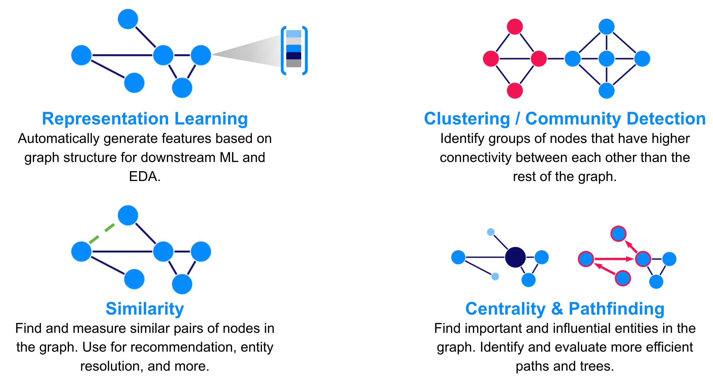

## Table of Contents

## What is a graph in the context of machine learning?

In machine learning, a graph is a way to represent data where things (called nodes or vertices) are connected by lines (called edges). Imagine a social network where people are nodes and friendships are edges. This structure helps in understanding relationships and patterns in data, which is useful for tasks like recommending friends or predicting behaviors.

Graphs are powerful because they can show complex relationships that simple lists or tables can't. For example, in a transportation network, cities are nodes and roads are edges. Machine learning algorithms can use this graph to find the shortest path between cities or to predict traffic flow. By using graphs, machines can learn from and make decisions based on the connections between data points, making them very useful in many areas of machine learning.

## How do graphs differ from traditional data structures used in machine learning?

Graphs are different from traditional data structures like arrays, lists, or tables because they focus on relationships between data points. In a graph, you have nodes that represent things, like people or cities, and edges that show how these things are connected, like friendships or roads. This is different from a table where you might just list information about each thing without showing how they relate to each other. For example, a table might tell you the population of different cities, but a graph can show you which cities are connected by highways.

Traditional data structures are good for storing and organizing data in a straightforward way. For instance, an array can hold a list of numbers, and you can easily access any number by its position in the array. But these structures don't naturally show connections between the data points. Graphs, on the other hand, are designed to highlight these connections, making them very useful for tasks where understanding relationships is important. For example, in a social network, a graph can help you see not just who your friends are, but also who your friends' friends are, which can be useful for recommending new connections.

## What are the basic components of a graph?

A graph has two basic parts: nodes and edges. Nodes are like points on a map. They can represent anything you want, like people, cities, or computers. Edges are the lines that connect these nodes. They show how the nodes are related. For example, if nodes represent people, edges can show friendships between them.

Graphs can be simple or complex. In a simple graph, edges just connect nodes without any extra information. But in a more complex graph, edges can have weights, which means they can show how strong or important a connection is. For example, if nodes are cities and edges are roads, the weight of an edge could show the distance between the cities. This makes graphs very flexible and useful for many different kinds of data.

## What are some common types of graphs used in machine learning?

In machine learning, one common type of graph is the undirected graph. In an undirected graph, the edges do not have a direction. They simply connect two nodes without saying which way the connection goes. This is useful for things like social networks where friendships go both ways. Another type is the directed graph, where edges have a direction. This can show things like the flow of information or the order of tasks in a project. For example, if you're modeling a website's navigation, a directed graph can show which pages link to others.

Another important type of graph is the weighted graph. In a weighted graph, each edge has a number called a weight. This weight can show how strong or important a connection is. For example, in a transportation network, the weight of an edge might be the distance between two cities. This helps algorithms find the shortest or fastest path. Finally, there are bipartite graphs, which have two different types of nodes. These are useful for matching problems, like pairing students with projects or workers with jobs. Each type of graph helps machine learning algorithms understand and use the data in different ways.

## How can graphs be used to represent data in machine learning applications?

Graphs are a great way to show how things are connected in machine learning. Imagine you have a bunch of people and you want to see who is friends with whom. You can use a graph where each person is a node and each friendship is an edge. This helps you see not just who is friends with who, but also how groups of friends are connected. For example, if you're building a recommendation system for a social network, a graph can help you suggest new friends by looking at the friends of your friends.

Graphs can also show more complex relationships. For instance, if you're trying to predict traffic, you can use a graph where cities are nodes and roads are edges. The edges can have weights to show the distance or time it takes to travel between cities. This type of graph helps machine learning algorithms find the shortest or fastest route. Graphs are also useful for understanding how information spreads, like in a network of websites where links between pages are edges. By using graphs, machine learning can better understand and predict patterns based on how things are connected.

## What are graph neural networks and how do they work?

Graph Neural Networks (GNNs) are a type of machine learning model that work with data that is set up like a graph. They are good at understanding and working with data where things are connected. For example, in a social network, GNNs can help predict who might be friends with who by looking at the connections between people. They do this by passing information along the edges of the graph, from one node to another, and then using that information to make predictions or decisions.

The way GNNs work is by taking the features of each node and the structure of the graph into account. They use a process called message passing, where each node sends and receives information from its neighbors. This helps the model learn about the relationships between nodes. For example, if you want to predict the popularity of a product based on customer reviews, a GNN can look at how customers are connected and how they rate the product. By doing this, the model can make better predictions by understanding the whole network of connections.

## What are some popular algorithms for graph-based machine learning?

One popular algorithm for graph-based machine learning is the Graph Convolutional Network (GCN). GCNs are good at working with data where things are connected, like in a social network. They work by taking the features of each node and the connections between them into account. Imagine you want to predict if two people might be friends. A GCN can look at the friends they already have and use that information to make a guess. They do this by using a special math formula to mix the information from a node with the information from its neighbors. This helps the model learn about the whole network of connections.

Another common algorithm is the Graph Attention Network (GAT). GATs are a bit like GCNs, but they pay more attention to some connections than others. Imagine you're trying to guess what movie someone might like. A GAT can look at the movies their friends liked, but it will pay more attention to the friends who have similar tastes. They use a special way of figuring out which connections are more important. This helps the model make better guesses by focusing on the most useful information.

A third algorithm worth mentioning is the GraphSAGE (Sample and aggreGatE). GraphSAGE is good for big graphs where you can't look at every connection. It works by picking a few neighbors for each node and then using their information to make a guess. For example, if you're trying to predict how a disease might spread, GraphSAGE can look at a few people around each person and use that to make a prediction. This makes it faster to work with big graphs because it doesn't have to look at every single connection.

## How can one preprocess graph data for machine learning?

Preprocessing graph data for machine learning is important to make sure the data is ready to be used by the algorithms. One way to preprocess graph data is by cleaning it. This means checking for any missing or wrong information and fixing it. For example, if you have a graph of a social network, you might find that some people are missing their age or have a wrong birthday. You can either fill in the missing information or remove those nodes. Another way to preprocess graph data is by normalizing the features of the nodes. This means making sure all the numbers are on the same scale so that no feature is too big or too small compared to others. This can help the machine learning model work better because it won't be tricked by big or small numbers.

Another important step in preprocessing graph data is to decide how to represent the graph in a way that the machine learning model can understand. One common way to do this is by using an adjacency matrix. This is a table where the rows and columns represent the nodes, and the numbers in the table show if there is a connection between the nodes. For example, if there is an edge between node A and node B, you might put a 1 in the table at the spot where row A and column B meet. If there is no edge, you put a 0. This can be shown as $$ A_{ij} = 1 $$ if there is an edge between node $$ i $$ and node $$ j $$, and $$ A_{ij} = 0 $$ if there is no edge. Another way to represent the graph is by using a list of edges, which is easier to work with for some algorithms. Once you have chosen how to represent the graph, you can start using machine learning algorithms to learn from it and make predictions.

## What are the challenges in applying machine learning to graph-structured data?

Applying machine learning to graph-structured data can be tricky because graphs can be very big and complicated. Imagine a social network with millions of people and friendships. It's hard to look at every single connection because it takes a lot of time and computer power. Also, graphs can have different shapes and sizes, which makes it hard to use the same machine learning model for all of them. For example, a graph of a city's transportation system might be very different from a graph of a company's organizational structure. This means you need special ways to handle and process the data so that the machine learning model can understand it.

Another challenge is that graphs often have missing or wrong information. If you're looking at a graph of customer reviews, some people might not have left a review or might have given a wrong rating by mistake. This can make it hard for the machine learning model to learn the right patterns. Also, figuring out which parts of the graph are important can be tough. In a social network, some friendships might be more important than others, and the model needs to figure out how to pay attention to the right connections. To deal with these challenges, you need to clean the data, choose the right way to represent the graph, like using an adjacency matrix $$ A_{ij} $$, and use special algorithms that can handle the unique nature of graph data.

## How do you evaluate the performance of graph-based machine learning models?

Evaluating the performance of graph-based machine learning models is important to see how well they are doing. One common way to do this is by using metrics like accuracy, precision, and recall. Accuracy tells you how often the model gets the right answer. Precision looks at how many of the positive predictions were actually correct. Recall checks how many of the actual positive cases the model found. For example, if you're trying to predict if two people might be friends, you can use these metrics to see how often the model's guesses are right.

Another way to evaluate graph-based models is by using special techniques like cross-validation. This means splitting the graph data into different parts and testing the model on each part to see how well it does. This helps make sure the model works well on different parts of the data. You can also use graph-specific metrics like the area under the ROC curve (AUC-ROC). The ROC curve shows how well the model can tell the difference between positive and negative cases. The AUC-ROC is a number between 0 and 1, where a higher number means the model is better at telling them apart. For example, if the AUC-ROC is close to 1, the model is doing a great job.

## What are some advanced techniques in graph machine learning?

One advanced technique in graph machine learning is Graph Attention Networks (GATs). GATs are special because they can pay more attention to some connections in the graph than others. Imagine you're trying to guess what movie someone might like. A GAT can look at the movies their friends liked, but it will pay more attention to the friends who have similar tastes. They use a special way of figuring out which connections are more important, called attention mechanisms. This helps the model make better guesses by focusing on the most useful information. For example, if you want to predict if two people might be friends, a GAT can look at their friends and give more weight to the connections that matter more.

Another advanced technique is GraphSAGE (Sample and aggreGatE). GraphSAGE is good for big graphs where you can't look at every connection. It works by picking a few neighbors for each node and then using their information to make a guess. For example, if you're trying to predict how a disease might spread, GraphSAGE can look at a few people around each person and use that to make a prediction. This makes it faster to work with big graphs because it doesn't have to look at every single connection. By using GraphSAGE, you can handle large graphs more easily and still get good results.

## What are the current research trends and future directions in graph machine learning?

One current research trend in graph machine learning is the development of more advanced Graph Neural Networks (GNNs). Researchers are working on making GNNs better at handling big and complex graphs. They are trying to make these networks faster and able to work with different kinds of graphs. For example, they are looking at ways to use GNNs for things like drug discovery, where the graph can represent the structure of a molecule. Another trend is the use of self-supervised learning on graphs. This means teaching the model to learn from the graph itself without needing extra labels. This can help the model learn better and be more useful in real-world situations where labeled data is hard to get.

Future directions in graph machine learning are exciting. One direction is to make GNNs more explainable, so people can understand how the model makes its decisions. This is important for things like healthcare, where it's crucial to know why a model suggests a certain treatment. Another direction is to use graphs for multi-modal learning, where different types of data, like text and images, are combined into one graph. This can help the model understand more about the world by looking at different kinds of information together. As graphs become more important in machine learning, these trends and directions will help make the models smarter and more useful.