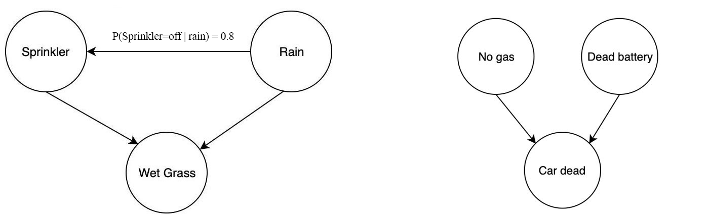

## Table of Contents

## What are graphics models in the context of machine learning?

Graphics models in machine learning are a type of model that uses graphs to represent the relationships between different variables. These graphs are made up of nodes, which represent the variables, and edges, which show how the variables are connected or dependent on each other. By using these graphs, graphics models can help us understand and predict how changes in one variable might affect others. This is really useful in many areas, like figuring out how genes interact or predicting weather patterns.

One common type of graphics model is the Bayesian network. In a Bayesian network, the nodes represent random variables, and the edges show the conditional dependencies between these variables. This means that the probability of one variable can depend on the value of another variable. For example, if we're looking at a weather model, the probability of it raining might depend on the current humidity and temperature. By using a Bayesian network, we can calculate these probabilities and make better predictions. The formula for calculating the joint probability distribution in a Bayesian network is $$ P(X_1, X_2, \ldots, X_n) = \prod_{i=1}^n P(X_i | \text{Pa}(X_i)) $$, where $$ \text{Pa}(X_i) $$ are the parents of node $$ X_i $$ in the graph.

Another type of graphics model is the Markov Random Field (MRF). Unlike Bayesian networks, MRFs are undirected graphs, meaning the edges do not show a direction of dependency. Instead, they represent a mutual relationship between variables. MRFs are often used in image processing and computer vision, where the value of a pixel can depend on its neighboring pixels. For example, in a simple image smoothing algorithm, you might use an MRF to model how the color of one pixel should be similar to the colors of the pixels around it. This helps in creating a smoother and more natural-looking image.

## How do graphics models differ from traditional machine learning models?

Graphics models and traditional machine learning models both aim to understand and predict data, but they do so in different ways. Graphics models use graphs to show how different pieces of data are connected. These graphs have nodes, which are like points on a map, and edges, which are like roads connecting the points. The nodes represent variables, and the edges show how these variables depend on each other. This makes graphics models really good at showing complex relationships between data points. For example, in a weather model, graphics models can show how temperature, humidity, and rain are all connected.

Traditional machine learning models, on the other hand, often use math formulas to predict outcomes based on input data. These models might use things like linear regression, where you try to draw a straight line through your data points, or decision trees, where you make a series of choices to reach a prediction. These models are great at finding patterns in data and making predictions, but they don't show the relationships between variables as clearly as graphics models do. For instance, a traditional model might predict the chance of rain based on temperature and humidity, but it won't show how these factors are connected in the same way a graphics model would.

In summary, while both types of models are useful, graphics models are better at showing how different pieces of data are related, and traditional models are better at making predictions based on patterns in the data. Graphics models use graphs to represent these relationships, making them very useful for understanding complex systems. Traditional models, however, focus more on the math behind the predictions, which can be more straightforward but less insightful about the connections between variables.

## What is ManifoldPlus and how does it relate to graphics models?

ManifoldPlus is a tool that helps with graphics models in machine learning. It's like a special map that helps you understand how different pieces of data are connected. Imagine you have a bunch of dots on a piece of paper, and you want to draw lines to show how they are related. ManifoldPlus helps you figure out the best way to draw those lines so that the connections make sense. It's especially useful when you're dealing with data that has a lot of different parts, and you need to see how they all fit together.

In the context of graphics models, ManifoldPlus helps by making it easier to see the structure of your data. Graphics models use graphs to show how variables are connected, and ManifoldPlus can help you find the best way to represent those connections. For example, if you're looking at a weather model, ManifoldPlus can help you see how temperature, humidity, and rain are all linked together. This makes it easier to understand and predict how changes in one part of the data might affect the other parts.

## What are the basic components of a graphics model?

The basic components of a graphics model are nodes and edges. Nodes are like points on a map, and they represent the different variables in your data. For example, if you're looking at a weather model, each node might represent things like temperature, humidity, or rain. Edges are like the lines that connect these points, and they show how the variables are related to each other. If there's an edge between the temperature node and the rain node, it means that the temperature can affect whether it rains or not.

In more detail, the nodes in a graphics model can represent random variables, and the edges can show different kinds of relationships. In a Bayesian network, the edges have arrows that show the direction of the relationship, like how humidity might affect the chance of rain. The formula for calculating the joint probability distribution in a Bayesian network is $$ P(X_1, X_2, \ldots, X_n) = \prod_{i=1}^n P(X_i | \text{Pa}(X_i)) $$, where $$ \text{Pa}(X_i) $$ are the parents of node $$ X_i $$ in the graph. In a Markov Random Field (MRF), the edges don't have arrows, so they show that the variables depend on each other in both directions. This is useful for things like image processing, where the color of one pixel can affect the color of the pixels around it.

## How can graphics models be used to improve image recognition tasks?

Graphics models can help make image recognition better by showing how different parts of an image are connected. In image recognition, we often need to understand how the pixels in an image relate to each other. Graphics models, like Markov Random Fields (MRFs), are really good at this. They use graphs to show how the color or brightness of one pixel can affect the pixels around it. This helps the computer understand the image as a whole, not just as separate pieces. For example, if you're trying to recognize a cat in a picture, the graphics model can help the computer see how the cat's fur color changes smoothly across its body, making it easier to identify the whole cat.

Using graphics models can also make image recognition more accurate. Traditional models might look at each pixel separately and try to guess what's in the image based on patterns. But graphics models look at the relationships between pixels, which can help the computer make better guesses. For instance, if the computer sees a pattern that looks like a face, a graphics model can help it check if the surrounding pixels also fit the pattern of a face, like the eyes, nose, and mouth being in the right places. This way, the computer can be more sure about what it's seeing, leading to fewer mistakes in recognizing objects in images.

## What are the advantages of using ManifoldPlus in graphics modeling?

ManifoldPlus makes graphics modeling easier by helping you understand how different pieces of data fit together. It's like having a special map that shows you the best way to connect the dots in your data. This tool is especially useful when you're dealing with a lot of different variables, like in a weather model where you have temperature, humidity, and rain all linked together. By using ManifoldPlus, you can see these connections more clearly, which helps you make better predictions and understand your data better.

Another big advantage of ManifoldPlus is that it can help you find patterns and relationships that might be hard to see otherwise. For example, if you're working on an image recognition task, ManifoldPlus can show you how the pixels in an image are related to each other. This can make your image recognition more accurate because you're not just looking at each pixel by itself, but also how it fits with the pixels around it. This way, ManifoldPlus helps you see the big picture and make smarter decisions based on your data.

## Can you explain the mathematical foundations behind ManifoldPlus?

ManifoldPlus is built on the idea of using math to understand how different pieces of data are connected. It uses something called manifold learning, which is a way to find patterns in data that live in high-dimensional spaces. Imagine you have a bunch of dots on a piece of paper, but the paper is folded in lots of different ways. Manifold learning helps you see the best way to unfold the paper so the dots make sense. ManifoldPlus takes this idea and applies it to graphics models, helping you see how variables are related in a way that's easy to understand. It uses a special kind of math called differential geometry to do this, which is all about understanding shapes and how they change.

One of the key math ideas behind ManifoldPlus is the concept of geodesics. Geodesics are the shortest paths between points on a curved surface. In the context of ManifoldPlus, geodesics help you find the best way to connect the dots in your data. The formula for calculating the length of a geodesic on a manifold is given by $$ L(\gamma) = \int_a^b \sqrt{g_{ij}(\gamma(t)) \dot{\gamma}^i(t) \dot{\gamma}^j(t)} \, dt $$, where $$ \gamma $$ is the path, $$ g_{ij} $$ is the metric tensor, and $$ \dot{\gamma} $$ is the derivative of the path. By using geodesics, ManifoldPlus can help you see the most direct relationships between your variables, making your graphics models more accurate and easier to understand.

## How do you implement a basic graphics model using ManifoldPlus?

To implement a basic graphics model using ManifoldPlus, you first need to set up your data in a way that ManifoldPlus can understand. Imagine you have a dataset with different variables, like temperature, humidity, and rain. You would start by organizing this data into a format that shows how these variables might be connected. ManifoldPlus uses graphs to represent these connections, so you'll need to create nodes for each variable and edges to show how they relate to each other. This can be done using a programming language like Python, where you would use libraries to handle the data and create the graph structure.

Once your data is set up, you can use ManifoldPlus to find the best way to connect the nodes. ManifoldPlus uses a special kind of math called manifold learning to do this. It looks at the data and figures out the shortest paths, called geodesics, between the nodes. The formula for calculating the length of a geodesic on a manifold is $$ L(\gamma) = \int_a^b \sqrt{g_{ij}(\gamma(t)) \dot{\gamma}^i(t) \dot{\gamma}^j(t)} \, dt $$. By using this formula, ManifoldPlus helps you see the most direct relationships between your variables, making your graphics model more accurate and easier to understand. You can then use this model to make predictions or understand how changes in one variable might affect others.

## What are some common challenges faced when training graphics models?

Training graphics models can be tricky because they need a lot of data to work well. If you don't have enough data, the model might not be able to see all the important connections between the variables. This can make the model less accurate and harder to trust. Also, graphics models can be sensitive to how you set them up. If you don't pick the right way to connect the nodes and edges, the model might not show the relationships in your data correctly. This means you need to be careful when you're setting up your model and make sure you're using the data in the best way possible.

Another challenge is that graphics models can take a long time to train, especially if you're working with a lot of data. The math behind these models, like the formula for calculating the length of a geodesic on a manifold $$ L(\gamma) = \int_a^b \sqrt{g_{ij}(\gamma(t)) \dot{\gamma}^i(t) \dot{\gamma}^j(t)} \, dt $$, can be complicated and slow to compute. This means you might need powerful computers to train your model quickly. On top of that, it can be hard to know if your model is working well. You need to keep checking and tweaking it to make sure it's giving you the right answers. This can be a lot of work, but it's important to make sure your graphics model is as good as it can be.

## How can the performance of graphics models be evaluated and optimized?

To evaluate the performance of graphics models, you need to check how well they predict or understand the relationships in your data. One way to do this is by using a test set, which is a part of your data that the model hasn't seen before. You can see how well the model predicts the outcomes in the test set and compare it to the actual outcomes. If the model does well, it means it's understanding the relationships correctly. Another way is to use metrics like accuracy, precision, and recall. These numbers help you see how many correct predictions the model makes and how many mistakes it has. If the model's performance is not good enough, you might need to go back and change how you set up the model or use more data to train it.

To optimize the performance of graphics models, you can try different ways of connecting the nodes and edges. For example, you might use a tool like ManifoldPlus to find the best paths between the nodes. The formula for calculating the length of a geodesic on a manifold is $$ L(\gamma) = \int_a^b \sqrt{g_{ij}(\gamma(t)) \dot{\gamma}^i(t) \dot{\gamma}^j(t)} \, dt $$. By using this formula, you can make sure the connections in your model are as direct and meaningful as possible. Another way to optimize is to use more data or better data. The more information the model has, the better it can understand the relationships. You might also need to tweak the model's settings, like changing the learning rate or the number of iterations, to see if that improves the performance. It's a bit like trying different recipes until you find the one that works best.

## What advanced techniques can be applied to enhance the capabilities of ManifoldPlus?

To enhance the capabilities of ManifoldPlus, one advanced technique is to use a method called "manifold alignment." This technique helps you combine different sets of data that might be related but come from different sources. Imagine you have two maps of the same area but drawn by different people. Manifold alignment helps you line up these maps so you can see the whole picture more clearly. By doing this, ManifoldPlus can understand more about how the variables in your data are connected, making your graphics model more accurate and useful. The math behind manifold alignment involves finding a transformation that minimizes the distance between corresponding points on different manifolds, which can be represented by the formula $$ \min_{f} \sum_{i,j} \| f(x_i) - y_j \|^2 $$, where $$ f $$ is the transformation function, $$ x_i $$ are points on one manifold, and $$ y_j $$ are points on another.

Another technique to improve ManifoldPlus is to use "kernel methods." These methods help you see patterns in your data that might be hard to spot otherwise. Think of it like using a special pair of glasses that makes certain details stand out more. Kernel methods can help ManifoldPlus find more complex relationships between the variables in your data, making your graphics model better at understanding and predicting outcomes. For example, you might use a Gaussian kernel, which can be represented by the formula $$ K(x, y) = \exp\left(-\frac{\|x - y\|^2}{2\sigma^2}\right) $$, where $$ \sigma $$ is a parameter that controls how much the kernel spreads out. By applying kernel methods, you can make your graphics model more powerful and insightful.

## What are the current research trends and future directions in graphics modeling with ManifoldPlus?

Current research trends in graphics modeling with ManifoldPlus are focusing on making the tool work better with big data. Scientists are trying to find ways to handle more data faster and more accurately. They're using techniques like manifold alignment to combine different sets of data and see the big picture more clearly. For example, researchers are working on ways to line up data from different sources, like weather data from different countries, to make better predictions. The math behind this involves finding a transformation that minimizes the distance between corresponding points on different manifolds, which can be represented by the formula $$ \min_{f} \sum_{i,j} \| f(x_i) - y_j \|^2 $$. By doing this, ManifoldPlus can help understand complex relationships in large datasets, making it more useful for real-world applications.

Future directions for ManifoldPlus include making it easier to use and more powerful. Researchers are looking into ways to automate the process of setting up the model so that it's less work for people. They're also exploring how to use ManifoldPlus in new areas, like biology and social networks, where understanding the connections between different pieces of data is really important. Another exciting area is combining ManifoldPlus with other machine learning techniques, like deep learning, to create even more accurate models. By working together, these methods could help us see patterns and make predictions that we couldn't before. This could lead to breakthroughs in fields like medicine, where understanding how different factors affect health could save lives.