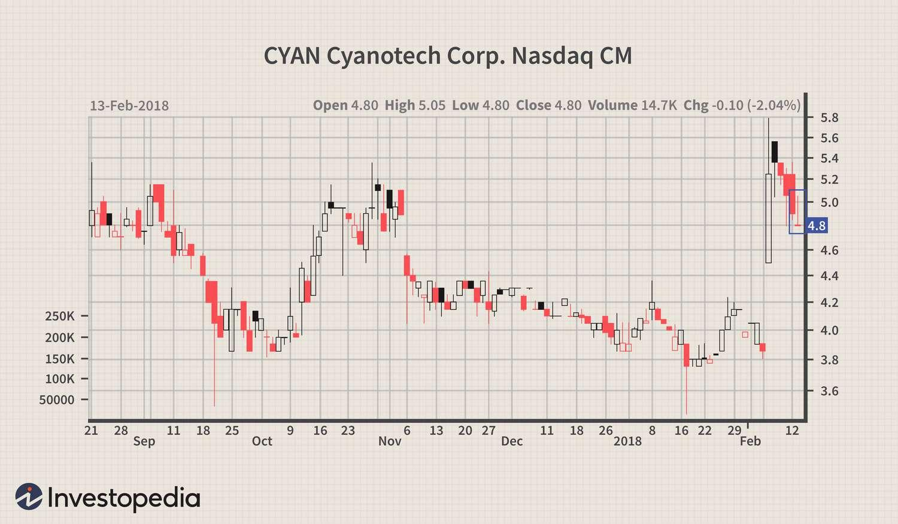

## Table of Contents

## What is a Gravestone Doji candlestick pattern?

A Gravestone Doji is a type of candlestick pattern that you might see on a stock chart. It looks like an upside-down 'T'. This pattern happens when the stock's price starts and ends at the same level during a trading day, but it goes up a lot in between. The long line at the top of the 'T' shows where the price went up to before coming back down.

This pattern is important because it can show that buyers tried to push the price up, but sellers were too strong and brought it back down. Traders often see this as a sign that the price might start to go down soon. If you see a Gravestone Doji after the price has been going up for a while, it might mean that the upward trend is getting weak and could reverse.

## How does a Gravestone Doji form on a chart?

A Gravestone Doji forms on a chart when the price of a stock opens at a certain level, then goes up a lot during the day, but by the end of the day, it comes all the way back down to the opening price. This makes the candlestick look like an upside-down 'T'. The long line at the top of the 'T' shows how high the price went before it fell back down.

This pattern shows that even though buyers pushed the price up during the day, sellers were strong enough to bring it back down to where it started. If you see a Gravestone Doji after the price has been going up for a while, it might mean that the upward trend is getting weaker and the price could start to go down soon.

## What does a Gravestone Doji indicate about market sentiment?

A Gravestone Doji shows that the market sentiment might be changing. When you see this pattern, it means that during the day, the price of the stock went up a lot but then came all the way back down to where it started. This tells us that even though buyers tried to push the price higher, sellers were strong enough to bring it back down. This can be a sign that the people who want to sell are starting to take control.

If the Gravestone Doji appears after the price has been going up for a while, it suggests that the upward trend might be getting weak. Traders often see this as a warning that the price could start to go down soon. It shows that the market might be losing its confidence in the stock's ability to keep going up, and more people might start selling.

## In which types of markets can a Gravestone Doji appear?

A Gravestone Doji can appear in any type of market where stocks, commodities, or currencies are traded. This includes stock markets like the New York Stock Exchange or the NASDAQ, where people buy and sell shares of companies. It can also show up in markets for things like oil, gold, or wheat, where traders buy and sell these goods. Even in the foreign exchange market, where different currencies are traded against each other, you might see a Gravestone Doji.

The pattern can be seen in both short-term and long-term charts. For example, it might appear on a daily chart, which shows what happens to the price over one day, or on a weekly chart, which shows price movements over a week. No matter the market or the time frame, a Gravestone Doji always means the same thing: the price went up during the day but came back down to where it started, suggesting that sellers might be gaining strength and the price could start to fall.

## How can a beginner identify a Gravestone Doji on a price chart?

To spot a Gravestone Doji on a price chart, look for a candlestick that looks like an upside-down 'T'. This means the opening and closing prices of the stock for that day are the same, and they are at the bottom of the candlestick. The long line sticking up from the bottom is called the upper shadow, and it shows how high the price went during the day before coming back down to the opening price.

Beginners can practice identifying this pattern by looking at different charts and paying attention to the shape of the candlesticks. If you see a candlestick that starts at the bottom, goes up a lot, but then comes back down to the bottom by the end of the day, that's a Gravestone Doji. Remember, it's a sign that the sellers might be getting stronger, especially if the price has been going up for a while before you see this pattern.

## What are the key characteristics that distinguish a Gravestone Doji from other Doji patterns?

A Gravestone Doji is a special kind of Doji pattern that looks like an upside-down 'T'. The main thing that makes it different from other Dojis is that the opening and closing prices are the same, and they are at the bottom of the candlestick. The long line sticking up from the bottom, called the upper shadow, shows how high the price went during the day before coming back down to where it started. This shape tells us that even though buyers pushed the price up, sellers were strong enough to bring it back down.

Other Doji patterns, like the Dragonfly Doji or the Long-Legged Doji, have different shapes and meanings. A Dragonfly Doji looks like a 'T' and shows that the price went down a lot during the day but came back up to the opening price by the end. A Long-Legged Doji has long lines both above and below the opening and closing prices, showing that the price went both up and down a lot but ended up back where it started. Each of these patterns tells a different story about what buyers and sellers are doing, but the Gravestone Doji is unique because it shows a strong push up followed by a full retreat back to the starting point.

## Can you explain the psychological interpretation behind a Gravestone Doji?

A Gravestone Doji tells us about what people are feeling in the market. When you see this pattern, it means the price went up a lot during the day but then came all the way back down to where it started. This shows that even though some people wanted to buy the stock and push the price higher, other people who wanted to sell were stronger and brought the price back down. It's like a tug-of-war where the sellers won in the end.

This pattern can make people feel worried if the price has been going up for a while. Seeing a Gravestone Doji might make buyers think twice about buying more, because it looks like the sellers are starting to take control. It can be a sign that the good feelings about the stock going up might be changing, and people might start to think the price could go down soon.

## What are the potential trading strategies that can be used when a Gravestone Doji appears?

When you see a Gravestone Doji, it can be a good time to think about selling if you already own the stock. This pattern shows that even though the price went up during the day, it came back down to where it started. That means sellers are getting stronger, and the price might start to go down. If you see this after the price has been going up for a while, you might want to sell your stock to avoid losing money if the price does go down.

Another strategy is to wait and see if the price actually starts to go down after the Gravestone Doji appears. You can put in a sell order at a lower price, called a stop-loss order, just in case the price drops. This way, you can sell the stock automatically if it reaches that lower price. If the price doesn't go down and keeps going up instead, you can keep holding onto your stock.

If you don't own the stock but you're thinking about buying it, seeing a Gravestone Doji might make you want to wait. It's a sign that the price could go down soon, so it might be better to wait and see what happens before you decide to buy. If the price does go down after the Gravestone Doji, you might be able to buy the stock at a lower price later.

## How reliable is a Gravestone Doji as a reversal signal, and what factors affect its reliability?

A Gravestone Doji can be a good sign that the price of a stock might start to go down soon, but it's not always perfect. It's more reliable when you see it after the price has been going up for a while. This pattern shows that even though the price went up during the day, it came back down to where it started, which means sellers are getting stronger. If you see this after a long time of the price going up, it's a stronger hint that the price could change direction and start going down.

The reliability of a Gravestone Doji can be affected by different things. One big thing is how much the price was going up before the Gravestone Doji appeared. If the price was going up a lot and for a long time, the Gravestone Doji is a stronger sign that the price might go down. Another thing that matters is how much trading was happening when the Gravestone Doji showed up. If a lot of people were buying and selling, it makes the pattern more important. Also, it's good to look at other signs on the chart to see if they agree with the Gravestone Doji, because using more than one sign can make your guess about the price going down more reliable.

## What are some common mistakes traders make when interpreting a Gravestone Doji?

One common mistake traders make when seeing a Gravestone Doji is thinking it always means the price will go down right away. Just because a Gravestone Doji shows up doesn't mean the price will start falling immediately. It's a sign that sellers might be getting stronger, but it's not a sure thing. Traders should look at other signs on the chart and maybe wait to see if the price actually starts to go down before making a decision.

Another mistake is not paying attention to what the price was doing before the Gravestone Doji appeared. If the price was going up a lot before, the Gravestone Doji is a stronger hint that the price might reverse. But if the price wasn't moving much or was already going down, the pattern might not be as important. Traders should always look at the bigger picture and not just focus on one pattern.

Lastly, some traders might ignore the [volume](/wiki/volume-trading-strategy) of trading when a Gravestone Doji shows up. If there's a lot of buying and selling happening when the Gravestone Doji appears, it's a stronger sign. But if not many people are trading, the pattern might not be as reliable. It's important to check the trading volume to see how serious the sign is.

## How does the position of a Gravestone Doji within a trend affect its significance?

The position of a Gravestone Doji within a trend really changes how important it is. If you see a Gravestone Doji after the price has been going up for a long time, it's a big deal. It means that even though the price went up a lot during the day, it came back down to where it started. This shows that sellers are getting stronger, and it's a warning that the price might start to go down soon. When the Gravestone Doji comes at the top of an upward trend, it's a strong hint that the trend could be about to change direction.

But if the Gravestone Doji shows up when the price isn't moving much or is already going down, it's not as important. In these cases, the pattern might just mean that the price is still trying to figure out which way to go. It's not a strong sign of a big change coming. So, when you see a Gravestone Doji, always look at what the price was doing before to understand how serious the pattern is.

## Can you discuss advanced techniques for confirming a Gravestone Doji signal, such as using volume or other indicators?

When you see a Gravestone Doji, one way to make sure it's a good sign that the price might go down is to look at how much trading was happening. If a lot of people were buying and selling when the Gravestone Doji showed up, it means the pattern is more important. High trading volume tells us that more people agree with the sellers, making the signal stronger. So, always check the volume to see if the Gravestone Doji is a big deal.

Another way to confirm a Gravestone Doji is to look at other signs on the chart. For example, if the price breaks below a support level after the Gravestone Doji, it's a stronger hint that the price will go down. You can also use other indicators like the Relative Strength Index (RSI) or the Moving Average Convergence Divergence (MACD). If these indicators show that the stock is overbought or if they start to move in a way that suggests the price might fall, it supports the idea that the Gravestone Doji is a good signal. Always look at more than one thing on the chart to be sure about what the Gravestone Doji means.

## How do you trade the Gravestone Doji candlestick pattern?

Trading the Gravestone Doji candlestick pattern effectively involves several strategic steps. Primarily, confirming the pattern’s occurrence at the peak of an uptrend, particularly where resistance increases, is crucial. This confirmation is essential since the Gravestone Doji typically indicates a potential reversal.

Traders should supplement the identification of this pattern with additional bearish indicators like a declining Relative Strength Index (RSI). A falling RSI suggests that the bullish [momentum](/wiki/momentum) is weakening, strengthening the case for a reversal signaled by the Gravestone Doji. The RSI is calculated using the formula:

$$

RSI = 100 - \left(\frac{100}{1 + RS}\right) 
$$

where $RS$ is the average of $n$ days' up closes divided by the average of $n$ days' down closes. A falling RSI from a high level could corroborate the bearish indication of a Gravestone Doji.

Setting a stop-loss is a critical aspect of managing risks when trading this pattern. The stop-loss should be placed slightly above the high of the Gravestone Doji. This method shields traders from unexpected bullish movements that contradict the bearish reversal expectations.

Profit targets should be intelligently set just before the next support level. This approach allows traders to secure gains when the downward momentum initiates. Identifying these profit targets demands understanding the market structure and examining past price movements to locate potential support zones.

Automating the trading strategy using algorithms can improve execution speed and maintain consistency. Python is a suitable language for developing such algorithms due to its robust libraries for financial analysis and trading. For instance, using Python and libraries like `pandas` and `talib`, one can programmatically identify the Gravestone Doji and automate trading decisions:

```python
import pandas as pd
import talib

# Assuming `data` is a pandas dataframe with OHLC data
data['Gravestone_Doji'] = talib.CDLGRAVESTONEDOJI(data['Open'], data['High'], data['Low'], data['Close'])

# Filtering Gravestone Doji signals
gravestone_days = (data['Gravestone_Doji'] != 0)

# Example Stop-loss & Profit Target Simulation
stop_loss = data.loc[gravestone_days, 'High'] * 1.01  # Stop-loss just above the high
profit_target = data.loc[gravestone_days, 'Low'] * 0.99  # Profit target just before the support level
```

By automating these strategies, traders can benefit from executing orders without the emotional bias that manual trading might introduce. Proper [backtesting](/wiki/backtesting) of this strategy over historical data can fine-tune the parameters and enhance strategy robustness, optimizing for consistent profitability across different market conditions.

## References & Further Reading

[1]: Nison, S. (2001). ["Japanese Candlestick Charting Techniques, Second Edition."](https://www.amazon.com/Japanese-Candlestick-Charting-Techniques-Second/dp/0735201811) Prentice Hall Press.

[2]: Brooks, A. (2009). ["Reading Price Charts Bar by Bar: The Technical Analysis of Price Action for the Serious Trader."](https://www.amazon.com/Reading-Price-Charts-Bar-Technical/dp/0470443952) Wiley Trading.

[3]: Bulkowski, T. (2008). ["Encyclopedia of Candlestick Charts."](https://onlinelibrary.wiley.com/doi/book/10.1002/9781119202288) Wiley.

[4]: Pring, M. (2002). ["Technical Analysis Explained, Fifth Edition: The Successful Investor's Guide to Spotting Investment Trends and Turning Points."](https://www.amazon.com/Technical-Analysis-Explained-Fifth-Successful/dp/0071825177) McGraw-Hill Education.

[5]: Murphy, J. J. (1999). ["Technical Analysis of the Financial Markets: A Comprehensive Guide to Trading Methods and Applications."](https://www.amazon.com/Technical-Analysis-Financial-Markets-Comprehensive/dp/0735200661) New York Institute of Finance.