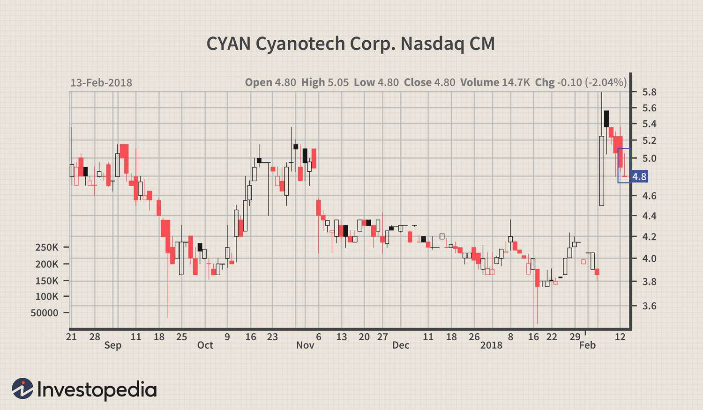

The world of trading encompasses a variety of strategies and tools designed to assist traders in making informed decisions. Among these tools, candlestick patterns hold a pivotal role in technical analysis, providing insights into market sentiment and potential price movements. Candlestick patterns graphically display the high, low, open, and close prices of a security over a specific time period and help traders to predict future movements by analyzing the historical data. One particular pattern, known as the Gravestone Doji, is highly regarded for its ability to predict bearish reversals. The Gravestone Doji is especially recognized because it indicates a shift in market sentiment and a potential decline in price, making it an important signal for traders considering short positions or planning to exit long positions.

The focus of this article is on the Gravestone Doji candlestick pattern and its trading potential, particularly in the context of algorithmic trading strategies. Through algorithmic trading, traders utilize computer programs to execute trades automatically based on predefined criteria. This approach can significantly enhance the consistency and speed of trading decisions. By integrating the Gravestone Doji into such algorithms, traders can potentially identify and capitalize on market reversals more efficiently.



We aim to provide a comprehensive guide on identifying, interpreting, and effectively trading using the Gravestone Doji pattern, specifically within algorithmic trading. This includes understanding its structure, the signals it conveys, and the algorithmic methods that can exploit these signals for better trading outcomes. The goal is to equip traders with the knowledge and tools needed to integrate this pattern into a broader trading strategy that balances technical analysis and risk management.

## Table of Contents

## Understanding the Gravestone Doji

A Gravestone Doji is a distinct candlestick pattern frequently utilized in technical analysis to anticipate potential market reversals. The pattern is notable for its defining shape, which resembles an inverted "T". This structure emerges due to the following components:

1. **Long Upper Shadow**: The upper shadow is significantly extended, indicating that buyers initially drove prices up during the trading session. However, they lost control by the close, allowing prices to fall back to or near the opening level.

2. **Little to No Body**: The body of a Gravestone Doji is minimal to nonexistent, meaning the open and close prices are nearly identical. This suggests indecision in the market, where neither buyers nor sellers have the definitive upper hand at the session's close.

3. **Bearish Market Sentiment Indicator**: The presence of this pattern, especially at the top of an existing uptrend, typically signals that the bullish momentum might be waning. This is because the buyers' inability to sustain higher price levels through the session indicates potential weaknesses in upward momentum.

4. **Strategic Trading Signal**: Traders often interpret the Gravestone Doji as a cue to exit long positions or to consider initiating short positions, anticipating a downtrend. The psychological shift represented by this pattern can indicate a transition from buying pressure to selling pressure.

Understanding these elements can assist traders in reacting appropriately to shifts in market sentiment, allowing them to capitalize on potential bearish reversals that the Gravestone Doji pattern forecasts.

## How to Identify a Gravestone Doji

Identifying a Gravestone Doji involves recognizing its distinct structure on candlestick charts, crucial for anticipating potential market reversals. A Gravestone Doji is characterized by a significantly long upper shadow and either a small or non-existent lower shadow. This pattern typically resembles an inverted "T", indicating the struggle between buyers and sellers, where buyers initially push prices higher, but sellers ultimately drive them back down to the session's opening price.

The open, close, and low prices of the session for a Gravestone Doji are generally very close or equal. This configuration suggests that despite bullish efforts during the trading session, the closing price falls near or at the session's low, underscoring a shift toward bearish sentiment. Recognizing this configuration is essential to anticipate a trend reversal, particularly when the pattern forms at the terminal stage of an uptrend.

To effectively identify Gravestone Dojis, manual analysis can be performed by observing candlestick charts, focusing on patterns that meet the criteria. However, utilizing tools and software in [algorithmic trading](/wiki/algorithmic-trading) can enhance the identification process. For instance, algorithms can be programmed to scan for candlestick structures that match the Gravestone Doji's distinctive features across multiple markets simultaneously. Here is a basic example of what such an algorithm could look like in Python using the pandas library:

```python
import pandas as pd

def identify_gravestone_doji(data):
    """
    Identify Gravestone Doji patterns in the given DataFrame.
    The DataFrame should have 'Open', 'High', 'Low', 'Close' columns.
    """
    gravestone_doji = []

    for index, row in data.iterrows():
        open_price = row['Open']
        close_price = row['Close']
        high_price = row['High']
        low_price = row['Low']

        if abs(open_price - close_price) <= (0.001 * open_price):  # Small or no body
            upper_shadow = high_price - max(open_price, close_price)
            lower_shadow = min(open_price, close_price) - low_price
            if upper_shadow > (2 * abs(open_price - close_price)) and lower_shadow <= (0.1 * upper_shadow):
                gravestone_doji.append(index)

    return gravestone_doji

# Example usage:
# df = pd.read_csv('historical_prices.csv')
# gravestone_dates = identify_gravestone_doji(df)
# print("Gravestone Doji found on:", gravestone_dates)
```

In the context of algorithmic trading, the identification process of Gravestone Doji patterns can be automated, providing traders with the capability to quickly analyze vast datasets and maintain efficiency in decision-making. By automating the detection of this pattern, traders can focus on evaluating other factors and executing timely trades based on a predefined set of conditions that incorporate Gravestone Doji formations.

## Trading Strategies With Gravestone Doji

Gravestone Doji patterns are valuable tools in crafting trading strategies for determining entry and [exit](/wiki/exit-strategy) points. By incorporating these patterns with other technical analysis tools, traders can enhance their decision-making processes. A typical strategy involves integrating Gravestone Doji patterns with resistance levels or moving averages. Resistance levels represent prices at which a stock or market consistently struggles to exceed, providing natural conjunction points for Doji signals. Similarly, moving averages help identify prevailing market trends, offering additional context to the reversals suggested by Gravestone Dojis.

One effective strategy is leveraging pullbacks in conjunction with naked charts. This involves examining price action without the addition of numerous indicators, focusing instead on the raw data. Traders look for price retracements against the prevailing trend and position Gravestone Dojis at the end of these pullbacks, indicating potential continuations of the primary trend.

The integration of RSI (Relative Strength Index) divergences provides another layer of confirmation. RSI is a [momentum](/wiki/momentum) indicator that measures the magnitude of recent price changes, thereby evaluating overbought or oversold conditions. When a Gravestone Doji appears in tandem with an RSI divergence — where the RSI indicates weakening momentum despite price growth — the reliability of a bearish reversal signal increases.

Pivot points, considered crucial levels of technical analysis, can also be employed alongside Gravestone Doji formations. These points are calculated based on the previous period's high, low, and close prices and serve as potential turning points in the market. Traders often watch for Gravestone Dojis forming around pivot points as signals for imminent market reversals, reinforcing their strategic decisions.

For algorithmic traders, automated systems can be developed to execute trades based on predefined conditions involving Gravestone Doji patterns. Here's an example of a simple Python script using a popular trading library like TA-Lib to identify Gravestone Doji patterns and confirm them with RSI divergences:

```python
import talib
import pandas as pd

# Load your historical data into a DataFrame
# This DataFrame should contain 'Open', 'High', 'Low', 'Close' columns
data = pd.read_csv('historical_data.csv')

# Calculate Gravestone Doji
doji = talib.CDLGRAVESTONEDOJI(data['Open'], data['High'], data['Low'], data['Close'])

# Calculate RSI
rsi = talib.RSI(data['Close'], timeperiod=14)

# Define a function to identify signals
def identify_signals(data, doji, rsi):
    signals = []
    for i in range(1, len(data)):
        # Check for Gravestone Doji and RSI divergence
        if doji[i] != 0 and rsi[i] < 30 and rsi[i] < rsi[i-1]:
            signals.append((i, 'Sell'))
    return signals

# Find trading signals
signals = identify_signals(data, doji, rsi)
print(signals)
```

This code serves as a foundational example and should be expanded upon to incorporate additional filters, [backtesting](/wiki/backtesting), and risk management protocols tailored to specific trading objectives and market conditions. The careful application of these strategies enables traders to harness the predictive power of Gravestone Doji patterns, enhancing trading performance across diverse market environments.

## Algorithmic Trading and the Gravestone Doji

Algorithmic trading leverages computer algorithms to automate trading decisions and executes trades with precision and speed. Incorporating candlestick patterns like the Gravestone Doji into these strategies can effectively identify potential market reversals, enhancing trading outcomes.

Including Gravestone Doji patterns into algorithmic strategies requires developing a systematic approach. Algorithms should be programmed to recognize the Gravestone Doji pattern's key characteristics—specifically its long upper shadow, small or absent body, and minimal lower shadow. However, relying solely on this pattern may lead to false signals. Therefore, algorithms should also align the pattern detection with other technical indicators, such as moving averages, RSI divergences, or resistance levels, to confirm trading signals and reduce error.

Backtesting plays a crucial role in algorithmic trading, allowing traders to refine their strategies by testing them over historical data. By simulating trades over past market data, traders can evaluate the effectiveness of incorporating the Gravestone Doji in various market conditions. This historical analysis aids in understanding the pattern's performance and adjusting strategies to maximize profitability.

Risk management protocols are fundamental to any trading strategy, particularly in algorithmic trading, where trades occur at a high velocity. Safeguarding against market [volatility](/wiki/volatility-trading-strategies) and unforeseen scenarios involves setting stop-loss and take-profit levels to cap potential losses and secure gains. Advanced algorithms can be coded to dynamically adjust these levels based on market conditions, further enhancing risk management.

In summary, the integration of the Gravestone Doji into algorithmic trading necessitates a disciplined approach. By employing a combination of robust pattern recognition techniques, backtesting, and stringent risk management measures, algorithmic traders can exploit the predictive potential of the Gravestone Doji pattern and improve their trading performance.

## Limitations and Considerations

The Gravestone Doji is a useful candlestick pattern, but it is not without its limitations. Traders should be cautious and use it alongside other analytical tools to enhance its efficacy. One of the primary challenges with the Gravestone Doji is the potential for false signals. This pattern may not always accurately indicate a bearish reversal, especially when observed in isolation. Confirmatory signals from other technical indicators or patterns, such as moving averages or the Relative Strength Index (RSI), can enhance the reliability of trading decisions based on the Gravestone Doji.

In algorithmic trading, keeping trading systems updated and tuned is crucial for adapting to evolving market conditions. Financial markets are dynamic, and a static system may fail to account for new trends or shifts. Continuous evaluation and refinement of the algorithm are necessary to ensure it remains effective. For instance, periodically recalibrating algorithms to incorporate recent market data or adjusting parameters based on performance analysis can help maintain a relevant edge in trading.

External factors, such as market news and geopolitical events, can significantly influence trading outcomes. A Gravestone Doji pattern that occurs amidst significant news announcements or geopolitical tensions may not perform as expected due to increased market volatility. Traders should integrate a mechanism for monitoring important news events and account for them in the trading strategy to adjust or halt trades when necessary.

A robust risk management framework is essential to mitigate potential losses. This involves setting stop-loss orders and position sizes that align with the trader's risk tolerance. For instance, using a fixed percentage of the trading account per trade or employing a volatility-based position sizing strategy can help control risk. Additionally, diversification across different assets or strategies can further reduce exposure to any single market movement. An example of implementing stop-loss in Python might involve setting a threshold whereby a trade is exited if the price moves a certain percentage against the position:

```python
def should_exit(position_price, current_price, stop_loss_percentage):
    loss_threshold = position_price * (1 - stop_loss_percentage / 100)
    return current_price <= loss_threshold

# Example usage:
position_price = 100
current_price = 95
stop_loss_percentage = 5

if should_exit(position_price, current_price, stop_loss_percentage):
    print("Exit the trade")
else:
    print("Hold the position")
```

By systematically coordinating these elements, traders can improve their trading strategies while effectively managing risks associated with the dynamic nature of financial markets.

## Conclusion

The Gravestone Doji serves as a crucial indicator for traders aiming to spot potential bearish reversals. As part of algorithmic trading strategies, its utility lies in automating and enhancing the detection of trading opportunities. Integrating the Gravestone Doji into these strategies requires a disciplined approach, often involving the combination of this pattern with other technical analysis tools to strengthen signal accuracy. 

Acknowledging the limitations of the Gravestone Doji is vital for traders. By continually refining strategies and adapting to the dynamic nature of markets, traders can position themselves more effectively. Such refinement may include periodic backtesting and adjusting algorithms to cater to evolving market behavior, thereby improving the reliability of trade signals.

Ultimately, success in trading is rooted in a holistic approach. This involves balancing technical analysis, such as the use of the Gravestone Doji, with robust risk management protocols and making informed decisions. By maintaining a comprehensive and adaptable strategy, traders can navigate the complexities of market conditions while minimizing potential risks. This strategic balance is essential for maximizing the benefits of utilizing the Gravestone Doji within the broader scope of algorithmic trading.

## References & Further Reading

[1]: Bergstra, J., Bardenet, R., Bengio, Y., & Kégl, B. (2011). ["Algorithms for Hyper-Parameter Optimization."](https://dl.acm.org/doi/10.5555/2986459.2986743) Advances in Neural Information Processing Systems 24.

[2]: ["Advances in Financial Machine Learning"](https://www.amazon.com/Advances-Financial-Machine-Learning-Marcos/dp/1119482089) by Marcos Lopez de Prado

[3]: ["Evidence-Based Technical Analysis: Applying the Scientific Method and Statistical Inference to Trading Signals"](https://www.amazon.com/Evidence-Based-Technical-Analysis-Scientific-Statistical/dp/0470008741) by David Aronson

[4]: ["Machine Learning for Algorithmic Trading"](https://github.com/stefan-jansen/machine-learning-for-trading) by Stefan Jansen

[5]: ["Quantitative Trading: How to Build Your Own Algorithmic Trading Business"](https://www.amazon.com/Quantitative-Trading-Build-Algorithmic-Business/dp/1119800064) by Ernest P. Chan