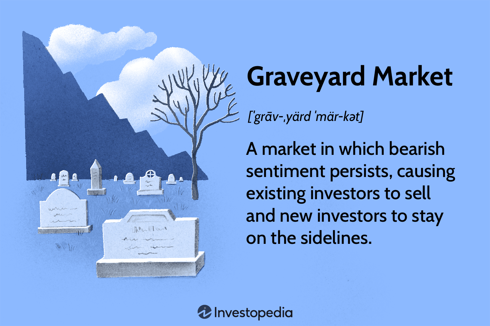

In recent years, financial markets have undergone profound transformations due to the integration of cutting-edge technologies and the influence of macroeconomic factors. The convergence of algorithmic trading, shifting market trends, and the occurrence of financial downturns has introduced complex dynamics to the stock market landscape. This article aims to explore the interplay of these elements and their implications for both short-term and long-term investment strategies.

Algorithmic trading, which leverages advanced mathematical models and high-frequency trading algorithms, has revolutionized how transactions are executed. This technology has increased market efficiency but also raised concerns regarding its potential contribution to volatility. Market trends, identified through the analysis of economic data and investor sentiment, guide the decision-making processes of traders and investors. The impact of geopolitical events and macroeconomic indicators play a crucial role in shaping these trends, influencing the direction of markets globally.



Financial downturns, characterized by periods of declining stock prices and adverse investor sentiment, highlight the vulnerability of the market to economic pressures. Historical instances, such as the Great Depression and the 2008 financial crisis, serve as poignant reminders of how markets react under stress. Recognizing the signals of impending downturns is vital to devising risk mitigation strategies.

This article further investigates how these elements affect investment strategies in today's volatile financial environment. As technology continues to advance and macroeconomic conditions fluctuate, understanding the intricate relationship between these factors is essential for navigating the complexities of modern financial markets.

## Table of Contents

## Understanding Market Trends

Market trends are vital indicators of the stock market's direction, serving as a compass for traders and investors. These trends are typically categorized into upward (bullish), downward (bearish), or sideways (neutral) paths, each reflecting different market sentiments and economic conditions.

Traders and investors analyze market trends to make informed decisions regarding buying, holding, or selling assets. Technical analysis is a common method used to interpret these trends, employing tools like moving averages, relative strength index (RSI), and candlestick patterns. For instance, a sustained upward trajectory in moving averages may signal a bullish trend, prompting buying activities.

Economic data play a pivotal role in shaping market trends. Indicators such as gross domestic product (GDP) growth rates, employment figures, and consumer price indices (CPI) provide a macroeconomic backdrop that influences investor behavior. For example, strong GDP growth often fosters bullish trends as it indicates economic expansion and corporate profit potential.

Geopolitical events significantly impact market trends by introducing uncertainty or optimism. Events such as elections, trade negotiations, and international conflicts can lead to market [volatility](/wiki/volatility-trading-strategies), altering the strategic positions of investors. For instance, positive trade talks between major economies might spur a bullish trend due to anticipated economic benefits.

Investor sentiment, often gauged through surveys and indices like the American Association of Individual Investors (AAII) sentiment survey, reflects the collective mood of market participants. High levels of optimism (greed) typically correlate with bullish trends, while fear or pessimism can drive bearish trends. Sentiment analysis is increasingly incorporating social media data, where the public sentiment can offer real-time insights into market movements.

Understanding these key factors—economic data, geopolitical events, and investor sentiment—allows for a nuanced approach in predicting and reacting to market trends, providing traders and investors with the necessary insights to optimize their strategies amidst changing market conditions.

## The Stock Market and Financial Downturns

Financial downturns, often referred to as bear markets, occur when stock prices fall by 20% or more from recent highs and investor sentiment becomes increasingly negative. These periods are marked by a lack of confidence in the economy, heightened by factors such as rising unemployment, declining economic growth, and adverse geopolitical developments. The implications of bear markets are profound, affecting individual wealth, corporate profitability, and broader economic stability.

Historical episodes like the Great Depression of the 1930s and the 2008 financial crisis underscore the stock market's sensitivity to economic stress. The Great Depression began with the stock market crash of 1929, leading to a staggering 89% decline in the Dow Jones Industrial Average over three years. This event reflected deep economic problems, including overproduction, declining consumer demand, and flawed banking practices.

Likewise, the 2008 financial crisis was precipitated by a combination of subprime mortgage defaults, irresponsible financial derivatives, and the collapse of major financial institutions such as Lehman Brothers. During this period, global stock markets experienced sharp declines, prominently evident when the S&P 500 index dropped by over 50% from its peak in October 2007 to its trough in March 2009. This downturn was compounded by severe [liquidity](/wiki/liquidity-risk-premium) issues and a rapid drop in consumer confidence, exacerbating the economic downturn.

Recognizing the indicators of financial downturns can assist investors in managing risks. These indicators include changes in key economic metrics like GDP growth rates, unemployment levels, and consumer confidence indices. Additionally, shifts in monetary policy, such as sudden changes in interest rates, can signal underlying economic distress. The following Python code snippet demonstrates a simple tool for monitoring unemployment trends, which can serve as a telltale sign of impending market downturns:

```python
import pandas as pd
import matplotlib.pyplot as plt

# Sample unemployment data
data = {
    'Month': ['Jan', 'Feb', 'Mar', 'Apr', 'May', 'Jun', 'Jul', 'Aug', 'Sep', 'Oct', 'Nov', 'Dec'],
    'Unemployment_Rate': [3.8, 3.9, 4.0, 4.2, 4.5, 4.6, 4.8, 5.0, 5.2, 5.3, 5.5, 5.7]
}

df = pd.DataFrame(data)

# Plotting the unemployment rate trend
plt.plot(df['Month'], df['Unemployment_Rate'], marker='o')
plt.title('Monthly Unemployment Rate Trend')
plt.xlabel('Month')
plt.ylabel('Unemployment Rate (%)')
plt.grid()
plt.show()
```

This data visualization helps investors identify alarming upward trends in unemployment, which may foreshadow market downturns.

In summary, while financial downturns present significant challenges, understanding their historical context and key indicators empowers investors to devise strategies that mitigate potential risks. Monitoring economic signals and maintaining awareness of market conditions are crucial steps towards navigating the uncertainties of bear markets.

## Algorithmic Trading: The New Frontier

Algorithmic trading, often abbreviated as algo-trading, leverages advanced computational models to automate and optimize the process of buying and selling financial assets. This approach utilizes a set of rules derived from statistical and mathematical models to execute trades at speeds and frequencies far beyond human capability. The primary objective of [algorithmic trading](/wiki/algorithmic-trading) is to maximize market efficiencies and capitalize on short-term opportunities, which has brought about significant transformations within financial markets over the past few decades.

The emergence of algorithmic trading can be traced back to technological advancements in computing power and the growth of electronic communication networks in the financial sector. By employing trading algorithms, investors can execute trades based on complex criteria, ensuring optimal entry and [exit](/wiki/exit-strategy) points in the market. These models often incorporate various indicators, such as moving averages, [momentum](/wiki/momentum), [volume](/wiki/volume-trading-strategy), and more sophisticated analytics, such as [machine learning](/wiki/machine-learning) algorithms. A basic example of a simple moving average crossover strategy could involve buying a stock when a short-term moving average surpasses a long-term moving average, indicating a potential upward trend.

The dual-edged nature of algorithmic trading became particularly evident during two significant market events: the 1987 Black Monday and the 2020 pandemic market plunge. On Black Monday, October 19, 1987, global stock markets experienced a severe and rapid decline, with the Dow Jones Industrial Average dropping by over 22% in a single day. It has been posited that computer-driven trading strategies, including program trading, exacerbated the market's fall as automated models collectively triggered a cascade of selling in response to specific market conditions.

Similarly, the 2020 market crash, provoked by the sudden onset of the global COVID-19 pandemic, again raised questions about the impact of algorithmic trading on market volatility. The unprecedented speed at which markets fell suggested that algorithms, designed to react instantaneously to market movements and news, may have amplified the downturn. This has led investors and analysts to scrutinize whether algorithmic trading contributes to increased volatility during times of market stress, potentially acting as a destabilizing force rather than a tool for efficiency.

The debate around the impact of algorithmic trading on market stability centers on the frequency and speed of trades executed by algorithms. While some argue that algorithmic trading enhances liquidity and market efficiency by narrowing bid-ask spreads and enabling price discovery, others contend that it can introduce systemic risks. High-frequency trading ([HFT](/wiki/high-frequency-trading-strategies)), a subset of algorithmic trading, in particular, has been critiqued for its potential to create flash crashes—sudden, brief price drops with swift recoveries.

As the prevalence of algorithmic trading continues to rise, the financial industry faces the challenge of balancing the benefits of technological efficiency with the need to maintain market stability. Future regulatory measures may focus on increasing transparency and implementing safeguards to prevent algorithms from exacerbating market volatility, ensuring the sustainable integration of technology into financial markets.

## Case Studies: Algorithmic Trading and Market Crashes

Algorithmic trading has had profound impacts on market behavior during significant financial upheavals such as Black Monday in 1987 and the 2020 market crash. Both events demonstrate the capabilities and inherent risks associated with algorithmic trading systems.

Black Monday, occurring on October 19, 1987, is characterized by a massive, sudden drop in stock prices. The Dow Jones Industrial Average fell by 22% in a single day. One of the major contributing factors was the use of portfolio insurance strategies, a type of algorithmic trading that aimed to hedge portfolios against market downturns. These strategies involved selling futures contracts as market values decreased, seeking to offset losses. However, the automated selling magnified the downward pressure, contributing to a feedback loop of declining prices and increased selling.

Similarly, the 2020 market crash, prompted by the COVID-19 pandemic, saw algorithms rapidly executing transactions based on pre-set thresholds. As market uncertainty rose, algorithms quickly responded to negative indicators, often exacerbating the volatility. High-speed trading capabilities enabled vast volumes of trades within seconds, outpacing traditional market reactions and amplifying price fluctuations.

Both of these events underscore the necessity of robust regulatory oversight. The rapid, automated nature of algorithmic trading requires transparency to ensure market stability. After Black Monday, regulatory bodies introduced measures, such as trading halts and circuit breakers, to slow trading during anomalously rapid market movements. These interventions allow for human intervention to assess market conditions and stabilize trading activities. Similarly, following the 2020 market crash, regulatory discussions intensified around improving transparency and setting stricter controls on algorithmic trading models.

To mitigate risks associated with algorithmic trading, regulatory frameworks must evolve continuously, adapting to new trading technologies and strategies. Transparency in algorithmic models is critical, ensuring that trading algorithms do not inadvertently trigger excessive volatility. These regulatory safeguards are essential in maintaining investor confidence and market integrity amidst the increasing prevalence of algorithmic trading.

## Regulatory Responses and Future Outlook

Market crashes have historically acted as catalysts for regulatory change, aiming to curb excessive volatility and protect investors from irrational market behavior. One of the most significant regulatory responses to market crashes has been the introduction of circuit breakers. These mechanisms are designed to temporarily halt trading on an exchange, giving investors a pause during periods of extreme volatility to reassess information and prevent panic selling. The U.S. Securities and Exchange Commission (SEC) implemented circuit breakers after the 1987 Black Monday crash, and they have since been updated to respond to evolving market conditions.

In addition to circuit breakers, regulators have been focusing on enhancing market transparency and the robustness of algorithmic trading systems. The rapid growth of algorithmic trading, characterized by its speed and complexity, has introduced new challenges in maintaining market stability. This trading style has sometimes been linked to flash crashes, which occur when automated trades spiral out of control, rapidly driving prices up or down.

Looking forward, the primary challenge lies in balancing the efficiency gains brought about by algorithmic trading with the need for market stability. Regulatory bodies globally, such as the European Securities and Markets Authority (ESMA) and the Commodity Futures Trading Commission (CFTC) in the U.S., are continuously exploring ways to strengthen oversight without stifling innovation. This involves reviewing trading thresholds, enhancing audit trails, and ensuring that algorithms are tested and monitored regularly.

Investors must remain vigilant and informed about these regulatory developments to effectively navigate the complexities of modern financial markets. Understanding the implications of new rules and how they might affect market behavior is crucial. For example, regulators might impose stricter requirements on high-frequency trading, which could affect liquidity and market dynamics. 

Future regulatory frameworks might also focus on the ethical use of [artificial intelligence](/wiki/ai-artificial-intelligence) in trading algorithms. Ensuring fairness and preventing market manipulation will be central to these discussions. As technology continues to advance, it is expected that regulatory strategies will need to evolve in tandem, fostering a financial ecosystem that is both innovative and secure.

In conclusion, the ongoing evolution of regulatory measures in response to market crashes and technological advancements signifies a commitment to maintaining a fair and stable financial environment. Investors are encouraged to stay abreast of these regulatory changes, as they are a critical component in formulating resilient and informed investment strategies.

## Conclusion

The current financial landscape is profoundly shaped by the interconnected dynamics of market trends, financial downturns, and algorithmic trading. These elements collectively influence the behavior of financial markets and the strategies investors deploy to navigate them. Market trends provide investors with a framework to assess potential movements in asset prices, driven by economic indicators, geopolitical events, and investor sentiment. However, these trends can be abruptly altered by financial downturns, episodes where market confidence plummets, leading to widespread selling and price declines.

Algorithmic trading adds another layer of complexity to this environment. By leveraging sophisticated algorithms, investors and institutions aim to capitalize on market efficiencies and execute trades at unprecedented speeds. Despite their advantages, algorithms also [carry](/wiki/carry-trading) the potential to amplify market volatility. During times of financial stress, pre-set trading conditions can trigger rapid buy or sell orders, intensifying price swings and contributing to market instability.

Managing these risks requires a keen understanding of the intertwined factors at play. Investors must appreciate the nuances of market trends and the potential for abrupt downturns, while also recognizing the role that algorithmic trading can play in both stabilizing and destabilizing markets. This necessitates a balanced approach to investment strategy that blends traditional analysis with a knowledge of technological impacts.

Moreover, ongoing regulatory efforts aim to address the challenges posed by rapid algorithmic trading and market volatility. By implementing measures such as circuit breakers, regulators strive to mitigate the extreme movements that can occur in times of panic.

In conclusion, the intersection of market trends, financial downturns, and algorithmic trading represents both opportunities and challenges for investors. Technological advancements offer enhanced efficiency, yet they also present novel risks that must be carefully managed. A comprehensive understanding of these dynamics is essential for formulating investment strategies that can withstand the pressures of volatile financial climates. By staying informed and adaptable, investors can better navigate the evolving landscape of financial markets.

## References & Further Reading

1. **Explore the Use of Algorithmic Trading in Financial Markets**  
   - Hendershott, Terrence, et al. "Algorithmic trading and information." *Journal of Financial and Quantitative Analysis*, vol. 46, no. 4, 2011, pp. 1001-1024. This paper discusses how algorithmic trading increases the efficiency of financial markets and its implications for market liquidity.

2. **Historical Perspectives on Financial Downturns**  
   - Kindleberger, Charles P., and Robert Z. Aliber, *Manias, Panics, and Crashes: A History of Financial Crises*. Palgrave Macmillan, 2011. This book offers a comprehensive overview of financial crises, including the mechanisms that lead to such downturns and their impacts on the global economy.

3. **The Role of Market Trends in Investment Strategies**  
   - Barberis, Nicholas, et al. "A model of investor sentiment." *Journal of Financial Economics*, vol. 49, no. 3, 1998, pp. 307-343. This article models how shifts in investor sentiment can lead to market trends and influence investing behavior.

4. **Algorithmic Trading and Market Volatility**  
   - Kirilenko, Andrei A., et al. "The Flash Crash: The impact of high-frequency trading on an electronic market." *The Journal of Finance*, vol. 72, no. 3, 2017, pp. 967-998. The study analyzes the role that algorithmic trading played during the Flash Crash of 2010.

5. **Regulatory Measures and Market Stability**  
   - Gomber, Peter, et al. "High-Frequency Trading." *ACM Computing Surveys (CSUR)*, vol. 50, no. 4, 2017, article 51.  This paper examines regulatory responses to high-frequency trading and discusses measures such as circuit breakers designed to enhance market stability.

6. **Future Outlook on Financial Markets**  
   - Shiller, Robert J. *Irrational Exuberance*. Princeton University Press, 2015. Shiller explores the future outlook of financial markets, emphasizing how historical trends can offer insights into upcoming economic conditions.

7. **Academic Insights on Market Analysis Techniques**  
   - Jegadeesh, Narasimhan, and Sheridan Titman. "Returns to buying winners and selling losers: Implications for stock market efficiency." *The Journal of Finance*, vol. 48, no. 1, 1993, pp. 65-91. This landmark paper analyzes momentum strategies in stock markets, showing the effects of past trends on future performance.

These references serve as a foundation for understanding the interconnected dynamics of algorithmic trading, market trends, and financial downturns, providing valuable resources for investors and researchers alike.

