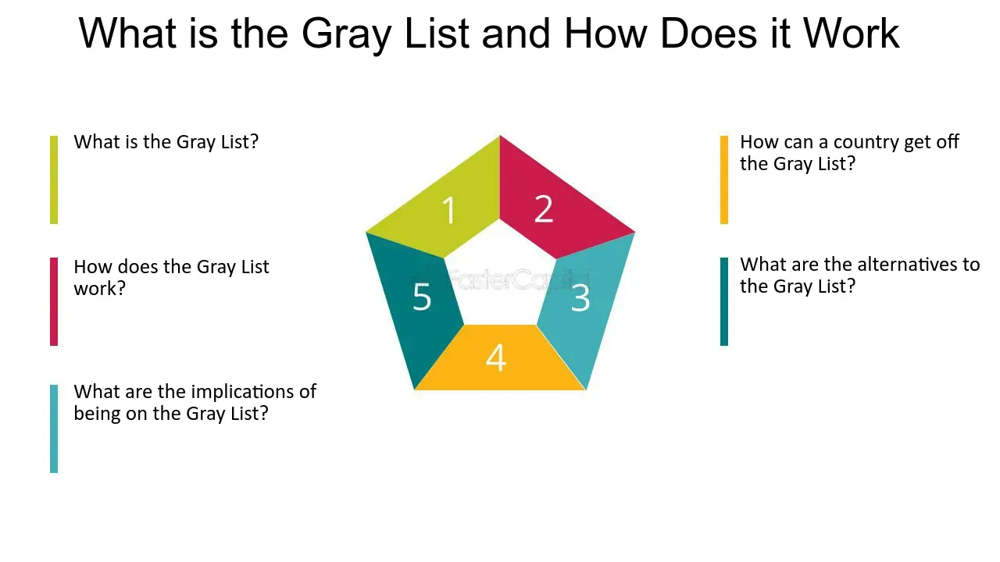

## Table of Contents

## What is a gray list?

A gray list is a term used to describe a list of items, countries, or entities that are under scrutiny or monitoring but not yet considered fully compliant or non-compliant with certain standards or regulations. It is often used in the context of financial regulations, where countries might be gray-listed by international bodies like the Financial Action Task Force (FATF) if they are seen as having deficiencies in their efforts to combat money laundering and terrorist financing.

Being on a gray list can have significant consequences for a country or entity. For example, it might face increased monitoring and reporting requirements, which can lead to higher costs and more scrutiny from international partners. Additionally, being gray-listed can affect a country's reputation and its ability to attract foreign investment, as investors may see it as a higher risk. However, it also serves as a warning, giving the listed entity a chance to improve its practices before facing more severe penalties or being moved to a blacklist.

## How does a gray list differ from a black list and a white list?

A gray list is a middle ground between a black list and a white list. It is used for countries, companies, or items that are being watched closely but are not yet seen as fully good or bad according to certain rules. Being on a gray list means you are not in big trouble yet, but you need to fix some problems or face more serious consequences later.

A black list is for the worst cases. It is a list of countries, companies, or items that are not allowed to do certain things because they break important rules. Being on a black list can mean serious trouble, like not being able to do business with other countries or facing big fines. On the other hand, a white list is for the best cases. It is a list of countries, companies, or items that are trusted and allowed to do things freely because they follow all the rules well. Being on a white list means you are seen as safe and reliable.

## What is the purpose of using a gray list?

The main purpose of a gray list is to give a warning to countries, companies, or items that are not fully following the rules but are not breaking them badly enough to be on a black list. It's like a middle step that says, "You need to fix some things, or you might get into bigger trouble." By putting someone on a gray list, the people in charge can keep a closer eye on them and make sure they are working to improve their practices.

Using a gray list also helps to keep things fair. It gives those on the list a chance to fix their problems before facing the harsher penalties that come with being on a black list. This way, it encourages improvement and cooperation, rather than just punishing right away. It's a way to say, "We see you're trying, but you need to do better," which can lead to better overall compliance with rules and standards.

## Who typically uses gray lists?

Gray lists are often used by big groups that watch over money and business rules. One famous group is the Financial Action Task Force (FATF). They use gray lists to keep an eye on countries that are not doing a good job at stopping money laundering and terrorist financing. By putting a country on a gray list, the FATF can make sure these countries know they need to do better or face bigger problems later.

Other groups like the European Union and the United Nations also use gray lists. They might use them to watch countries or companies that are not following rules about trade, human rights, or other important things. Being on a gray list is a warning that says, "You need to fix these issues, or you might get into more trouble." This helps these groups make sure everyone is playing by the rules and working to make things better.

## What are the common mechanisms for adding entities to a gray list?

When a group like the Financial Action Task Force (FATF) wants to add a country to a gray list, they usually start by looking at how well the country is following rules about stopping money laundering and terrorist financing. They do this by checking reports, doing their own research, and sometimes visiting the country to see what's going on. If they find that the country is not doing enough to stop these bad things, they might decide to put it on a gray list. This is a way to say, "You need to do better, or you might get into bigger trouble."

Once the group decides a country should be on a gray list, they tell the country about it. They also let other countries and groups know, so everyone can keep a closer eye on what's happening. The country on the gray list then has to make a plan to fix the problems and show the group that they are trying to do better. If the country does not improve, it might be moved to a black list, which means even more trouble. But if it does improve, it can be taken off the gray list and things can go back to normal.

## How are entities removed from a gray list?

To get off a gray list, a country or company needs to fix the problems that got them on the list in the first place. They have to show the group that put them on the list, like the Financial Action Task Force (FATF), that they are doing better. This means making changes to their rules and showing proof that they are following the new rules. They might have to send reports, let people come and check their work, or do other things to prove they are trying hard to improve.

Once the group sees that the country or company has made good changes and is following the rules better, they might decide to take them off the gray list. This decision comes after looking at all the new information and seeing if the changes are real and lasting. If everything looks good, the group will tell everyone that the country or company is no longer on the gray list. This means they can go back to normal and don't have to worry about the extra watching and rules that come with being on a gray list.

## What are the implications for entities on a gray list?

Being on a gray list can make things harder for a country or company. They might have to follow more rules and send more reports to show they are trying to do better. This can cost more money and take more time. Other countries and businesses might also be more careful about working with them because they are seen as riskier. This can make it harder for them to do business and might mean they lose money or have trouble growing.

But being on a gray list also gives them a chance to fix their problems before things get worse. It's like a warning that says, "You need to improve, or you might end up on a black list." If they work hard and make the right changes, they can get off the gray list and go back to normal. This can help them avoid bigger trouble and keep their reputation from getting too bad.

## How is the confidentiality of a gray list maintained?

When a group like the Financial Action Task Force (FATF) puts a country on a gray list, they have to be careful about who knows about it. They usually tell the country first, so it can start fixing its problems. But they also have to let other countries and groups know, so everyone can keep an eye on what's happening. To keep things private, they might only share the list with certain people or groups who need to know. This helps stop the information from getting out to everyone and causing more problems for the country on the list.

Even though the gray list is shared with some people, the group tries to keep the details quiet. They might not tell everyone exactly what problems the country has or what it needs to do to get off the list. This way, the country can work on getting better without everyone knowing all the details. By keeping things confidential, the group helps the country fix its problems without making things worse by spreading too much information around.

## What are the legal and ethical considerations of using gray lists?

When groups like the Financial Action Task Force (FATF) use gray lists, they have to think about the law and what is right and fair. Legally, they need to make sure they follow the rules about how they can watch and judge countries or companies. They also need to be fair and give everyone a chance to fix their problems before they face big trouble. If they don't do this right, they might get in trouble themselves or be seen as unfair.

Ethically, using gray lists can be tricky. It's important to treat everyone the same and not pick on some countries or companies more than others. The group needs to be clear about why they put someone on a gray list and what they need to do to get off it. This helps keep things fair and stops people from thinking the group is being too hard on them. By being open and fair, the group can help everyone follow the rules better and make the world a safer place.

## How do gray lists impact international relations and diplomacy?

When a country gets put on a gray list, it can change how it gets along with other countries. Being on a gray list can make other countries think twice about working with them. They might be worried about the risks or not want to be seen working with a country that is not following the rules. This can make it harder for the country on the gray list to make friends or do business with other countries. It can also make them feel left out or picked on, which can cause tension and hurt feelings in international relations.

But gray lists can also help with diplomacy. They give countries a chance to fix their problems before things get worse. This can lead to more talking and working together between countries. The country on the gray list might ask for help or advice from other countries to get better. This can build trust and understanding if everyone works together to solve the problems. So, while gray lists can cause some trouble, they can also be a way to bring countries closer together and make the world safer.

## What technologies are used to manage and monitor gray lists?

To manage and watch over gray lists, people use computer systems and special software. These systems keep track of who is on the gray list and what they need to do to get off it. They also help collect and look at information from different places, like reports and visits to the countries on the list. This helps the groups in charge, like the Financial Action Task Force (FATF), make sure everyone is following the rules and working to get better.

Sometimes, they use special tools to keep the information safe and private. These tools help stop the wrong people from seeing the gray list and the details about it. By using technology, the groups can keep everything organized and make sure they are being fair and clear about what they are doing. This helps them do their job better and keep the world safer.

## What are the future trends and potential developments in the use of gray lists?

In the future, gray lists might use more smart technology to keep track of countries and companies. Computers and special software could get better at watching and understanding what is happening in these places. This could help groups like the Financial Action Task Force (FATF) make better decisions about who should be on a gray list and what they need to do to get off it. The technology might also help keep the information safer and more private, so only the right people can see it.

Another thing that might happen is that more groups and countries could start using gray lists. Right now, big groups like the FATF use them, but in the future, smaller groups or even businesses might use them too. This could help more people work together to stop bad things like money laundering and terrorist financing. It could also make the world a safer place by encouraging everyone to follow the rules better.

## What is the role of risk assessment in algorithmic trading?

Algorithmic trading relies heavily on robust risk assessment due to its automated nature and the high velocity of transactions it processes. Unlike traditional trading, [algorithmic trading](/wiki/algorithmic-trading) systems operate at speeds and complexities that necessitate advanced risk assessment methodologies to ensure stability and compliance.

A primary challenge in integrating gray list considerations into algorithmic trading is the dynamic nature of these lists. Gray lists, which typically include securities under scrutiny due to potential non-public information relating to corporate actions or M&A activities, must be managed in real-time to ensure that trading algorithms do not inadvertently execute trades on securities that might lead to regulatory violations. To address this, algorithm developers often need to create adaptive systems capable of responding to frequent gray list updates. This requires maintaining a comprehensive database of gray list securities and developing latency-efficient mechanisms to cross-reference these continually with potential trades.

Risk assessment in algorithmic trading incorporates a range of frameworks designed to evaluate and control exposure to market risks, credit risks, and operational risks. One popular framework is the Value-at-Risk (VaR) model, which estimates the potential loss in the value of a portfolio under normal market conditions over a set time period. Mathematically, VaR can be expressed as:

$$
\text{VaR} = \sigma \times Z \times \sqrt{t}
$$

where $\sigma$ is the standard deviation of return, $Z$ is the Z-score corresponding to the confidence level, and $t$ is the time period.

In addition to VaR, stress testing is often employed to simulate extreme market conditions and evaluate the resiliency of trading algorithms under adverse scenarios, including those where gray list securities might be triggered into restricted trading states. 

Modern risk management frameworks also leverage [machine learning](/wiki/machine-learning) techniques to predict potential risk scenarios and optimize trade execution strategies. These models can be trained to recognize patterns and anomalies in market data that might indicate the need to adjust trading parameters dynamically, especially when gray list implications are considered. Python libraries like scikit-learn can be employed for building predictive models to enhance risk management practices.

```python
from sklearn.ensemble import RandomForestClassifier

# Example of a simple model to predict risk levels
# Features could include market volatility, position size, and gray list status
X_train, X_test, y_train, y_test = train_test_split(features, labels, test_size=0.2)

model = RandomForestClassifier(n_estimators=100, max_depth=5)
model.fit(X_train, y_train)

risk_prediction = model.predict(X_test)
```

Risk assessment frameworks are essential for ensuring that algorithmic trading systems remain compliant with legal standards, including those concerning gray lists, which help to prevent trading based on non-disclosed material information. By incorporating these frameworks, financial institutions can better manage the complexities and risks inherent to algorithmic trading, particularly when handling gray list securities.

## References & Further Reading

[1]: ["Advances in Financial Machine Learning"](https://www.amazon.com/Advances-Financial-Machine-Learning-Marcos/dp/1119482089) by Marcos Lopez de Prado

[2]: ["Evidence-Based Technical Analysis: Applying the Scientific Method and Statistical Inference to Trading Signals"](https://www.amazon.com/Evidence-Based-Technical-Analysis-Scientific-Statistical/dp/0470008741) by David Aronson

[3]: ["Machine Learning for Algorithmic Trading"](https://github.com/stefan-jansen/machine-learning-for-trading) by Stefan Jansen

[4]: ["Quantitative Trading: How to Build Your Own Algorithmic Trading Business"](https://www.amazon.com/Quantitative-Trading-Build-Algorithmic-Business/dp/1119800064) by Ernest P. Chan

[5]: Bergstra, J., Bardenet, R., Bengio, Y., & Kégl, B. (2011). ["Algorithms for Hyper-Parameter Optimization."](https://dl.acm.org/doi/10.5555/2986459.2986743) Advances in Neural Information Processing Systems 24.