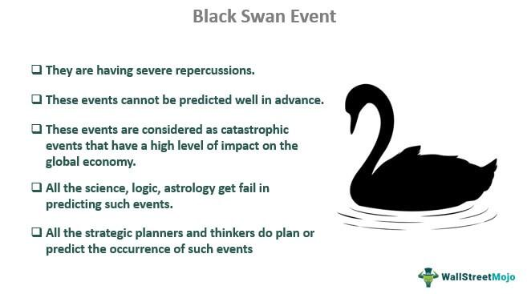

Algorithmic trading, often referred to as algo trading, encompasses the use of computer programs and algorithms to execute trades in financial markets. This method leverages complex mathematical models and formulas to make swift trading decisions, aiming to capitalize on market opportunities and trends that are often unnoticed by human traders. Over recent years, algorithmic trading has become increasingly influential, dominating a substantial portion of market transactions. Its rise can be attributed to the technology's capacity to process vast volumes of data at high speeds, ensuring efficient trade execution while reducing human error and emotional decision-making.

The concept of a gray list, often used within investment banks, intersects with the dynamics of algorithmic trading as it serves a significant risk management function. A gray list is a strategic compilation of securities or entities that may present potential risks, such as those involved in mergers and acquisitions (M&A) or under regulatory scrutiny. Unlike blacklists, which categorize entities strictly off-limits, gray lists suggest additional caution, enabling firms to manage risks preemptively. For algorithmic traders, integrating gray list considerations is vital to align automated strategies with compliance and ethical standards.



Confidentiality and risk assessment emerge as cornerstone elements of this integration process. In modern trading scenarios, the protection of sensitive information is paramount. Breaches can lead to regulatory penalties and reputational damage. Confidentiality protocols, therefore, are critical when maintaining and accessing gray lists. This ensures sensitive information on potential market-moving activities remains protected while informing risk assessments aligned with regulatory frameworks.

The purpose of this article is to investigate how gray lists impact risk assessment concerning confidentiality in algorithmic trading. Understanding this relationship will provide insights into how investment banks and trading platforms can navigate the complexities of legal and financial landscapes. This exploration is essential as the financial sector continues to adapt to rapid technological advancements and increasingly stringent regulatory requirements.

## Table of Contents

## Understanding the Gray List

A gray list is an essential tool within investment banks, serving as a confidential list of securities or companies that are subject to close scrutiny due to various business concerns or potential conflicts of interest. The primary function of a gray list is to prevent illegal insider trading by restricting trades in certain stocks, ensuring compliance with legal and ethical standards. Unlike a black list, which explicitly prohibits transactions with specific entities or securities, a gray list indicates stocks that require further examination or have trading restrictions during sensitive periods.

The primary distinction between a gray list and a black list lies in their severity and application. A black list is an unequivocal restriction imposed on certain securities or trading partners, prohibiting any form of transaction, often due to regulatory constraints, ethical concerns, or past violations. Conversely, a gray list offers a more flexible approach, highlighting securities under heightened scrutiny and often requiring special permissions or additional due diligence before trading. This nuanced differentiation allows investment banks to maintain operational flexibility while addressing potential legal and market risks.

Gray lists are instrumental in managing potential risks associated with certain stocks or trading partners. They are often employed when there is evolving information regarding mergers, acquisitions, or other significant corporate events that might impact the market. When a company becomes involved in confidential activities such as mergers or acquisitions (M&A), its stock may be placed on a gray list to strictly monitor trading activities and prevent the misuse of non-public information. By doing so, investment banks safeguard against conflicts of interest and uphold the integrity of financial markets. 

Furthermore, gray lists play a critical role in navigating complex financial landscapes by providing a structured approach to handling sensitive information related to mergers and acquisitions. When a potential M&A transaction is in discussion, the companies involved are often subject to gray list scrutiny to prevent any unauthorized information exchanges or insider trades that could disrupt market fairness. This ensures that all market participants operate on a level playing field, and any decisions made regarding gray-listed securities fully comply with relevant legal standards and internal policies.

In summary, gray lists are a vital component of risk management for investment banks, serving as an intermediary measure between unrestricted trading and complete prohibition, such as black lists. Their careful deployment assists in mitigating legal and ethical risks, particularly in scenarios involving potential conflicts of interest, like mergers and acquisitions. By doing so, gray lists reinforce the integrity of trading activities and uphold the financial industry’s reputation for ethical conduct.

## The Role of Confidentiality in Gray Lists

Confidentiality is a cornerstone of the gray list's efficacy within investment banking. Gray lists are critical tools for managing sensitive information, particularly in environments where the stakes are high and the potential for conflicts of interest is significant. Maintaining the secrecy of a gray list allows financial institutions to protect the integrity of ongoing transactions and negotiations, such as those involved in mergers and acquisitions.

Internally, gray lists are maintained through strict access controls, ensuring that only authorized personnel have visibility. This limitation of access is vital to prevent leaks of sensitive information that could lead to market manipulation or insider trading. A common practice involves compartmentalizing information so that relevant teams are aware only of the parts necessary for their roles, thus minimizing the risk of information breaches.

The concept of the "Chinese wall" is highly pertinent in this context. The term refers to internal procedures that create information barriers within an organization to prevent conflict of interest. By separating departments like investment banking and research, financial institutions aim to ensure that material nonpublic information is not improperly disclosed or used. This mechanism is essential in maintaining the credibility and compliance of the bank's operations, especially when managing gray lists.

The enforcement of Chinese walls helps in creating a barrier that limits information flow to only those who need it for specific purposes, enhancing confidentiality. This segregation helps uphold the legal and ethical standards required in financial activities, aligning with regulations across various jurisdictions aimed at preventing insider trading and ensuring fairness in markets. By implementing strict confidentiality protocols and maintaining robust information barriers, banks protect both their clients' interests and their own reputational standing.

## Risk Assessment in Algorithmic Trading

Algorithmic trading relies heavily on robust risk assessment due to its automated nature and the high velocity of transactions it processes. Unlike traditional trading, [algorithmic trading](/wiki/algorithmic-trading) systems operate at speeds and complexities that necessitate advanced risk assessment methodologies to ensure stability and compliance.

A primary challenge in integrating gray list considerations into algorithmic trading is the dynamic nature of these lists. Gray lists, which typically include securities under scrutiny due to potential non-public information relating to corporate actions or M&A activities, must be managed in real-time to ensure that trading algorithms do not inadvertently execute trades on securities that might lead to regulatory violations. To address this, algorithm developers often need to create adaptive systems capable of responding to frequent gray list updates. This requires maintaining a comprehensive database of gray list securities and developing latency-efficient mechanisms to cross-reference these continually with potential trades.

Risk assessment in algorithmic trading incorporates a range of frameworks designed to evaluate and control exposure to market risks, credit risks, and operational risks. One popular framework is the Value-at-Risk (VaR) model, which estimates the potential loss in the value of a portfolio under normal market conditions over a set time period. Mathematically, VaR can be expressed as:

$$
\text{VaR} = \sigma \times Z \times \sqrt{t}
$$

where $\sigma$ is the standard deviation of return, $Z$ is the Z-score corresponding to the confidence level, and $t$ is the time period.

In addition to VaR, stress testing is often employed to simulate extreme market conditions and evaluate the resiliency of trading algorithms under adverse scenarios, including those where gray list securities might be triggered into restricted trading states. 

Modern risk management frameworks also leverage [machine learning](/wiki/machine-learning) techniques to predict potential risk scenarios and optimize trade execution strategies. These models can be trained to recognize patterns and anomalies in market data that might indicate the need to adjust trading parameters dynamically, especially when gray list implications are considered. Python libraries like scikit-learn can be employed for building predictive models to enhance risk management practices.

```python
from sklearn.ensemble import RandomForestClassifier

# Example of a simple model to predict risk levels
# Features could include market volatility, position size, and gray list status
X_train, X_test, y_train, y_test = train_test_split(features, labels, test_size=0.2)

model = RandomForestClassifier(n_estimators=100, max_depth=5)
model.fit(X_train, y_train)

risk_prediction = model.predict(X_test)
```

Risk assessment frameworks are essential for ensuring that algorithmic trading systems remain compliant with legal standards, including those concerning gray lists, which help to prevent trading based on non-disclosed material information. By incorporating these frameworks, financial institutions can better manage the complexities and risks inherent to algorithmic trading, particularly when handling gray list securities.

## Impact of Gray Lists on Trading Strategies

Gray lists significantly influence trading strategies by introducing constraints and alerts for specific securities or trading partners. These lists function as a preventive measure to control trading decisions that might lead to regulatory violations or conflicts of interest. When securities are placed on a gray list, algorithms must adjust their operations to accommodate new levels of risk tolerance and compliance requirements.

Algorithmic trading systems must be adaptable to gray list updates, which often mandate immediate alterations to trading algorithms to maintain adherence to internal and external compliance standards. Typically, these updates may involve excluding securities from trading models or imposing restricted trading volumes on flagged assets. Algorithms may be programmed to recognize gray-listed securities by comparing them against an internal database that is regularly updated from gray list entries.

For instance, consider a simplified Python code snippet that demonstrates how an algorithm might dynamically adjust its trading signals based on gray list updates:

```python
def update_trading_signals(security_list, gray_list):
    updated_signals = {}
    for security in security_list:
        if security in gray_list:
            updated_signals[security] = 'Hold'
        else:
            updated_signals[security] = 'Trade'
    return updated_signals

# Example usage
securities = ['AAPL', 'GOOGL', 'MSFT']
gray_list_securities = ['GOOGL']
signals = update_trading_signals(securities, gray_list_securities)
print(signals)  # Output: {'AAPL': 'Trade', 'GOOGL': 'Hold', 'MSFT': 'Trade'}
```

In portfolio management, gray lists impose additional layers of analysis. Portfolio managers need to ensure alignment with compliance mandates while optimizing return profiles. A gray list may require managers to re-evaluate the risk/return relationships of their holdings, potentially leading to the rebalancing of portfolios to avoid gray-listed securities. This rebalancing might include altering asset allocation models to mitigate potential compliance risks associated with holding or transacting in these securities.

Trade execution systems also undergo adjustments to incorporate gray list constraints. Execution algorithms must minimize market impact while adhering to the restrictions imposed by gray lists. This might involve executing trades at different times or using alternate strategies to ensure that any buys or sells of gray-listed securities are executed in a manner that aligns with defined compliance needs.

When securities on a gray list are involved in ongoing mergers and acquisitions (M&A) activities, the impact on trading strategies can be particularly pronounced. Algorithms may need sophisticated analysis to predict the outcomes of such corporate events and adjust positions accordingly, balancing potential benefits against the risks of being involved in sensitive transactions.

In summary, gray lists require financial institutions to recalibrate trading strategies continually. The necessity to harmonize trading decisions with compliance demands places additional emphasis on the flexibility and sophistication of algorithmic systems.

## Case Studies and Industry Examples

As algorithmic trading gains prominence, financial institutions increasingly rely on gray lists to navigate complex trading environments. Two prominent examples of effective gray list usage are JPMorgan Chase and Goldman Sachs. These institutions demonstrate varying approaches and outcomes that provide valuable insights for other entities.

JPMorgan Chase employs gray lists to manage potential conflicts of interest and maintain regulatory compliance. By systematically categorizing securities subjected to restrictions due to ongoing confidential activities, they mitigate risks related to insider trading. The utilization of gray lists at JPMorgan allows the firm to identify and segregate non-public information efficiently, reducing the likelihood of inadvertent regulatory breaches and maintaining their reputation for compliance.

The outcomes of JPMorgan’s gray list implementation highlight its role in enhancing information barriers within the firm. By ensuring that sensitive information does not influence trading activities, JPMorgan enhances the integrity of its operations. Additionally, implementing gray lists enables the firm to maintain robust audit trails, providing a clear record of how sensitive information is handled. This approach not only averts potential legal repercussions but also strengthens trust with clients and regulators.

Goldman Sachs adopts a similar strategy, utilizing gray lists to manage securities influenced by potential mergers and acquisitions. The forward-looking nature of gray lists helps Goldman Sachs pre-emptively identify impacted securities, allowing informed decision-making in evolving market conditions. This proactive strategy minimizes the risks associated with market [volatility](/wiki/volatility-trading-strategies) and ensures that the firm remains compliant with insider trading regulations.

The successful outcomes of Goldman Sachs’s gray list application underscore its value in strategic decision-making. By integrating gray lists early in the research and trading processes, Goldman Sachs effectively manages exposure to regulatory risks and enhances operational efficiency. Moreover, their comprehensive approach ensures that all relevant stakeholders are informed and processes are streamlined, fostering a culture of risk-aware trading.

From these examples, other financial entities can glean important insights. The implementation of gray lists provides pivotal advantages in managing trading risks and ensuring regulatory compliance. Institutions should aim for meticulous monitoring of securities and establish clear protocols for managing restricted lists. Furthermore, leveraging technology to automate and update gray list data can enhance agility and accuracy, optimizing decision-making in fast-paced trading environments.

In conclusion, JPMorgan Chase and Goldman Sachs exemplify the successful application of gray lists in managing trading risks and regulatory requirements. Other financial institutions can apply these insights to strengthen their own practices, striving for enhanced operational security and reputational integrity.

## Pros and Cons of Gray Lists

Gray lists in the context of investment banking and algorithmic trading present both advantages and disadvantages that institutions must consider when managing trading risks.

### Advantages of Gray Lists

1. **Risk Mitigation**: Gray lists serve as an effective tool for mitigating potential conflicts of interest and insider trading risks. By identifying and monitoring securities or counterparties associated with ongoing corporate activities or sensitive information, banks can prevent unauthorized trades that could lead to regulatory penalties or market manipulation accusations.

2. **Increased Control**: The use of gray lists provides investment banks with enhanced control over their trading operations. They allow institutions to systematically manage who has access to sensitive information, ensuring that only authorized personnel can engage with specific securities during sensitive periods like mergers and acquisitions.

3. **Enhanced Reputation**: By adhering to gray list protocols, financial institutions uphold their reputation for integrity and compliance, fostering trust among clients and stakeholders. This can be particularly beneficial in maintaining a competitive edge and securing future business opportunities.

### Potential Downsides

1. **Administrative Overhead**: Managing a gray list can introduce significant administrative overhead. The continuous updating of lists, monitoring of transactions, and enforcement of restrictions require dedicated resources and sophisticated systems, which can be both costly and time-consuming.

2. **Missed Opportunities**: Gray lists can lead to missed trading opportunities. By restricting trades in certain securities, banks may forfeit profitable trades, potentially impacting portfolio performance. Traders might also be less willing to initiate trades if they foresee possible inclusion on a gray list in the near future.

3. **Operational Complexity**: The integration of gray lists into existing trading systems can complicate operations. Firms must ensure seamless communication between compliance and trading departments, often requiring advanced technological solutions and robust internal controls.

### Balancing Benefits and Drawbacks

While gray lists offer significant advantages in terms of risk management and regulatory compliance, their implementation poses challenges related to operational efficiency and opportunity costs. To balance these factors, financial institutions often invest in advanced technological solutions, such as automated monitoring systems, to streamline processes and minimize administrative burden. Additionally, regular training for traders and compliance personnel can help manage the complexities and ensure adherence to protocols.

Ultimately, the decision to implement and maintain gray lists must be aligned with an institution’s broader risk management strategy, weighing the tangible benefits of risk mitigation against the inherent challenges of operational execution.

## Regulatory Compliance and Gray Lists

Gray lists play a pivotal role in ensuring regulatory compliance, particularly concerning insider trading regulations. Investment banks and financial institutions often employ gray lists as a means of managing potential conflicts of interest and maintaining strict adherence to legal and ethical standards in trading activities. By categorizing securities that may be subject to non-public, material information, gray lists help organizations mitigate the risk of unlawful insider trading, thereby supporting compliance with regulations such as the Securities Act of 1933 and Regulation Fair Disclosure (Reg FD).

The Securities Act of 1933 lays the foundation for securities regulation in the United States, primarily by requiring that investors receive financial and other significant information concerning securities being offered for public sale. It also aims to prevent deceit, misrepresentations, and other fraud in the sale of securities. Gray lists contribute to compliance with these principles by acting as an internal control measure that flags securities which require heightened scrutiny due to their potential association with material non-public information. This ensures that trading activities conducted by financial institutions adhere to the transparency and fairness mandates outlined in the Act.

Regulation Fair Disclosure (Reg FD) further complements these efforts by mandating that publicly traded companies disclose material information to all investors simultaneously, thus preventing selective disclosure that could benefit certain traders. Gray lists are instrumental in helping firms enforce Reg FD by identifying and restricting trading in securities that might be influenced by information disclosed in private before it becomes publicly available. This proactive measure helps uphold the integrity of the financial markets by ensuring that all investors have equitable access to important financial developments.

Maintaining gray lists aids financial institutions in navigating the complex regulatory landscape by creating a structured approach to identifying and managing potential compliance risks. Organizations can guide their trading practices through meticulous monitoring and updating of gray lists, ensuring that securities transactions do not inadvertently breach insider trading laws. This process typically involves internal policies and control measures that limit access to gray list information to authorized personnel only, thereby aligning with the confidentiality and ethical standards requisite in financial services.

Overall, gray lists serve as a critical tool for financial institutions aiming to navigate regulatory requirements effectively while safeguarding the principles of transparency and fairness in the securities markets. As the financial industry continues to evolve, the strategic use of gray lists remains essential for compliance and risk management in trading operations.

## Conclusion

Gray lists play a crucial role in the financial industry by enhancing confidentiality and managing risks within algorithmic trading. These lists help investment banks and financial institutions navigate the complexities of the market by identifying and managing potential risks associated with certain stocks or trading partners. By differentiating between a gray list and a black list, organizations can maintain a layer of confidentiality while still monitoring and controlling the flow of sensitive information. This is particularly important in preventing insider trading and ensuring compliance with regulations.

The confidentiality aspect of gray lists is reinforced through the use of internal security measures, such as access limitations to specific personnel and the implementation of Chinese walls. These measures prevent information leakage and protect the integrity of trading strategies. Furthermore, the integration of gray list considerations into algorithmic trading risk assessments is essential in adapting to market changes and ensuring the accuracy and reliability of trading algorithms. These assessments also facilitate informed decision-making, allowing for the adjustment of trading strategies in response to updates on the gray list.

Looking towards the future, advancements in technology and data analytics are expected to shape the development of gray list practices within the financial industry. As regulatory environments continue to evolve, the role of gray lists in ensuring compliance and mitigating risks will likely expand. Institutions may increasingly rely on sophisticated algorithms and machine learning models to enhance the efficacy of gray lists, leading to more proactive and dynamic risk management. Such developments will further solidify the importance of gray lists as indispensable tools for maintaining the confidentiality and stability of algorithmic trading operations.

## References & Further Reading

[1]: ["Advances in Financial Machine Learning"](https://www.amazon.com/Advances-Financial-Machine-Learning-Marcos/dp/1119482089) by Marcos Lopez de Prado

[2]: ["Evidence-Based Technical Analysis: Applying the Scientific Method and Statistical Inference to Trading Signals"](https://www.amazon.com/Evidence-Based-Technical-Analysis-Scientific-Statistical/dp/0470008741) by David Aronson

[3]: ["Machine Learning for Algorithmic Trading"](https://github.com/stefan-jansen/machine-learning-for-trading) by Stefan Jansen

[4]: ["Quantitative Trading: How to Build Your Own Algorithmic Trading Business"](https://www.amazon.com/Quantitative-Trading-Build-Algorithmic-Business/dp/1119800064) by Ernest P. Chan

[5]: Bergstra, J., Bardenet, R., Bengio, Y., & Kégl, B. (2011). ["Algorithms for Hyper-Parameter Optimization."](https://dl.acm.org/doi/10.5555/2986459.2986743) Advances in Neural Information Processing Systems 24.