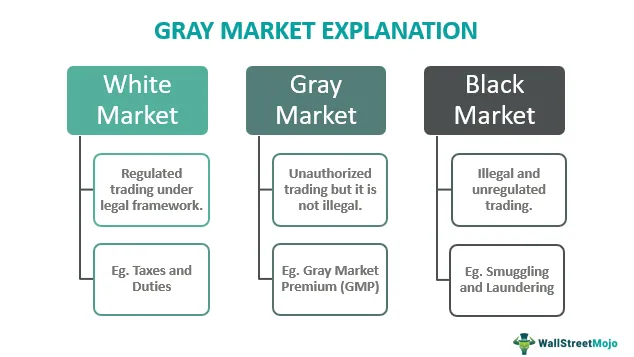

The financial markets have experienced substantial transformation with the emergence of modern trading techniques over recent decades. Among these innovations are gray market trading and algorithmic trading (algo trading), both of which have significantly influenced how traders and investors interact with markets.

Gray market trading refers to unofficial market activities that occur outside recognized exchanges, often involving the trading of securities before they are officially issued. These transactions provide critical insights into price discovery and demand assessment, even though they are not conducted formally. Despite this informal nature, gray market trading is not illegal, as long as it complies with relevant regulations and does not involve fraud or manipulation.



Algorithmic trading, or algo trading, on the other hand, employs sophisticated algorithms to execute trades with high efficiency and speed, capitalizing on brief market fluctuations. This method relies on data-driven instructions, allowing transactions at volumes and speeds beyond the capabilities of human traders. It has shifted market dynamics by prioritizing precision and consistency in trading decisions, resulting in reduced errors and enhanced trade execution.

Understanding gray market trading and algo trading offers opportunities to optimize trading strategies. These methods, despite their differences, hold the potential to improve market participation by providing insights and tools that enhance traditional trading practices. This article aims to provide a detailed exploration of gray market trading and algo trading, their functioning, advantages, and their impact on financial markets, offering a comprehensive overview for those seeking to capitalize on these innovative trading methodologies.

## Table of Contents

## Understanding Gray Market Trading

Gray market trading refers to market transactions that occur outside of established and regulated exchanges. These unofficial markets deal primarily with suspended securities or those yet to be officially released. By facilitating such transactions, gray markets contribute to preliminary price discovery and provide insights into potential demand levels for these securities.

Gray market transactions are not illegal; however, they do present specific risks. Notably, one of the prominent risks is the potential for reneging by unauthorized participants. Traders must be aware that while trades in the gray market can be binding, the lack of formal regulation can lead to complications if one party defaults or disputes arise.

One of the key characteristics defining gray market trading is its segmentation into various trade types, such as over-the-counter (OTC) and presale trading. OTC trades take place directly between parties without the oversight of an exchange, giving them flexibility to negotiate terms that might not be available in the more structured exchange environment. Presale trading involves the buying and selling of securities before they are issued to the public, typically providing an early indication of a security's market value.

For issuers, gray market activity can offer a preview of how a security might perform once it officially launches. Underwriters might use this information to adjust pricing strategies or to gauge initial market reception. Investors participating in these markets can gain early access to securities, potentially benefiting from the opportunity to buy at favorable prices before a broader public offering. However, investing in the gray market can also involve significant risk due to the aforementioned lack of regulation and the potential for inaccurate assessments of future demand.

The impact of gray market trading extends to official market channels as well. Insights gleaned from gray market activity can influence pricing strategies, impact the timing of official offerings, and affect market sentiment more broadly. However, excessive reliance on gray market signals could lead to discrepancies between expected and actual securities performance, underlining the need for careful analysis and due diligence. Overall, while gray market trading offers substantial opportunities for early engagement with securities, it demands a comprehensive understanding of the associated risks and impacts on the broader financial ecosystem.

## The Mechanics of Gray Market Trading

Gray market trading operates under a framework where trades, although binding, find their settlement postponed until the official market reopens. This interim phase allows participants to execute trades based on anticipated demand and price movements. These transactions, albeit outside the purview of formal exchanges, are crucial for price discovery and investor sentiment analysis.

**Trade Execution and Risk Mitigation**

In a typical gray market scenario, trade execution follows informal negotiations and agreements between parties, often facilitated through over-the-counter (OTC) deals or pre-sale arrangements. The lack of formal regulation increases the likelihood of contractual breaches, such as unauthorized participant reneging. To mitigate these risks, traders often employ strategies like demanding upfront payment or implementing collateral arrangements that ensure adherence to agreed terms. Documentation and mutual trust play significant roles in maintaining integrity in such transactions.

**Motivations for Gray Market Participation**

Participants engage in gray market trading for several reasons. One primary motivation is addressing [liquidity](/wiki/liquidity-risk-premium) issues; securities in the gray market provide an avenue to convert investments into cash prior to the official market opening. Moreover, market anticipation drives traders to the gray market, as they seek to capitalize on potential demand increases or price adjustments before securities are publicly traded. This speculative aspect allows informed participants to gain a competitive edge by acting on pre-release information or sentiment shifts.

**Comparative Analysis: Gray, Black, and Formal Markets**

To comprehend the distinctive nature of gray markets, it is essential to compare them with both black and formal markets. Unlike black markets, where transactions often involve illegally traded goods, gray markets remain within legal boundaries but lack formal oversight. Formal markets, in contrast, operate under stringent regulations and standardized procedures, ensuring greater transparency and reduced risk for traders. This distinction underscores the unique position gray markets hold in providing a middle ground that combines legal trading with informal methodologies for price anticipation.

**Role in Price Stabilization and Investor Sentiment**

Gray markets play a pivotal role in price stabilization and investor sentiment analysis. They offer a preliminary platform for gauging investor interest and adjusting prices accordingly before the official market activity begins. Several cases highlight how gray market activity influences subsequent formal market behavior. For instance, higher-than-expected trading volumes or price levels in the gray market can signal robust demand, potentially stabilizing prices upon official release and guiding investor sentiment accordingly. This predictive element contributes to a more informed and balanced market environment once trading transitions to formal exchanges.

In conclusion, gray market trading, with its unique execution mechanics and motivations, serves as a valuable component in the broader financial ecosystem. It provides crucial insights into potential market movements and sentiment, highlighting the importance of understanding its operations for informed trading strategies.

 to Algorithmic Trading

Algorithmic trading, often referred to as algo trading, involves the execution of trades based on a set of pre-programmed instructions. These instructions are defined by mathematical models that analyze a wide array of data inputs, enabling trades to occur at speeds unattainable by human traders. This capability allows for the capitalization on minute market fluctuations that might arise within milliseconds.

The fundamental goals of [algorithmic trading](/wiki/algorithmic-trading) include achieving precision in trade execution, leveraging vast datasets, and minimizing the need for human intervention. This approach ensures that trading decisions are made based on quantitative analysis and pre-established criteria, reducing emotional biases that can affect decision-making in traditional trading methodologies.

Algo trading contrasts with manual trading primarily in terms of speed, efficiency, and accuracy. While manual trading relies on a trader’s ability to analyze and react to market movements, algorithmic trading executes trades at high speed using pre-defined algorithms, thus eliminating the latency associated with human drawback. One significant limitation of manual trading is its susceptibility to emotional and psychological influences, which can lead to errors or inconsistencies in decision-making. In contrast, algorithmic trading strictly adheres to the predefined rules and parameters set within its algorithms, thereby ensuring consistency and objectivity in trade execution.

The application of algo trading spans various financial markets, including stocks, [forex](/wiki/forex-system), and cryptocurrencies. For instance, in stock markets, algorithmic trading algorithms can rapidly process large volumes of data to identify trends and execute trades accordingly. In the forex market, algo trading can analyze currency pair data with remarkable speed and precision, allowing traders to respond to changes in exchange rates swiftly. Similarly, in cryptocurrencies, algorithmic trading systems can navigate the highly volatile market conditions to exploit [arbitrage](/wiki/arbitrage) opportunities across different exchanges.

Here is a simple Python example demonstrating how algorithmic trading might be implemented, utilizing a basic moving average crossover strategy:

```python
def moving_average(prices, window_size):
    return sum(prices[-window_size:]) / window_size

def trading_strategy(prices, short_window, long_window):
    if len(prices) < long_window:
        return 'Hold'  # Insufficient data

    short_ma = moving_average(prices, short_window)
    long_ma = moving_average(prices, long_window)

    if short_ma > long_ma:
        return 'Buy'
    elif short_ma < long_ma:
        return 'Sell'
    else:
        return 'Hold'

# Example usage:
prices = [100, 102, 104, 101, 105, 107, 110, 108]
short_window = 3
long_window = 5
action = trading_strategy(prices, short_window, long_window)
print(f"Recommended action: {action}")
```

In this example, the trading strategy recommends buying or selling based on the relative values of short-term and long-term moving averages, serving as a basic algo trading model. This demonstrates how algorithmic strategies can automate decisions and execute trades systematically. As algo trading continues to evolve, the incorporation of [artificial intelligence](/wiki/ai-artificial-intelligence) and [machine learning](/wiki/machine-learning) promises to enhance its capabilities, offering sophisticated tools for traders to navigate increasingly complex market dynamics.

## Key Components and Strategies in Algo Trading

Algo trading, a prevalent methodology in modern financial markets, leverages algorithms to automate and optimize the trading process. This approach relies on three primary components: data input, algorithmic analysis, and autonomous trade execution.

**Data Input** is the foundational step in algo trading. It involves gathering vast amounts of data from various sources, including market prices, volume, historical data, and real-time feeds. The quality and timeliness of the data are crucial, as they directly influence the accuracy of the algorithmic predictions and decisions. Data is typically formatted and pre-processed, removing outliers and filling in missing values, to ensure reliability.

**Algorithmic Analysis** is where the data is processed through sophisticated algorithms to generate trading decisions. These algorithms are based on mathematical models and can include a variety of strategies. Notable ones include:

- **Trend-Following:** This strategy capitalizes on market trends by buying when prices are expected to rise and selling when they are anticipated to fall. It uses technical indicators like moving averages to identify trends.

- **Mean Reversion:** This approach assumes that asset prices will revert to their historical mean over time. Algorithms identify assets that have deviated significantly from their mean price, executing trades to take advantage of these anomalies.

- **Market-Making:** These algorithms provide liquidity to the market by simultaneously placing buy and sell orders. Profit is generated from the bid-ask spread, and these strategies require precise timing and execution.

Python, with libraries like `pandas` for data manipulation and `numpy` for numerical computations, is commonly used in algorithm development. Here's an example of a simple moving average crossover strategy:

```python
import pandas as pd

# Load historical price data
data = pd.read_csv('historical_prices.csv')

# Calculate moving averages
data['SMA50'] = data['Close'].rolling(window=50).mean()
data['SMA200'] = data['Close'].rolling(window=200).mean()

# Generate signals
data['Signal'] = 0
data['Signal'][50:] = np.where(data['SMA50'][50:] > data['SMA200'][50:], 1, 0)

# Implement trading rule
data['Position'] = data['Signal'].diff()
```

**Autonomous Trade Execution** occurs after analysis, where the algorithm sends orders directly to the market. This step requires robust infrastructure to handle execution speed, latency, and trade accuracy, crucial for capturing short-lived market opportunities. Trading platforms such as MetaTrader 5 and QuantConnect provide tools for developing, testing, and executing algorithmic strategies effectively. They support backtesting capabilities, allowing traders to validate their models against historical data.

**AI and Machine Learning** are increasingly integrated into algo trading, enhancing decision-making processes. Machine learning models, through techniques such as supervised learning and reinforcement learning, improve the predictive accuracy of trading algorithms. They analyze patterns and adapt to new market conditions, offering a competitive edge through continuous refinement.

In conclusion, the integration of data input, sophisticated algorithms, and automated execution forms the backbone of algo trading. This synergy not only enhances efficiency but also opens new avenues for exploiting market opportunities, underlining the importance of strategic implementation and ongoing refinement in algorithmic trading practices.

## Benefits and Risks of Algo Trading in Financial Markets

Algorithmic trading has established a dominant presence in financial markets, driven by its capabilities to enhance trading efficiency, speed, and accuracy. By replacing the emotional biases inherent in human trading with a systematic, data-driven approach, algorithmic trading facilitates objective decision-making processes.

**Efficiency and Speed**

Algo trading leverages advanced computational algorithms to process vast datasets quickly, capitalizing on even the smallest price fluctuations. Trades are executed at speeds impossible for manual efforts, allowing traders to exploit market conditions swiftly. This rapid execution aids in reducing delays and slippage, providing an edge over traditional methods where human interventions might slow down trading reactions.

**Reduced Error Rates**

Algorithms minimize human errors associated with manual trading by adhering strictly to predefined rules and parameters. This consistent application ensures that trading decisions remain unaffected by emotional factors such as panic or overconfidence, that could distort judgment. Given their precise nature, algorithms also ensure that operational errors, such as incorrect order sizes or mistimed trades, are minimized.

**Unbiased Decision-Making**

A key advantage of algorithmic trading is its reliance on a purely systematic approach devoid of emotional biases. Trading strategies are developed based on historical data analyses, ensuring that decisions are grounded in solid empirical evidence. This unbiased approach helps in maintaining robust trading performance across varied market conditions, where human traders might falter due to psychological stress or market noise.

**Risks: Over-Optimization and System Failures**

Despite its advantages, algorithmic trading is not without risks. Over-optimization, known as curve-fitting, can lead to strategies that perform well on historical data yet fail in live markets due to lack of adaptability to real-time conditions. Additionally, system failures present significant risks; technical glitches or connectivity issues can result in missed opportunities or erroneous trades. Software developers and traders must design resilient systems with fail-safes to handle such eventualities.

```python
# Example of a simple moving average crossover strategy
def moving_average_crossover(data, short_window, long_window):
    signals = pd.DataFrame(index=data.index)
    signals['price'] = data['Price']
    signals['short_mavg'] = data['Price'].rolling(window=short_window, min_periods=1).mean()
    signals['long_mavg'] = data['Price'].rolling(window=long_window, min_periods=1).mean()
    signals['signal'] = 0.0
    signals['signal'][short_window:] = np.where(signals['short_mavg'][short_window:] > signals['long_mavg'][short_window:], 1.0, 0.0)
    signals['positions'] = signals['signal'].diff()
    return signals

# Usage example
data = download_market_data('AAPL')  # Function to download historical market data for a given ticker
signals = moving_average_crossover(data, short_window=40, long_window=100)
```

**Regulatory Challenges**

Algo trading faces regulatory scrutiny due to concerns about market stability and fairness. Automated trading strategies can contribute to market [volatility](/wiki/volatility-trading-strategies), as seen in flash crashes. This has led to increased monitoring and regulatory measures, necessitating that traders stay compliant with guidelines to avoid legal and operational repercussions.

**Strategies to Maximize Efficacy**

To mitigate these risks, traders employ sound [backtesting](/wiki/backtesting) methods, ensuring strategies are rigorously tested against historical data before live implementation. This involves validating algorithms across different market conditions to confirm robustness. Constant real-time data handling and system monitoring further enhance algorithmic performance, ensuring that trading strategies remain effective and responsive to dynamic market changes.

By successfully navigating these risk factors, traders can harness the full potential of algorithmic trading, gaining substantial advantages in the competitive financial landscape.

## Comparative Analysis: Gray Market and Algo Trading

Gray market and algorithmic trading are two distinct yet impactful methodologies within the trading ecosystem. Each influences market liquidity, price discovery, and investor strategies in unique ways, contributing critically to financial market dynamics.

Gray market trading primarily affects market liquidity by allowing trading of securities before their official release on recognized exchanges. This trading takes place in unofficial markets and can serve as a precursor to understanding investor demand and potential pricing of new securities. The activity helps in the price discovery process by providing early and additional data points regarding how a security might perform once listed officially. However, it also carries inherent risks due to its unofficial nature, potentially affecting market participants through unauthorized or non-settling trades.

Algorithmic trading, on the other hand, boosts market liquidity by executing high-frequency trades often involving large volumes, which reduces bid-ask spreads and enhances market efficiency. Algo trading systems use advanced algorithms to analyze vast amounts of data quickly and execute trades at speeds beyond human capability. This method contributes significantly to price discovery as well, since the rapid execution of trades can stabilize prices by correcting market inefficiencies in real-time.

Examining the strategies of investors in both domains reveals distinct approaches but also highlights areas of potential synergy. In gray market trading, investors often engage for speculative purposes or to hedge potential pricing risks of new issues. In contrast, algorithmic trading strategies are typically grounded in statistical and quantitative models that rely heavily on historical data and real-time analytics. The inherent data-driven nature of algo trading can potentially be enhanced further by incorporating gray market pricing insights, allowing algorithms to adjust predictively based on expected market movements before securities officially trade.

Future trends may see a convergence of these methodologies, driven by technological advancements and the increasing introduction of artificial intelligence in trading strategies. The ability of algorithmic systems to process gray market data effectively could allow for more refined trading models, improving prediction accuracy and market response times. As financial markets continue to evolve, developing strategies that integrate insights from both gray and algorithmic trading could provide investors with a competitive advantage, balancing the speculative nature of gray markets with the structured efficiency of algorithmic trading.

In conclusion, gray market and algorithmic trading each offer valuable perspectives and capabilities for contemporary investors. Understanding and integrating insights from both methods could significantly enhance market participation and investment outcomes, setting the stage for continuous evolution within the trading landscape.

## Conclusion

The evolution of gray market and algorithmic trading has significantly impacted the financial markets, offering both opportunities and challenges for traders and investors. As technological advancements continue, it is imperative for market participants to adapt and evolve their strategies to remain competitive.

Gray market trading, often seen as a precursor to formal market activities, provides critical insights into investor sentiment and market demand before official listings. These insights are invaluable for making informed investment decisions. By monitoring the price movements and trends within gray markets, investors can gain an edge in forecasting and strategizing their entry into formal markets.

Algorithmic trading has revolutionized the way trades are executed. Its ability to process vast amounts of data at unprecedented speeds allows traders to capitalize on even the smallest market fluctuations. The continued development of algorithmic strategies leveraging artificial intelligence and machine learning suggests that future prospects are bright. The integration of these advanced techniques in traditional finance will likely lead to more efficient and optimized trading environments.

For investors, the ability to strategically combine the intelligence gleaned from gray markets with the precision of algorithmic trading represents a formidable advantage. By aligning these methodologies, traders can enhance their market engagement, benefiting from improved liquidity, reduced transaction costs, and better timing in trade execution.

As the financial landscape becomes increasingly complex, the importance of staying informed about emerging trading methodologies cannot be understated. Investors who understand and adapt to these evolving systems will be better positioned to not only survive but thrive in a competitive market. This adaptability is crucial as the convergence of these trading techniques may lead to new models that redefine participation in both traditional and alternative markets.

## References & Further Reading

[1]: Gehr, A., & Ollig, H. (2013). ["The role of the gray market in equity valuation."](https://www.jstor.org/stable/43303792) The Quarterly Review of Economics and Finance, 53(2), 108-124.

[2]: Pardo, R. (2008). ["The Evaluation and Optimization of Trading Strategies."](https://onlinelibrary.wiley.com/doi/book/10.1002/9781119196969) Wiley Trading.

[3]: Aldridge, I. (2013). ["High-Frequency Trading: A Practical Guide to Algorithmic Strategies and Trading Systems."](https://onlinelibrary.wiley.com/doi/pdf/10.1002/9781119203803.fmatter) Wiley.

[4]: Hasbrouck, J., & Saar, G. (2013). ["Low-Latency Trading."](https://www.sciencedirect.com/science/article/abs/pii/S1386418113000165) Journal of Financial Markets, 16(4), 646-679.

[5]: Hendershott, T., Jones, C. M., & Menkveld, A. J. (2011). ["Does algorithmic trading improve liquidity?"](https://onlinelibrary.wiley.com/doi/full/10.1111/j.1540-6261.2010.01624.x) Journal of Finance, 66(1), 1-33. 

[6]: Vaananen, T. (2015). ["Dark Pools and High-Frequency Trading: Equipping Investors for the Future."](https://book-v2.usesession.com/public/Resources/Documents/Dark%20Pools%20And%20High%20Frequency%20Trading%20For%20Dummies%20Jay%20Vaananen.pdf) Palgrave Macmillan.