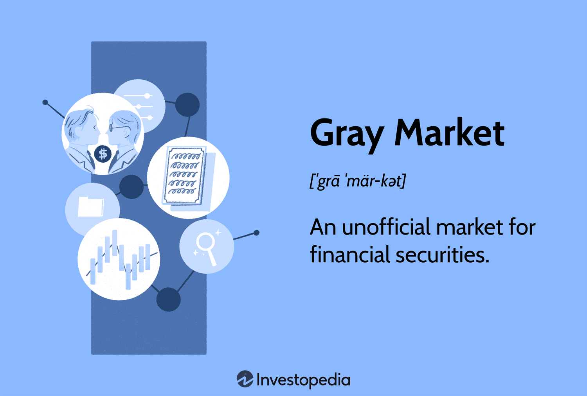

## Table of Contents

## What is the gray market in trading?

The gray market in trading refers to the unofficial trading of securities or products that are not yet officially available or are being traded before their official release. This often happens with new stocks or initial public offerings (IPOs) where investors buy and sell shares before they are officially listed on a stock exchange. The gray market allows investors to speculate on the future value of these securities, often based on rumors or preliminary information.

While the gray market can provide early access to potentially profitable investments, it also comes with significant risks. Since these trades are not regulated by official exchanges, there is a higher chance of fraud or misinformation. Prices in the gray market can be volatile and may not reflect the true value of the security once it becomes officially available. Therefore, while some investors see it as an opportunity, others view it as a risky and uncertain area of trading.

## How does the gray market differ from the black market and the official market?

The gray market is like a middle ground between the official market and the black market. In the gray market, people trade things that are not officially available yet, like new stocks before they are listed on a stock exchange. This market is not illegal, but it's not fully regulated either. People might trade based on rumors or early information, hoping to make money when the product or stock officially comes out. It's a bit risky because prices can change a lot and there's a chance of getting fooled by wrong information.

The black market is different because it's fully illegal. Here, people trade things that are banned or stolen, like drugs or counterfeit goods. The black market doesn't follow any rules and can be very dangerous. People use it to buy and sell things they can't get legally, often at very high prices because of the risk involved. Unlike the gray market, the black market is always against the law.

The official market is the safest and most regulated of the three. This is where you buy and sell stocks, bonds, and other financial products through official exchanges like the New York Stock Exchange. Everything is legal and follows strict rules to protect buyers and sellers. Prices are more stable, and there's less chance of fraud because everything is watched closely by regulators. The official market is the opposite of the black market and more structured than the gray market.

## What types of products or securities are typically traded on the gray market?

The gray market often deals with new stocks or initial public offerings (IPOs) before they are officially listed on a stock exchange. When a company decides to go public, investors might want to buy and sell its shares even before they can do so officially. This happens because people think the stock's price might go up once it's listed, so they want to get in early. These trades are based on guesses and rumors about how well the company will do, which makes the gray market a bit risky.

Besides stocks, other products like electronics or luxury goods can also be found on the gray market. Sometimes, new gadgets or limited edition items are sold before they officially hit the stores. People might buy these products from other countries or through unofficial channels, hoping to sell them for a profit once they become popular. Just like with stocks, there's a chance that the prices could change a lot, and buyers might end up paying more than the item is worth when it's officially available.

## What are the risks associated with trading on the gray market?

Trading on the gray market can be risky because it's not fully regulated like the official market. This means there's a higher chance of getting fooled by false information or rumors. People might buy things thinking they'll make a lot of money, but if the rumors are wrong, they could lose money instead. Also, since the gray market is not official, there's no one watching to make sure everything is fair. This can lead to fraud or scams where people take your money and give you nothing in return.

Another big risk is that prices on the gray market can change a lot and very quickly. If you buy something hoping to sell it for more later, you might find that the price drops instead. This can happen because the gray market is based on guesses about what might happen in the future, not on what's happening right now. So, if the guesses are wrong, the value of what you bought can go down fast. It's like trying to predict the weather without any tools – you might get it right sometimes, but often you'll be wrong.

## How can one identify gray market opportunities?

To spot gray market opportunities, you need to keep an eye on news and rumors about new products or companies going public. If a company is planning an IPO, people might start trading its shares before they're officially listed. You can find out about these opportunities by following financial news, social media, or special websites that talk about upcoming IPOs and new products. Sometimes, friends or other investors might share tips about what's happening in the gray market, but be careful because not all information you hear will be true.

Once you know about a potential gray market opportunity, you need to decide if it's worth the risk. Think about how much the product or stock might be worth when it becomes official. Talk to other people who know about the gray market to see if they think it's a good idea. Remember, the gray market can be tricky because prices can change a lot and there's a chance you might lose money if things don't go as planned. So, it's important to do your homework and not jump into anything too quickly.

## What are the legal implications of participating in gray market trading?

Trading on the gray market is not illegal like the black market, but it can still get you into trouble. The gray market is not fully regulated, so there are fewer rules to protect you. If you buy or sell something on the gray market and something goes wrong, like if you get scammed or if the price drops a lot, you might not have anyone to help you. Also, some countries have rules about trading things before they are officially available, so you need to check the laws where you live to make sure you're not breaking them.

Even though the gray market is not against the law, it can lead to legal problems if you're not careful. For example, if you trade stocks before an IPO and the company finds out, they might take you to court. Or, if you're selling products that are not supposed to be sold yet, the company that makes those products could sue you. So, while the gray market itself is not illegal, the things you do on it might cause legal trouble if they go against other rules or laws.

## How does the gray market impact the overall economy?

The gray market can affect the economy in different ways. When people trade things like new stocks or products before they are officially available, it can create a lot of excitement and interest. This might help companies get more attention and maybe even more money when they finally go public or release their products. But it can also make the market seem more unstable because prices can change a lot based on rumors and guesses, not real facts. This can make some people nervous about investing, which might slow down the economy a bit.

On the other hand, the gray market can also lead to problems. If a lot of people get scammed or lose money because of false information, it can hurt trust in the market. When people don't trust the market, they might not want to invest or spend money, which is bad for the economy. Also, if too many products are sold on the gray market before they are officially released, it might make it harder for the companies to control their prices and make money. This can affect how much they can grow and create jobs, which is important for the economy.

## What strategies can traders use to mitigate risks in gray market trading?

To reduce risks in gray market trading, traders need to do a lot of research before jumping in. They should look at all the information they can find about the product or stock they want to trade. This includes reading news, checking social media, and talking to other traders to see if the rumors and guesses make sense. It's also a good idea to start small, only trading a little bit of money at first to see how things go. That way, if the price drops or something goes wrong, they won't lose too much.

Another strategy is to set clear goals and limits. Traders should decide ahead of time how much they are willing to lose and stick to that amount. If the price starts to go down, they should be ready to sell and cut their losses instead of hoping things will get better. It's also smart to keep an eye on the official market and see how similar products or stocks are doing. This can give them a better idea of what might happen in the gray market. By being careful and prepared, traders can lower their chances of losing money on the gray market.

## Can you explain how gray market trading affects new stock issues?

Gray market trading can really change how new stocks do when they first come out. When a company wants to go public and sell its shares to everyone, some people might start trading those shares before they are officially on the stock exchange. This happens because people think the stock might go up in price once it's listed, so they want to buy it early. But this can make the price go up and down a lot based on rumors and guesses, not real facts. If the price in the gray market gets too high, it might be hard for the company to set a good price when the stock goes public, which can affect how much money they raise.

This early trading can also make the stock market seem more risky to other investors. If people see the price of a new stock changing a lot before it's even officially available, they might think twice about buying it. This can make it harder for the company to get people interested in their stock. On the other hand, if the gray market trading goes well and the price stays stable, it might help build excitement and trust in the new stock. So, gray market trading can have a big impact on how well a new stock does when it first comes out.

## What role do intermediaries play in gray market trading?

Intermediaries are really important in gray market trading. They help connect people who want to buy and sell things that are not yet officially available. These could be new stocks before they go public or new gadgets before they hit the stores. Intermediaries know a lot about the gray market and can help make sure trades happen smoothly. They often use their connections and information to find good deals and help people make money.

But, working with intermediaries in the gray market can be risky. Since the gray market is not fully regulated, there's a chance that intermediaries might not be totally honest. They might give you wrong information or try to trick you into a bad deal. So, it's important to be careful and do your homework before trusting an intermediary. Make sure they have a good reputation and that you understand the risks involved in any trade they suggest.

## How do regulatory bodies monitor and control gray market activities?

Regulatory bodies keep an eye on gray market activities to make sure things don't get out of hand. They watch for signs of fraud or illegal trading, even though the gray market itself is not against the law. These bodies might use special tools and reports to track what's happening in the gray market. If they see something that looks wrong, like people trading stocks before they should be, they can step in and try to stop it. They might also make new rules to help control the gray market and protect people from getting tricked.

But controlling the gray market is hard because it's not as easy to watch as the official market. Since gray market trades happen before things are officially available, it can be tough to know exactly what's going on. Regulatory bodies might work with other countries or use information from the official market to help them understand the gray market better. Even though they can't control everything, they try their best to make sure the gray market doesn't cause too many problems for the overall economy.

## What are some case studies or examples of successful gray market trading?

One example of successful gray market trading happened with Tesla's IPO in 2010. Before Tesla officially went public, people were already trading its shares on the gray market. They thought Tesla's stock would go up a lot once it was listed on the stock exchange. And they were right! When Tesla's IPO happened, the stock price jumped from $17 to $23.89 on the first day. People who bought Tesla shares on the gray market made a good profit because they got in early.

Another case was with the iPhone. When Apple releases a new iPhone, some people buy them from other countries before they are available in their own country. They then sell these phones on the gray market at a higher price. For example, when the iPhone X came out, it was hard to find in some places. People who managed to buy it early and sell it on the gray market made money because others were willing to pay more to get it sooner. This shows how the gray market can be a way to make money if you know what you're doing and are willing to take the risk.

## References & Further Reading

[1]: Gehr, A., & Ollig, H. (2013). ["The role of the gray market in equity valuation."](https://www.jstor.org/stable/43303792) The Quarterly Review of Economics and Finance, 53(2), 108-124.

[2]: Pardo, R. (2008). ["The Evaluation and Optimization of Trading Strategies."](https://onlinelibrary.wiley.com/doi/book/10.1002/9781119196969) Wiley Trading.

[3]: Aldridge, I. (2013). ["High-Frequency Trading: A Practical Guide to Algorithmic Strategies and Trading Systems."](https://onlinelibrary.wiley.com/doi/pdf/10.1002/9781119203803.fmatter) Wiley.

[4]: Hasbrouck, J., & Saar, G. (2013). ["Low-Latency Trading."](https://www.sciencedirect.com/science/article/abs/pii/S1386418113000165) Journal of Financial Markets, 16(4), 646-679.

[5]: Hendershott, T., Jones, C. M., & Menkveld, A. J. (2011). ["Does algorithmic trading improve liquidity?"](https://onlinelibrary.wiley.com/doi/full/10.1111/j.1540-6261.2010.01624.x) Journal of Finance, 66(1), 1-33. 

[6]: Vaananen, T. (2015). ["Dark Pools and High-Frequency Trading: Equipping Investors for the Future."](https://book-v2.usesession.com/public/Resources/Documents/Dark%20Pools%20And%20High%20Frequency%20Trading%20For%20Dummies%20Jay%20Vaananen.pdf) Palgrave Macmillan.