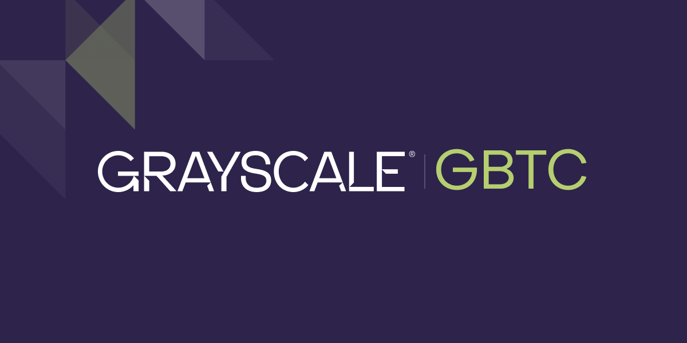

## Table of Contents

## What is the Grayscale Bitcoin Trust ETF?

The Grayscale Bitcoin Trust (GBTC) is a financial product that allows people to invest in Bitcoin without actually owning the cryptocurrency directly. It's like a stock that you can buy and sell on the stock market, but instead of representing a company, it represents Bitcoin. GBTC is managed by Grayscale Investments, a company that creates different investment products related to cryptocurrencies.

When you buy shares of GBTC, you're essentially buying a piece of a big pool of Bitcoin that Grayscale holds. The value of GBTC shares goes up and down based on the price of Bitcoin. This makes it easier for people who want to invest in Bitcoin but don't want to deal with the complexities of managing their own cryptocurrency wallets and transactions. However, it's important to know that GBTC often trades at a price different from the actual value of the Bitcoin it holds, which can affect your investment returns.

## How does the Grayscale Bitcoin Trust ETF work?

The Grayscale Bitcoin Trust (GBTC) is a way for people to invest in Bitcoin without having to buy and store the cryptocurrency themselves. It works like this: Grayscale holds a bunch of Bitcoin in a big pool. When you buy shares of GBTC, you're buying a small piece of that pool. The price of GBTC shares goes up and down based on the price of Bitcoin. So, if Bitcoin's price goes up, the value of your GBTC shares will likely go up too.

However, GBTC is a bit different from just owning Bitcoin directly. The shares of GBTC trade on the stock market, so their price can be different from the actual value of the Bitcoin that Grayscale holds. Sometimes, GBTC shares might be more expensive than the Bitcoin they represent, and sometimes they might be cheaper. This difference is called a "premium" or "discount," and it can affect how much money you make or lose when you invest in GBTC. So, it's important to keep an eye on both the price of Bitcoin and the price of GBTC shares when you're thinking about investing.

## What are the benefits of investing in the Grayscale Bitcoin Trust ETF?

One of the main benefits of investing in the Grayscale Bitcoin Trust (GBTC) is that it makes it easy to invest in Bitcoin without having to deal with the technical stuff. You don't need to set up a [cryptocurrency](/wiki/cryptocurrency) wallet or learn how to buy and store Bitcoin yourself. Instead, you can just buy GBTC shares on a regular stock market, like you would with any other stock. This can be a big help if you're new to cryptocurrencies or if you just want a simpler way to invest in Bitcoin.

Another benefit is that GBTC can be a good fit for certain types of investors. For example, if you have a retirement account or other investment accounts that don't let you buy cryptocurrencies directly, you might still be able to buy GBTC shares. This means you can add Bitcoin to your investment mix without breaking any rules. Plus, because GBTC trades on the stock market, it's easy to keep track of how your investment is doing and to buy or sell shares whenever you want.

## What are the risks associated with the Grayscale Bitcoin Trust ETF?

One of the biggest risks with the Grayscale Bitcoin Trust (GBTC) is that its price can be different from the actual value of the Bitcoin it holds. This difference is called a "premium" or "discount." If you buy GBTC shares when they are trading at a premium, you might end up paying more than the Bitcoin is actually worth. And if you want to sell your shares when they are at a discount, you might get less money than the Bitcoin's real value. This can make it harder to make money with GBTC compared to just owning Bitcoin directly.

Another risk is that GBTC has some extra costs that you wouldn't have if you owned Bitcoin yourself. Grayscale charges fees to manage the trust, and these fees can eat into your profits over time. Plus, because GBTC is a trust and not a true [ETF](/wiki/etf-trading-strategies), it can be less flexible and might not be available in all investment accounts. This means you might not be able to buy or sell GBTC shares as easily as you could with a regular ETF or with Bitcoin itself.

## How does the Grayscale Bitcoin Trust ETF compare to other Bitcoin investment vehicles?

The Grayscale Bitcoin Trust (GBTC) is one way to invest in Bitcoin, but there are other options too. GBTC is easy to use because you can buy and sell its shares on a regular stock market, just like you would with any other stock. This makes it a good choice if you don't want to deal with the technical stuff that comes with owning Bitcoin directly. However, GBTC has some downsides. It can trade at a price that's different from the actual value of the Bitcoin it holds, which can make it harder to make money. Also, Grayscale charges fees to manage the trust, and these fees can eat into your profits over time.

Another option is to buy Bitcoin directly through a cryptocurrency exchange. This gives you more control over your investment because you own the actual Bitcoin. You don't have to worry about premiums or discounts like you do with GBTC, and you don't have to pay management fees. However, buying and storing Bitcoin yourself can be more complicated. You need to set up a cryptocurrency wallet and learn how to use it safely, which can be a challenge if you're new to cryptocurrencies.

Some people also invest in Bitcoin through other types of investment vehicles, like Bitcoin futures or other cryptocurrency funds. These options can offer different levels of risk and reward, depending on how they are structured. For example, Bitcoin futures let you bet on the future price of Bitcoin without actually owning it, but they can be very risky and are usually not recommended for beginners. Other cryptocurrency funds might be more like GBTC, but they might have different fees or ways of tracking Bitcoin's price. It's important to understand the pros and cons of each option before deciding which one is right for you.

## What is the fee structure of the Grayscale Bitcoin Trust ETF?

The Grayscale Bitcoin Trust (GBTC) charges a yearly management fee of 2%. This means if you have $100 invested in GBTC, you'll pay $2 in fees every year. The fee is taken out of the trust's assets, which can make your investment grow slower than if you owned Bitcoin directly.

The fee covers the costs of managing the trust, like storing the Bitcoin and handling all the paperwork. It's important to think about this fee when you're deciding if GBTC is a good choice for you. Over time, these fees can add up and eat into your profits, especially if Bitcoin's price doesn't go up very much.

## How can one invest in the Grayscale Bitcoin Trust ETF?

To invest in the Grayscale Bitcoin Trust (GBTC), you need to have a brokerage account that lets you buy and sell stocks. You can open an account with a broker like E*TRADE, Fidelity, or Charles Schwab if you don't already have one. Once your account is set up, you can search for GBTC using the broker's trading platform. When you find it, you can place an order to buy shares just like you would with any other stock. You can choose to buy a specific number of shares or a certain dollar amount, depending on what your broker allows.

After you buy the shares, you can keep track of how your investment is doing through your brokerage account. You'll be able to see the current price of GBTC and how much your shares are worth. If you decide you want to sell your shares later, you can do that through the same trading platform. Just remember that the price of GBTC can be different from the actual value of the Bitcoin it holds, and there are fees to think about, so it's important to keep an eye on all of these things when you're investing.

## What has been the historical performance of the Grayscale Bitcoin Trust ETF?

The Grayscale Bitcoin Trust (GBTC) has had a pretty wild ride since it started in 2013. Its performance has gone up and down a lot, just like the price of Bitcoin. When Bitcoin's price goes up, GBTC usually goes up too, but sometimes it goes up even more because people are willing to pay a premium for the shares. For example, during the big Bitcoin boom in 2017, GBTC's price shot up a lot. But when Bitcoin's price crashed in 2018, GBTC's price fell too, and it even traded at a discount for a while.

Over the years, GBTC has given investors some big wins and some big losses. It's a good idea to look at a long-term chart to see how it has done over time. But remember, past performance doesn't tell you what will happen in the future. Bitcoin is still a new and unpredictable investment, and GBTC can be even more unpredictable because of the premiums and discounts. So, if you're thinking about investing in GBTC, it's important to do your homework and understand the risks.

## How does the Grayscale Bitcoin Trust ETF handle regulatory compliance?

The Grayscale Bitcoin Trust (GBTC) follows all the rules set by the government and financial watchdogs. It has to do this to make sure it's doing things the right way and to keep investors safe. Grayscale works hard to meet all the rules from the U.S. Securities and Exchange Commission (SEC) and other groups. They do things like regular check-ups and reports to show they're following the rules.

GBTC also has to follow special rules for dealing with cryptocurrencies. This means they have to be careful about how they store and handle the Bitcoin they hold for investors. They use safe ways to keep the Bitcoin secure and make sure everything they do with it follows the law. This helps make sure that the trust is doing things the right way and that investors can trust them.

## What is the process for creating and redeeming shares in the Grayscale Bitcoin Trust ETF?

Creating new shares in the Grayscale Bitcoin Trust (GBTC) is a bit different from how it works with regular ETFs. Grayscale can create new shares by taking in more Bitcoin and then selling those new shares to investors. But they only do this when there's enough demand for new shares. They don't let just anyone create new shares like you can with some other ETFs. This means that the number of GBTC shares can go up over time, but it's controlled by Grayscale.

Redeeming shares, or turning them back into Bitcoin, is also different with GBTC. Unlike many ETFs where you can always get your shares turned back into the underlying asset, GBTC doesn't let investors redeem their shares for Bitcoin. Once you buy GBTC shares, you can only sell them to other investors on the stock market. This can make GBTC less flexible than owning Bitcoin directly or investing in some other types of funds.

## How does the Grayscale Bitcoin Trust ETF manage its Bitcoin holdings?

The Grayscale Bitcoin Trust (GBTC) keeps its Bitcoin safe by using special storage solutions. They work with companies that are really good at keeping cryptocurrencies secure. This means they use something called "cold storage," which is like keeping the Bitcoin offline so it's harder for hackers to steal it. Grayscale also follows strict rules to make sure the Bitcoin is safe and that they're doing everything the right way. They do regular checks to make sure everything is okay and report to the people who watch over them, like the SEC.

When it comes to managing the Bitcoin, GBTC doesn't do much with it. They just hold onto it and don't trade it or use it for anything else. The value of GBTC shares goes up and down based on the price of Bitcoin, but Grayscale doesn't try to make the price go up or down. They just keep the Bitcoin safe and let the market decide what the shares are worth. This makes GBTC a simple way for people to invest in Bitcoin without having to deal with the complicated stuff themselves.

## What are the tax implications of investing in the Grayscale Bitcoin Trust ETF?

When you invest in the Grayscale Bitcoin Trust (GBTC), you need to think about taxes. If you make money when you sell your GBTC shares, you'll have to pay capital gains tax. This tax depends on how long you held the shares. If you held them for less than a year, it's a short-term capital gain, and you'll pay tax at your regular income tax rate. If you held them for more than a year, it's a long-term capital gain, and you'll pay a lower tax rate.

GBTC also has something called a "grantor trust" status, which means you might have to pay taxes on any gains the trust makes, even if you don't sell your shares. This is different from owning Bitcoin directly, where you only pay taxes when you sell it. So, it's a good idea to talk to a tax expert to understand all the tax rules and how they might affect your investment in GBTC.

## References & Further Reading

[1]: Antonopoulos, A. M. (2017). ["Mastering Bitcoin: Unlocking Digital Cryptocurrencies."](https://books.google.com/books/about/Mastering_Bitcoin.html?id=IXmrBQAAQBAJ) O'Reilly Media.

[2]: Baur, D. G., Hong, K., & Lee, A. D. (2018). ["Bitcoin: Medium of exchange or speculative assets?"](https://www.sciencedirect.com/science/article/abs/pii/S1042443117300720) Journal of International Financial Markets, Institutions and Money, 54, 177-189.

[3]: Narang, R. K. (2013). ["Inside the Black Box: The Simple Truth About Quantitative Trading."](https://onlinelibrary.wiley.com/doi/book/10.1002/9781118267738) John Wiley & Sons.

[4]: Securities and Exchange Commission (SEC). ["Bitcoin Futures and Other Cryptocurrency-Related Investment Products."](https://www.sec.gov/securities-topics/crypto-assets) U.S. Securities and Exchange Commission.

[5]: Petrescu, M., & Krishen, A. S. (2017). ["Bitcoin: A New Investment Opportunity?"](https://link.springer.com/content/pdf/10.1057/s41270-017-0019-1.pdf) Journal of Investing, 26(2), 171-182.