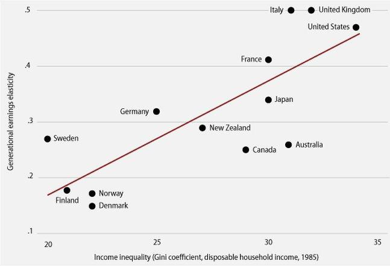

In today's economic discussions, inequality continues to be a topic of significant debate. One way to examine this issue is through the Great Gatsby Curve, which illustrates the relationship between income inequality and intergenerational mobility across different countries. The curve is named after F. Scott Fitzgerald's novel, capturing the idea that wealth and social status may inhibit upward mobility. The Great Gatsby Curve implies that higher levels of income inequality within a country are associated with lower levels of intergenerational mobility, suggesting that children in highly unequal societies have a tougher time achieving different economic statuses than their parents. This relationship raises pertinent questions about the societal and economic structures that underpin such dynamics.

In parallel, the rise of algorithmic trading in financial markets introduces another layer of complexity to the discussion of economic inequality. Algorithmic trading refers to the use of sophisticated algorithms to execute trading orders, often at speeds and volumes unreachable by human traders. While these financial advancements contribute to market efficiency, they also pose potential risks of exacerbating economic disparities. The accessibility of algorithmic trading technologies is often limited to wealthy investors and institutions, allowing them to capitalize on market movements more effectively than individuals with fewer resources. This scenario highlights a technological layer influencing the broader discussion of inequality.

Understanding how economic inequality, intergenerational mobility, and financial advancements intersect requires an integrated approach. By exploring these fields in tandem, we can gain insights into the multifaceted nature of economic inequality and identify potential avenues for fostering a more equitable society.

## Table of Contents

## Understanding the Great Gatsby Curve

The Great Gatsby Curve illustrates the relationship between income inequality and intergenerational mobility by plotting income inequality against the elasticities of income across generations. This concept suggests that as income inequality increases within a country, the ability for individuals to change their economic status relative to their parents decreases. In other words, countries with high income inequality often face lower intergenerational mobility, where an individual's economic position is significantly tied to their family's economic status.

To understand this relationship, it is essential to look at how income inequality is quantified. One common measure is the Gini coefficient, which ranges from 0 (perfect equality) to 1 (maximum inequality). Intergenerational income elasticity, however, measures the degree to which a child’s economic outcomes are affected by their parents’ income. A higher elasticity indicates a stronger correlation between parental income and child economic status, implying lower mobility.

In practice, countries such as the Nordic nations, which have lower Gini coefficients, generally display higher intergenerational mobility. Conversely, countries like the United States, which exhibit higher income inequality, typically show lower mobility levels. This inverse relationship raises critical questions about the underlying societal and economic structures in different countries.

Various factors may influence the dynamics observed in the Great Gatsby Curve. Educational opportunities, access to healthcare, labor market conditions, and social safety nets are key examples. These factors collectively impact the degree of inequality and mobility within a country. Addressing inequality involves a nuanced understanding of these interconnected elements and how they can collectively foster a more equitable society. 

The Great Gatsby Curve serves as a critical analytical tool by highlighting the need for policies that can effectively mitigate income inequality and improve chances for individuals to rise economically, regardless of their familial background.

## Intergenerational Mobility and Its Implications

Intergenerational mobility is a critical component of understanding economic inequality, reflecting how fluid an economy is in allowing individuals to move across different income levels compared to their parents. High levels of intergenerational mobility suggest a society where opportunities are accessible, helping to foster a fair economic system. In such societies, meritocracy prevails, enabling talent and hard work to drive upward economic movement. Conversely, low levels of mobility often signal deep-rooted structural issues, resulting in entrenched poverty and constrained economic potential for a significant portion of the population.

The phenomenon of low intergenerational mobility can result in perpetuating cycles of poverty. When individuals are unable to improve their economic status relative to their parents, economic disparities become more pronounced and systemic. This entrenchment limits not only personal growth but also equates to a significant loss of potential talent and innovation within the broader economy. Inequitable systems foster environments where economic growth is stifled and talent is underutilized, stalling economic advancement at societal levels.

To address and improve intergenerational mobility, systemic interventions are typically required. Education plays a paramount role; access to quality education can provide the skills and knowledge necessary to transcend economic barriers. Education policy reforms often focus on equalizing opportunities by improving educational access and quality, ensuring that socioeconomic background is less of a determinant in educational success.

Moreover, economic policy reforms can facilitate increased mobility by leveling the economic playing field. These reforms often target income distribution, taxation, and social welfare systems to create more equitable conditions. For instance, progressive tax policies and social safety nets can redistribute resources to those in need, enhancing opportunities for upward mobility.

These efforts collectively aim to dismantle the barriers that hinder economic mobility, offering pathways towards a more equitable and dynamic economic landscape. Enhanced mobility signifies not just individual success, but a thriving economy, resonating with the broader goals of bridging inequality and fostering inclusive growth.

## Algorithmic Trading’s Impact on Economic Inequality

Algorithmic trading utilizes complex algorithms to automate financial market transactions, streamlining processes and boosting trade efficiency. This advancement, however, presents significant implications for economic inequality. The sophisticated nature of these trading systems often requires substantial investment in technology and skilled personnel, which is more accessible to wealthy investors and large financial institutions. This disparity can lead to a concentration of financial advantages among higher economic tiers, potentially widening the existing gap between the wealthy and the less affluent.

The core challenge lies in technological access disparities. While [algorithmic trading](/wiki/algorithmic-trading) can enhance [liquidity](/wiki/liquidity-risk-premium) and reduce transaction costs, its benefits are not equally distributed. Wealthier entities have the capital to invest in cutting-edge technology and data analytics, factors crucial for successful algorithmic trading. This capability allows them to execute trades at speeds and complexities unattainable by smaller investors, often leading to a market environment where advantages compound upon existing capital, exacerbating income disparity.

The democratization of financial technology can help mitigate these effects. By making advanced trading tools and knowledge more accessible, financial markets can become more inclusive. Open-source tools, educational initiatives, and supportive regulatory frameworks can empower smaller investors to harness algorithmic trading's potential. Platforms offering fractional trading and no-fee transactions are steps towards reducing barriers and redistributing trading advantages.

Ultimately, addressing the economic inequalities exacerbated by algorithmic trading requires a multifaceted approach. Fostering an equitable trading environment necessitates collaboration between financial institutions, regulators, and technology providers to ensure that advancements in trading technology do not solely benefit those with existing advantages. Ensuring broad access to financial technology will be crucial in leveling the playing field and promoting financial inclusivity.

## Linking Financial Technology and Mobility

Financial technology, often referred to as fintech, holds significant promise for fostering economic mobility, provided it is implemented effectively. One of the primary avenues through which fintech can facilitate mobility is by expanding access to financial services, particularly through innovations like decentralized finance (DeFi) and mobile banking solutions. These technologies are designed to reach underbanked and unbanked communities, offering them the opportunity to engage with financial systems that were previously inaccessible.

DeFi, in particular, leverages blockchain technology to create financial instruments without relying on traditional banking infrastructure. This decentralized approach can reduce barriers to entry for individuals and small businesses, particularly in regions where banking services are limited or expensive. Mobile banking further supports this by offering platform-independent access to financial services, allowing individuals in remote or underserved areas to perform transactions, save, and invest without needing physical bank branches.

However, the potential of fintech to promote economic mobility is contingent on two critical factors: digital literacy and equitable access to technology. Digital literacy ensures that users can effectively engage with and benefit from these financial technologies. This involves understanding and navigating digital platforms, as well as making informed financial decisions. As such, education and training programs tailored to improve digital literacy are essential to maximize the impact of fintech on mobility.

Furthermore, equitable access to technology is necessary to ensure that these innovations reach and benefit economically marginalized groups. Disparities in technology access, such as inadequate internet connectivity or lack of affordable devices, can hinder individuals' ability to engage with fintech solutions. Addressing these issues requires cohesive efforts from governments, financial institutions, and technology companies to provide infrastructure and resources that support widespread and inclusive access to technology.

If financial technology is successfully democratized, it can help counteract some of the mobility issues highlighted by the Great Gatsby Curve. By providing previously unavailable financial tools and opportunities, fintech can play a central role in disrupting cycles of poverty and enhancing intergenerational mobility. Through strategic deployment and support structures aimed at overcoming existing technological disparities, fintech can be a powerful ally in the pursuit of economic equality and increased mobility.

## Conclusion

Addressing economic inequality is a multi-faceted challenge that necessitates a comprehensive strategy involving economic policy, financial technology, and educational reforms. The Great Gatsby Curve underscores the profound influence of income inequality on generational mobility. It highlights the necessity for policies that can moderate inequality to enhance economic mobility across generations, suggesting that tailored interventions are crucial for facilitating equal opportunities.

Algorithmic trading and technological advancements in finance offer both challenges and opportunities. Although they can widen the economic gap due to unequal access to technology, they can also democratize financial opportunities if implemented inclusively. The key lies in balancing innovation with accessibility, ensuring that advancements serve broad societal interests rather than reinforcing existing disparities.

The path to reducing inequality and improving mobility hinges on cross-sectoral collaboration. Policymakers, technologists, educators, and financial institutions must work together to create environments that promote equitable access to resources and opportunities. By integrating efforts to reform economic policies, advance financial technologies, and improve educational systems, societies can mitigate the adverse effects captured by the Great Gatsby Curve and foster a more equitable economic landscape.

## References & Further Reading

[1]: Krueger, A. B. (2012). ["The Rise and Consequences of Inequality in the United States."](https://obamawhitehouse.archives.gov/sites/default/files/krueger_cap_speech_final_remarks.pdf) Brookings Papers on Economic Activity.

[2]: Corak, M. (2013). ["Income Inequality, Equality of Opportunity, and Intergenerational Mobility."](https://www.aeaweb.org/articles?id=10.1257/jep.27.3.79) Journal of Social Issues.

[3]: Atkinson, A. B., & Morelli, S. (2014). ["The Chartbook of Economic Inequality."](https://www.chartbookofeconomicinequality.com/) Institute for New Economic Thinking.

[4]: Aldridge, I. (2013). ["High-Frequency Trading: A Practical Guide to Algorithmic Strategies and Trading Systems."](https://www.amazon.com/High-Frequency-Trading-Practical-Algorithmic-Strategies/dp/1118343506) Wiley.

[5]: Piketty, T. (2014). ["Capital in the Twenty-First Century."](https://www.jstor.org/stable/j.ctt6wpqbc) Harvard University Press.

[6]: Bourguignon, F. (2015). ["The Globalization of Inequality."](https://www.jstor.org/stable/j.ctvc77hcm) Princeton University Press.

[7]: Guiso, L., Sapienza, P., & Zingales, L. (2008). ["Trusting the Stock Market."](https://onlinelibrary.wiley.com/doi/abs/10.1111/j.1540-6261.2008.01408.x) The Journal of Finance.