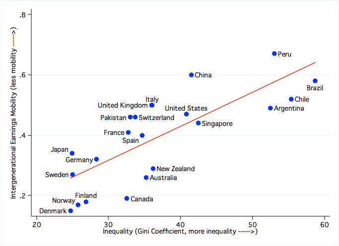

## Table of Contents

## What is the Great Gatsby Curve?

The Great Gatsby Curve is a graph that shows a connection between how much money people earn in a country and how much their kids will earn. It was named after a book called "The Great Gatsby" because the book talks about rich and poor people. The curve shows that in countries where there is a big difference between the rich and the poor, it's harder for kids to move up to a different income level than their parents.

Researchers use the Great Gatsby Curve to talk about something called "economic mobility." This means how easy or hard it is for people to change their income level. If a country has a lot of economic mobility, it means that it's easier for people to get richer or poorer than their parents. The curve helps people understand that if a country wants more economic mobility, it might need to make the difference between rich and poor smaller.

## Who coined the term 'Great Gatsby Curve'?

The term 'Great Gatsby Curve' was coined by economist Alan Krueger. He used it in a speech he gave in 2012 when he was working for the White House.

Krueger named it after the book "The Great Gatsby" because the book shows the big difference between rich and poor people. He used the curve to show how the gap between rich and poor can make it harder for kids to do better than their parents in terms of money.

## How does the Great Gatsby Curve relate to social mobility?

The Great Gatsby Curve shows how the difference between rich and poor people in a country can affect social mobility. Social mobility means how easy or hard it is for people to move to a different level of money or status than their parents. The curve shows that in countries where there is a big gap between the rich and the poor, it's harder for kids to move up to a higher income level than their parents. This is because when the rich have a lot more money, they can give their kids more opportunities, like better schools and more resources, which makes it harder for kids from poorer families to catch up.

Researchers use the Great Gatsby Curve to talk about how to make social mobility better. If a country wants to make it easier for people to move up or down in income, it might need to make the difference between rich and poor smaller. This could mean making sure everyone has access to good education and job opportunities, no matter how much money their parents have. By understanding the Great Gatsby Curve, people can see why it's important to work on making society more equal, so everyone has a fair chance to improve their lives.

## What are the key components of the Great Gatsby Curve?

The Great Gatsby Curve has two main parts. The first part is the difference in income between rich and poor people in a country. This is called income inequality. The second part is how easy or hard it is for kids to earn more or less money than their parents. This is called intergenerational income mobility. The curve shows that when the difference in income is big, it's harder for kids to do better than their parents.

Researchers use the Great Gatsby Curve to help understand why some countries have more social mobility than others. They look at how much money people earn and how their kids do. If a country has a lot of income inequality, it means the rich have a lot more money than the poor. This can make it harder for kids from poor families to get good jobs and education, so they can't move up as easily. The curve helps show that making the income gap smaller might help everyone have a better chance to improve their lives.

## Can you explain the methodology used to create the Great Gatsby Curve?

To create the Great Gatsby Curve, researchers look at two main things in different countries: how much money people earn and how their kids do later. They use something called the Gini coefficient to measure how different the incomes are between rich and poor people. The Gini coefficient is a number between 0 and 1, where a higher number means there's a bigger gap between rich and poor. They also use something called intergenerational income elasticity to see how much kids' earnings depend on their parents' earnings. This is a number that shows if kids tend to earn similar amounts of money as their parents, or if they can move up or down.

Researchers collect a lot of data from different countries to make the curve. They look at how much money people earn over many years and then see how their kids do when they grow up. They put all this information together to find the Gini coefficient and intergenerational income elasticity for each country. Then, they plot these numbers on a graph. The horizontal line shows the Gini coefficient (income inequality), and the vertical line shows the intergenerational income elasticity (how much kids' earnings depend on their parents'). The curve that forms shows that countries with bigger income gaps tend to have less chance for kids to move up or down in income compared to their parents.

## What are some common misconceptions about the Great Gatsby Curve?

Some people think the Great Gatsby Curve means that if a country has a big difference between rich and poor, no one can ever move up in income. But that's not true. The curve shows that in countries with big income gaps, it's harder for kids to do better than their parents, but it doesn't mean it's impossible. Some people can still move up, but it's just more difficult.

Another common mistake is thinking the Great Gatsby Curve is the only thing that affects how easy it is for people to move up or down in income. There are many other things that can help or hurt social mobility, like education, job opportunities, and government policies. The curve is just one way to look at how income differences might affect social mobility, but it's not the whole story.

## How does the Great Gatsby Curve vary across different countries?

The Great Gatsby Curve looks different in every country because the gap between rich and poor people is not the same everywhere. In some countries, the rich have a lot more money than the poor, and this makes it harder for kids to earn more than their parents. For example, in the United States, there is a big difference between rich and poor, and it's harder for kids to move up in income. In other countries, like the Nordic countries (like Sweden and Denmark), the difference between rich and poor is smaller, and it's easier for kids to do better than their parents.

Researchers look at many countries to make the Great Gatsby Curve. They use numbers to see how big the income gap is and how much kids' earnings depend on their parents' earnings. When they put all this information together, they see that countries with smaller income gaps, like those in Europe, tend to have more social mobility. Countries with bigger income gaps, like the U.S. and some in Latin America, have less social mobility. This helps people understand that making the income gap smaller might help everyone have a better chance to move up in life.

## What are the economic implications of the Great Gatsby Curve?

The Great Gatsby Curve shows that when there is a big difference between rich and poor people in a country, it's harder for kids to earn more money than their parents. This can make the economy less fair because it's harder for people to move up in income. If only a few people can get rich, it might slow down the whole economy because fewer people can spend money and start new businesses. This can make the country grow more slowly and make it harder for everyone to have a good life.

On the other hand, if a country can make the difference between rich and poor smaller, it might help the economy grow faster. When more people have a chance to move up in income, they can spend more money and start new businesses. This can make the economy stronger and help everyone have a better life. The Great Gatsby Curve helps people see why it's important to make sure everyone has a fair chance to do well, so the whole country can grow and be successful.

## How has the Great Gatsby Curve evolved over time?

The Great Gatsby Curve has changed over time as countries have become richer and the gap between rich and poor has grown or shrunk. In the past, many countries had smaller differences in income, and it was easier for kids to do better than their parents. But as time went on, some countries like the United States saw the gap between rich and poor get bigger. This made it harder for kids to move up in income, and the Great Gatsby Curve showed this change. Researchers keep updating the curve with new data to see how things are changing.

Today, the Great Gatsby Curve still shows that countries with big income gaps have less chance for kids to move up or down in income compared to their parents. But it also shows that some countries have been able to make the gap smaller over time, which can help with social mobility. For example, some European countries have worked on making sure everyone has a fair chance to get a good education and job, which can make the curve look better. The Great Gatsby Curve helps people understand how income differences affect social mobility and how things might change in the future.

## What are the policy recommendations based on the insights from the Great Gatsby Curve?

The Great Gatsby Curve shows that when the difference between rich and poor is big, it's harder for kids to earn more money than their parents. To make it easier for everyone to move up in income, countries can make policies that help close the gap between rich and poor. One way to do this is by making sure everyone has a good education. When all kids can go to good schools, they have a better chance to get good jobs and earn more money. Another way is to make sure people have access to healthcare and other important services. This can help everyone stay healthy and work hard.

Countries can also make tax policies that help make the income gap smaller. For example, they can have higher taxes for rich people and use that money to help poor people. This can make sure everyone has a fair chance to do well. Governments can also create programs that help people find jobs and start businesses. When more people can work and earn money, it's easier for them to move up in income. By using these kinds of policies, countries can make the Great Gatsby Curve look better and help everyone have a better chance to improve their lives.

## How do critics challenge the validity of the Great Gatsby Curve?

Critics say the Great Gatsby Curve might not tell the whole story about how easy or hard it is for people to move up in income. They think it's too simple and doesn't look at all the things that can affect social mobility. For example, the curve only shows the gap between rich and poor and how kids' earnings depend on their parents' earnings. But there are other important things like education, job opportunities, and even luck that can make a big difference. Critics also say that the data used to make the curve can be old or not the same for every country, which can make the results less accurate.

Some critics also think that the Great Gatsby Curve makes it seem like income inequality is the only thing that matters for social mobility. They argue that even if a country makes the income gap smaller, it might not help everyone move up in income if there are other big problems. For example, if schools are bad or there are not enough jobs, making the income gap smaller might not help much. Critics believe that while the Great Gatsby Curve can show an important part of the story, it's not the whole picture, and people should look at many different things to understand social mobility better.

## What future research directions are suggested by the Great Gatsby Curve?

The Great Gatsby Curve shows that when the gap between rich and poor is big, it's harder for kids to earn more money than their parents. This suggests that future research should look at ways to make the income gap smaller. Researchers could study different policies like better education, healthcare, and job programs to see if they help close the gap. They could also look at how taxes and government help can make a difference. By understanding what works, countries can make better plans to help everyone have a fair chance to move up in income.

Another direction for future research is to look at other things that affect social mobility. The Great Gatsby Curve only shows part of the story, so researchers should study things like luck, family support, and even the neighborhoods people live in. They could also use newer and better data to make the curve more accurate. By looking at all these different things, researchers can get a fuller picture of what helps or hurts social mobility. This can help countries make the best choices to give everyone a chance to do well.

## References & Further Reading

[1]: Krueger, A. B. (2012). ["The Rise and Consequences of Inequality in the United States."](https://obamawhitehouse.archives.gov/sites/default/files/krueger_cap_speech_final_remarks.pdf) Brookings Papers on Economic Activity.

[2]: Corak, M. (2013). ["Income Inequality, Equality of Opportunity, and Intergenerational Mobility."](https://www.aeaweb.org/articles?id=10.1257/jep.27.3.79) Journal of Social Issues.

[3]: Atkinson, A. B., & Morelli, S. (2014). ["The Chartbook of Economic Inequality."](https://www.chartbookofeconomicinequality.com/) Institute for New Economic Thinking.

[4]: Aldridge, I. (2013). ["High-Frequency Trading: A Practical Guide to Algorithmic Strategies and Trading Systems."](https://www.amazon.com/High-Frequency-Trading-Practical-Algorithmic-Strategies/dp/1118343506) Wiley.

[5]: Piketty, T. (2014). ["Capital in the Twenty-First Century."](https://www.jstor.org/stable/j.ctt6wpqbc) Harvard University Press.

[6]: Bourguignon, F. (2015). ["The Globalization of Inequality."](https://www.jstor.org/stable/j.ctvc77hcm) Princeton University Press.

[7]: Guiso, L., Sapienza, P., & Zingales, L. (2008). ["Trusting the Stock Market."](https://onlinelibrary.wiley.com/doi/abs/10.1111/j.1540-6261.2008.01408.x) The Journal of Finance.