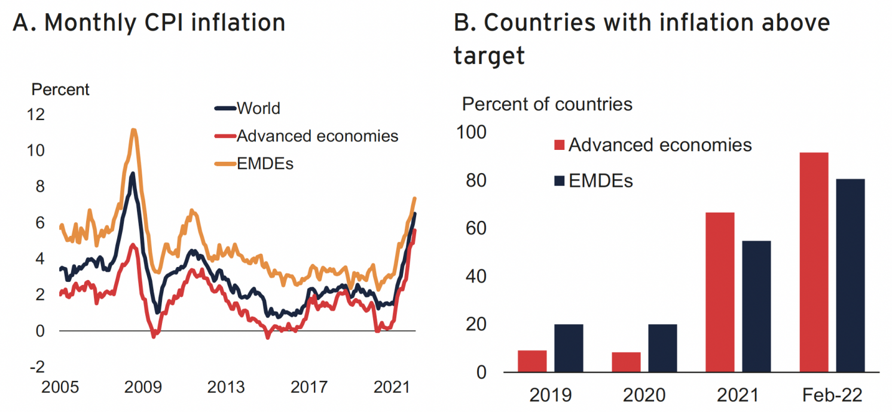

## Table of Contents

## What was the Great Inflation of the 1970s?

The Great Inflation of the 1970s was a time when prices for things like food, gas, and other goods went up a lot in the United States. It started in the late 1960s and got worse in the 1970s. This happened because the government was spending a lot of money, and there were problems with the world's oil supply. People started to expect that prices would keep going up, so they bought more things quickly, which made prices go up even more.

During this time, the economy was not doing well. Many people lost their jobs, and it was hard for businesses to make money. The government and the Federal Reserve tried different things to stop the inflation, but it took a long time. Finally, in the early 1980s, they were able to get inflation under control by raising interest rates and making it harder to borrow money. This helped to slow down the economy and bring prices back to normal.

## What were the main causes of the Great Inflation?

The Great Inflation of the 1970s was caused by several things. One big reason was that the government was spending a lot more money than it was getting from taxes. This extra spending made more money available in the economy, which made prices go up. Also, the Vietnam War was costing a lot of money, and this added to the problem. At the same time, the government and the Federal Reserve were not doing enough to control the money supply, which let inflation grow.

Another cause was the oil crisis in the 1970s. Oil prices went up a lot because oil-producing countries decided to cut back on how much oil they were selling. This made everything that needed oil to be made or transported more expensive. When oil prices went up, it affected the prices of many other things too. People started to expect that prices would keep going up, so they bought things quickly, which made inflation even worse.

In the end, the way people expected prices to keep rising also played a big role. When people think prices will go up, they often spend money faster, which can make prices go up even more. This cycle of expecting higher prices and then seeing them happen made the Great Inflation last longer and be harder to stop.

## How did the Great Inflation affect the average American?

The Great Inflation made life harder for the average American. Prices for everyday things like food, gas, and clothes went up a lot. This meant that people could buy less with the same amount of money. Families had to be careful with their spending and often had to cut back on things they enjoyed. Many people found it hard to make ends meet, especially if they were on a fixed income like retirees. They had to stretch their dollars further, which was stressful and difficult.

On top of rising prices, many Americans also faced job problems. The economy was not doing well, and a lot of people lost their jobs or had to work fewer hours. This made it even harder to pay for things when prices were going up. People felt less secure about their future because they didn't know if they would have enough money to live on. The combination of high inflation and a weak job market created a tough time for many Americans during the 1970s.

## What were the economic policies in place during the 1970s that contributed to inflation?

During the 1970s, the U.S. government was spending a lot more money than it was bringing in from taxes. This extra spending put more money into the economy, which made prices go up. The Vietnam War was a big reason for this extra spending. The government also had programs to help people, like welfare and social security, which cost a lot of money too. At the same time, the Federal Reserve, which controls the money supply, wasn't doing enough to stop inflation. They kept interest rates low, which made it easy for people to borrow money and spend more, which made prices go up even more.

Another big problem was the oil crisis. In the 1970s, oil-producing countries decided to cut back on how much oil they were selling, which made oil prices go up a lot. Because oil is used to make and move so many things, this made the prices of a lot of other things go up too. When oil prices went up, it caused a chain reaction that made everything more expensive. People started to expect that prices would keep going up, so they spent their money faster, which made inflation even worse. The government and the Federal Reserve tried different things to stop inflation, but it took a long time for them to get it under control.

## How did the oil crisis of the 1970s contribute to the Great Inflation?

The oil crisis of the 1970s was a big reason for the Great Inflation. In the early 1970s, oil-producing countries decided to cut back on how much oil they were selling. This made the price of oil go up a lot. Because oil is used to make and move so many things, when its price went up, it made everything else more expensive too. This was called "cost-push inflation" because the higher costs of making things pushed up the prices.

When oil prices went up, it started a chain reaction that made everything cost more. People saw prices going up and started to expect that they would keep going up. So, they spent their money faster, which made inflation even worse. This cycle of expecting higher prices and then seeing them happen made the Great Inflation last longer and be harder to stop. The oil crisis was a big part of why the 1970s were such a tough time for the economy.

## What role did wage and price controls play during this period?

During the Great Inflation, the government tried to use wage and price controls to stop prices from going up so fast. They made rules that said how much businesses could raise their prices and how much workers could get paid. The idea was to slow down inflation by keeping prices and wages from going up too quickly. But these controls didn't work very well. Businesses found ways to get around the rules, and people started to expect that prices would keep going up even with the controls in place.

In the end, wage and price controls made things worse instead of better. When the controls were taken away, prices jumped up even more because businesses had been holding back on raising prices. This made inflation even worse. People also started to expect that prices would keep going up no matter what the government did. So, the controls didn't stop inflation and might have even made it harder to control in the long run.

## How did the Federal Reserve's monetary policy influence the Great Inflation?

During the Great Inflation, the Federal Reserve's monetary policy played a big role in making inflation worse. The Fed, which controls the amount of money in the economy, kept interest rates low. Low interest rates made it easy for people to borrow money and spend more. This extra spending put more money into the economy, which made prices go up. The Fed was not doing enough to stop inflation by controlling how much money was out there. They were more worried about keeping people employed than stopping prices from going up.

When the Fed finally started to raise interest rates in the late 1970s and early 1980s, things started to change. Higher interest rates made it harder for people to borrow money and spend. This slowed down the economy and helped to bring inflation under control. It took a while, and it was hard on a lot of people, but the Fed's new policy eventually worked. By making borrowing more expensive, they were able to slow down inflation and get prices back to normal.

## What were the international impacts of the Great Inflation on the global economy?

The Great Inflation of the 1970s had a big effect on the global economy. Because the U.S. dollar is used a lot in international trade, when the U.S. had high inflation, it made the dollar weaker. This meant that other countries found it harder to buy things from the U.S. because their money could buy less. At the same time, countries that sold things to the U.S. saw their prices go up because they had to raise them to keep making money. This caused problems for many countries because it made their own prices go up too.

The oil crisis also had a big impact around the world. Oil is used everywhere, so when oil prices went up, it made everything more expensive in many countries. This led to inflation in other places too, not just in the U.S. Many countries had to deal with their own economic problems because of the high oil prices. It made it hard for them to grow their economies and caused a lot of people to lose their jobs. The Great Inflation showed how connected the world's economies are and how problems in one place can cause problems everywhere.

## How did the Great Inflation lead to stagflation, and what is stagflation?

Stagflation is when an economy has high inflation, high unemployment, and slow economic growth all at the same time. It's a really tough situation because usually, high inflation means people are spending a lot, which should help the economy grow and create jobs. But during stagflation, that doesn't happen. Instead, prices keep going up, but people aren't buying more things, and businesses aren't hiring more workers. This makes it hard for the economy to get better.

The Great Inflation of the 1970s led to stagflation in the U.S. because of a few big reasons. First, the oil crisis made everything more expensive because oil is used to make and move so many things. This pushed up prices, but it also made businesses have to pay more for their costs, so they didn't grow or hire as much. At the same time, the government was spending a lot of money, which put more money into the economy and made prices go up even more. But this extra money didn't help the economy grow because people were worried about the future and didn't spend it. So, prices kept going up, but the economy was stuck, and a lot of people were out of work. This is how the Great Inflation turned into stagflation, making it a really hard time for everyone.

## What measures were eventually taken to combat the Great Inflation, and how effective were they?

To fight the Great Inflation, the government and the Federal Reserve took some big steps. In the late 1970s and early 1980s, the Federal Reserve, led by Paul Volcker, started to raise interest rates a lot. This made it harder for people to borrow money and spend, which helped slow down the economy and bring prices under control. The government also changed some of its spending habits, trying to spend less money than it was bringing in from taxes. These actions were tough and made a lot of people unhappy because it was hard to get loans and many people lost their jobs.

These measures were effective in the end, but it took time and caused a lot of pain. By the early 1980s, inflation started to go down, and prices became more stable. The economy eventually started to grow again, and unemployment went down too. But getting inflation under control meant going through a tough time with a lot of people out of work and businesses struggling. It showed that fighting inflation can be hard, but it's important for the long-term health of the economy.

## How did the Great Inflation change economic theories and practices in the following decades?

The Great Inflation changed how people thought about the economy a lot. Before the 1970s, many economists believed that you could control inflation and unemployment at the same time. They thought that if the government spent more money, it could help people get jobs without making prices go up too much. But the Great Inflation showed that this wasn't true. It made economists realize that inflation and unemployment could be high at the same time, which is called stagflation. This changed how they thought about how the economy works and made them focus more on keeping inflation under control.

After the Great Inflation, the Federal Reserve and other central banks around the world started to pay more attention to controlling the money supply. They learned that keeping interest rates steady and not letting too much money into the economy was important for stopping inflation. This led to new ways of managing the economy, like setting specific goals for inflation and using interest rates to control it. The Great Inflation taught everyone that fighting inflation can be hard and might hurt the economy in the short term, but it's necessary for long-term stability.

## What lessons can modern policymakers learn from the Great Inflation of the 1970s?

The Great Inflation of the 1970s teaches modern policymakers that keeping inflation under control is really important. They learned that if the government spends too much money and the central bank lets too much money into the economy, prices can go up a lot. Policymakers now know they need to be careful with how much money they put into the economy and make sure they don't let inflation get out of hand. They also learned that sometimes, fighting inflation can be hard and might make people unhappy in the short term, but it's necessary for the economy to be stable in the long run.

Another lesson from the Great Inflation is that the economy can have high inflation and high unemployment at the same time, which is called stagflation. This showed that the old ideas about controlling inflation and unemployment at the same time were not always true. Modern policymakers now understand they need to be ready for unexpected problems like oil crises and make plans to deal with them. They also know that managing people's expectations about prices is important because if people think prices will keep going up, it can make inflation worse. By learning from the past, policymakers can make better decisions to keep the economy healthy.

## References & Further Reading

[1]: ["The Great Inflation and Its Aftermath: The Past and Future of American Affluence"](https://archive.org/details/greatinflationi00samu) by Robert J. Samuelson

[2]: ["Stagflation in the 1970s"](https://www.investopedia.com/articles/economics/08/1970-stagflation.asp) from The Economist

[3]: ["Nixon and the End of the Bretton Woods System, 1971–1973"](https://history.state.gov/milestones/1969-1976/nixon-shock;) from U.S. Department of State, Office of the Historian

[4]: Taylor, John B. (1997). ["Discretion versus Policy Rules in Practice."](https://web.stanford.edu/~johntayl/Onlinepaperscombinedbyyear/1993/Discretion_versus_Policy_Rules_in_Practice.pdf) Carnegie-Rochester Conference Series on Public Policy.

[5]: ["Algorithmic Trading: Winning Strategies and Their Rationale"](https://www.amazon.com/Algorithmic-Trading-Winning-Strategies-Rationale-ebook/dp/B00CY5HC0U) by Ernie Chan