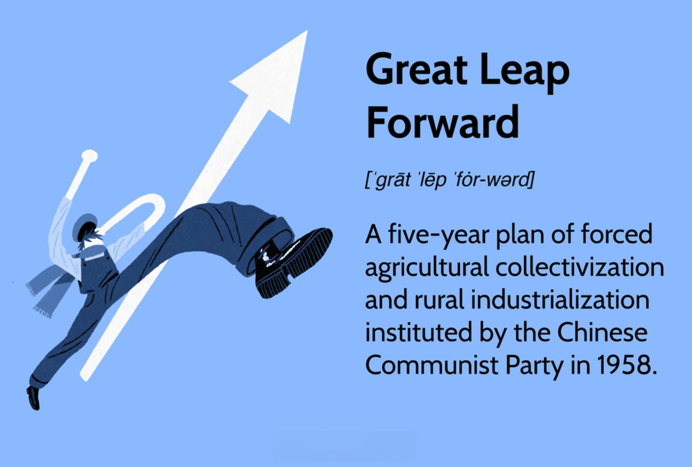

The Great Leap Forward, initiated by Mao Zedong, stands as a transformative chapter in Chinese history that reshaped its socio-economic landscape. During the late 1950s, China's leadership sought to transition the nation from an agrarian economy into an industrialized powerhouse. This ambition was manifested through an array of extensive policies that profoundly impacted the country's economic and social fabric. As China pursued rapid transformation, the Great Leap Forward became a complex tapestry of high aspirations and profound consequences.

The initiatives introduced during this period aimed at revolutionizing agricultural and industrial processes. The introduction of collective farming and small-scale industries were seen as means to accelerate development. However, the outcomes were not as anticipated and resulted in challenges that were both significant and tragic. The implications of these policies have left a lasting impression on China's historical narrative, casting a shadow that extends into contemporary discussions on economic policy and management.

This article seeks to unravel the details and ramifications of the Great Leap Forward. Moreover, it presents a unique comparison with the evolution of algorithmic trading in the modern era. By exploring this connection, the article provides a lens through which historical lessons can inform current economic strategies and technological progressions. There is an inherent linkage between past events and modern technological phenomena like algorithmic trading, offering invaluable insights for today's world.

The intersection of these historical and technological developments holds a rich repository of knowledge, demonstrating the importance of learning from historical experience while shaping future economic directions. Through careful analysis, this article will illuminate how historical context can guide the navigation of today's complex technological landscape.

## Table of Contents

## Understanding the Great Leap Forward

The Great Leap Forward, initiated in 1958 by the Chinese Communist Party under the leadership of Mao Zedong, was a transformative campaign with the intention of rapidly industrializing the country's agrarian economy. This ambitious campaign sought to mobilize China's rural population into communal farms and small-scale industries, an approach that diverged sharply from traditional agricultural practices.

A central strategy of the Great Leap Forward was the establishment of people's communes, which amalgamated individual landholdings into collective units intended to operate more efficiently and equitably. These communes were expected to serve as the primary organizational structure for providing education, healthcare, and other communal amenities. The aim was not only economic in nature but also ideological, reflecting the socialist ideals of collective ownership and production.

Another major aspect of the Great Leap Forward was the introduction of backyard furnaces. In an effort to propel China into a leading industrial nation, local communities were encouraged to produce steel at small-scale smelting operations. However, due to the lack of technical expertise and poor resource management, the quality of the steel produced was often substandard, rendering much of it useless for industrial purposes.

Despite the initial enthusiasm and hopes for increased industrial and agricultural output, the Great Leap Forward resulted in catastrophic failures. The state's overemphasis on industrial targets led to severe disruptions in agricultural production. Collectivization policies and the drive for intensive planting techniques further exacerbated the situation, causing widespread food shortages. Misguided policies, coupled with natural disasters, contributed to one of the most severe famines in modern history.

The human toll was immense. It is estimated that between 30 to 45 million people perished due to starvation, forced labor, and execution during the period of the Great Leap Forward. This humanitarian disaster was a direct consequence of the economic mismanagement and ideological zeal that characterized the campaign, marking it as one of the greatest tragedies in human history.

## The Economic Impact of the Great Leap Forward

The Great Leap Forward had profound effects on China's economy, resulting in significant challenges and disruptions. Initiated with the intent to rapidly industrialize China, the campaign prompted a dramatic contraction in economic output and severely disrupted traditional farming practices. The push for rapid industrialization led to numerous infrastructural projects, many of which proved to be of minimal utility. For instance, the establishment of backyard furnaces for steel production was a key policy of the campaign. However, these furnaces produced low-quality steel, often unfit for practical use, and diverted labor away from agriculture, contributing to food shortages.

The implementation of communal farming also disrupted traditional agricultural practices. Agricultural communes were expected to significantly increase output through collectivization. However, poor planning and the lack of incentives led to inefficiencies and widespread famine. It is estimated that between 30 to 45 million people died due to starvation, execution, and forced labor during this period (Dikötter, 2010).

Despite the immediate and devastating impact of the Great Leap Forward, some historians argue that its long-term effect was a stimulus for China's eventual industrial growth. The campaign underscored the critical need for practical and data-driven economic planning. It highlighted the pitfalls of centralized economic planning, which operated without the guidance of empirical data and often ignored localized conditions and expert input.

Mao's policies present a cautionary tale of the dangers associated with unrestrained political control over economic matters. The centralized decision-making process, coupled with the lack of accountability, meant that the campaigns pursued unrealistic targets without consideration of practical feasibility or the consequences of failure. In essence, the Great Leap Forward serves as an instructive example of how economic policies driven by ideological zeal rather than empirical evidence can lead to catastrophic outcomes. This period in Chinese history underscores the necessity for balanced approaches that consider both political objectives and economic realities, a lesson that remains relevant in contemporary economic strategy development.

## Algorithmic Trading: A Modern Economic Leap

In contrast to Mao's era, today's economic landscape has been significantly transformed by technological advancements, notably through the advent of [algorithmic trading](/wiki/algorithmic-trading). Algorithmic trading, often referred to as algo-trading, utilizes sophisticated computer algorithms to execute trades in financial markets. The primary advantage of this approach is its ability to process and analyze vast amounts of data quickly, enabling the execution of high-frequency trades that would be impossible for human traders to manage manually. 

At its core, algorithmic trading employs mathematical models and rules to make trading decisions. These algorithms are capable of processing multiple markets and executing orders at high speeds, thus optimizing trade strategies by identifying statistically profitable opportunities. This forward-thinking approach allows for a reduction in human error, potential improvements in profitability, and a more systematic trading method. For instance, algorithms can be programmed to buy or sell stocks when specific conditions are met, such as when certain price levels are reached or when moving averages cross over.

The automation inherent in algorithmic trading provides an opportunity for market participants to execute complex strategies with precision and efficiency. Strategies such as [market making](/wiki/market-making), [arbitrage](/wiki/arbitrage), and [trend following](/wiki/trend-following) can be seamlessly executed via automated systems, ensuring accuracy and speed while minimizing costs.

However, while the benefits are considerable, algorithmic trading is not without its challenges and risks. One prominent issue is the introduction of market [volatility](/wiki/volatility-trading-strategies). The speed and [volume](/wiki/volume-trading-strategy) of trades can lead to sudden and enormous shifts in market dynamics, as seen in incidents like the 2010 Flash Crash when the Dow Jones Industrial Average plummeted about 1,000 points within minutes before recovering. Such events often highlight the vulnerabilities within the high-speed trading framework.

Another critical consideration is the ethical implication of relying heavily on technology for financial transactions. The detachment between human judgment and algorithmic decision-making can lead to ethical dilemmas, particularly regarding fairness and equity in markets. Furthermore, the complexity of these algorithms can make it difficult to predict outcomes in unusual market conditions, presenting unforeseen risks to the financial system.

In conclusion, while algorithmic trading represents a modern economic leap akin to an industrial revolution in financial markets, it necessitates a balanced approach. Careful consideration and management of both the technological capabilities and the ethical constraints are essential to harness the full potential of algorithmic trading without exacerbating market risks. The intersection of technology and finance continues to evolve, pushing the boundaries of what economic systems can achieve when aligned with human oversight and strategic foresight.

## Lessons from History: Applying Historical Perspectives to Modern Practices

Drawing parallels between the Great Leap Forward and today's algorithmic trading highlights critical insights into the balance between ambition and caution in economic planning. The Great Leap Forward, characterized by its rapid industrialization ambitions, underscores the necessity of basing economic strategies on solid empirical data and cautious optimism. Mao Zedong's policies, which overlooked the practical realities of resource availability and agricultural capacity, resulted in catastrophic outcomes. This underscores the importance of robust data collection and analysis in the development of economic strategies.

Modern algorithmic trading, while technologically advanced, faces similar challenges. The algorithms used in financial markets must be meticulously designed and tested using historical data to ensure accuracy and avoid potential pitfalls such as market volatility. Historical events such as the Great Leap Forward illuminate the dangers of proceeding without sufficient empirical backing, a lesson crucial in algorithm development.

Appropriately leveraging technology is a recurrent theme across historical and modern practices. While technology can drive unprecedented economic transformations, it also bears risks that need careful navigation. For instance, algorithmic trading can enhance efficiency and profitability but may induce rapid market fluctuations due to factors like algorithmic errors or flash crashes. Therefore, policy-makers and technologists must weigh these potential benefits against possible drawbacks, vigilantly monitoring for unintended consequences.

Reflecting on the lessons from the Great Leap Forward can prevent the repetition of past errors in the technological domain. It underscores the necessity for adaptive economic policies that accommodate changes and uncertainties. In algorithmic trading, adopting measures such as rigorous testing, scenario analysis, and regulatory oversight can foster innovation while ensuring stability. This balanced approach ensures that the drive for technological advancement does not repeat the mistakes of history but instead builds on them to forge better practices.

Ultimately, the evolution of economic strategies benefits from a historical perspective, applying past learnings to current innovations. This synthesis aids in crafting a more sustainable and adaptable economic framework, vital for integrating cutting-edge technology with prudent strategy development.

## Conclusion

The Great Leap Forward stands as a significant reminder of the complexities and potential pitfalls associated with policy-driven economic transformation. Initiated with ambitious goals, it ultimately resulted in unintended consequences, underscoring the necessity for careful strategic planning. This historical event accentuates the importance of aligning economic ambitions with practical, empirical data and realistic objectives. The catastrophic outcomes serve as a valuable testament to the dangers of untested policies driven by political imperatives rather than data-driven insights.

In modern economic practices, particularly algorithmic trading, the lessons from the Great Leap Forward are vital. These lessons highlight the need for caution and rigorous analysis. Algorithmic trading, while a testament to technological advancement and efficiency, brings its own set of risks. The rapid evolution and automation in financial markets demand meticulous management to mitigate potential negative impacts such as market instability. Just as policy errors in the past led to human and economic costs, unmonitored technological advances could produce similar risks.

Maintaining a connection with historical understanding is crucial as society navigates technological progress. History provides context, helping identify patterns that can inform the development of robust, adaptable economic policies that anticipate and accommodate rapid changes. By integrating historical insights with contemporary practices, decision-makers are better equipped to anticipate challenges, ensuring that new technologies contribute positively to economic sustainability.

The intersection between historic events like the Great Leap Forward and modern technologies such as algorithmic trading plays a pivotal role in shaping contemporary strategic decision-making. This synthesis informs a more comprehensive approach to economic planning, fostering innovation while avoiding past errors. History and technology together can guide a strategy that not only seeks progress but also recognizes the potential for unforeseen outcomes, striving for a balanced and sustainable economic future.

## References & Further Reading

[1]: Dikötter, F. (2010). ["Mao's Great Famine: The History of China's Most Devastating Catastrophe, 1958-62."](https://academic.oup.com/ahr/article/117/5/1565/42569) Walker & Company.

[2]: Courtois, S., Werth, N., Panné, J.-L., Paczkowski, A., Bartošek, K., & Margolin, J.-L. (1999). ["The Black Book of Communism: Crimes, Terror, Repression."](https://www.hup.harvard.edu/books/9780674076082) Harvard University Press.

[3]: Jansen, S. (2018). ["Machine Learning for Algorithmic Trading: Predictive models to extract signals from market and alternative data for systematic trading strategies with Python."](https://www.amazon.com/Machine-Learning-Algorithmic-Trading-alternative/dp/1839217715) Packt Publishing.

[4]: Chan, E. P. (2009). ["Quantitative Trading: How to Build Your Own Algorithmic Trading Business."](https://github.com/ftvision/quant_trading_echan_book) Wiley.

[5]: Lopez de Prado, M. (2018). ["Advances in Financial Machine Learning."](https://www.amazon.com/Advances-Financial-Machine-Learning-Marcos/dp/1119482089) Wiley.

[6]: Aronson, D. R., & Masters, T. (2006). ["Evidence-Based Technical Analysis: Applying the Scientific Method and Statistical Inference to Trading Signals."](https://www.amazon.com/Evidence-Based-Technical-Analysis-Scientific-Statistical/dp/0470008741) Wiley.