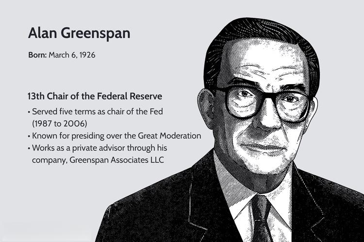

## Table of Contents

## What is the Great Moderation?

The Great Moderation refers to a period of time from the mid-1980s to the mid-2000s when the economy in the United States and other countries was very stable. During this time, there were fewer ups and downs in the economy, and things like inflation and unemployment stayed pretty steady. This stability made life easier for people and businesses because they could plan better without worrying about big economic changes.

Economists have different ideas about why the Great Moderation happened. Some think it was because of better economic policies, like how central banks managed interest rates. Others believe that it was due to luck, with fewer big shocks hitting the economy. There's also a view that businesses got better at managing their risks, which helped keep the economy on an even keel. However, the Great Moderation ended with the financial crisis in 2007-2008, showing that even long periods of stability can be followed by big problems.

## When did the Great Moderation occur?

The Great Moderation happened from the middle of the 1980s until around the middle of the 2000s. This was a time when the economy in the United States and other places was very stable. There were fewer big ups and downs, and things like inflation and unemployment didn't change much. This made life easier for people and businesses because they could plan better without worrying about big economic changes.

Economists have different ideas about why the Great Moderation happened. Some think it was because of better ways of managing the economy, like how central banks set interest rates. Others believe it was just good luck, with fewer big shocks hitting the economy. There's also a view that businesses got better at managing risks, which helped keep the economy steady. But the Great Moderation ended with the big financial crisis in 2007-2008, showing that even long periods of stability can be followed by big problems.

## What are the main characteristics of the Great Moderation?

The Great Moderation was a time when the economy was very stable. It lasted from the mid-1980s to the mid-2000s. During this time, there were fewer big changes in the economy. Things like inflation and unemployment stayed pretty steady. This made life easier for people and businesses because they could plan better without worrying about big economic changes.

Economists have different ideas about why the Great Moderation happened. Some think it was because of better ways of managing the economy, like how central banks set interest rates. Others believe it was just good luck, with fewer big shocks hitting the economy. There's also a view that businesses got better at managing risks, which helped keep the economy steady.

But the Great Moderation ended with the big financial crisis in 2007-2008. This showed that even long periods of stability can be followed by big problems. The end of the Great Moderation reminded everyone that the economy can still have big ups and downs, even after a long time of being stable.

## What economic indicators were used to identify the Great Moderation?

The Great Moderation was identified by looking at several key economic indicators. One main indicator was the reduced [volatility](/wiki/volatility-trading-strategies) in GDP growth. This means that the ups and downs in how much the economy grew each year were smaller than before. Another important indicator was lower inflation rates. During the Great Moderation, inflation didn't go up and down as much as it used to, which helped keep prices more stable for everyone.

Unemployment rates were also more stable during this time. Instead of big swings in how many people were out of work, unemployment stayed pretty steady. This made it easier for people to plan their lives and for businesses to make decisions. Economists also looked at how much consumer spending and business investments changed. These were less volatile too, meaning people and companies were spending and investing at a more even pace.

These indicators together showed that the economy was experiencing a period of unusual stability. From the mid-1980s to the mid-2000s, the economy had fewer big shocks and surprises. This period of calm ended with the financial crisis in 2007-2008, which reminded everyone that even long periods of stability can be followed by big economic problems.

## What are the proposed causes of the Great Moderation?

Economists have different ideas about what caused the Great Moderation. Some think it was because of better economic policies. For example, central banks got better at managing interest rates, which helped keep inflation low and steady. Also, governments used better ways to control the economy, like making sure businesses and people had the right information to make good choices. These policies helped make the economy more stable and predictable.

Others believe the Great Moderation was just a lucky time with fewer big shocks hitting the economy. There were fewer sudden events like oil price spikes or financial crises that could shake things up. Some economists also think that businesses got better at managing risks. They used new tools and strategies to protect themselves from economic ups and downs, which helped keep the economy on an even keel.

But even with all these ideas, the Great Moderation ended with the big financial crisis in 2007-2008. This showed that even long periods of stability can be followed by big problems. It's a reminder that the economy can still have big ups and downs, even after a long time of being stable.

## How did monetary policy contribute to the Great Moderation?

Monetary policy played a big role in the Great Moderation. Central banks, like the Federal Reserve in the United States, got better at managing interest rates. They used these rates to control inflation and keep the economy stable. When inflation started to go up, they would raise interest rates to slow things down. When the economy needed a boost, they would lower rates to encourage spending and investment. This careful balancing act helped keep prices and economic growth steady over the years.

Another way monetary policy helped was by making the economy more predictable. People and businesses could trust that central banks would act to keep things stable. This trust made it easier for everyone to plan for the future. They knew that if something unexpected happened, the central bank would step in to fix it. This confidence helped reduce the big ups and downs in the economy, leading to the stability seen during the Great Moderation.

## What role did technological advancements play in the Great Moderation?

Technological advancements played a big part in the Great Moderation by helping businesses manage their risks better. With new technology, companies could use better tools to predict and handle economic changes. For example, they used computers and software to analyze data and make smarter decisions. This helped them avoid big losses and keep their businesses running smoothly, even when the economy was shaky. By managing risks better, businesses helped keep the economy more stable during the Great Moderation.

Another way technology helped was by making it easier for people and businesses to share information. With the internet and other communication tools, everyone could get news and data quickly. This meant they could react faster to changes in the economy. When people and businesses had better information, they could make better choices about spending and investing. This sharing of information helped keep the economy on an even keel, contributing to the stability seen during the Great Moderation.

## How did globalization influence the Great Moderation?

Globalization helped make the economy more stable during the Great Moderation. It did this by spreading out the risks that businesses faced. When companies started doing business all over the world, they could sell their products in many different countries. If one country's economy was doing badly, they could still make money in other places. This helped keep their profits steady and made the whole economy less likely to have big ups and downs.

Another way globalization helped was by making it easier for countries to trade with each other. When countries traded more, they could get the things they needed from other places. This made their economies stronger and more stable. For example, if a country didn't have enough oil, it could buy it from another country. This kind of trade helped keep prices steady and made the economy more predictable during the Great Moderation.

## What were the criticisms and controversies surrounding the concept of the Great Moderation?

Some people didn't agree with the idea of the Great Moderation. They said it made people too relaxed about the economy. Because things were so stable for a long time, people thought the good times would last forever. But this wasn't true. The financial crisis in 2007-2008 showed that even when the economy seems stable, big problems can still happen. Critics said that the Great Moderation might have made people and businesses take too many risks, thinking nothing bad would happen.

Another criticism was about how the Great Moderation was measured. Some economists said that looking at just a few numbers, like GDP growth and inflation, didn't tell the whole story. They thought that other parts of the economy, like income inequality, were getting worse even during the Great Moderation. This meant that while some people were doing well, others were struggling. Critics argued that focusing only on stability missed these important issues and gave a false sense of how well the economy was doing.

## How did the Great Moderation affect different sectors of the economy?

The Great Moderation made life easier for many sectors of the economy. For businesses, the stable economy meant they could plan better. They knew that things like interest rates and inflation wouldn't change much, so they could make long-term plans without worrying about big surprises. This stability helped businesses grow and invest more, which was good for the economy. In the housing sector, steady interest rates made it easier for people to get loans and buy homes. This led to more construction and jobs in the housing industry. For the financial sector, the calm economy meant fewer big shocks, so banks and investors could take on more risk without fearing sudden changes.

However, not all sectors benefited equally from the Great Moderation. Some industries, like manufacturing, faced challenges because of globalization. Even though the economy was stable, competition from other countries made it hard for some companies to keep up. This meant that some workers in these sectors might have lost their jobs or had to accept lower wages. In the labor market, while unemployment was stable, the benefits of the Great Moderation were not shared equally. Some workers saw their incomes grow, but others didn't see much improvement. This led to a growing gap between the rich and the poor, even during this time of economic stability.

## What were the implications of the Great Moderation for economic theory and policy?

The Great Moderation changed how economists thought about the economy. It made them believe that they could use tools like interest rates to keep things stable. This led to a focus on something called "inflation targeting," where central banks tried to keep inflation at a certain level. Economists also started to think that the economy was less likely to have big ups and downs, which made them more confident about using policies to control it. But the financial crisis in 2007-2008 showed that even with all these tools, big problems could still happen. This made economists rethink their ideas and look for new ways to understand and manage the economy.

The Great Moderation also changed how policymakers made decisions. During this time, they felt more sure about using economic policies to guide the economy. They thought they could keep things calm and predictable, which made them more willing to try different policies. But after the financial crisis, policymakers realized that they needed to be ready for big shocks. They started to think more about how to protect the economy from sudden changes and how to make sure everyone benefited from growth, not just a few. This led to new ideas about how to make the economy stronger and more fair for everyone.

## How did the end of the Great Moderation impact the global economy?

The end of the Great Moderation had a big impact on the global economy. It ended with the financial crisis in 2007-2008, which started in the United States but quickly spread to other countries. Banks and businesses around the world lost a lot of money, and many people lost their jobs. This made the economy very unstable, with big ups and downs that were much worse than during the Great Moderation. Countries had to work together to try and fix the problems, but it took a long time for things to get better.

After the financial crisis, people and businesses were more careful about taking risks. They remembered how bad things got when the economy was unstable, so they were less likely to borrow money or invest in new projects. Governments and central banks also changed how they managed the economy. They started to focus more on preventing big shocks and making sure the economy could handle surprises. This led to new rules and policies that aimed to make the economy stronger and more stable, but it also meant that growth was slower and more cautious than during the Great Moderation.

## References & Further Reading

[1]: Bernanke, B. S. (2004). ["The Great Moderation."](https://www.federalreserve.gov/boarddocs/speeches/2004/20040220/) Remarks at the meetings of the Eastern Economic Association, Washington, DC.

[2]: Diebold, F. X., & Rudebusch, G. D. (1996). "Measuring Business Cycles: A Modern Perspective." The Review of Economics and Statistics, 78(1), 67-77.

[3]: Lopez de Prado, M. (2018). ["Advances in Financial Machine Learning."](https://www.amazon.com/Advances-Financial-Machine-Learning-Marcos/dp/1119482089) Wiley.

[4]: Chan, E. P. (2009). ["Quantitative Trading: How to Build Your Own Algorithmic Trading Business."](https://github.com/egorpe/EPChan-QuantitativeTrading/blob/master/example7_6.m) Wiley.

[5]: Aronson, D. R. (2006). ["Evidence-Based Technical Analysis: Applying the Scientific Method and Statistical Inference to Trading Signals."](https://www.amazon.com/Evidence-Based-Technical-Analysis-Scientific-Statistical/dp/0470008741) Wiley.

[6]: McConnell, M. M., & Perez-Quiros, G. (2000). "Output Fluctuations in the United States: What Has Changed Since the Early 1980's?" American Economic Review, 90(5), 1464-1476.

[7]: Jansen, S. (2020). ["Machine Learning for Algorithmic Trading."](https://github.com/stefan-jansen/machine-learning-for-trading) Packt Publishing.