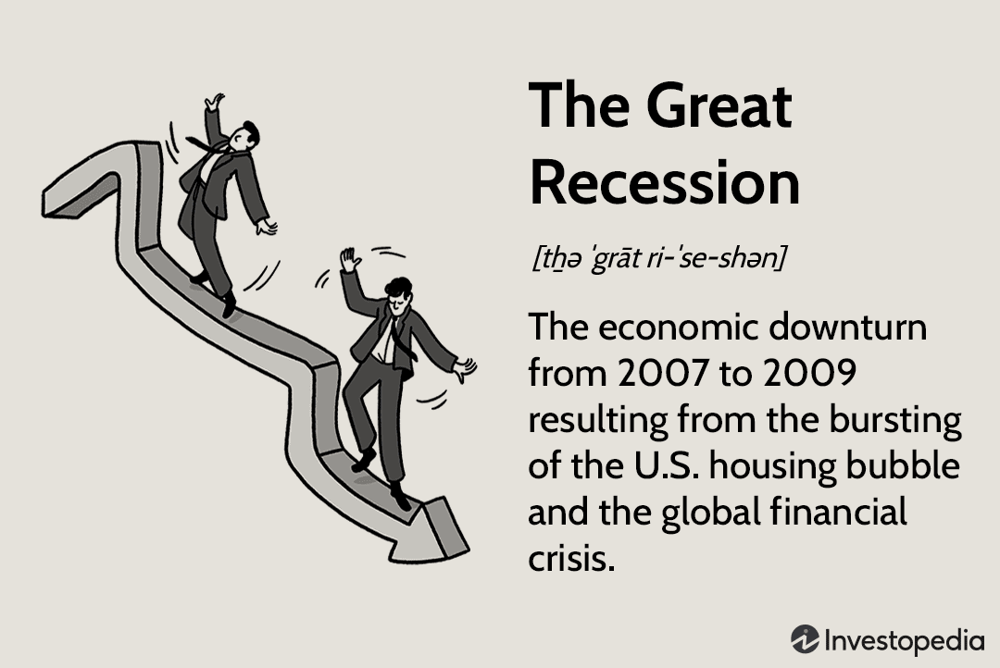

Economic downturns and financial crises have long been subjects of significant interest and investigation. These events, which often manifest as recessions or depressions, can have far-reaching effects on global financial markets and economies. The Great Recession, which began in 2007, serves as a poignant example of how these downturns can lead to systemic financial distress and highlight vulnerabilities within economic structures.

A recession is typically defined as a period during which a country's GDP declines for two or more consecutive quarters, often resulting in reduced consumer spending, business investment, and overall economic activity. On the other hand, a depression is a more severe and prolonged economic downturn, characterized by extreme reductions in economic output and high unemployment rates. The Great Recession, often cited for its severe impact, was precipitated by the collapse of the housing bubble in the United States, leading to a global financial crisis exacerbated by institutional weaknesses and excessive risk-taking.



Algorithmic trading has emerged as a pivotal force within financial markets, particularly in scenarios marked by high volatility. This form of trading employs pre-programmed algorithms to execute transactions at speeds and volumes unattainable by human traders. During economic downturns, algorithmic trading plays a dual role—its speed and efficiency can enhance liquidity and stabilize markets, yet it also possesses the potential to amplify market instability through rapid and massive sell-offs, as evidenced by events like the Flash Crash of 2010.

Understanding these phenomena is crucial for investors aiming to craft resilient investment strategies and for policymakers tasked with maintaining economic stability. Examining the interplay between economic downturns, financial crises, and algorithmic trading allows stakeholders to assess risks better, predict future crises, and safeguard financial systems against unforeseen disruptions. By expanding our knowledge in these areas, we can develop more robust frameworks, ensuring economic resilience and fostering a stable global financial environment.

## Table of Contents

## Understanding Economic Downturns and Financial Crises

Economic downturns and financial crises are critical phenomena with significant impacts on economies worldwide. To understand these occurrences, it is essential to define and differentiate between terms such as 'recession' and 'depression.' 

A recession is typically defined as a period of temporary economic decline during which trade and industrial activities are reduced, generally identified by a fall in Gross Domestic Product (GDP) in two successive quarters. Recessions are part of the economic cycle and may involve rising unemployment, decreased consumer spending, and a decline in business investment.

In contrast, a depression is a more severe and prolonged downturn. It is characterized by a significant decline in economic activity across the economy, lasting for years rather than just a few quarters. Depressions involve a sharp drop in GDP, widespread unemployment, and deflation or severe inflation.

The Great Recession, which began in December 2007, is a prominent example of how financial crises are interconnected with economic downturns. It originated in the United States due to the bursting of the housing bubble, leading to a global financial meltdown. A combination of factors such as excessive risk-taking by financial institutions, failures in regulatory frameworks, and the complex interplay of global financial markets exacerbated the crisis. 

During such crises, the credit flow ceases, leading to a [liquidity](/wiki/liquidity-risk-premium) shortage. Businesses struggle to operate due to decreased access to financing, while consumers cut back on spending, further reducing demand. These factors contribute to a feedback loop that deepens the economic downturn.

Financial crises and economic downturns can significantly affect global economies by distorting market dynamics, impacting currency values, and reducing investor confidence. Understanding these phenomena is crucial for policymakers and investors to prepare and mitigate such adverse effects in the future.

## The Great Recession: A Case Study

The Great Recession, which began in December 2007 and lasted until June 2009, was a severe global economic crisis precipitated by the collapse of financial institutions, declines in consumer wealth, and disruptions in global markets. One of the primary catalysts for the recession was the bursting of the housing bubble in the United States. During the early 2000s, housing prices soared, driven by speculative investments and easy access to credit facilitated by low-interest rates and subprime lending. Financial institutions provided mortgages to borrowers with poor credit histories, under the expectation that housing prices would continue to rise.

The housing bubble's growth was further fueled by the securitization of mortgage debt. Mortgages were bundled into complex financial instruments known as mortgage-backed securities (MBS) and collateralized debt obligations (CDOs). These instruments, presented as low-risk investments, were sold to investors worldwide. When home prices began to fall, it led to widespread mortgage defaults, revealing the underlying vulnerabilities in these financial products. Financial institutions holding significant amounts of MBS and CDOs faced substantial losses, leading to a liquidity crisis.

Regulatory failures played a crucial role in exacerbating the crisis. Financial institutions engaged in excessive risk-taking, fueled by insufficient oversight and lax regulatory standards. The shadow banking system, which operated outside traditional regulatory frameworks, grew significantly in size, contributing to systemic risks. Furthermore, credit rating agencies assigned high ratings to risky securities, underestimating the potential for widespread defaults. This misjudgment by credit rating agencies played a significant role in the proliferation of risky financial products.

The credit crisis peaked when major financial institutions such as Lehman Brothers collapsed, triggering a panic in global financial markets. The resulting liquidity shortage led to the contraction of credit, causing a cascade of negative effects on the economy, including rising unemployment, declining consumer spending, and a contraction in GDP.

The aftermath of the Great Recession has had a long-lasting impact on economic policy and financial regulation. Governments worldwide implemented unprecedented fiscal and monetary policies to stabilize the financial system. In the United States, initiatives like the Troubled Asset Relief Program (TARP) and aggressive monetary policies by the Federal Reserve, such as lowering interest rates and quantitative easing, were employed to restore economic stability. On the regulatory front, measures were taken to increase oversight and mitigate systemic risks, including the Dodd-Frank Wall Street Reform and Consumer Protection Act aimed at preventing future crises by enhancing transparency and accountability in the financial system.

In conclusion, the Great Recession serves as a critical case study of the interplay between rising asset bubbles, regulatory failures, and systemic risk in global financial markets. It highlights the importance of sound risk management practices and robust regulatory frameworks in maintaining financial stability.

## Impact on Financial Markets

Financial crises have substantial effects on global financial markets, often leading to increased market [volatility](/wiki/volatility-trading-strategies), shaken investor confidence, and fluctuations in asset valuations. 

Market volatility tends to surge during financial crises as uncertainty surrounding economic conditions and corporate earnings mounts. Volatility indices, like the VIX in the United States, often reflect these heightened levels of uncertainty, which are indicative of investor sentiment regarding market risk. Though historically, periods of high volatility may present investment opportunities, they also lead to unpredictable price swings that can deter participation from risk-averse investors.

Investor confidence is significantly impacted during economic downturns. As financial instability escalates, investors often become more cautious, opting for safer assets or withdrawing from markets altogether. This behavioral shift can lead to decreased market liquidity, further exacerbating volatility. The erosion of confidence can result in prolonged periods of economic stagnation as consumers and businesses reduce spending and investments.

Asset valuations are directly influenced in times of economic distress. Equity markets often experience declines as companies face reduced earnings prospects and increased default risk. The valuation of fixed-income securities may also be affected by changes in interest rates and credit spreads, as investors reassess the risk/reward profiles of different asset classes. Additionally, downturns can lead to systemic reassessments of risk, impacting the valuations of complex financial instruments.

Central banks and governments play a pivotal role in stabilizing financial markets during crises. Central banks often implement monetary policy adjustments, such as lowering interest rates or engaging in quantitative easing, to inject liquidity and encourage lending. For example, during the Great Recession, central banks in advanced economies reduced policy rates aggressively and adopted unconventional monetary policy tools to restore stability. Governments may also introduce fiscal stimulus measures to support economic activity and bolster confidence. Regulatory frameworks might be adjusted to ensure liquidity and prevent systemic risks, as seen with the introduction of measures like the Basel III standards for banking practices.

Overall, understanding the dynamic interactions between financial crises and market responses is crucial for both investors and policymakers. This knowledge guides the development of strategies tailored to mitigate risks and support recovery efforts in turbulent times.

## Algorithmic Trading: An Evolving Landscape

Algorithmic trading, a subset of automated trading systems, leverages advanced algorithms and high-speed data processing to execute trades at speeds and frequencies that human traders cannot achieve. This trading method has gained prominence in modern financial markets due to its ability to process vast amounts of data efficiently, identify patterns, and execute trades with minimal human intervention.

At its core, [algorithmic trading](/wiki/algorithmic-trading) relies on pre-defined strategies encoded into algorithms that can automatically decide aspects of trading such as timing, price, and quantity. These algorithms typically employ sophisticated mathematical models and statistical analyses to identify trading opportunities, optimize execution, and manage risk. 

Technology forms the backbone of algorithmic trading, with high-frequency trading ([HFT](/wiki/high-frequency-trading-strategies)) being one of the most prominent forms. HFT firms utilize state-of-the-art technology, including colocated servers, to minimize latency and maximize the speed of order execution. This technological edge allows for [arbitrage](/wiki/arbitrage) opportunities and the exploitation of minute price discrepancies in the market.

Key strategies in algorithmic trading include [statistical arbitrage](/wiki/statistical-arbitrage), [trend following](/wiki/trend-following), mean reversion, and market-making strategies. Statistical arbitrage involves profiting from price inefficiencies between securities, while trend following seeks to capitalize on the [momentum](/wiki/momentum) of market trends. Mean reversion strategies assume that prices will revert to a historical mean, allowing traders to buy low and sell high. Market-making involves providing liquidity to the market by simultaneously quoting bid and ask prices.

The advent of algorithmic trading has significantly altered trading dynamics, particularly during periods of market volatility. Algorithms can react to market conditions faster than human traders, often leading to increased market liquidity and tighter bid-ask spreads. However, this speed and efficiency can also contribute to heightened volatility. For instance, during volatile market conditions, algorithms may trigger a cascade of orders, exacerbating price swings and rendering markets tumultuous.

Real-world examples such as the Flash Crash of 2010 illustrate the dual-edged nature of algorithmic trading. During the Flash Crash, the Dow Jones Industrial Average plunged nearly 1,000 points within minutes, partially attributed to high-frequency trading algorithms reacting to and amplifying market movements. While algorithmic trading can enhance market efficiency and liquidity, it also necessitates robust risk management and regulatory frameworks to mitigate potential destabilizing effects.

In conclusion, algorithmic trading has revolutionized financial markets, providing a blend of heightened efficiency and complexity. Its implications on market structures and volatility underscore the importance for investors and policymakers to grasp its dynamics in order to harness its benefits while safeguarding market stability.

## Algorithmic Trading During Economic Downturns

Algorithmic trading, a practice that uses computer algorithms to automate trading decisions and executions, plays a significant role in shaping financial markets, particularly during periods of economic downturns. The ability of these algorithms to process vast amounts of data and execute trades at high speeds presents both opportunities and risks for market stability.

### Stabilizing Potential of Algorithmic Trading

During economic downturns, the increased market volatility can lead to heightened trading activity. Algorithmic trading can enhance market stability by providing liquidity, which is crucial when investor confidence wanes. Algorithms can quickly react to price changes, ensuring that buyers and sellers can find counter-parties more efficiently. This constant influx of liquidity helps reduce bid-ask spreads, minimizing costs for traders and potentially dampening excessive price swings.

Moreover, algorithmic trading systems often incorporate sophisticated risk management and arbitrage strategies. These algorithms identify mispriced assets and perform arbitrage trades that, in theory, should help align prices with their fundamental values more quickly, contributing to market efficiency even in turbulent periods.

### Destabilizing Potential of Algorithmic Trading

Conversely, algorithmic trading can also introduce instability, particularly when algorithms react to the same market signals simultaneously. This synchronous behavior can exacerbate market movements, resulting in rapid price declines or spikes—phenomena known as "herding". When many algorithms attempt to sell or buy large volumes at once, the liquidity they aim to provide can quickly evaporate, creating severe market disruptions.

A notable example of such destabilization occurred during the Flash Crash on May 6, 2010. On that day, U.S. financial markets experienced a dramatic and rapid decline in prices before quickly recovering. Investigations revealed that algorithmic trading played a crucial role in this event. A large sell order triggered a cascade of selling algorithms to react, amplifying the downturn and evaporating liquidity momentarily. This incident highlighted the potential for algorithms to contribute to systemic risk, particularly when trade execution speed surpasses the market's capacity to absorb rapid changes.

### Example: The Flash Crash

The Flash Crash serves as a prominent case study illustrating the dual nature of algorithmic trading during economic downturns. During the crash, the actions of a single market participant's algorithm cascaded into a liquidity crisis, causing the Dow Jones Industrial Average to plunge about 1,000 points in minutes. This rapid sequence of trades reveals the challenges inherent in ensuring algorithms have the necessary checks to prevent cascading errors. 

Code Example:

```python
# Example of a basic algorithmic trading model using a moving average strategy
import pandas as pd
import numpy as np

def moving_average_strategy(prices, window=20):
    """
    Implement a simple moving average strategy.
    :param prices: pd.Series or list of price data.
    :param window: int, number of periods for the moving average.
    :return: list of signals (1 for buy, -1 for sell, 0 for hold)
    """
    signals = [] 
    moving_avg = prices.rolling(window=window).mean()

    for i in range(len(prices)):
        if prices[i] > moving_avg[i]:
            signals.append(-1)  # Sell Signal
        elif prices[i] < moving_avg[i]:
            signals.append(1)   # Buy Signal
        else:
            signals.append(0)   # Hold

    return signals

# Example price data
price_data = pd.Series(np.random.random(100) * 100)

signals = moving_average_strategy(price_data)

print(signals)
```

This example illustrates the fundamental premise of algorithmic strategies—automation based on predefined rules, which in extended forms can result in large-scale market impacts depending on how different algorithms are designed to react to each other's movements.

In conclusion, while algorithmic trading can dampen some adverse effects of economic downturns through liquidity provision and market efficiency enhancements, it also bears the risk of inducing volatility through synchronized actions. The case of the Flash Crash underscores the need for comprehensive oversight and robust checks within algorithmic systems to mitigate potential systemic risks.

## Can Algorithmic Trading Predict Economic Downturns?

Algorithmic trading has gained prominence in the financial sector due to its ability to process vast amounts of data at high speeds, making it a potential tool for predicting economic downturns. This ability hinges on the integration of big data, [artificial intelligence](/wiki/ai-artificial-intelligence) (AI), and [machine learning](/wiki/machine-learning) (ML) to analyze intricate patterns and correlations within financial markets.

Big data is central to these predictive capabilities as it comprises extensive datasets that include economic indicators, market trends, social media sentiment, and geopolitical events. The sheer [volume](/wiki/volume-trading-strategy) and variety of these datasets enable algorithms to potentially identify early warning signs of economic instability. For instance, the aggregation of data on consumer spending, manufacturing indices, and employment figures can offer insights into economic health.

AI and ML enhance the processing and analysis of big data by applying algorithms that learn and adapt over time. Machine learning models, such as neural networks and ensemble methods, are trained to recognize complex patterns and make predictions. Neural networks, particularly [deep learning](/wiki/deep-learning) models, can uncover non-linear relationships in data that traditional statistical methods might miss. Here is a simple Python example of a [neural network](/wiki/neural-network) prediction model using a framework such as TensorFlow:

```python
import tensorflow as tf
from tensorflow import keras
import numpy as np

# Sample data: economic indicators (for illustration purposes)
X_train = np.random.rand(1000, 10)  # 1000 samples, 10 features
y_train = np.random.rand(1000, 1)   # 1000 target values

# Define a simple neural network model
model = keras.Sequential([
    keras.layers.Dense(64, activation='relu', input_shape=(10,)),
    keras.layers.Dense(64, activation='relu'),
    keras.layers.Dense(1)
])

# Compile the model
model.compile(optimizer='adam', loss='mean_squared_error')

# Train the model
model.fit(X_train, y_train, epochs=50, batch_size=32)

# Use the model to make predictions
predictions = model.predict(X_train)

print(predictions[:5])  # Displaying the first 5 predictions
```

Despite the potential of algorithmic trading to foresee downturns, there are noteworthy challenges and limitations. One significant limitation is the inherent unpredictability of financial markets, often influenced by unforeseen events such as political changes or natural disasters. Additionally, the complexity and dynamic nature of financial systems mean that past data might not always be an accurate predictor of future events.

There is also a risk that algorithms trained on historical data may fail to generalize to new market conditions, leading to inaccurate predictions. This limitation is compounded by the potential for overfitting, where models learn patterns in the training data that do not actually generalize to unseen data. Furthermore, reliance on algorithmic predictions could exacerbate volatility during times of market stress if many traders or fund managers utilize similar models, leading to synchronized buying or selling.

While big data, AI, and ML offer promising tools for enhancing the predictive capabilities of algorithmic trading, the effective prediction of economic downturns remains a complex challenge. The dynamic and multifaceted nature of global economics necessitates a cautious approach, blending algorithmic insights with expert judgment and robust risk management strategies.

## Future Prospects of Algorithmic Trading

As financial markets continue to evolve, algorithmic trading is poised to play an increasingly influential role, particularly as we account for future economic downturns and potential depressions. The development of AI and machine learning technologies stands at the forefront of this evolution, offering enhanced capabilities that could dramatically improve the effectiveness of algorithmic trading. These advancements enable the analysis of vast datasets to uncover insights and patterns that humans may overlook, potentially leading to better trading decisions and more accurate market predictions.

One significant advancement is the use of machine learning algorithms, such as neural networks and [reinforcement learning](/wiki/reinforcement-learning). These models can analyze historical and real-time data to predict market trends, adapting to new information with minimal human intervention. Python, a popular programming language in data science, provides various libraries like TensorFlow and Keras for implementing these complex models. An example of a basic neural network for predicting stock prices may look like this:

```python
import numpy as np
from keras.models import Sequential
from keras.layers import Dense, LSTM
from sklearn.preprocessing import MinMaxScaler

# Sample data
data = np.random.rand(1000, 1) 

# Scale data
scaler = MinMaxScaler(feature_range=(0, 1))
scaled_data = scaler.fit_transform(data)

# Model architecture
model = Sequential()
model.add(LSTM(50, return_sequences=True, input_shape=(1, 1)))
model.add(LSTM(50, return_sequences=False))
model.add(Dense(25))
model.add(Dense(1))

# Compile the model
model.compile(optimizer='adam', loss='mean_squared_error')
```

Such models can optimize trading strategies by predicting price movements with improved accuracy. However, the predictive power of these algorithms should not be overstated. While they offer significant advantages, they are not infallible. The complexity and chaos inherent in financial markets mean there's always a degree of unpredictability that even the most sophisticated algorithms cannot eliminate.

Amidst these technological advancements, regulatory frameworks play a crucial role in ensuring the stability and integrity of financial markets. Algorithmic trading, particularly high-frequency trading, can exacerbate market volatility, as demonstrated by events like the 2010 Flash Crash. To mitigate such risks, regulatory bodies may design systems to enforce circuit breakers, ensure sufficient liquidity, and set limits on the trading speed and volume executed by algorithms.

As we look to the future, it becomes increasingly important for regulators to update policies in line with technological advancements. This includes collaboration across international borders to address the global nature of modern financial systems. Enhanced regulatory frameworks can help protect against systemic risks while allowing the benefits of algorithmic trading to be fully realized.

In conclusion, the prospective landscape of algorithmic trading is intricately linked with technological advancements and the robustness of regulatory frameworks. By leveraging AI and machine learning while maintaining vigilant regulatory oversight, algorithmic trading can contribute to more efficient and stable financial markets, even during potential economic downturns.

## Conclusion

The complex interplay between economic downturns, financial crises, and algorithmic trading reveals crucial insights for understanding and enhancing financial stability. It emphasizes the necessity for investors, policymakers, and financial institutions to deeply comprehend these elements. Historically, economic downturns have demonstrated their capacity to disrupt financial systems, leading to crises characterized by asset devaluation, diminished investor confidence, and increased market volatility. The Great Recession serves as a poignant example, illustrating how poor regulatory oversight and excessive risk-taking precipitated a global financial meltdown.

Algorithmic trading has become increasingly significant within financial markets, especially amid economic volatility. Its influence, both stabilizing and destabilizing, underscores the need for a nuanced understanding of its mechanisms and impacts. The Flash Crash of 2010 exemplifies how sophisticated trading algorithms can trigger rapid market movements, highlighting potential risks. Conversely, algorithmic trading also offers benefits, such as enhanced market liquidity and efficiency.

The potential of algorithmic trading to predict economic downturns is a topic of considerable interest. With advancements in big data, AI, and machine learning, the predictive capacities of these algorithms have increased. Nevertheless, challenges such as data quality, model accuracy, and inherent market unpredictability pose significant limitations.

Looking forward, the future of algorithmic trading in periods of economic distress hinges on continued technological progress and the establishment of comprehensive regulatory frameworks. Such measures are critical in mitigating risks while optimizing the benefits of algorithmic strategies. The ongoing development of AI and machine learning can potentially revolutionize trading practices, offering innovative strategies for managing financial crises.

In summary, the interaction between economic downturns, financial crises, and algorithmic trading necessitates ongoing research and exploration. Understanding these dynamics is vital for crafting robust financial strategies and ensuring systemic resilience. As algorithmic trading becomes increasingly prevalent, it remains imperative to leverage its capabilities responsibly, guided by insights from past experiences and technological advancements.

## References & Further Reading

[1]: Bergstra, J., Bardenet, R., Bengio, Y., & Kégl, B. (2011). ["Algorithms for Hyper-Parameter Optimization."](https://papers.nips.cc/paper/4443-algorithms-for-hyper-parameter-optimization) Advances in Neural Information Processing Systems 24.

[2]: ["Advances in Financial Machine Learning"](https://www.amazon.com/Advances-Financial-Machine-Learning-Marcos/dp/1119482089) by Marcos Lopez de Prado

[3]: ["Evidence-Based Technical Analysis: Applying the Scientific Method and Statistical Inference to Trading Signals"](https://www.amazon.com/Evidence-Based-Technical-Analysis-Scientific-Statistical/dp/0470008741) by David Aronson

[4]: ["Machine Learning for Algorithmic Trading"](https://github.com/stefan-jansen/machine-learning-for-trading) by Stefan Jansen

[5]: ["Quantitative Trading: How to Build Your Own Algorithmic Trading Business"](https://www.amazon.com/Quantitative-Trading-Build-Algorithmic-Business/dp/1119800064) by Ernest P. Chan