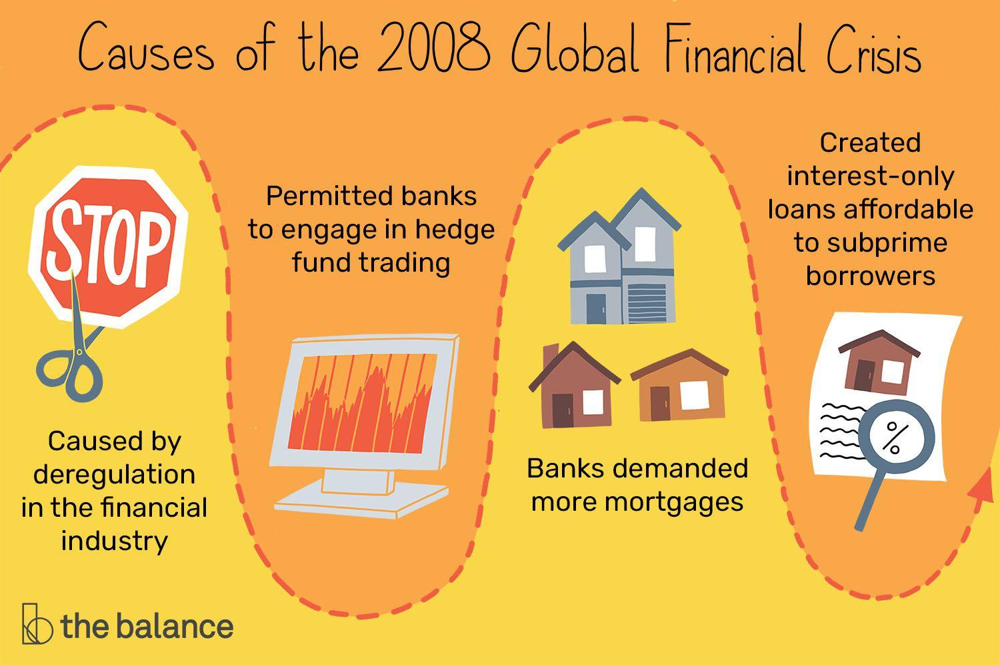

## Table of Contents

## What is the Great Recession?

The Great Recession was a big economic problem that started in the United States in 2007 and spread to many countries around the world. It was caused by problems in the housing market, where many people could not pay back their home loans. This led to banks losing a lot of money and stopping lending to people and businesses. As a result, many businesses had to close, and many people lost their jobs.

The effects of the Great Recession were felt for many years. Governments around the world had to spend a lot of money to help their economies recover. Many people had a hard time finding new jobs, and some lost their homes. It took a long time for things to get better, and some places are still feeling the impact today. The Great Recession taught us a lot about how important it is to manage money carefully and make sure that the economy is strong.

## When did the Great Recession start and end?

The Great Recession started in the United States in December 2007. It began when the housing market crashed because many people could not pay back their home loans. This caused banks to lose a lot of money, and they stopped lending to people and businesses. As a result, many businesses had to close, and many people lost their jobs.

The Great Recession officially ended in June 2009, according to the National Bureau of Economic Research. However, the effects of the recession were felt for many years after it officially ended. It took a long time for the economy to recover, and some people and places are still feeling the impact today.

## What were the immediate causes of the Great Recession?

The immediate cause of the Great Recession was the housing market crash in the United States. Many people had taken out loans to buy homes they could not afford. These loans were called subprime mortgages. When people could not pay back these loans, banks lost a lot of money. Banks had also been selling these risky loans to other investors, so when the loans failed, many investors lost money too. This led to a big problem in the financial system.

As banks lost money, they stopped lending to people and businesses. Without loans, businesses could not grow or even stay open, and many had to close. When businesses closed, they had to let their workers go, so many people lost their jobs. Without jobs, people could not spend money, and this made the economy even worse. The problems in the housing market quickly spread to the whole economy, causing the Great Recession.

## How did the housing market contribute to the Great Recession?

The housing market played a big role in causing the Great Recession. Many people were buying homes with loans called subprime mortgages. These loans were given to people who had a hard time paying them back. Banks thought they could make a lot of money by giving these loans and then selling them to other investors. But when people could not pay back their loans, the value of these loans dropped a lot. Banks and investors lost a lot of money because of this.

When banks lost money, they stopped giving out new loans to people and businesses. Without loans, businesses could not grow or even stay open. Many businesses had to close, and this meant they had to let their workers go. A lot of people lost their jobs and could not spend money like they used to. This made the economy even worse. The problems in the housing market spread quickly and led to the Great Recession.

## What role did financial institutions play in the Great Recession?

Financial institutions, like banks, played a big part in causing the Great Recession. They gave out a lot of loans called subprime mortgages to people who could not really afford them. Banks thought they could make a lot of money by giving these loans and then selling them to other investors. But when people could not pay back their loans, the value of these loans dropped a lot. Banks and investors lost a lot of money because of this.

When banks lost money, they got scared and stopped giving out new loans to people and businesses. Without loans, businesses could not grow or even stay open. Many businesses had to close, and this meant they had to let their workers go. A lot of people lost their jobs and could not spend money like they used to. This made the economy even worse. The problems in the financial system spread quickly and led to the Great Recession.

## How did government policies contribute to the Great Recession?

Government policies played a role in the Great Recession. One way was through policies that encouraged homeownership. The government wanted more people to own homes, so it made it easier for people to get loans. This led to banks giving out more subprime mortgages to people who could not really afford them. When these loans failed, it caused a big problem in the housing market and hurt the economy.

Another way government policies contributed was through not regulating the financial system enough. Banks were allowed to take big risks with their money. They could give out risky loans and sell them to other investors. The government did not stop this, even though it was dangerous. When these risky loans failed, it caused a lot of damage to the financial system and helped cause the Great Recession.

## What were the global impacts of the Great Recession?

The Great Recession had a big impact on the whole world. It started in the United States, but it quickly spread to other countries. Many countries saw their economies shrink, and a lot of people lost their jobs. In Europe, countries like Greece, Spain, and Ireland were hit very hard. They had to ask for help from other countries and organizations to keep their economies from getting even worse. In Asia, countries like Japan and South Korea also felt the effects, with businesses closing and people losing jobs.

The effects of the Great Recession lasted for many years. Governments around the world had to spend a lot of money to help their economies recover. They did things like giving money to people who lost their jobs and helping businesses stay open. But even with this help, it took a long time for things to get better. Many people had a hard time finding new jobs, and some countries are still feeling the impact today. The Great Recession taught us that what happens in one part of the world can affect everyone.

## How did the Great Recession affect unemployment rates?

The Great Recession caused unemployment rates to go up a lot in many countries. In the United States, the unemployment rate went from about 5% in 2007 to over 10% in 2009. This meant that many more people were out of work and looking for jobs. Businesses had to close because they could not get loans from banks, and when businesses closed, they had to let their workers go. This made it hard for people to find new jobs, and many people had to wait a long time before they could work again.

The effects of the Great Recession on unemployment were felt around the world. In Europe, countries like Spain and Greece saw their unemployment rates go up even more than in the United States. In Spain, the unemployment rate went over 20%, and in Greece, it went over 25%. Many young people had a hard time finding jobs, and this led to a lot of problems for them and their families. Even after the recession officially ended, it took many years for unemployment rates to go back down to normal levels in many places.

## What were the long-term economic impacts of the Great Recession?

The Great Recession had big long-term effects on the economy. Many people lost their jobs and had a hard time finding new ones. This made it hard for them to buy things and save money. Businesses also had a tough time because people were not spending as much. Some businesses had to close, and new ones were slow to start up. Governments spent a lot of money to help the economy get better, but it took a long time. This led to big debts for many countries, and they had to be careful with their money for years after.

Another long-term impact was on people's trust in the economy. After the recession, many people were scared to spend money or invest in things like the stock market. They were worried that something bad could happen again. This made it harder for the economy to grow. Also, the rules for banks and financial institutions changed. Governments made new laws to stop the same problems from happening again. These changes helped make the financial system safer, but they also made it harder for some people to get loans. Overall, the Great Recession changed how people and governments think about money and the economy.

## What measures were taken by governments and central banks to mitigate the effects of the Great Recession?

Governments and central banks took many steps to help fix the problems caused by the Great Recession. They spent a lot of money on things like helping people who lost their jobs and giving money to businesses so they could stay open. This was called a stimulus package. Central banks also lowered interest rates a lot. This made it cheaper for people and businesses to borrow money. They did this to help the economy start growing again.

Another thing governments did was to make new rules for banks and financial institutions. They wanted to make sure that the same problems would not happen again. These new rules made banks safer but also made it harder for some people to get loans. Governments also worked together to help countries that were in big trouble, like Greece and Spain. They gave them money to keep their economies from getting even worse. All these actions helped the economy start to recover, but it took a long time.

## How did the Great Recession influence financial regulation and economic policy?

The Great Recession made governments and financial leaders think a lot about how to keep the economy safe. They made new rules for banks and other financial places to stop the same problems from happening again. These rules made banks keep more money in case of emergencies and be more careful about the loans they give out. In the United States, a big law called the Dodd-Frank Act was passed to make the financial system safer. Other countries also made changes to their rules to protect their economies.

These changes also made people think differently about how to run the economy. Governments started to be more careful with their money and tried to keep big debts from getting out of control. They also looked at ways to help people and businesses if another big problem happened. Central banks kept interest rates low for a long time to help the economy grow slowly and steadily. Overall, the Great Recession taught everyone that being careful and having good rules can help keep the economy strong.

## What lessons can be learned from the Great Recession to prevent future economic crises?

The Great Recession taught us that we need to be very careful with money and loans. Banks and people should not take big risks that they cannot handle. Governments should make sure that banks follow good rules and do not give out loans that people cannot pay back. If banks are too risky, it can hurt the whole economy. We also learned that it's important to keep an eye on the housing market because problems there can spread to other parts of the economy.

Another lesson is that governments and central banks need to be ready to help when things go wrong. They can give money to people who lose their jobs and help businesses stay open. Central banks can lower interest rates to make it easier for people and businesses to borrow money. But governments also need to be careful not to spend too much money, or they could end up with big debts. Overall, being prepared and having good rules can help stop a big economic problem from happening again.

## References & Further Reading

[1]: Bergstra, J., Bardenet, R., Bengio, Y., & Kégl, B. (2011). ["Algorithms for Hyper-Parameter Optimization."](https://papers.nips.cc/paper/4443-algorithms-for-hyper-parameter-optimization) Advances in Neural Information Processing Systems 24.

[2]: ["Advances in Financial Machine Learning"](https://www.amazon.com/Advances-Financial-Machine-Learning-Marcos/dp/1119482089) by Marcos Lopez de Prado

[3]: ["Evidence-Based Technical Analysis: Applying the Scientific Method and Statistical Inference to Trading Signals"](https://www.amazon.com/Evidence-Based-Technical-Analysis-Scientific-Statistical/dp/0470008741) by David Aronson

[4]: ["Machine Learning for Algorithmic Trading"](https://github.com/stefan-jansen/machine-learning-for-trading) by Stefan Jansen

[5]: ["Quantitative Trading: How to Build Your Own Algorithmic Trading Business"](https://www.amazon.com/Quantitative-Trading-Build-Algorithmic-Business/dp/1119800064) by Ernest P. Chan