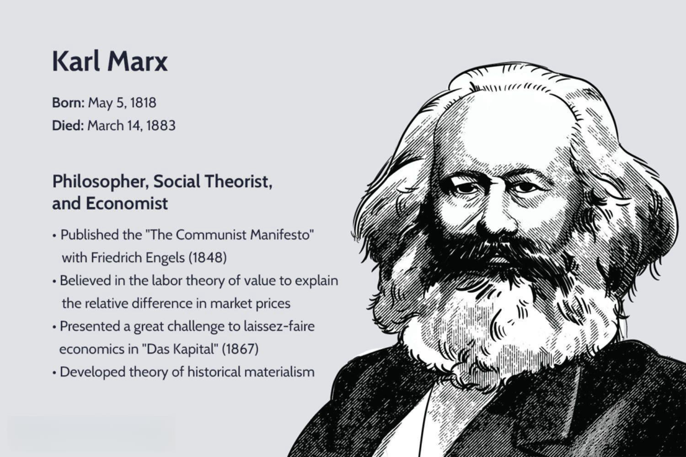

In the ever-evolving world of finance, two significant concepts— the Great Society and algorithmic trading—have profoundly impacted both society and the financial industry. The Great Society was a series of domestic policy initiatives and programs launched in the 1960s by U.S. President Lyndon B. Johnson. This ambitious set of programs aimed to eliminate poverty and address racial injustice, markedly altering the social fabric of the United States. Initiatives under the Great Society, such as Medicare, Medicaid, and educational reforms, continue to shape America's socio-economic landscape.

Contrasting the social reform nature of the Great Society, algorithmic trading leverages computer algorithms to execute trades in financial markets with unparalleled speed and accuracy. This modern trading approach relies on quantitative analysis to process vast volumes of data, making financial transactions more efficient. As technology has advanced, algorithmic trading has become the method of choice for many traders and institutions due to its reliability and precision.



This article explores the legacy of the Great Society while addressing frequently asked questions about algorithmic trading. The goal is to examine their profound influences and the potential synergies between historical social reforms and contemporary trading technologies. Understanding these intersections may provide insights into developing strategies that bridge social and economic progress, reflecting on how past societal shifts could inform present innovations in trading.

## Table of Contents

## The Great Society: An Overview

The Great Society was a comprehensive series of domestic policies and programs introduced in the 1960s under the leadership of U.S. President Lyndon B. Johnson. Its primary goals were to eliminate poverty and racial injustice, but it also addressed a variety of other critical social issues. This ambitious initiative was comparable in scope and vision to Franklin D. Roosevelt's transformative New Deal of the 1930s, which sought to address the economic challenges of the Great Depression through extensive government intervention and social welfare programs.

One of the hallmark achievements of the Great Society was the establishment of Medicare and Medicaid, which provided essential healthcare services to the elderly and low-income individuals, respectively. These programs significantly expanded the social safety net in the United States and have remained integral components of the nation's healthcare system.

Another key element was the Elementary and Secondary Education Act (ESEA), which aimed to improve educational opportunities for all children, specifically targeting funding to schools in poorer communities. This legislation marked a significant federal commitment to education and helped lay the foundation for ongoing educational reforms.

Environmental protection initiatives also featured prominently among the Great Society's objectives. Recognizing the importance of preserving natural resources and promoting ecological well-being, several measures were implemented to address environmental challenges, contributing to the development of subsequent environmental policies and standards.

Overall, the Great Society programs played a crucial role in shaping the modern social and economic landscape of the United States. Through substantial investment and federal legislation, these initiatives sought to create a more equitable society by addressing fundamental social issues and setting legislative frameworks that continue to impact American life today.

## Legacy of the Great Society

The Great Society's legacy is profoundly evident in its lasting programs that continue to provide essential services to Americans. At the core of these initiatives were substantial reforms in healthcare, education, and civil rights, areas where the policies introduced by President Lyndon B. Johnson have left an indelible mark.

In healthcare, the introduction of Medicare and Medicaid transformed access for the elderly and low-income individuals. Medicare, established in 1965, provides health insurance to people age 65 and older, regardless of income or medical history, while Medicaid offers assistance to those with limited income and resources. According to the Centers for Medicare & Medicaid Services, these programs have become pillars of the American healthcare system, playing a crucial role in reducing the uninsured population and improving health outcomes for millions. 

Education reform under the Elementary and Secondary Education Act (ESEA) marked a significant federal investment in public education. The ESEA aimed to close the skill gap by providing resources to schools in underserved communities. Its reauthorizations over the years, such as the No Child Left Behind Act and the Every Student Succeeds Act, underscore its enduring influence on educational policies and practices in the United States.

Civil rights advancements were another cornerstone of the Great Society's agenda. Landmark legislation, including the Civil Rights Act of 1964 and the Voting Rights Act of 1965, sought to dismantle systemic racial discrimination and ensure equal rights for all citizens. These acts laid the foundation for subsequent civil rights protections and continue to serve as critical frameworks for addressing racial inequities.

Despite these achievements, the Great Society faced criticism and challenges. Critics argue about the sustainability and efficiency of the programs, citing concerns over federal spending and bureaucratic inefficiencies. Nonetheless, the initiatives of the Great Society provided a blueprint for future social and economic reforms, adapting to the evolving needs of society while aiming to fulfill the vision of a more equitable and just America.

 to Algorithmic Trading

Algorithmic trading, an innovative approach to executing trades, utilizes automated systems that operate based on pre-programmed instructions. These systems typically hinge on quantitative analysis to identify and capitalize on trading opportunities with remarkable speed and precision. The core idea behind [algorithmic trading](/wiki/algorithmic-trading) is the use of algorithms, which are essentially sets of rules or calculations, to make decisions about buying or selling financial instruments.

These algorithms can process vast quantities of data at a rate that far exceeds human capabilities. By rapidly analyzing market conditions, price trends, and other significant factors, they can execute trades within fractions of a second. This precision is particularly advantageous in markets where prices can fluctuate in milliseconds due to high volumes of trading activity.

One of the fundamental aspects of algorithmic trading is its ability to minimize manual intervention, allowing for more consistent and emotion-free trading decisions. Traders and financial institutions use various strategies within algorithmic trading, including [trend following](/wiki/trend-following), [arbitrage](/wiki/arbitrage), [market making](/wiki/market-making), and [statistical arbitrage](/wiki/statistical-arbitrage). Each strategy is designed to recognize specific patterns or inefficiencies in the market, enabling the execution of trades that aim to maximize returns or minimize risks.

The surge in algorithmic trading's popularity is largely fueled by technological advancements in computing power and data analytics. High-frequency trading ([HFT](/wiki/high-frequency-trading-strategies)), a subclass of algorithmic trading, exemplifies how technology can substantially enhance trading performance. With platforms offering sophisticated algorithms and access to extensive datasets, traders are now better equipped to undertake complex trading strategies.

Moreover, these advancements have democratized access to algorithmic trading tools, allowing not only institutions but also individual traders to develop and implement their strategies. Python, for instance, is a popular programming language used in creating trading algorithms due to its ease of use and the availability of numerous data analysis libraries such as NumPy and pandas.

Overall, algorithmic trading represents a significant evolution in financial markets by leveraging technology to conduct trades that are faster, more accurate, and potentially more profitable than traditional methods. As technology continues to evolve, the adoption and sophistication of algorithmic trading are expected to grow, further cementing its role in modern financial markets.

## Common Questions About Algorithmic Trading

Algorithmic trading, often seen as a revolution in the finance sector, utilizes algorithms or computer programs to automate trading decisions based on predefined criteria such as price, timing, and [volume](/wiki/volume-trading-strategy). Primarily driven by quantitative analysis, these systems can simultaneously analyze vast amounts of market data, thereby providing execution speed and precision unattainable through manual trading.

### What is Algorithmic Trading and How Does it Work?

Algorithmic trading leverages a set of rules and mathematical models to execute trades. It is often implemented using high-frequency trading systems that monitor and capitalize on small price changes in the market. Key components of an algorithmic trading strategy could include, but are not limited to, trend following systems, arbitrage opportunities, and market-making strategies. Here's a basic illustration in Python of a simple moving average crossover strategy, often employed in algorithmic trading:

```python
def simple_moving_average(data, window):
    return data.rolling(window=window).mean()

def generate_signals(prices, short_window=40, long_window=100):
    signals = pd.DataFrame(index=prices.index)
    signals['price'] = prices
    signals['short_mavg'] = simple_moving_average(signals['price'], short_window)
    signals['long_mavg'] = simple_moving_average(signals['price'], long_window)
    signals['signal'] = 0.0
    signals['signal'][short_window:] = np.where(signals['short_mavg'][short_window:] 
                                                > signals['long_mavg'][short_window:], 1.0, 0.0)   
    signals['positions'] = signals['signal'].diff()
    return signals
```

Algorithmic trading is favored for its ability to minimize human errors, reduce transaction costs, and execute orders at optimal times based on a vast array of market indicators.

### How Does One Start Using Algorithmic Trading Systems Effectively?

To start with algorithmic trading, one must understand both the financial markets and programming. Effective use of algorithmic trading systems involves several steps:

1. **Education**: Acquire a foundational understanding of financial instruments, market behavior, and quantitative analysis.

2. **Develop Skills**: Gain proficiency in programming languages used in quantitative finance, such as Python, R, or C++.

3. **Design and Development**: Create a trading strategy based on backtesting and simulation, ensuring it performs well under various market conditions.

4. **Select a Platform**: Choose an algorithmic trading platform that offers robust data integration and testing capabilities without latency issues.

5. **Monitor and Optimize**: Continuously monitor the performance of your algorithms and optimize them for changing market conditions. 

### What are the Risks and Challenges Associated with Algorithmic Trading?

Despite its benefits, algorithmic trading is not without risks and challenges. These include:

- **Technical Failures**: Algorithms can malfunction due to errors in the code or unexpected market conditions, potentially leading to significant financial losses.
- **Market Impact**: High-frequency trading strategies can sometimes exacerbate market volatility and affect price stability.
- **Regulatory Issues**: Compliance with regulations is critical as algorithmic trading is closely scrutinized by financial authorities to prevent unfair market practices.
- **Overfitting**: Algorithms based on historical data may perform poorly in unknown future conditions due to overfitting to specific past trends.

### Why Do Traders Prefer Algorithmic Trading Over Traditional Methods?

Traders often prefer algorithmic trading over traditional methods for its efficiency and accuracy. Algorithms can process large datasets much faster than human traders, leading to more informed and timely trading decisions. Additionally, algorithmic trading eliminates emotional biases from decision-making processes, strictly adhering to the predefined trading rules. Furthermore, it enhances [liquidity](/wiki/liquidity-risk-premium) and allows for the automatic execution of trades, reducing the potential for slippage and securing better pricing outcomes.

In sum, algorithmic trading continues to shape the financial landscape by providing more efficient and systematic trading strategies, though it requires a robust understanding and careful management of its inherent risks and challenges.

## Legacy Algorithm Trading Platforms: A Case Study

Legacy Algo represents a significant leap forward in the world of trading technology, focusing on providing traders with tools that leverage [artificial intelligence](/wiki/ai-artificial-intelligence) (AI) and [machine learning](/wiki/machine-learning) (ML) to optimize trading decisions. This platform exemplifies the integration of sophisticated algorithms and real-time analytics to create a more efficient and precise trading environment.

**Features and Functionalities**

Legacy Algo stands out through its suite of proprietary algorithms designed to enhance trading accuracy and efficiency. Key features of the platform include:

1. **Real-Time Buy/Sell Signals**: These signals are generated through complex algorithms that analyze market patterns and historical data to identify profitable trading opportunities. By using AI, these signals adapt to changing market conditions, offering users a dynamic tool to make informed decisions.

2. **Trend Dashboards**: These dashboards present a comprehensive overview of market trends, driven by data visualization and statistical analysis. They enable traders to quickly grasp the direction and momentum of the market, facilitating timely decision-making.

3. **AI-Generated Support/Resistance Zones**: Utilizing machine learning, Legacy Algo identifies key support and resistance levels that are pivotal in trading strategies. These zones are calculated by examining price action data and identifying patterns indicative of market psychology.

**Technology and Development**

The platform is underpinned by continuous technological updates, ensuring that it remains at the forefront of trading innovations. The incorporation of AI and ML not only enhances the decision-making process but also allows for the development of adaptive models that evolve with market dynamics. This adaptability is crucial for maintaining competitiveness in fast-paced financial environments.

**Access and Usability**

To cater to a wide range of traders, Legacy Algo offers a free trial period. This allows potential users to explore its features and assess its suitability for their trading objectives. Following the trial, several subscription options are available, providing flexibility and scalability according to the user's needs.

In summary, Legacy Algo exemplifies the modern approach to trading, utilizing advanced technologies to empower traders with actionable insights and enhanced market understanding. Its continuous upgrades and adaptive features make it a valuable resource in today's algorithm-driven financial landscape.

## The Intersection of Social Policy and Algorithmic Trading

Both the Great Society and algorithmic trading have emerged as responses to systemic challenges but in considerably different domains. The Great Society aimed at addressing socioeconomic issues such as poverty and racial injustice through policies and programs that reshaped the American societal landscape. In contrast, algorithmic trading focuses on enhancing financial market efficiencies using technology and quantitative strategies. Despite their differing objectives, there is potential for these two areas to inform and enhance each other’s goals through integrated approaches.

Algorithmic applications present significant opportunities in the realm of social policy design and execution. Complex data analysis skills inherent in algorithmic trading can be repurposed for policy analytics and economic modeling. Policymakers could use algorithms to assess the effectiveness of various initiatives, predict outcomes, and optimize resource allocation. For example, public health efforts akin to those the Great Society initiated could benefit from data-driven evaluations to improve programmatic efficiency and impact.

Consider a scenario involving economic modeling to evaluate a social welfare program. Algorithmic methodologies, such as decision trees and regression analysis, can be applied to large datasets to identify patterns and impacts. A simplified Python script using a linear regression model might look like this:

```python
import numpy as np
from sklearn.linear_model import LinearRegression

# Hypothetical data: X is funding input, y is welfare outcome
X = np.array([[100], [200], [300], [400], [500]])
y = np.array([30, 50, 70, 90, 110])

# Create linear regression model
model = LinearRegression()
model.fit(X, y)

# Predict welfare outcome for new funding
new_funding = np.array([[600]])
predicted_outcome = model.predict(new_funding)
print(f"Predicted welfare outcome: {predicted_outcome[0]}")
```

This script can model the relationship between funding levels and welfare outcomes, providing insights for efficient resource deployment.

On the other hand, understanding the social implications of algorithmic trading can contribute to devising new economic strategies that are in harmony with social goals. For instance, patterns identified in trading data could highlight economic disparities, prompting targeted intervention measures.

Ultimately, integrating insights from algorithmic trading into social policy frameworks could lead to innovative approaches that enhance economic stability and social equity. By leveraging algorithmic proficiency to refine policy initiatives and using policy insights to guide responsible trading practices, stakeholders can craft strategies that simultaneously address financial and societal needs. This synergy has the potential to foster an environment where technological advancements and social progress go hand in hand.

## Conclusion

The Great Society and algorithmic trading, although distinct in their origins and applications, have both profoundly shaped their respective fields of social reform and financial markets. The Great Society, through its comprehensive policies targeting poverty, healthcare, and education, established frameworks that continue to influence contemporary social welfare and economic policy. Its legacy is seen in the robust systems of Medicare and Medicaid, along with educational reforms and civil rights advancements that have enhanced the quality of life for many Americans.

On the other hand, algorithmic trading represents a significant leap in financial innovation. By harnessing advanced computational technologies and quantitative analysis, algorithmic trading has transformed how financial transactions are executed, offering unprecedented speed, accuracy, and efficiency. This evolution in the trading landscape underscores a broader trend toward digitization and automation across various sectors.

Their seemingly disparate impacts converge when considering the broader pursuit of societal and economic progress. The systemic insights gleaned from algorithmic trading—such as data analytics and predictive modeling—can be potential tools for enhancing policy decision-making and optimizing resource allocation in social programs. For instance, sophisticated algorithms could support economic forecasting or the modeling of social program outcomes, thereby refining the implementation of reforms similar to those initiated by the Great Society.

Looking ahead, integrating the principles behind these influential entities can foster new strategies for addressing complex societal challenges. The continuous advancement in technology offers a unique opportunity to align economic strategies with social objectives, potentially leading to more effective and equitable solutions.

Understanding the interplay between historical social reforms and modern technological advances is vital for shaping strategies that ensure progress in both social and economic dimensions. As society progresses, leveraging the strengths of both areas could lead to innovative approaches to improving the quality of life while maintaining a robust economic infrastructure.

## References & Further Reading

[1]: Caro, R. A. (2002). ["The Years of Lyndon Johnson: Master of the Senate."](https://www.jstor.org/stable/30025801) Alfred A. Knopf.

[2]: ["Advances in Financial Machine Learning"](https://www.amazon.com/Advances-Financial-Machine-Learning-Marcos/dp/1119482089) by Marcos Lopez de Prado.

[3]: ["The Great Society: A New History"](https://www.amazon.com/Great-Society-History-1960s-America/dp/0061706426) by Amity Shlaes.

[4]: ["Evidence-Based Technical Analysis: Applying the Scientific Method and Statistical Inference to Trading Signals"](https://www.oreilly.com/library/view/evidence-based-technical-analysis/9780470008744/) by David Aronson.

[5]: ["Machine Learning for Algorithmic Trading"](https://github.com/stefan-jansen/machine-learning-for-trading) by Stefan Jansen.

[6]: ["Quantitative Trading: How to Build Your Own Algorithmic Trading Business"](https://www.amazon.com/Quantitative-Trading-Build-Algorithmic-Business/dp/1119800064) by Ernest P. Chan.