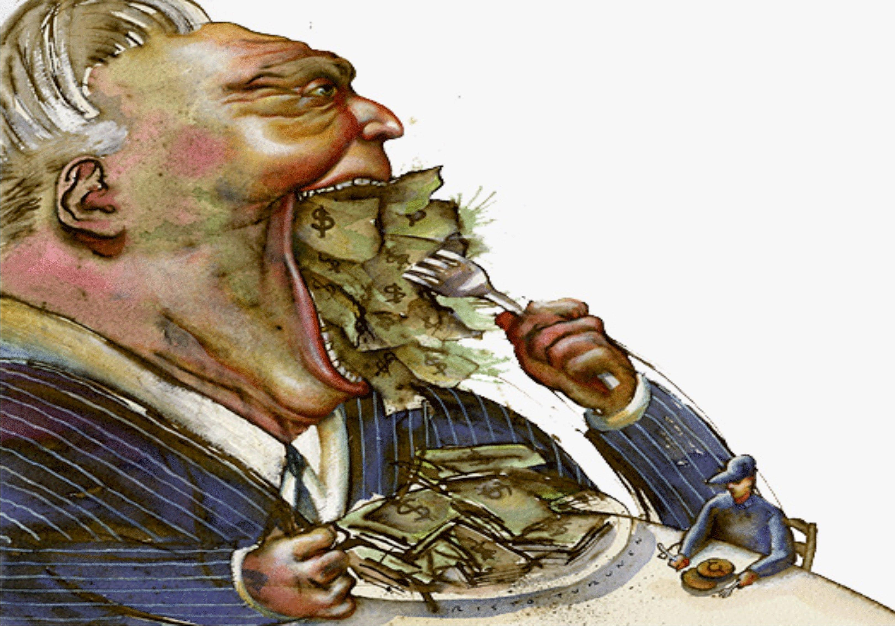

Algorithmic trading, or algo trading, has revolutionized the financial markets by enabling the rapid and efficient execution of trades through automated systems. These platforms leverage complex mathematical models and algorithms to analyze market data and execute trades at speeds beyond human capacity. As a result, algo trading is associated with increased trading efficiency and improved liquidity.

However, algo trading is not immune to the emotional influences that affect traditional trading. Despite the objectivity inherent in algorithms, the emotional landscape of human traders—especially the pervasive influence of greed—continues to play a significant role in trading decisions. Greed, characterized by an insatiable desire for wealth and profit, can manifest at various levels within algorithmic trading strategies. Even though these systems are designed to minimize human emotions, the biases and motivations of the people who create and adjust these algorithms can lead to strategies that reflect greed-driven motives.

This article examines the nature of greed within the context of algorithmic trading, offering insights into how this emotion can impact decision-making processes and overall trading performance. Through a discussion of historical examples and psychological implications, the article aims to provide a comprehensive understanding of this phenomenon. Additionally, it explores methods for effectively managing greed to enhance trading outcomes. By acknowledging and addressing the influence of greed, traders and developers can work towards more disciplined and balanced trading strategies.

## Table of Contents

## Understanding Greed in Algorithmic Trading

Greed in [algorithmic trading](/wiki/algorithmic-trading) manifests when traders prioritize high returns without adequately considering the inherent risks. This pursuit of profit can lead to over-leveraged positions and increased exposure to market [volatility](/wiki/volatility-trading-strategies). The core of algo trading lies in its perceived objectivity; however, the construction of algorithms is inherently rooted in the biases and emotional states of the developers. Consequently, such algorithms may be unknowingly influenced by greed, leading to strategies that chase unrealistic gains.

Algorithmic strategies are engineered to capitalize on market efficiencies and execute trades based on predetermined criteria. However, these criteria can be subtly skewed by the creator's drive for maximized returns. This skewing often results in riskier algorithmic decisions, as the model parameters may not fully account for tail risks or market irrationalities. For instance, an algorithm might be coded to pursue aggressive strategies during a bull market, inadvertently neglecting the potential for sudden reversals and increased loss probabilities. Thus, even in mechanically driven strategies, human greed can subtly dictate the direction and aggressiveness of trading models.

Understanding the influence of greed on decision-making in algorithmic strategies is vital for maintaining a balanced trading framework. Traders must assess the risk-reward scenarios built into their algorithms, ensuring that these models align with realistic market conditions and risk tolerances. A conscientious approach should incorporate risk management principles, such as stop-loss orders and diversification, to mitigate the potential excesses brought about by greed-driven strategies.

Implementing robust [backtesting](/wiki/backtesting) protocols can help identify biases and unrealistic expectations coded into trading algorithms. By simulating the performance of these algorithms across varying market conditions, traders can observe potential greed-induced outcomes and adjust the parameters accordingly. This practice ensures that algorithms remain aligned with realistic performance metrics.

Furthermore, the integration of risk-adjusted performance measures, such as the Sharpe ratio, can assist in evaluating whether the returns generated by an algorithm are commensurate with the risks undertaken. By focusing on metrics that offer insight into the risk-return equilibrium, traders can ensure their strategies are not overly influenced by the pursuit of outsized returns, reducing the impact of greed in their decision-making processes.

## The Psychological Impact of Greed

Even in environments dominated by algorithmic trading, the psychological influences on traders are not entirely replaced or negated by technology. Human emotions, particularly greed, continue to pose significant challenges. Greed is often characterized by an intense desire for wealth accumulation, which can lead traders to make impulsive alterations to their algorithms. These changes are frequently high-risk and deviate from an initially sound and logical strategy.

One of the critical impacts of greed is that it clouds judgment, leading to the escalation of risk-taking behaviors. For example, a trader might encounter a situation where an algorithm is functioning within its expected parameters and generating steady returns. However, swayed by the desire for even higher profits, the trader might adjust the algorithm’s parameters or risk thresholds, disregarding the initial strategy's stress-tested safety. Such interventions can disrupt the delicate balance originally created to navigate market volatility and lead to significant financial losses.

The historical dot-com bubble serves as a poignant example of greed's pervasive influence. During this period, which occurred in the late 1990s and early 2000s, the technology sector experienced explosive growth in stock prices due to widespread optimism about the internet's commercial potential. However, driven by speculative greed, investors poured money into internet-based companies with unsustainable business models. The collective belief in skyrocketing returns overshadowed rational assessment of company fundamentals, leading to mass overvaluation. When reality caught up, the market crashed, wiping out trillions of dollars in value, thereby demonstrating how collective greed can have catastrophic effects.

In algorithmic trading, personal bias introduced in the development or adaptation of algorithms often reflects this historical pattern of investor behavior during periods dominated by greed. An equilibrium must be maintained to mitigate such influences, and integrating risk management features into the trading process is critical. These features ensure that no matter the psychological pressures, the algorithm remains aligned with the strategic goals set forth at its inception. Thus, acknowledging the unavoidability of human emotions is crucial, as it paves the way toward developing more resilient and effective trading systems.

## Strategies to Mitigate Greed in Algorithmic Trading

Managing greed in algorithmic trading involves several disciplined approaches that help maintain the integrity and effectiveness of trading strategies. One of the primary techniques is adhering to a well-defined trading plan. Such a plan should delineate precise rules for trade entries and exits, thereby ensuring that decisions are based on strategic analysis rather than impulse. This structured plan acts as a safeguard against the emotional bias introduced by greed, promoting consistency and reducing errors that could arise from impulsive decision-making.

Diversification is another critical strategy to mitigate greed. By spreading investments across various asset classes or within distinct algorithmic strategies, traders can avoid the allure of concentrating resources on a single, supposedly lucrative trade. This distribution of risk not only minimizes potential losses but also stabilizes returns over time. A balanced portfolio inherently diminishes the urge to chase high returns from singular, high-risk investments which may be influenced by greed.

Moreover, setting realistic expectations regarding potential returns anchors traders in achievable goals rather than speculative, greed-driven ambitions. Unrealistic forecasts often lead to increased risk-taking, which could result in substantial financial losses. Clear benchmarks and attainable targets foster a more disciplined trading environment, where decisions are made logically and systematically.

In summary, the establishment of a solid trading plan, diversification of assets, and setting reasonable performance expectations are essential strategies in counteracting greed in algorithmic trading. These methods support a constructive trading mindset, aligning decisions with strategic objectives rather than emotional inclinations.

## Using Technology to Counter Greed

Modern algorithmic trading platforms, such as Tradetron and others, provide sophisticated tools designed to address the pervasive influence of greed in trading decisions. These platforms incorporate features like backtesting and real-time analysis, empowering traders to recognize and understand biases within their strategies.

### Backtesting and Real-Time Analysis

Backtesting is a crucial process that enables traders to simulate how a strategy would have performed based on historical data. This feature allows traders to identify potential flaws and biases, including greed-induced decisions. By assessing the performance of an algorithm under different historical market conditions, traders can evaluate the robustness of their strategy objectively. Real-time analysis complements backtesting by providing immediate feedback on how strategies perform in current market conditions, allowing for timely adjustments and reducing the likelihood of deviating from predefined plans due to emotional impulses like greed.

### Testing Strategies Under Various Market Conditions

Algorithmic platforms facilitate stress testing of strategies across a spectrum of market scenarios, aiding the identification and mitigation of biases that might have been overlooked during development. By simulating adverse market conditions, traders can assess how strategies withstand volatility and economic changes, ultimately leading to more resilient trading systems. This exhaustive testing process helps in curbing the temptation to chase excessive profits at the expense of sound risk management, often a consequence of unchecked greed.

### Sentiment Analysis Tools

In addition to technical features, many algorithmic trading systems incorporate sentiment analysis tools. These tools analyze news articles, social media trends, and other text-based data to gauge the overall market sentiment. By providing a quantitative measure of market mood, sentiment analysis offers traders an objective perspective that counteracts subjective decision-making influenced by greed. Python libraries such as TextBlob or NLTK can be used to perform sentiment analysis by classifying text data into categories of positive, negative, or neutral sentiments. Utilizing such tools enables traders to remain objective and grounded, avoiding the emotionally driven allure of speculative investments based on greed-fueled sentiment rather than rational analysis.

### Conclusion

By leveraging modern algorithmic trading platforms equipped with backtesting, real-time analysis, and sentiment analysis tools, traders can better manage the bias of greed in their strategies. These technologies provide an objective framework for developing, testing, and executing trading strategies, ensuring that decisions are driven by data and sound analysis rather than emotional impulses.

## Conclusion

Algorithmic trading provides a seemingly objective mechanism for participating in financial markets. However, it does not entirely eliminate the intrinsic human propensity toward emotions like greed, which can heavily influence trading outcomes. Even with algorithms in place, traders must be vigilant in managing these emotions to ensure decisions remain balanced and grounded in rationality.

By employing well-defined strategies and utilizing advanced technological tools, traders can effectively mitigate the impact of greed. A disciplined approach through adherence to strategic plans ensures that emotions are kept in check. For instance, algorithms can be designed with strict entry and [exit](/wiki/exit-strategy) rules, reducing the impulsivity that greed might incite. Additionally, integrating diversification in trading strategies can further safeguard against the overcommitment that greed can provoke, spreading risk across various assets and market conditions.

Furthermore, leveraging technology is crucial in supporting objective decision-making. Advanced trading platforms provide functionalities such as backtesting and real-time analytics, enabling traders to evaluate their strategies and identify potential biases, including those influenced by greed. These capabilities facilitate a more thorough understanding of how emotional factors can affect strategy performance and allow for necessary adjustments to be made preemptively. Additionally, incorporating sentiment analysis tools can provide a more detached view of market dynamics, further countering any subjective tendencies traders might have.

Ultimately, recognizing and acknowledging the role of emotions in trading can lead to more disciplined and balanced decisions. By combining strategy, technology, and an awareness of human psychology, traders can enhance their algorithmic trading endeavors, ensuring they remain objective and profitable in the long term.

## References & Further Reading

[1]: Bergstra, J., Bardenet, R., Bengio, Y., & Kégl, B. (2011). ["Algorithms for Hyper-Parameter Optimization."](https://papers.nips.cc/paper/4443-algorithms-for-hyper-parameter-optimization) Advances in Neural Information Processing Systems 24.

[2]: ["Advances in Financial Machine Learning"](https://www.amazon.com/Advances-Financial-Machine-Learning-Marcos/dp/1119482089) by Marcos Lopez de Prado

[3]: ["Evidence-Based Technical Analysis: Applying the Scientific Method and Statistical Inference to Trading Signals"](https://www.amazon.com/Evidence-Based-Technical-Analysis-Scientific-Statistical/dp/0470008741) by David Aronson

[4]: ["Machine Learning for Algorithmic Trading"](https://github.com/stefan-jansen/machine-learning-for-trading) by Stefan Jansen

[5]: ["Quantitative Trading: How to Build Your Own Algorithmic Trading Business"](https://books.google.com/books/about/Quantitative_Trading.html?id=j70yEAAAQBAJ) by Ernest P. Chan