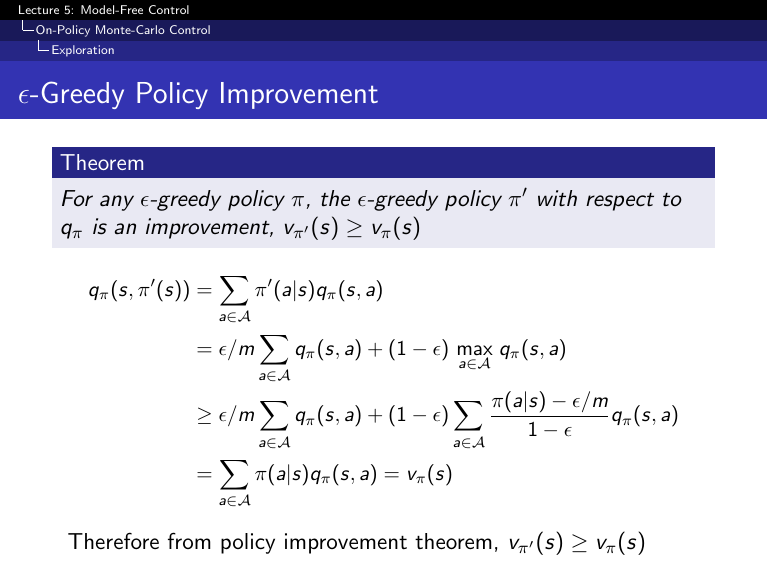

## Table of Contents

## What is a Greedy Policy in the context of machine learning?

A Greedy Policy in machine learning is a strategy used in reinforcement learning where an agent chooses the action that seems to be the best at the current moment, without considering the long-term effects of that action. Imagine you're playing a game and you always pick the move that gives you the most points right now, even if it might lead to a worse outcome later. This is what a Greedy Policy does. It looks at the immediate rewards and makes decisions based on those, which can be useful in certain situations but might not always lead to the best overall results.

In more technical terms, if an agent is in a state $$s$$ and has a set of possible actions $$A(s)$$, a Greedy Policy would select the action $$a$$ that maximizes the expected immediate reward, often represented as $$a = \arg\max_{a \in A(s)} R(s, a)$$. While this approach can lead to quick improvements in performance, it might miss out on better strategies that require short-term sacrifices for long-term gains. Therefore, Greedy Policies are often balanced with other methods, like exploration strategies, to ensure that the agent can learn from a broader range of experiences and potentially find more optimal solutions over time.

## How does a Greedy Policy differ from other decision-making policies?

A Greedy Policy is like choosing the best thing you can see right now, without thinking about what might happen later. It's like picking the candy that looks the tastiest in front of you, even if eating too much of it might make you feel sick later. In machine learning, this means the computer picks the action that gives the biggest reward at that moment. For example, if an agent is in a state $$s$$ and can choose from different actions, a Greedy Policy will always pick the action $$a$$ that gives the highest immediate reward, which can be written as $$a = \arg\max_{a \in A(s)} R(s, a)$$. This can work well for quick results, but it might not be the best way to win in the long run.

Other policies, like Epsilon-Greedy or Q-Learning, try to balance this short-term thinking with a longer view. An Epsilon-Greedy Policy, for instance, sometimes picks the best immediate action but also sometimes tries other actions to see if they might be better in the long run. This is like trying a new food once in a while to see if you might like it better than your usual favorite. Q-Learning, on the other hand, tries to figure out the best action by considering not just the immediate reward but also what might happen after that action. It's like planning your meals for the week to make sure you stay healthy and happy, not just picking what tastes good right now. These methods can lead to better overall results because they consider both the present and the future.

## What are the basic steps to implement a Greedy Policy in an algorithm?

To implement a Greedy Policy in an algorithm, you first need to understand the environment and the possible actions an agent can take. Imagine you're playing a game where you can move left, right, up, or down. Each move gives you a certain number of points. A Greedy Policy means you always pick the move that gives you the most points right now. So, you need to know what the current state is and what the immediate reward for each action would be. In programming terms, you'd have a function that tells you the reward for each action in the current state.

Once you have this information, you can write the code to choose the best action. You look at all the possible actions and pick the one with the highest reward. In math, this is written as $$a = \arg\max_{a \in A(s)} R(s, a)$$, which means you're finding the action $$a$$ that gives the maximum reward $$R$$ when you're in state $$s$$. In code, this might look like:

```python
def choose_action(state, possible_actions, reward_function):
    best_action = None
    best_reward = float('-inf')
    for action in possible_actions:
        reward = reward_function(state, action)
        if reward > best_reward:
            best_reward = reward
            best_action = action
    return best_action
```

This function goes through all the actions, calculates their rewards, and picks the one with the highest reward. That's how you implement a Greedy Policy in an algorithm.

## Can you provide a simple example of a Greedy Policy in action?

Imagine you're playing a simple game where you can move left or right on a line. Each move gives you points. If you move left, you get 5 points, and if you move right, you get 3 points. A Greedy Policy means you always pick the move that gives you the most points right now. So, in this game, you would always choose to move left because it gives you more points immediately.

Let's see this in action with a simple code example. If you're at the start of the game and you need to decide which way to go, a Greedy Policy would look at the immediate rewards and choose the best one. Here's how you might write this in Python:

```python
def choose_move():
    left_reward = 5
    right_reward = 3
    if left_reward > right_reward:
        return "left"
    else:
        return "right"

print(choose_move())  # This will print "left"
```

In this example, the function `choose_move` always picks "left" because it gives a higher immediate reward. That's how a Greedy Policy works in this simple game.

## What are the advantages of using a Greedy Policy in machine learning?

A Greedy Policy in machine learning is easy to understand and use because it always picks the action that gives the biggest reward right now. This can make things simpler and faster, especially when you're just starting to learn how to solve a problem. If you're playing a game and you want to get as many points as possible quickly, a Greedy Policy can help you do that by always choosing the move that scores the highest at that moment.

However, while a Greedy Policy can be good for quick results, it might not always be the best way to win in the long run. It's like picking the candy that looks the tastiest right in front of you, without thinking about what might happen later. In machine learning, this means the computer might miss out on better strategies that need some short-term sacrifices for bigger long-term gains. So, while a Greedy Policy is simple and can be useful, it's important to think about balancing it with other methods that look at the bigger picture.

## What are the limitations or potential drawbacks of a Greedy Policy?

A Greedy Policy can lead to missing out on better long-term strategies because it only focuses on the immediate reward. Imagine you're playing a game where you need to collect as many points as possible. If you always choose the move that gives you the most points right now, you might not see a path that would give you fewer points at first but lead to a much bigger reward later. This short-sightedness can prevent the agent from finding the best overall solution, especially in complex environments where the best strategy involves some short-term sacrifices for long-term gains.

Another limitation is that a Greedy Policy doesn't explore other possible actions, which can be a problem in situations where the best action isn't immediately obvious. In reinforcement learning, exploring different actions helps the agent learn more about the environment and potentially find better strategies. If an agent always picks the action with the highest immediate reward, it might never try other actions that could lead to discovering more optimal paths or solutions. This lack of exploration can result in the agent getting stuck in a suboptimal strategy, never realizing there might be a better way to achieve its goals.

## How can a Greedy Policy be applied in reinforcement learning?

In reinforcement learning, a Greedy Policy is used to help an agent decide what to do next by always choosing the action that gives the biggest reward right now. Imagine you're playing a game where you can move left or right, and each move gives you points. If moving left gives you 5 points and moving right gives you 3 points, a Greedy Policy would always make you move left because it's the best choice at that moment. In reinforcement learning terms, if an agent is in a state $$s$$ and has a set of possible actions $$A(s)$$, a Greedy Policy would select the action $$a$$ that maximizes the expected immediate reward, which can be written as $$a = \arg\max_{a \in A(s)} R(s, a)$$. This approach is simple and can lead to quick improvements in performance.

However, a Greedy Policy has its limitations because it doesn't look at the long-term effects of its choices. In the game example, always moving left might get you a lot of points quickly, but it might also lead you into a trap where you can't move anymore, and you miss out on a path that would have given you even more points later. To use a Greedy Policy effectively in reinforcement learning, it's often combined with other methods like Epsilon-Greedy, which sometimes picks the best immediate action but also sometimes tries other actions to explore the environment. This balance helps the agent learn from a broader range of experiences and potentially find more optimal solutions over time.

## In what types of problems is a Greedy Policy most effective?

A Greedy Policy is most effective in problems where the best action is clear and immediate rewards are the most important thing. Imagine you're playing a game where you need to collect as many points as you can right now. If moving left gives you 5 points and moving right gives you 3 points, a Greedy Policy would always make you move left because it's the best choice at that moment. In such simple, immediate-reward focused scenarios, a Greedy Policy can help you get quick results without needing to think about what might happen later.

However, a Greedy Policy can also work well in problems where the environment doesn't change much and the best action doesn't depend on what happens next. For example, if you're sorting a list of numbers and you always pick the smallest number to put at the front, that's a Greedy approach. It works because the best choice at each step (picking the smallest number) leads to the best overall result (a sorted list). In these types of problems, where short-term and long-term goals align, a Greedy Policy can be very effective.

## How does the exploration-exploitation trade-off affect Greedy Policies?

The exploration-exploitation trade-off is all about balancing between trying new things and sticking with what you know works. A Greedy Policy always chooses the action that gives the biggest reward right now, which is like always picking the candy that looks the tastiest in front of you. This approach is great for exploiting what you already know, but it doesn't help you explore other options that might be even better in the long run. If you only ever pick the candy you know tastes good, you might miss out on discovering a new favorite.

In reinforcement learning, this trade-off is really important. A Greedy Policy can lead to quick improvements because it focuses on immediate rewards, but it might not find the best overall strategy because it doesn't explore other actions. To make a Greedy Policy work better, you can mix it with exploration strategies like Epsilon-Greedy, where you sometimes pick a random action instead of the best one. This helps the agent learn more about the environment and find better paths or solutions over time. So, while a Greedy Policy is simple and can be useful, balancing it with exploration can lead to better results in the long run.

## What advanced techniques can enhance the performance of a Greedy Policy?

One advanced technique to enhance the performance of a Greedy Policy is to use an Epsilon-Greedy approach. This means that instead of always picking the action with the highest immediate reward, you sometimes choose a random action. Imagine you're playing a game and usually pick the move that gives you the most points right now, but once in a while, you try a different move just to see what happens. This is like setting a small chance, called epsilon, to explore other actions. By doing this, you can discover new strategies that might be better in the long run, even if they don't give you the biggest reward right away.

Another technique is to use Q-Learning along with a Greedy Policy. Q-Learning helps you figure out the best action by thinking about not just the immediate reward but also what might happen after that action. In Q-Learning, you keep track of how good each action is in each state using something called a Q-value. The Greedy Policy then picks the action with the highest Q-value. Over time, as you learn more about the game, the Q-values get better, and the Greedy Policy can make smarter choices. This combination helps balance short-term gains with long-term planning, leading to better overall performance.

For example, in a simple game where you can move left or right, you might start with a Greedy Policy that always moves left because it gives you more points immediately. But with Epsilon-Greedy, you might sometimes move right to see if it leads to a better outcome later. And with Q-Learning, you would keep updating your Q-values based on what happens after each move, so the Greedy Policy can eventually pick the best action considering both immediate and future rewards.

## Can you discuss a case study where a Greedy Policy significantly impacted the outcome?

Imagine a company using a Greedy Policy to manage its inventory. The company always orders the product that sells the fastest right now, hoping to maximize immediate sales and profits. In this case, the Greedy Policy leads to quick results because the company focuses on the products that are popular at the moment. For example, if toy cars are selling like hotcakes, the company would order more toy cars to meet the current demand. This approach helps the company make money quickly, but it might miss out on other products that could become big sellers in the future.

However, this Greedy approach can have drawbacks. If the company only focuses on toy cars and ignores other products like puzzles, which might not be as popular now but could have a big demand during the holiday season, it might lose out on potential sales. In this case study, the company could improve its strategy by using an Epsilon-Greedy approach. This means it would mostly order the fastest-selling products but sometimes order other items to explore new opportunities. By balancing immediate sales with exploring other products, the company could find a better long-term strategy for managing its inventory and maximizing overall profits.

## How do you evaluate the performance of a Greedy Policy in machine learning applications?

To evaluate the performance of a Greedy Policy in machine learning applications, you look at how well it does compared to other ways of making decisions. Imagine you're playing a game and you always pick the move that gives you the most points right now. You'd want to see if this strategy helps you win more often or get more points than if you tried different moves or planned ahead. In machine learning terms, you might compare the total reward or the average reward per step that the Greedy Policy gets to what other policies like Epsilon-Greedy or Q-Learning achieve. This helps you understand if focusing on immediate rewards is good enough or if you need to think about the long-term effects of your choices.

Another way to evaluate a Greedy Policy is by looking at how it performs over time. If you're using a Greedy Policy in a changing environment, like a game where the rules or rewards can change, you want to see if it can adapt or if it gets stuck doing the same thing even when it's no longer the best choice. You might run the policy through many rounds of the game and track how the rewards change. If the Greedy Policy starts off well but then stops improving or even gets worse as the game changes, it might not be the best choice. This kind of evaluation helps you decide if you need to add some exploration or long-term planning to make your policy better.