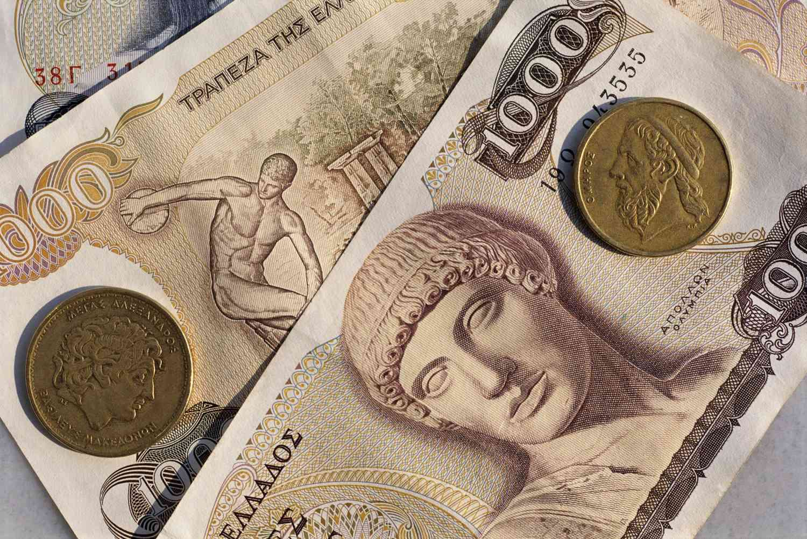

The drachma, one of the world's oldest currencies, has deep roots in Greek history, dating back to ancient times when it served as a fundamental unit of exchange among Greek city-states. Renowned for its significance during the era of ancient Greece, the drachma symbolized economic strength and cultural identity for centuries. As Greece emerged from the clutches of the Ottoman Empire in the 19th century, the drachma was revived as the new national currency, marking the country's economic rebirth.

However, in 2001, Greece embraced the euro, transitioning from the drachma to join the broader Eurozone community. This shift was motivated by a desire for economic stability, integration with European markets, and the promise of reduced inflation and interest rates. Despite these benefits, the transition was not without challenges, sparking debates such as "Grexit" — a term coined to describe the controversy surrounding Greece's potential exit from the Eurozone and the revival of the drachma. These debates have been fueled by economic crises, national pride, and contrasting views on Greece's financial sovereignty.



In recent years, the role of algorithmic trading has become increasingly prominent in global financial markets. This advanced trading strategy leverages mathematical models and complex algorithms to execute trades at speeds and frequencies beyond human capabilities. Algorithmic trading has revolutionized the way financial markets operate, offering enhanced precision, decreased transaction costs, and improved market liquidity. However, it also brings challenges such as market volatility and systemic risks. Understanding algorithmic trading's impact on historical currency scenarios, like those involving the drachma, offers insight into how modern financial technologies could influence traditional currency markets.

## Table of Contents

## The Historical Origins of the Greek Drachma

The Greek drachma, as one of the oldest known currencies, played a pivotal role in ancient Greek society. Its origins date back to around the 6th century BCE, emerging in the city-states throughout Greece. The term 'drachma' is derived from the verb 'drassomai', meaning "to grasp". A drachma historically represented a handful of six oboloi, small iron rods used as currency in earlier times. Structurally, the drachma consisted of silver coins which standardized weight and value across the diverse regions of Greece, easing trade and commerce activities.

Each Greek city-state minted its drachma coins, with Athens' version being the most prominent and widely accepted due to the city's influence and extensive trade networks. The Athenian drachma featured symbols and deities, with the owl symbolizing wisdom and Athena, the goddess of wisdom, on its reverse side. This currency facilitated not only local trade but also international commerce with other thriving civilizations across the Mediterranean.

Following Greece's independence from the Ottoman Empire in 1821, the drachma was reintroduced as the official currency in 1832. This period marked a significant revival as the newly established Greek state sought to build a sense of nationalism and economic identity. The modern drachma initially replaced the short-lived phoenix, which served as the first currency post-independence.

The reintroduction of the drachma was a symbol of sovereignty and economic rebirth, reflecting Greece's desire to restore its glorious past and position itself credibly within the European economic framework. This revived drachma underwent various modernizations and changes reflecting the socio-economic conditions of the Greek state until its eventual replacement by the euro in 2001. Throughout these phases, the drachma retained its historical symbolism of Greek identity and its legacy as an enduring currency from antiquity.

## From the Phoenix to the Drachma: Currency Evolution in Greece

In the 19th century, Greece underwent significant changes in its monetary system, transitioning from the phoenix to the drachma. The phoenix was introduced in 1828 by Governor Ioannis Kapodistrias as the first currency of the modern Greek state, following independence from Ottoman rule. It was named to symbolize the rebirth of Greece, echoing the mythical bird that rises from its ashes. However, the phoenix faced several challenges, such as limited circulation due to a scarcity of coins, which impeded its efficacy as a national currency.

By 1832, the necessity for a robust and stable monetary system became apparent, leading to the introduction of the drachma in 1833. The drachma was intended to establish a more standardized and widespread currency across Greece. It was pegged to the French franc, which was considered a stable and strong currency at the time, with one drachma equaling one franc. This alignment with the franc helped strengthen international confidence in the Greek economy, providing a more reliable currency basis for both domestic and foreign trade.

The introduction of the drachma was a pivotal moment in setting the financial foundation for Greece. It facilitated economic development by promoting trade and investment. Furthermore, with the new currency, Greece could lay down a structured banking system, which further aided in economic growth. The establishment of the National Bank of Greece in 1841 was a part of this broader monetary reform and played a crucial role in stabilizing and regulating the currency.

Moreover, the move from the phoenix to the drachma allowed for better integration into European commerce, as the standardized currency was more easily accepted in international markets. This transition not only boosted the economic standing of Greece but also contributed to a sense of national identity and pride, linking modern Greece with its ancient cultural heritage, as the drachma was also the currency used in ancient Greek city-states.

Thus, transitioning to the drachma in the 19th century was instrumental in laying the groundwork for a stable and economically viable future for Greece. It addressed the shortcomings of the phoenix and established the monetary stability necessary for Greece to engage more effectively with both domestic and international economic systems.

## Greece Joins the Eurozone

Greece transitioned from the drachma to the euro on January 1, 2001, marking a significant economic shift for the nation. This transition was driven by several economic motivations. Firstly, joining the eurozone promised enhanced economic stability. By adopting a common currency, Greece aimed to integrate more deeply into the European economic framework, fostering trade and investment through the elimination of currency exchange risks. The uniform currency also intended to curb inflation by aligning with the monetary discipline imposed by the European Central Bank, providing a more stable economic environment.

Economically, Greece anticipated that the adoption of the euro would attract foreign investment, as the euro was seen as a powerful and stable currency on the global stage. This stability was considered crucial for a country that had experienced periods of economic [volatility](/wiki/volatility-trading-strategies). Moreover, the switch to the euro was expected to lower interest rates, reducing borrowing costs for both the government and private sector, potentially spurring economic growth.

The benefits of joining the eurozone were evident in several areas. The elimination of currency conversion costs facilitated cross-border trade and travel within the eurozone, making it more seamless for businesses and tourists alike. Additionally, Greece experienced an initial period of economic growth, partly due to increased investor confidence and access to larger capital markets.

However, the challenges were equally significant. Post-euro adoption, Greece faced increased competition, particularly from economies with lower production costs. The loss of autonomous monetary policy meant that Greece could no longer devalue its currency to boost competitiveness during economic downturns. Public finances came under scrutiny, as adhering to the eurozone's fiscal requirements strained Greece’s budget and exposed underlying economic weaknesses.

The structural reforms necessary to align with the eurozone's fiscal discipline framework were not fully implemented, leading to long-term economic and social challenges. The financial crisis of 2008 further revealed Greece's fiscal vulnerabilities, culminating in a sovereign debt crisis that posed critical questions about the sustainability of its eurozone membership.

Overall, Greece's transition to the euro presented both opportunities and challenges, setting the stage for debates about its long-term economic strategy and integration within Europe.

## The Greek Drachma and the Grexit Debate

The Grexit debate, a portmanteau of "Greece" and "[exit](/wiki/exit-strategy)," refers to the discussions surrounding the possibility of Greece leaving the Eurozone and returning to its former currency, the drachma. This conversation gained prominence during the European debt crisis, which significantly impacted Greece's economy.

Proponents of the return to the drachma argue that regaining control over its currency could enable Greece to devalue it, potentially making Greek exports more competitive globally. This could spur economic growth and reduce unemployment by boosting local industries. Moreover, re-establishing the drachma might restore a level of economic sovereignty, allowing Greece to implement independent monetary policies tailored to its specific economic conditions. National pride also plays a role, as some Greek citizens view the euro as a symbol of external control, contrasting with the drachma as a symbol of national identity and autonomy.

Conversely, those opposing the reintroduction of the drachma emphasize the risks and uncertainties involved. Transitioning from the euro could lead to significant economic instability, with potential capital flight as investors move their assets to safer, euro-denominated locales. Inflation might surge if the new drachma is devalued excessively, eroding purchasing power and leading to higher costs for imported goods. Furthermore, existing euro-denominated debts might become more burdensome if they need to be repaid in a weaker currency.

Economically, exiting the euro would isolate Greece from the benefits of a shared currency system, such as reduced transaction costs and integrated financial markets. This could strain relationships with European partners and complicate trade. A return to the drachma would likely mean renegotiating trade terms and facing more stringent borrowing conditions on international markets, given the increased risk associated with a standalone currency.

In conclusion, while returning to the drachma might offer Greece more economic control and align with national pride, it also entails significant risks, including potential economic instability and international isolation. Balancing these factors is central to the continuing Grexit debate and Greece's financial future.

## Algorithmic Trading and Currency Markets

Algorithmic trading refers to the use of computer algorithms to manage the trading process of financial instruments, which allows for the execution of large orders at high speed and efficiency. This approach is used extensively in modern currency markets and has revolutionized the way trading is conducted by automating the trading decisions and execution process. The algorithms analyze various market factors, including price, [volume](/wiki/volume-trading-strategy), and time, to identify trading opportunities and make decisions in real-time. This level of precision reduces human error and improves the consistency of trading strategies.

The introduction of [algorithmic trading](/wiki/algorithmic-trading) could have dramatically altered historical currency trading scenarios. In the context of the Greek drachma, an algorithmic approach might have provided significant advantages. Historical currency trading was predominantly manual, often limited by the processing capacity and emotional biases of human traders. If algorithmic trading had been implemented during periods of volatility in the drachma, for instance, it could have allowed traders to quickly react to market changes and execute trades based on predefined sets of rules, minimizing potential losses and taking advantage of fleeting opportunities.

For instance, consider a basic algorithm that triggers buy or sell orders based on the moving average convergence divergence (MACD) strategy:

```python
def macd_strategy(prices, short_window=12, long_window=26, signal_window=9):
    short_ema = prices.ewm(span=short_window, adjust=False).mean()
    long_ema = prices.ewm(span=long_window, adjust=False).mean()
    macd = short_ema - long_ema
    signal = macd.ewm(span=signal_window, adjust=False).mean()
    return macd, signal

def get_signals(prices):
    macd, signal = macd_strategy(prices)
    positions = [0]

    for i in range(1, len(prices)):
        if macd[i] > signal[i]:
            positions.append(1)  # Buy signal
        elif macd[i] < signal[i]:
            positions.append(-1)  # Sell signal
        else:
            positions.append(0)  # Neutral

    return positions
```

The benefits of applying algorithmic trading to currencies such as the drachma include increased market [liquidity](/wiki/liquidity-risk-premium), improved efficiency in trade execution, and reduced transaction costs. Because algorithms can rapidly process vast amounts of data and execute trades based on sophisticated models, they can also help stabilize markets by reducing the impact of large trades and minimizing price distortions caused by human error or emotion-driven decisions.

However, there are potential challenges associated with algorithmic trading. One significant concern is the risk of market manipulation through practices like spoofing, where traders place false orders to manipulate prices. Additionally, system failures or bugs in trading algorithms can lead to significant financial losses or market disruptions. For instance, the "flash crash" of 2010, where the U.S. stock market briefly plummeted, demonstrated the potential for automated trading systems to cause unexpected volatility.

In the hypothetical scenario of the drachma being reintroduced and subjected to algorithmic trading, these benefits and challenges would need careful consideration. A robust regulatory framework and continuous monitoring would be essential to ensure market integrity and protect investors. Thus, while algorithmic trading offers numerous opportunities for enhancing currency trading efficiency and effectiveness, it also demands vigilant oversight and management to mitigate risks.

## Conclusion: Currency Evolution and Modern Trading Perspectives

The Greek drachma has had a long and storied history, ranging from its origins in ancient Greek city-states to its role as the national currency of modern Greece until 2001. The drachma was first introduced as a unit of currency in the 6th century BCE and was widely used across the Greek world. It symbolized not just economic transactions but also cultural and political significance, becoming a standard for trade in the Mediterranean.

In the 19th century, following Greece's independence from the Ottoman Empire, the drachma was revived as the official currency, marking a pivotal step in establishing a modern financial identity for the newly-formed state. The transition from the phoenix, an earlier currency introduced briefly during Greek independence, to the drachma underlined Greece's aspiration for stability and growth. Despite various economic challenges, the drachma remained Greece's monetary unit for almost two centuries.

The adoption of the euro in 2001 represented a significant shift, aiming to integrate Greece more deeply into the European economic framework. While it brought about benefits like reduced transaction costs and improved access to European markets, it also introduced economic complexities that were highlighted during the financial crisis of the late 2000s. This led to debates over "Grexit," or Greece's potential exit from the Eurozone, contemplating a return to the drachma. Proponents argued it could restore economic sovereignty and flexibility, whereas opponents warned of inflation and instability.

Modern algorithmic trading has transformed how currencies are traded today, bringing efficiency and speed to financial markets. In the context of a hypothetical return to the drachma, algorithmic trading could offer greater liquidity and price discovery, potentially cushioning the shock of a currency transition. However, it may also expose the currency to speculative attacks and increased volatility. The capabilities of algorithms in executing trades based on real-time data and complex financial models may introduce challenges in calibration and risk management, especially for a newly reintroduced currency like the drachma.

The continued evolution of financial technologies presents both opportunities and challenges for global currency markets. As Greece considers its monetary future, balancing historical identity with modern economic practices remains critical. The journey of the drachma reflects broader themes of cultural and economic integration, serving as a case study for how historical currencies adapt amid modern trading paradigms.

## References & Further Reading

[1]: Gallant, R. A. (1997). ["An Introduction to Econometric Theory."](https://press.princeton.edu/books/ebook/9780691186238/an-introduction-to-econometric-theory) Princeton University Press.

[2]: Galbraith, J. K. (2009). ["A Short History of Financial Euphoria."](https://www.penguinrandomhouse.com/books/321392/a-short-history-of-financial-euphoria-by-john-kenneth-galbraith/) Penguin Books.

[3]: Tsoukalas, E. (2013). ["The Greek Dra(c)ma: You Have the Drachma, We Have the Drama."](https://www.semanticscholar.org/paper/The-Greek-Debt-Crisis%3A-Likely-Causes%2C-Mechanics-and-Arghyrou-Tsoukalas/6dd1f3545a2042338249e28d2b33c0aa1e5b89b1) Environment and Planning A: Economy and Space.

[4]: Scholtes, S. (2015). ["The Euro: A Concise Introduction to European Monetary Integration."](https://www.rienner.com/uploads/47d95e10497ed.pdf) Oxford University Press.

[5]: Kuepper, J. (2020). ["Understanding Algorithmic Trading."](https://www.sec.gov/files/Algo_Trading_Report_2020.pdf) Investopedia.