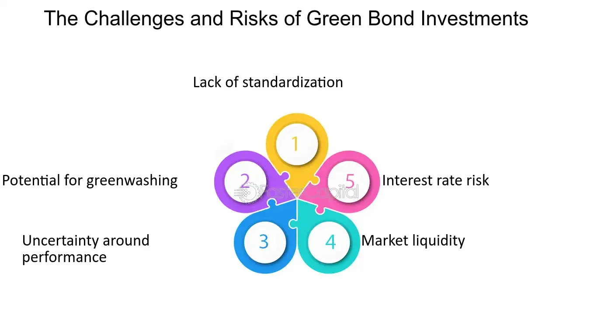

## Table of Contents

## What is a green bond?

A green bond is a type of bond that companies or governments issue to raise money for projects that help the environment. These projects can include things like building wind farms, improving energy efficiency, or protecting natural areas. People who buy green bonds are lending money to these organizations, and in return, they get their money back with interest, just like with any other bond.

The main difference between green bonds and regular bonds is that the money from green bonds must be used for environmentally friendly projects. This makes green bonds attractive to investors who care about the environment and want to support sustainable initiatives. Green bonds help to fight climate change by providing the funds needed for important environmental projects.

## How do green bonds differ from traditional bonds?

Green bonds and traditional bonds are both ways for companies or governments to borrow money from investors. With both types of bonds, the borrower promises to pay back the money with interest over time. The big difference is what the borrowed money is used for. With traditional bonds, the money can be used for anything the borrower needs, like building new factories or paying off other debts. But with green bonds, the money must be used for projects that help the environment, like building solar power plants or protecting forests.

Another difference is who might want to buy these bonds. Traditional bonds attract investors who are looking for a safe place to put their money and earn interest. Green bonds, on the other hand, also attract investors who care about the environment and want their investments to help make the world a better place. So, while both types of bonds work in similar ways, green bonds have an extra focus on supporting eco-friendly projects.

## What are the primary uses of funds raised through green bonds?

The money raised through green bonds is mainly used for projects that help the environment. These projects often focus on renewable energy, like building wind farms or solar power plants. This helps to reduce the use of fossil fuels and lowers greenhouse gas emissions. Another common use is improving energy efficiency in buildings, which means making them use less power and save energy. This can include things like better insulation or more efficient heating systems.

Green bonds also fund projects that protect and restore nature. This can mean planting new trees, protecting wildlife habitats, or cleaning up polluted areas. These projects help to keep the planet healthy and support biodiversity. Sometimes, the money is used for sustainable transport, like building bike lanes or electric vehicle charging stations. All these uses help to fight climate change and make the world a better place for everyone.

## Who are the typical issuers of green bonds?

The main groups that issue green bonds are governments and big companies. Governments, like countries or cities, use green bonds to get money for projects that help the environment. For example, a city might issue a green bond to build a new solar power plant or to make their buildings more energy-efficient. Countries might use green bonds to protect their forests or to clean up polluted areas.

Big companies also issue green bonds. These companies can be in different industries, like energy, transportation, or real estate. For instance, an energy company might issue a green bond to build more wind farms, while a real estate company might use the money to make their buildings more eco-friendly. Both governments and companies see green bonds as a way to get money for important projects that also help the planet.

## What are the potential benefits of investing in green bonds?

Investing in green bonds can be good for both your money and the planet. When you buy a green bond, you're lending money to a company or government that promises to use it for projects that help the environment. These projects can be things like building wind farms or making buildings use less energy. Because these bonds support eco-friendly projects, you can feel good knowing your money is helping to fight climate change and protect the planet.

Green bonds can also be a safe and steady way to earn money. Just like other bonds, green bonds pay you back with interest over time. This means you can get a regular income from your investment. Plus, many people and big investors like green bonds because they want their money to do good in the world. So, green bonds can be a smart choice if you care about the environment and also want to earn some money.

## What are the risks associated with green bond investments?

Investing in green bonds can be good, but there are some risks to think about. One big risk is that the projects the money is used for might not work out as planned. For example, a wind farm might not produce as much energy as expected, or a project to protect a forest might not succeed. If these projects fail, the company or government might have trouble paying back the money they borrowed, which means you might not get all your money back or the interest you were promised.

Another risk is that green bonds might not be as "green" as they say. Sometimes, companies or governments might say they are using the money for eco-friendly projects, but they might not be completely honest about it. This is called "greenwashing." If you find out that the money wasn't used for good environmental projects, you might feel tricked and unhappy with your investment. It's important to do your research and make sure the green bond is really helping the environment before you invest.

## How can investors verify the 'green' credentials of a bond?

Investors can check if a green bond is really helping the environment by looking at something called a "green bond framework." This is a plan that the company or government makes, saying exactly how they will use the money from the bond for eco-friendly projects. It's like a promise to do good things for the planet. Investors should read this framework carefully to see if it matches their own goals for helping the environment.

Another way to verify a bond's green credentials is by looking for a "second party opinion." This is when a different company, that knows a lot about the environment, checks the green bond framework and gives their opinion on it. If this second company says the bond is good for the environment, it can give investors more confidence. Also, investors can look for certifications from groups like the Climate Bonds Initiative, which have strict rules about what makes a bond truly green. By doing these checks, investors can feel more sure that their money is really helping the planet.

## What role do green bonds play in sustainable investing?

Green bonds are a big part of sustainable investing because they help people put their money into projects that are good for the environment. When someone buys a green bond, they are lending money to a company or government that promises to use it for things like building wind farms or protecting forests. This means that investors can feel good knowing their money is helping to fight climate change and make the world a better place.

Green bonds also fit well with the goals of sustainable investing, which is all about making money while also doing good for the planet and society. By investing in green bonds, people can earn a regular income from the interest they get, just like with other bonds. But the special thing about green bonds is that they also help support projects that make the environment healthier. This makes green bonds a popular choice for investors who want to make a positive impact on the world while still [earning](/wiki/earning-announcement) money.

## How have green bonds performed historically compared to other bonds?

Green bonds have generally performed pretty well compared to other bonds. They often give investors a similar return, which means the interest they earn is about the same as what they would get from regular bonds. This makes green bonds attractive because you can help the environment and still earn a good amount of money. Studies have shown that green bonds can be just as safe and steady as other bonds, which is great news for people who want to invest in a way that's good for the planet.

Sometimes, green bonds can even do a bit better than other bonds. This can happen because more and more people want to invest in things that help the environment, so the demand for green bonds can go up. When demand goes up, the price of the bond can go up too, which can mean a higher return for investors. Overall, green bonds have been a solid choice for people who want to make money and also help the planet at the same time.

## What are the tax implications of investing in green bonds?

The tax rules for green bonds can be a bit different depending on where you live and what kind of green bond you buy. In some places, the interest you earn from green bonds might be taxed just like the interest from regular bonds. This means you have to pay taxes on the money you make from the interest. But in other places, there might be special tax breaks for green bonds because they help the environment. For example, some governments might let you pay less tax on the interest or even not pay any tax at all.

It's really important to check the tax laws in your area before you invest in green bonds. You can talk to a tax advisor or look up the rules online to make sure you know what to expect. Knowing the tax implications can help you decide if green bonds are a good choice for you, especially if you want to save money on taxes while also helping the planet.

## How do regulatory frameworks impact green bond markets?

Regulatory frameworks are really important for the green bond market. They help make sure that the money from green bonds is used for projects that actually help the environment. Governments and other groups set rules that companies and governments have to follow when they issue green bonds. These rules can say what kinds of projects are allowed and how the companies need to report on what they're doing with the money. This makes investors feel more confident that their money is being used in a good way.

These rules also help stop something called "greenwashing," which is when a company says their bond is green but it's not really helping the environment. When there are strict rules, it's harder for companies to trick people. This makes the green bond market grow because more people want to invest in bonds that they know are really making a difference. Overall, good regulatory frameworks make the green bond market stronger and more trustworthy.

## What future trends are expected in the green bond market?

The green bond market is expected to keep growing in the future. More and more people and companies are caring about the environment, so they want to invest in things that help the planet. This means that more companies and governments will issue green bonds to get money for eco-friendly projects. As the world tries to fight climate change, green bonds will become a bigger part of how we pay for things like wind farms, solar power plants, and protecting nature.

Another trend we might see is better rules and standards for green bonds. Right now, there are different rules in different places, which can be confusing. In the future, there might be more clear and strict rules all around the world. This will make it easier for investors to know if a green bond is really helping the environment. Also, new kinds of green bonds might be created, like bonds that focus on specific issues like clean water or reducing plastic waste. These trends will make the green bond market stronger and more helpful for the planet.

## References & Further Reading

[1]: Flammer, C. (2021). ["Corporate Green Bonds."](https://www.sciencedirect.com/science/article/pii/S0304405X21000337) National Bureau of Economic Research.

[2]: Climate Bonds Initiative. (n.d.). ["Green Bonds Market Summary."](https://www.climatebonds.net/resources/reports/green-bonds-market-summary-h1-2020)

[3]: International Capital Market Association. (2018). ["The Green Bond Principles."](https://www.icmagroup.org/assets/documents/Regulatory/Green-Bonds/Green-Bonds-Principles-June-2018-270520.pdf)

[4]: European Investment Bank. (2018). ["The EIB's Role in the Green Bond Market."](https://www.eib.org/en/publications/activity-report-2018)

[5]: Tang, D. Y., & Zhang, Y. (2020). ["Do shareholders benefit from green bonds?"](https://www.sciencedirect.com/science/article/pii/S0929119918301664) Journal of Corporate Finance.

[6]: Chiesa, M., & Barua, S. (2019). ["The surge of impact borrowing: The magnitude and determinants of green bond supply and its heterogeneity across markets."](https://www.tandfonline.com/doi/full/10.1080/20430795.2018.1550993) Journal of Cleaner Production.