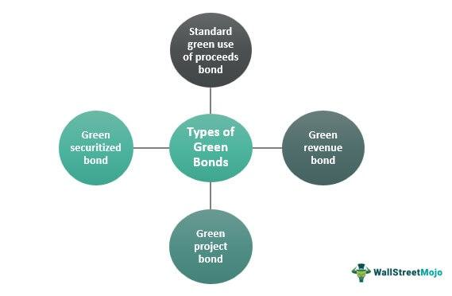

In an era where sustainable finance is increasingly prioritized, understanding the synergy between green bonds and algorithmic trading is crucial for future-focused investors. Green bonds, as a financial instrument, are designed to fund projects with positive environmental impacts, thereby aligning investments with the broader goals of environmental sustainability. These bonds finance a variety of initiatives, such as renewable energy projects, energy efficiency improvements, and sustainable water management systems. Their commitment to strict environmental criteria and reporting obligations distinguishes them from traditional bonds, providing transparency and accountability that appeal to environmentally conscious investors.

Simultaneously, algorithmic trading represents a significant advancement in trading practices, leveraging technology to improve the efficiency and accuracy of transactions in financial markets. By automating the buying and selling processes, algorithmic trading enhances liquidity, reduces transaction costs, and enables the rapid execution of trades. This technology is particularly beneficial for green bonds, given the growing demand for sustainable financial products and the need for efficient market mechanisms to support this demand.



This article explores how green bonds and algorithmic trading together create opportunities for investors seeking both financial returns and environmental benefits. We will define the mechanics of green bonds, examine how algorithmic trading enhances market efficiency, and assess the potential that these innovations hold for investors. By understanding the interplay between these financial tools, investors can better position themselves to contribute to and benefit from the evolving landscape of sustainable finance.

## Table of Contents

## Understanding Green Bonds

Green bonds are a specialized type of fixed-income security designed to raise capital specifically for projects that yield positive environmental outcomes. Unlike conventional bonds, which fund a wide range of general expenditures, green bonds are explicitly allocated to support environmentally sustainable initiatives. These initiatives span a variety of sectors, including renewable energy, energy efficiency, and sustainable water management. The deployment of funds from green bonds must adhere to pre-defined environmental objectives and contribute towards mitigating climate change, preserving ecosystems, or promoting sustainable use of resources.

Green bonds have gained traction due to their ability to align financial markets with broader environmental goals. They provide an avenue for investors to contribute actively to climate action and sustainable development while pursuing financial returns. The appeal of green bonds is further augmented by their compliance with rigorous environmental criteria and reporting obligations. This ensures transparency and accountability, facilitating investor confidence that their investments are actually being used for their intended green purposes.

Issuers of green bonds are typically required to follow the guidelines set by frameworks such as the Green Bond Principles (GBP). These principles outline criteria for project eligibility, management of proceeds, and mandatory reporting on the environmental impact. The reporting is especially crucial as it verifies that the funded projects deliver genuine ecological benefits, thus avoiding greenwashing, where investments are misleadingly marketed as environmentally friendly without substantial backing.

Overall, green bonds represent a vital intersection of finance and sustainability, driving the flow of capital into projects that support environmental resilience and responsible resource management. By meeting both ecological and economic criteria, green bonds offer a compelling proposition for environmentally conscious investors.

## History and Growth of the Green Bond Market

The green bond market has witnessed noteworthy evolution and growth since its inception. The first green bond was issued by the European Investment Bank (EIB) in 2007. This set the stage for a burgeoning market focused on financing projects with positive environmental benefits. These bonds were designed to offer fixed-income investment opportunities while also facilitating the funding of sustainable initiatives such as renewable energy, energy efficiency, and sustainable water management.

In the years following the initial issuance, the green bond market experienced substantial growth, driven largely by the increasing consciousness around environmental, social, and governance ([ESG](/wiki/esg-investing)) criteria among investors. By 2023, the issuance of green bonds reached unprecedented levels, marking a record year for sales. This remarkable growth is attributed to several factors, including heightened demand from investors seeking sustainable financial products that align with their values and principles. The alignment with ESG goals has become a crucial [factor](/wiki/factor-investing) for many asset managers and institutional investors looking to integrate sustainability into their portfolios.

Regulatory support has played a critical role in bolstering the green bond market's expansion. Governments and regulatory bodies worldwide have implemented policies and frameworks encouraging the issuance and investment in green bonds. For instance, the European Union's Green Bond Standard and the United Nations-supported Principles for Responsible Investment have provided guidelines and incentives, further stimulating market growth. 

Moreover, the increasing transparency and standardization in reporting and verifying the environmental impact of projects funded by green bonds have helped mitigate concerns about greenwashing and have enhanced investor confidence. As a result, more corporations and municipalities are considering green bonds as viable financial instruments in their efforts to finance environmentally sustainable projects.

As awareness and regulatory frameworks continue to evolve, the green bond market is expected to maintain its growth trajectory, offering investors opportunities to contribute to environmental sustainability while achieving financial returns.

## Algorithmic Trading: Enhancing Green Bond Investments

Algorithmic trading leverages sophisticated computer algorithms to facilitate the systematic buying and selling of financial securities, including green bonds. This automated approach to trading is designed to execute orders with speed and precision, a distinct advantage in the fast-paced environment of modern financial markets. By efficiently processing high volumes of data, these algorithms can make real-time trading decisions that enhance [liquidity](/wiki/liquidity-risk-premium) and reduce transaction costs, offering significant benefits to green bond markets.

The integration of [algorithmic trading](/wiki/algorithmic-trading) into green bond investments largely enhances market efficiency. One of the primary efficiencies offered by algorithmic trading is the improvement in market liquidity. Liquidity refers to the ease with which an asset can be bought or sold in the market at a stable price, and algorithmic trading can increase this liquidity by ensuring that trades are executed quickly and at the most favorable prices. This is crucial for green bonds, where liquidity concerns can sometimes be more pronounced due to the specificity of the investment criteria and a relatively nascent market.

Moreover, algorithmic trading reduces transaction costs by minimizing the bid-ask spread and exploitation of temporary market inefficiencies. The algorithms can identify and capitalize on these inefficiencies at speeds unattainable by human traders, allowing for continued refinement and adjustment of trading strategies based on real-time data inputs.

A critical aspect of algorithmic trading within the green bond space is the capability to incorporate sustainability metrics within trading algorithms. This ensures that investment decisions are not only driven by financial criteria but also align with environmental, social, and governance (ESG) objectives. By integrating these sustainability indicators, algorithmic trading strategies can prioritize investments in green bonds that meet specific environmental criteria, such as carbon footprint reductions or renewable energy endorsements, thereby maintaining the integrity and purpose of green investments.

In practice, this can involve the utilization of environmental data analytics tools that parse complex datasets to derive actionable insights into the sustainability performance of potential investments. These tools may include [machine learning](/wiki/machine-learning) models that predict environmental impact scores or analyze the alignment of projects with broader sustainability targets set by governmental or international environmental agreements.

Consider the following Python pseudocode that illustrates a simplified model for incorporating ESG factors into algorithmic trading strategies:

```python
class GreenBondAlgorithm:
    def __init__(self, green_bonds):
        self.green_bonds = green_bonds

    def evaluate_esg_scores(self):
        for bond in self.green_bonds:
            bond.esg_score = self.calculate_esg(bond)

    def calculate_esg(self, bond):
        # Hypothetical ESG score calculation
        return (bond.renewable_energy_use * 0.3 +
                bond.carbon_reduction_potential * 0.4 +
                bond.water_efficiency * 0.3)

    def select_optimal_investments(self):
        # Select bonds with the highest ESG scores
        return sorted(self.green_bonds, key=lambda bond: bond.esg_score, reverse=True)[:10]

# Example usage
green_bonds = [...]  # List of green bond objects with attributes like renewable_energy_use, etc.
algorithm = GreenBondAlgorithm(green_bonds)
algorithm.evaluate_esg_scores()
optimal_investments = algorithm.select_optimal_investments()
```

This program demonstrates an approach where a portfolio of green bonds is evaluated and selected based on ESG scores, reflecting the sustainability criteria prioritized by environmentally-conscious investors. The confluence of algorithmic trading and green bonds represents a significant opportunity to advance both financial and environmental objectives, solidifying their role in sustainable finance initiatives.

## Benefits of Investing in Green Bonds through Algo Trading

Green bonds present a compelling investment option for those seeking to align financial returns with environmental responsibility. These fixed-income instruments are designated for financing projects that deliver positive environmental impacts, such as renewable energy and sustainable water management. By committing capital to green bonds, investors not only engage in ethical investing but also gain access to potentially attractive financial returns.

Algorithmic trading, an advanced method of leveraging computer algorithms to automate securities transactions, offers significant advantages when applied to green bond investments. This technology can enhance the efficiency and effectiveness of managing green bond portfolios. Traders can use complex algorithms to process environmental data and integrate sustainable investment criteria, thus optimizing portfolio performance while maintaining alignment with environmental goals.

One salient advantage of algorithmic trading is its ability to process large datasets swiftly, enabling informed investment decisions based on real-time market conditions and detailed environmental metrics. Using environmental data analytics, these algorithms can assess the sustainability metrics associated with each bond. For instance, an algorithm could prioritize bonds funding projects with the highest reductions in carbon emissions per dollar invested, thereby ensuring that investments contribute to impactful environmental outcomes.

Investors benefit from green bonds' potential tax incentives, which governments might offer to promote sustainable projects. Tax incentives can enhance the net return on investment, making green bonds more attractive compared to conventional bonds. Additionally, green bonds typically exhibit lower risk profiles. Their association with reputable projects often backed by government or established corporations contributes to their creditworthiness, presenting a stable investment opportunity.

In conclusion, the integration of algorithmic trading with green bond investments allows investors to efficiently manage portfolios that deliver both financial returns and substantial environmental benefits. By harnessing the power of technology and data, alongside the enduring value of sustainable projects, investors are equipped to achieve both economic and ecological objectives.

## Challenges and Risks in the Integration

Green bonds, though instrumental in supporting environmentally sustainable projects, encounter several challenges and risks, particularly when integrated with algorithmic trading systems. One of the primary challenges faced by green bonds is the issue of greenwashing. Greenwashing involves falsely portraying investments as environmentally friendly, without adhering to genuine sustainable practices. This can undermine investor confidence and dilute the positive impact that green bonds are meant to generate.

Moreover, green bonds are subject to complex verification processes. These bonds must adhere to stringent environmental criteria, which requires thorough evaluation and reporting. Ensuring the accuracy and integrity of such reporting is crucial, as it forms the basis of the investment's credibility. However, this process can be resource-intensive and, if not properly managed, can pose risks to both issuers and investors.

The relative novelty of the green bond market introduces additional challenges, such as liquidity and standardization issues. Liquidity refers to the ease with which an asset can be bought or sold in the market without affecting its price. Due to the relatively new and still growing nature of the green bond market, there may be fewer participants compared to more established markets. This can lead to less liquidity, making it difficult for investors to quickly buy or sell green bonds without impacting their market price.

Standardization is also a key issue. With various issuers and differing criteria for what constitutes a green bond, achieving a consistent standard across the market is challenging. This lack of standardization can complicate the integration of algorithmic trading systems, which rely on clear and consistent data inputs to function effectively.

Algorithmic trading models, which are increasingly used to enhance market efficiency, require high-quality data to operate optimally. For green bonds, this means having access to reliable and precise environmental impact data. However, securing such data can be difficult, given the varying reporting standards and the potential for data inaccuracies. Thus, accurate environmental impact reporting is vital to ensure that algorithmic trading models can correctly assess the sustainability performance of green bond investments.

In summary, while green bonds offer significant opportunities for sustainable finance, they are not without their challenges. Greenwashing, complex verification processes, liquidity issues, and the need for high-quality data all present risks that must be carefully managed to successfully integrate green bonds with algorithmic trading platforms. Addressing these challenges is essential for maintaining the integrity and efficacy of green investments.

## Real-World Examples of Green Bonds in Action

Several noteworthy projects have highlighted the impactful deployment of green bonds, illustrating their effectiveness as financial instruments to promote sustainable development. Among these, the Rampur Hydropower Project in India serves as a prominent example. Funded through green bonds, this project aims to enhance the country's renewable energy capacity by harnessing hydropower to reduce reliance on fossil fuels. The environmental benefits associated with such initiatives are multifaceted, including the reduction of greenhouse gas emissions, fostering energy independence, and supporting local ecosystems.

Corporations have also taken significant strides by issuing green bonds to fund their sustainability objectives. Apple Inc., for instance, has been at the forefront of corporate environmental stewardship by issuing multiple green bonds. These funds have been allocated towards renewable energy projects, energy efficiency upgrades in their facilities, and the advancement of their material recycling programs. Similarly, PepsiCo has utilized green bond proceeds to finance initiatives aimed at improving water use efficiency, reducing packaging waste, and enhancing sustainable agricultural practices. These examples underscore how businesses are integrating sustainability into their core operations, incentivized by the financial and reputational advantages offered by green bond financing.

The tangible impacts of these green bond-funded projects are evident not only in environmental terms but also in their financial performance. Investors are increasingly recognizing the dual benefits of sustainable investments, where financial returns align with positive environmental outcomes. Additionally, projects funded via green bonds often enjoy lower borrowing costs due to the perceived lower risk and high demand for sustainable financial products by ESG-conscious investors. This intersection of finance and sustainability through green bonds represents a strategic approach to addressing global environmental challenges, fostering a more sustainable and resilient future.

## The Future of Green Bonds and Algorithmic Trading

The future trajectory of green bonds appears distinctly promising due to ongoing regulatory enhancements and a steadily expanding investor base. Regulatory bodies worldwide are increasingly formulating frameworks that favor sustainable finance, encouraging the issuance and investment in green bonds. These frameworks are integral in standardizing definitions, ensuring transparency, and mitigating the risks of greenwashing—a practice where non-environmentally friendly projects are misrepresented as green.

One such regulatory example is the European Union’s Green Bond Standard, which is designed to provide issuers with a uniform approach to communicate the environmental impact of projects financed through green bonds. Such regulatory measures serve to attract more investors seeking alignment with Environmental, Social, and Governance (ESG) goals.

Algorithmic trading is poised to significantly enhance the integration of green bonds into diversified investment portfolios. By utilizing advanced algorithms, trading strategies can rapidly process and analyze vast datasets that include sustainability metrics alongside traditional financial metrics. This enables investors to efficiently allocate capital to green investments that not only promise financial returns but also measurable environmental benefits. 

The progression of technology and improvement in data quality are pivotal in this integration. As computational techniques evolve, they are capable of more sophisticated evaluation models which can incorporate environmental impact assessments into their operation. The inclusion of Environmental, Social, and Governance (ESG) factors into algorithmic trading models can help investors identify and mitigate risks while exploiting financial opportunities associated with sustainable projects. Below is a simplified example of a Python snippet that might be used to factor in ESG scores into trade decisions for green bonds:

```python
def evaluate_green_bond_investment(bond_data):
    # Example function to evaluate green bond investment
    esg_weight = 0.7  # Giving a 70% weight to ESG factors
    financial_weight = 0.3  # Giving 30% weight to traditional financial factors
    esg_score = bond_data['esg_score']  # ESG score from trusted data source
    financial_score = bond_data['return_score']  # Predicted financial return
    investment_score = (esg_score * esg_weight) + (financial_score * financial_weight)
    return investment_score

# Example green bond data
green_bond = {'esg_score': 0.85, 'return_score': 0.75}
score = evaluate_green_bond_investment(green_bond)
```

In addition, as industry standards mature, the synergy between green bonds and algorithmic trading will likely foster advancements in achieving sustainable finance objectives. Enhanced standards will facilitate reliable impact reporting and verification, making it easier for investors to trust in the 'greenness' of their contributions.

Looking ahead, the dual forces of regulatory support and technological advancement suggest that the confluence of green bonds and algorithmic trading will play a critical role in the transition to a more sustainable global economy. As technology continues to evolve and embrace environmental considerations, the landscape of green finance will extend its reach, providing a robust platform for investors committed to propelling sustainable economic growth.

## Conclusion

Green bonds offer a strategic opportunity for investors intent on aligning their financial goals with environmental sustainability. These innovative debt instruments serve as catalysts for funding projects that deliver tangible environmental benefits, thereby enabling investors to support green initiatives while seeking financial returns. By channeling capital into environmentally beneficial projects, green bonds embody the dual objectives of profit and ecological responsibility.

Incorporating algorithmic trading into the green bonds market is a significant advancement for scaling and enhancing efficiency. Algorithmic trading utilizes sophisticated computer algorithms to accelerate and optimize trading processes, offering substantial advantages over traditional trading. These algorithms can swiftly process vast quantities of environmental and financial data, facilitating smarter investment decisions that are aligned with both financial and sustainability criteria. This integration not only enhances liquidity and reduces transaction costs but also propels the green bond market towards greater scalability and efficiency.

Embracing these advancements is crucial for investors committed to impactful environmental change and achieving long-term sustainability goals. As regulatory frameworks continue to evolve and technology plays an increasingly integral role in finance, green bonds and algorithmic trading together present a potent avenue for driving sustainable finance forward. The continued growth and maturation of these tools are likely to further embed sustainability into the financial sector, offering investors a powerful means to contribute to a resilient and environmentally conscious global economy.

## References & Further Reading

[1]: Flammer, C. (2021). ["Corporate Green Bonds."](https://www.sciencedirect.com/science/article/pii/S0304405X21000337) Management Science, 67(12), 6994-7015.

[2]: Maltais, A., & Nykvist, B. (2020). ["Understanding the role of green bonds in advancing sustainability."](https://www.tandfonline.com/doi/full/10.1080/20430795.2020.1724864) Journal of Sustainable Finance & Investment.

[3]: Climate Bonds Initiative. (2023). ["Green Bonds Market Summary - 2023."](https://www.climatebonds.net/resources/reports/global-state-market-report-2023)

[4]: HSBC. (2019). ["Green Bonds: A Unique Product Positioning in the Sustainable Finance Market."](https://www.hsbc.com/-/files/hsbc/investors/fixed-income-investors/green-and-sustainability-bonds/pdfs/191001-hsbc-green-bonds-report-2019.pdf?download=1)

[5]: Choudhury, M., & Singh, R. (2021). ["Algorithmic Trading: Benefits, Risks, and Analysis of Regulatory Paradigms."](https://onlinelibrary.wiley.com/doi/10.1002/smj.3215) Arabian Journal for Science and Engineering.

[6]: European Union. (2020). ["EU Green Bond Standard."](https://finance.ec.europa.eu/sustainable-finance/tools-and-standards/european-green-bond-standard-supporting-transition_en) 

[7]: Principles for Responsible Investment (PRI). ["Principles for Responsible Investment."](https://www.unpri.org/about-us/what-are-the-principles-for-responsible-investment) 

[8]: Shishlov, I., Morel, R., & Cochran, I. (2016). ["Beyond Transparency: Unlocking the Full Potential of Green Bonds."](https://www.researchgate.net/profile/Igor-Shishlov/publication/320443734_Beyond_transparency_unlocking_the_full_potential_of_green_bonds/links/59e5b2520f7e9b0e1ab22976/Beyond-transparency-unlocking-the-full-potential-of-green-bonds.pdf?origin=publication_detail) Institute for Climate Economics.