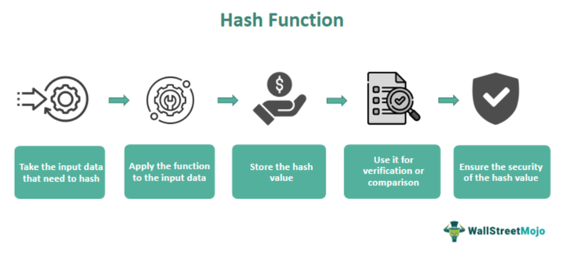

In the fast-evolving landscape of finance, algorithmic trading, often referred to as 'algo trading,' is becoming an indispensable tool for traders. This method leverages computer programs and algorithms to execute trades at speeds and frequencies beyond the capability of human traders. Algo trading's core advantage lies in its ability to analyze vast amounts of market data at high speed, thereby facilitating optimal decision-making processes in trading.

This article explores the synergy between Green Book variants and algorithmic trading to optimize financial operations. Green Books are important governmental publications containing vital financial guidance and economic projections that influence market dynamics. By integrating the detailed analyses and forecasts from Green Books into trading algorithms, traders can enhance the precision and effectiveness of their strategies.



Understanding the Green Book’s role and its variants can provide traders with insights necessary for efficient and strategic trading activities. Each variant, such as those produced by the U.S. Bureau of Fiscal Service and the Federal Reserve, delivers unique information critical to financial analysis and policy-making. These include expectations of government payments, fiscal policies, and macroeconomic indicators that are essential inputs for algorithmic models.

We will examine how Green Books influence financial and economic decisions and explore ways to utilize these insights effectively in algo trading. By aligning algorithmic trading strategies with data from Green Books, traders can improve their risk management and capitalize on market opportunities informed by governmental and institutional forecasts. Consequently, this integration could enhance algorithmic trading's role in strategic planning, contributing to more robust and profitable trading practices in today's complex financial markets.

## Table of Contents

## Understanding Green Book Variants

Green Books are governmental publications that serve as essential guides or reports, varying significantly based on the issuing entity. These documents provide crucial insights into financial transactions and economic projections, making them influential in shaping market activities. They offer detailed information that assists in the strategic planning and decision-making processes essential for both public and private financial entities.

One of the primary variants is the Green Book from the U.S. Bureau of Fiscal Service, which focuses on the guidelines and protocols related to automated government payments. This document is vital for understanding the intricacies of government disbursements and offers key information on the implementation of electronic payment systems. Such data is foundational for financial institutions that facilitate or manage these transactions, ensuring compliance and efficiency in public financial operations.

Another notable variant is the Federal Reserve's Greenbook, which provides economic analyses and forecasts used by the Federal Open Market Committee (FOMC) to make monetary policy decisions. The Greenbook offers extensive data and projections regarding macroeconomic trends, inflation, employment, and other critical economic indicators. This information is instrumental for economists, policymakers, and financial analysts aiming to understand the potential direction of economic policy and its implications on financial markets.

Each Green Book variant serves a distinct purpose, contributing diverse and valuable perspectives on financial analysis and decision-making. The variety in these publications enables comprehensive insight into governmental and economic activities, assisting stakeholders in making informed decisions. Whether guiding automated payment processes or shaping economic policy understanding, Green Books stand as integral resources for financial systems.

## The Role of Algorithmic Trading

Algorithmic trading utilizes automated systems to execute trades efficiently by employing sophisticated statistical models and real-time market data analysis. This technology-driven approach enables traders to capitalize on minute price discrepancies across various markets and execute trades within fractions of a second, which is crucial given the speed and [volatility](/wiki/volatility-trading-strategies) characteristic of modern financial markets.

One of the primary advantages of [algorithmic trading](/wiki/algorithmic-trading) is its ability to process and manage large transaction volumes with precision and minimal human intervention. By automating the trading process, traders can mitigate the effects of emotional and psychological biases, allowing for consistent and disciplined execution according to pre-defined trading strategies. For example, algorithms can automatically execute buy or sell orders when certain technical indicators or price levels are met, ensuring that opportunities are not missed due to human hesitation or error.

The integration of insights from Green Books into algorithmic trading systems further enhances the accuracy and effectiveness of these strategies. Green Books, known for their detailed economic forecasts and financial policy guidelines, offer valuable data that can be utilized to refine and adjust trading algorithms. By incorporating macroeconomic indicators, such as GDP growth rates or [interest rate](/wiki/interest-rate-trading-strategies) trends from Green Books, algorithms can be programmed to adjust their trades based on anticipated market movements, minimizing risk and optimizing returns.

Moreover, algorithmic trading's reliance on comprehensive data analyses, often provided by reports like the Green Books, contributes significantly to its effectiveness. These analyses enable traders to develop and back-test complex models that predict market behavior based on historical data and current economic conditions. Advanced [machine learning](/wiki/machine-learning) techniques can be employed to uncover patterns and correlations within the data, feeding this intelligence back into the trading algorithms to continuously improve their predictive capabilities and operational performance.

In conclusion, algorithmic trading represents a powerful tool in the arsenal of modern traders, offering unparalleled speed, precision, and capacity for integrating vast amounts of economic data. By leveraging insights from Green Book reports alongside cutting-edge statistical analyses, traders can develop robust strategies that adapt to changing market conditions and maximize profitability. Through this synthesis of technology and economic intelligence, the full potential of algorithmic trading can be realized.

## Leveraging Green Book Data in Algo Trading

Traders can use data from Green Books, such as economic forecasts and policy guidelines, to enhance their algorithmic trading strategies. These governmental publications provide predictions and forecasts that are valuable for creating more informed and responsive trading algorithms. By integrating insights from Green Books, traders can tailor their algorithms to better anticipate market trends and fluctuations.

For instance, the economic forecasts provided in Green Books can be translated into predictive signals within a trading algorithm. Suppose a Green Book suggests an impending interest rate hike. A trader could program their algorithm to reduce exposure to interest-sensitive securities ahead of the market, thereby minimizing risk. This anticipatory function can significantly enhance the adaptability and robustness of trading strategies.

To optimize algorithmic models, traders often incorporate Green Book data into their risk management frameworks. Algorithms can be designed to respond dynamically to policy changes or economic indicators cited in these reports, adjusting positions in real time as new information emerges. This synchronization enhances strategic decision-making, allowing traders to react promptly to changes in the fiscal or monetary environment.

Here's a simple Python example illustrating how one might adjust trading strategies based on a policy change indicated in a Green Book:

```python
import pandas as pd

# hypothetical function to load and parse Green Book data
def load_green_book_data():
    # Normally this would load data from the Green Book PDF
    return pd.DataFrame({
        'indicator': ['interest_rate_change'],
        'value': [0.25]  # example indicating a 25 basis point increase
    })

def adjust_strategy(market_data, green_book_data):
    if 'interest_rate_change' in green_book_data['indicator'].values:
        rate_change = green_book_data[green_book_data['indicator'] == 'interest_rate_change']['value'].iloc[0]
        print(f"Adjusting strategy for interest rate change: {rate_change}")
        # Example strategy adjustment
        # Reduce bond positions if interest rates are expected to rise
        market_data['bond_position'] *= (1 - rate_change)

    return market_data

# Load market and Green Book data
market_data = pd.DataFrame({'bond_position': [1000000]})
green_book_data = load_green_book_data()

# Adjust trading strategy based on Green Book insights
adjusted_market_data = adjust_strategy(market_data, green_book_data)
print(adjusted_market_data)
```

In this example, a simple adjustment is made to a bond position based on an anticipated interest rate change from Green Book data. Though rudimentary, the script highlights how algorithmic strategies can be seamlessly adjusted in response to policy changes.

Moreover, real-world applications demonstrate how traders modify their algorithmic approaches based on insights from fiscal or monetary policy updates published in Green Books. For example, an algorithm might change its asset allocation strategy immediately after a Green Book indicates a shift in government spending. By incorporating such data, the algorithm remains agile and better suited to maximize profitable trading opportunities.

Through the calculated integration of Green Book data, traders not only protect against downside risks but also leverage potential market opportunities, aligning their algorithms with the evolving economic and financial landscapes.

## The Benefits of Integrating Functionality

The integration of Green Book insights into algorithmic trading systems provides a robust framework for comprehensive financial market analysis. By harnessing insights from these governmental publications, traders can significantly enhance the precision of their trading strategies. This precision is largely attributed to informed decision-making that leverages detailed financial data, economic forecasts, and policy guidelines offered by Green Books.

Green Books often contain crucial information about fiscal policy shifts, macroeconomic projections, and other economic indicators. By embedding these insights into algorithmic trading models, traders are better equipped to anticipate changes in market dynamics. For example, a Green Book might provide projections on interest rate changes, which can be used to adjust trading algorithms accordingly. This anticipatory approach allows traders to align their strategies with expected market movements, providing them with a competitive edge.

A practical implementation might involve the use of Python to update trading algorithms based on Green Book data. Below is a Python snippet demonstrating how such data might be integrated:

```python
import pandas as pd

# Sample Green Book data: Interest rate projections
green_book_data = pd.DataFrame({
    'Date': ['2023-01-01', '2023-06-01', '2024-01-01'],
    'Interest_Rate_Projection': [1.5, 1.75, 2.0]
})

# Sample trading algorithm adjustment based on interest rate projections
def adjust_trading_strategy(current_rate, projected_rate):
    if projected_rate > current_rate:
        return "Increase bond holdings"
    else:
        return "Shift to equities"

# Current interest rate
current_interest_rate = 1.5

# Adjust strategy based on next projection
strategy = adjust_trading_strategy(current_interest_rate, green_book_data['Interest_Rate_Projection'][1])
print(f"Trading Strategy: {strategy}")
```

Ultimately, the synergy between comprehensive data-driven forecasting and algorithmic execution can significantly enhance trading performance and profitability. This integration not only refines risk management but also aligns trading activities with projected economic conditions. As traders increasingly rely on sophisticated algorithms, the inclusion of Green Book data offers a strategic advantage in navigating the complexities of financial markets.

## Conclusion and Future Outlook

As financial markets continue to evolve, the reliance on Green Books for strategic planning and algorithmic trading is expected to gain importance. Green Books, with their extensive economic forecasts and policy guidelines, offer vital insights that traders can leverage for a strategic advantage. Staying informed about the latest updates in Green Books ensures that traders are equipped with relevant and timely data, crucial for adapting and refining their trading strategies amidst shifting market landscapes.

The future of trading is fundamentally intertwined with the integration of comprehensive data analysis and advanced trading algorithms. The incorporation of Green Book insights into algorithmic systems enables traders to build robust, data-driven models that can adeptly predict market movements. This approach not only enhances the precision of trading executions but also provides the data-backed confidence necessary for effective risk management and strategic decision-making.

By systematically leveraging Green Book data, traders position themselves to better navigate the financial world's complexities. This strategy involves embedding predictive insights from Green Books into the architecture of algorithmic trading systems, thus fostering a blend of qualitative knowledge and quantitative execution. As algorithmic trading platforms continue to evolve, traders who incorporate these authoritative data sources are likely to achieve superior trading performance and profitability.

Ultimately, the synergy between Green Book data and algorithmic trading marks a paradigm shift towards more informed trading practices. As markets are increasingly influenced by automated decision-making, traders who stay attuned to Green Book updates will maintain their strategic edge, ready to capitalize on emerging opportunities and adeptly manage potential risks. This convergence of strategic foresight and technological execution underscores the future trajectory of financial trading.

## References & Further Reading

[1]: ["Advances in Financial Machine Learning"](https://www.amazon.com/Advances-Financial-Machine-Learning-Marcos/dp/1119482089) by Marcos Lopez de Prado

[2]: ["Quantitative Trading: How to Build Your Own Algorithmic Trading Business"](https://www.amazon.com/Quantitative-Trading-Build-Algorithmic-Business/dp/1119800064) by Ernest P. Chan

[3]: ["Machine Learning for Algorithmic Trading"](https://www.amazon.com/Machine-Learning-Algorithmic-Trading-alternative/dp/1839217715) by Stefan Jansen

[4]: ["Evidence-Based Technical Analysis: Applying the Scientific Method and Statistical Inference to Trading Signals"](https://www.amazon.com/Evidence-Based-Technical-Analysis-Scientific-Statistical/dp/0470008741) by David Aronson

[5]: Bergstra, J., Bardenet, R., Bengio, Y., & Kégl, B. (2011). ["Algorithms for Hyper-Parameter Optimization."](https://dl.acm.org/doi/10.5555/2986459.2986743) Advances in Neural Information Processing Systems 24.