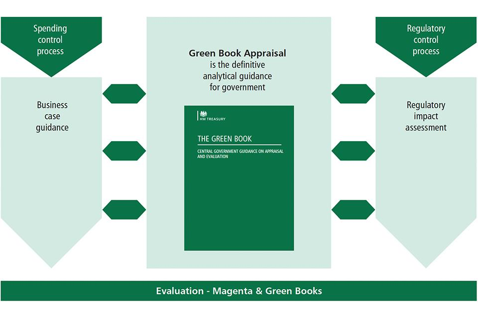

## Table of Contents

## What is the Green Book?

The Green Book is a guide that was very important for African American travelers during the time of racial segregation in the United States. It was created by Victor Hugo Green in 1936 and was called "The Negro Motorist Green Book." The book listed places like hotels, restaurants, and gas stations where African Americans were welcome. This was very helpful because during segregation, many places did not allow African Americans to enter or use their services.

The Green Book helped African Americans travel more safely and comfortably. It was published every year until 1967. The guide was needed because of the unfair laws and practices that made traveling difficult and dangerous for African Americans. The Green Book gave them a way to plan their trips and know where they could stop without facing discrimination. It played a big role in helping African Americans during a tough time in history.

## Who created the Green Book and why was it needed?

The Green Book was created by a man named Victor Hugo Green. He started it in 1936. Green was a postal worker in New York and he saw that African Americans needed help when they traveled. At that time, the United States had laws and rules called segregation that made life hard for African Americans. These rules said that black people could not go to the same places as white people, like restaurants, hotels, and even restrooms. This made traveling very difficult and sometimes dangerous for African Americans.

The Green Book was needed because it helped African Americans find safe places to stop while traveling. It listed hotels, restaurants, and gas stations that welcomed black people. This was important because many places did not allow African Americans to enter or use their services. The Green Book made traveling easier and safer for African Americans during a time when they faced a lot of discrimination. It was published every year until 1967 and helped many people during a tough time in history.

## When was the Green Book first published and how long was it in circulation?

The Green Book was first published in 1936. It was made by Victor Hugo Green to help African Americans travel safely during a time when the United States had segregation laws. These laws made it hard for black people to find places to eat, sleep, and get gas while traveling because many places did not allow them in.

The Green Book was in circulation for over 30 years. It was published every year until 1967. During this time, it listed places like hotels, restaurants, and gas stations where African Americans were welcome. This guide was very important because it helped make traveling easier and safer for African Americans during a difficult time in history.

## What types of establishments were listed in the Green Book?

The Green Book listed many types of places that were safe for African Americans to visit during segregation. These places included hotels where African Americans could stay overnight. It also listed restaurants where they could eat without being turned away. Gas stations were another important type of place listed in the book, so African Americans could fill up their cars on long trips.

The Green Book also had other kinds of businesses in it. For example, it listed beauty salons and barber shops where African Americans could get their hair done. There were also listings for drugstores and nightclubs that welcomed black customers. These places were important because they provided services and a place to relax and have fun without facing discrimination.

## How did the Green Book help African American travelers during segregation?

The Green Book helped African American travelers a lot during segregation. It was like a special guide that told them where they could go safely. During segregation, many places did not let African Americans in. They could not eat in some restaurants, stay in some hotels, or even use some gas stations. The Green Book listed places that welcomed African Americans. It had hotels where they could sleep, restaurants where they could eat, and gas stations where they could fill up their cars. This made traveling much easier and safer for them.

The Green Book was really important because it helped African Americans plan their trips. They could look at the book and know where to stop along the way. This was a big help because they did not have to worry about being turned away or facing danger. The book was used from 1936 until 1967. It made a big difference in the lives of many African American travelers during a hard time in history.

## What were the key features and sections included in the Green Book?

The Green Book was a helpful guide for African American travelers during segregation. It had different sections to make it easy to find safe places to stop. One key section was for hotels and motels where African Americans could stay overnight. Another important section was for restaurants that welcomed black customers. There was also a section for gas stations, which was very useful for long trips because African Americans needed to know where they could fill up their cars without facing discrimination.

The Green Book also included sections for other types of businesses. There were listings for beauty salons and barber shops where African Americans could get their hair done. Drugstores and nightclubs were also listed, providing places where black people could buy medicine or relax and have fun without being turned away. The guide even had sections for places like tourist homes and boarding houses, which offered another option for lodging. All these sections together made the Green Book a very important tool for African American travelers during a difficult time in history.

## How did the Green Book evolve over time in terms of content and format?

The Green Book started in 1936 and changed a lot over the years. At first, it was just a small guide that listed places in New York where African Americans could go. As more people used it, the Green Book grew bigger. It started to include more cities and states across the whole country. By the 1940s, it had sections for hotels, restaurants, and gas stations in many different places. The guide also began to list other types of businesses like beauty salons, barber shops, and nightclubs where African Americans were welcome.

Over time, the format of the Green Book also changed. In the beginning, it was a simple booklet. But as it got more popular, it became thicker and more detailed. The guide started to include maps and advertisements from businesses that wanted to show they welcomed African Americans. By the 1950s and 1960s, the Green Book was a well-known and trusted resource for black travelers. It helped them plan their trips and find safe places to stop until it stopped being published in 1967.

## What were some of the challenges faced by the Green Book's publisher and users?

The publisher of the Green Book, Victor Hugo Green, faced many challenges. One big problem was making sure the information in the book was right. He had to check that all the places listed still welcomed African Americans. This was hard because places could change their rules or close down. Another challenge was getting enough money to keep publishing the book. Green had to find businesses willing to pay for ads in the Green Book to help cover the costs.

Users of the Green Book also had a lot of challenges. Traveling during segregation was scary and hard for African Americans. They had to [carry](/wiki/carry-trading) the Green Book with them and use it to plan every part of their trip. They needed to know where they could eat, sleep, and get gas without facing discrimination or danger. Even with the Green Book, there were times when they might still be turned away or treated badly. But the Green Book gave them a way to feel a little safer and more confident when they traveled.

## Are there any notable stories or experiences related to the use of the Green Book?

One famous story about the Green Book is about a family trip taken by a man named George. George and his family used the Green Book to plan their vacation. They drove from New York to Florida. Along the way, they used the Green Book to find safe places to eat and sleep. One night, they found a hotel listed in the book that welcomed African Americans. They were so happy to have a comfortable place to stay after a long day of driving. Without the Green Book, their trip would have been much harder and more stressful.

Another story is about a woman named Clara who used the Green Book to visit her relatives in the South. Clara was nervous about traveling because she knew it could be dangerous for African Americans. But the Green Book helped her feel safer. She used it to find a restaurant where she could have a nice meal without being turned away. She also found a gas station where she could fill up her car. Clara was so thankful for the Green Book because it made her trip easier and less scary. These stories show how important the Green Book was for African American travelers during segregation.

## How has the legacy of the Green Book influenced modern travel and civil rights?

The Green Book has left a big mark on modern travel and civil rights. It showed how important it is for everyone to be treated fairly when they travel. Today, many people remember the Green Book and use its story to talk about how we can make travel better for everyone. It helps us understand that everyone should be able to go places without being treated badly. This idea has made travel companies and places like hotels and restaurants think more about how they treat their customers.

The Green Book also helps us learn about civil rights. It reminds us of a time when African Americans had to fight for their rights, even when traveling. Its story has inspired movies, [books](/wiki/algo-trading-books), and talks about how we can make the world a fairer place. The Green Book's legacy pushes us to keep working so that everyone can travel safely and happily, no matter who they are. It's a big part of why we keep fighting for equal rights today.

## What efforts have been made to preserve and digitize the Green Book?

People have worked hard to keep the Green Book alive and make it easier for everyone to see. The New York Public Library has a big collection of Green Books. They have put them online so anyone can look at them. This helps people learn about the Green Book and how it helped African Americans during segregation. The library's website has pictures of the books and information about them. This way, the Green Book's history is saved for future generations.

Other groups and schools have also helped. They have made projects to study the Green Book and share its stories. Some have made apps and websites where you can see where the places listed in the Green Book used to be. These efforts help us remember how important the Green Book was and how it changed the lives of many people. By keeping the Green Book's history alive, we can learn from it and work to make the world a better place for everyone.

## How can researchers and historians utilize the Green Book for studies on American history and civil rights?

Researchers and historians can use the Green Book to learn a lot about American history and civil rights. The Green Book shows what life was like for African Americans during segregation. It tells us about the places they could go and the challenges they faced when they traveled. By studying the Green Book, researchers can understand how African Americans had to plan their trips carefully to stay safe. They can also see how businesses that welcomed African Americans helped make travel easier and more comfortable during a hard time.

The Green Book is also important for studying civil rights. It shows how African Americans fought for their rights, even in small ways like finding safe places to eat and sleep. Historians can use the Green Book to talk about how segregation affected everyday life and how people worked together to make things better. The stories and experiences in the Green Book help us see the bigger picture of the civil rights movement. By looking at the Green Book, researchers can learn about the strength and courage of African Americans during a time when they were treated unfairly.

## References & Further Reading

[1]: ["Advances in Financial Machine Learning"](https://www.amazon.com/Advances-Financial-Machine-Learning-Marcos/dp/1119482089) by Marcos Lopez de Prado

[2]: ["Quantitative Trading: How to Build Your Own Algorithmic Trading Business"](https://www.amazon.com/Quantitative-Trading-Build-Algorithmic-Business/dp/1119800064) by Ernest P. Chan

[3]: ["Machine Learning for Algorithmic Trading"](https://www.amazon.com/Machine-Learning-Algorithmic-Trading-alternative/dp/1839217715) by Stefan Jansen

[4]: ["Evidence-Based Technical Analysis: Applying the Scientific Method and Statistical Inference to Trading Signals"](https://www.amazon.com/Evidence-Based-Technical-Analysis-Scientific-Statistical/dp/0470008741) by David Aronson

[5]: Bergstra, J., Bardenet, R., Bengio, Y., & Kégl, B. (2011). ["Algorithms for Hyper-Parameter Optimization."](https://dl.acm.org/doi/10.5555/2986459.2986743) Advances in Neural Information Processing Systems 24.