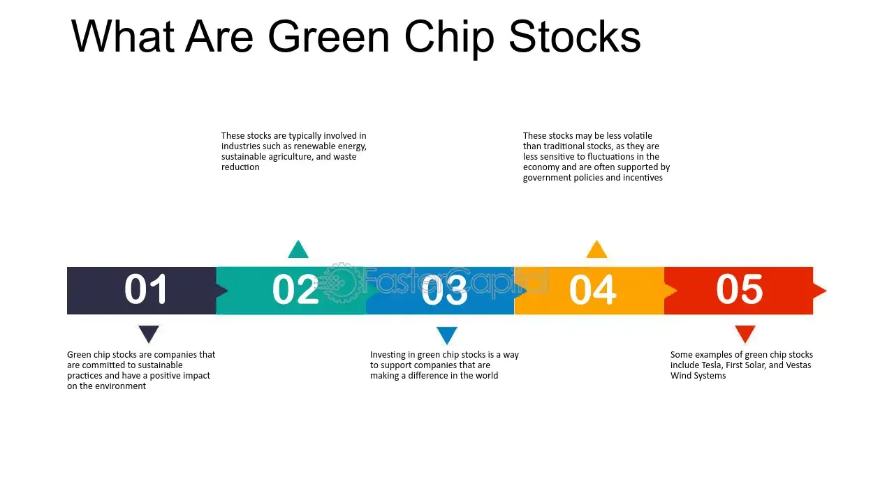

## Table of Contents

## What are green chip stocks?

Green chip stocks are stocks from companies that focus on being good to the environment. These companies work on things like making clean energy, reducing waste, and using resources in a way that doesn't harm the planet. People who care about the environment might choose to invest in these stocks because they want to support businesses that are trying to make the world a better place.

Investing in green chip stocks can be a way to make money while also helping the environment. These stocks can be from big companies that are well-known for their green efforts, or smaller companies that are just starting to make a difference. Like any investment, green chip stocks can go up or down in value, so it's important to do research and understand the risks before buying them.

## How do green chip stocks differ from traditional stocks?

Green chip stocks are different from traditional stocks because they come from companies that focus on helping the environment. These companies might work on things like making clean energy from the sun or wind, or finding ways to use less water and make less trash. Traditional stocks, on the other hand, can be from any kind of company, no matter if it's good or bad for the environment. So, when you buy green chip stocks, you're choosing to support businesses that care about the planet.

Another way green chip stocks differ is that they often attract investors who want to make money and also do something good for the world. These investors might feel good about their choice because they know their money is going to companies that are trying to solve big problems like climate change. Traditional stocks might not give that same feeling because they don't always focus on being eco-friendly. But, like all stocks, green chip stocks can still go up or down in value, so they come with risks just like traditional stocks do.

## What are the main segments of green chip stocks?

Green chip stocks can be divided into a few main segments. One big segment is renewable energy. This includes companies that make power from the sun, wind, or water. These companies help us move away from using dirty energy like coal and oil. Another segment is energy efficiency. These companies make products that help us use less energy, like better light bulbs or smart thermostats. They help save money and reduce our impact on the environment.

Another important segment is waste management and recycling. These companies work on ways to deal with trash in a better way, like turning it into new products or making sure it doesn't harm the planet. There's also a segment called sustainable agriculture. These companies focus on farming in ways that are good for the earth, like using fewer chemicals and protecting the soil. Each of these segments plays a big role in making our world greener and cleaner.

Lastly, there's the segment of green transportation. This includes companies that make electric cars, bikes, or even better public transport systems. These companies help reduce the pollution that comes from driving. All these different segments of green chip stocks show how many ways there are to invest in a better future for our planet.

## Can you provide examples of companies in each segment of green chip stocks?

In the renewable energy segment, a well-known company is NextEra Energy. They make a lot of their power from the sun and wind. Another company in this segment is Vestas, which makes wind turbines that help create clean energy. In the energy efficiency segment, you can find companies like Honeywell, which makes smart thermostats and other products that help save energy. Another example is Philips, known for their energy-saving light bulbs.

For waste management and recycling, Waste Management Inc. is a big name. They work on ways to deal with trash better, like recycling and turning waste into energy. In the sustainable agriculture segment, companies like Beyond Meat focus on making plant-based foods that are good for the earth. Another company, John Deere, makes farming equipment that helps farmers use fewer chemicals and take better care of the soil.

In the green transportation segment, Tesla is famous for their electric cars that don't use gas and don't pollute the air. Another company, Proterra, makes electric buses that help make public transport cleaner. These examples show how different companies are working in different ways to make our planet a better place.

## What factors should be considered when investing in green chip stocks?

When thinking about investing in green chip stocks, it's important to look at how well the company is doing. You want to see if they are making money and growing. Check their financial reports to see if they are profitable and if people are buying their products. It's also good to understand the industry they are in. For example, if a company makes solar panels, you should know about the future of solar energy and if it's getting more popular. Another thing to think about is the competition. Are there other companies doing the same thing, and how is this company different or better?

Another big [factor](/wiki/factor-investing) is how committed the company is to being green. Some companies might talk a lot about being good for the environment but not do much. Look for companies that have real plans and actions to help the planet. It's also important to think about government rules and support. Some countries give money or other help to green companies, which can make them a better investment. Lastly, consider your own values. Investing in green chip stocks can make you feel good because you're helping the environment, but remember that all investments can go up or down, so always do your homework first.

## How has the performance of green chip stocks compared to the broader market in recent years?

In recent years, green chip stocks have had ups and downs, just like the broader market. Overall, they have done pretty well, especially as more people and governments focus on fighting climate change. For example, in 2020, when the world was dealing with the COVID-19 pandemic, many green chip stocks, like those in renewable energy, saw big jumps in their stock prices. This was because people were looking for ways to invest in a better future, and governments started giving more money to green projects.

But green chip stocks can also be more risky than the broader market. They depend a lot on new technology and government policies, which can change quickly. For instance, in 2021 and 2022, some green chip stocks went down because of higher costs and supply chain problems. Still, over the long term, many green chip stocks have grown faster than the broader market, especially as the world moves towards using more clean energy and sustainable practices.

## What government policies and incentives impact green chip stocks?

Government policies and incentives can have a big impact on green chip stocks. For example, when governments give money or tax breaks to companies that make clean energy, like solar or wind power, it can help those companies grow and make more money. This makes their stocks more attractive to investors. Also, if a government sets rules that make it harder for companies to pollute, it can push more people to buy from green companies. This can make green chip stocks go up in value.

On the other hand, if a government decides to take away these incentives or change the rules, it can hurt green chip stocks. For instance, if a new law makes it harder for a solar company to build new projects, that company's stock might go down. Governments around the world are trying to fight climate change, so they often create policies to help green companies. But these policies can change, and investors need to keep an eye on what's happening to understand how it might affect their green chip stock investments.

## What are the risks associated with investing in green chip stocks?

Investing in green chip stocks can be risky because they often depend a lot on new technology. If the technology doesn't work as well as expected or costs too much, the company might not make money. Also, green companies can be smaller and newer than other companies, which means they might not have a long track record of doing well. This can make their stocks go up and down a lot, which can be scary for investors.

Another big risk comes from government policies. Governments can give money or tax breaks to green companies, but they can also take these away or change the rules. If a government decides to stop helping green companies, their stocks might go down. Also, green chip stocks can be affected by what people think about the environment. If people start caring less about being green, it might hurt these companies. So, while green chip stocks can be a good way to invest in a better future, they come with risks that investors need to think about carefully.

## How can investors analyze the sustainability practices of companies within green chip stock segments?

To analyze the sustainability practices of companies in green chip stock segments, investors can start by looking at the company's own reports. Many companies put out yearly reports called sustainability or [ESG](/wiki/esg-investing) (Environmental, Social, and Governance) reports. These reports tell you about the company's goals for helping the environment, what they are doing to reach those goals, and how well they are doing. Investors should look for clear plans and real actions, not just promises. It's also helpful to see if the company has set targets for things like reducing carbon emissions or using less water, and if they are meeting those targets.

Another way to analyze sustainability practices is to use ratings from third-party organizations. Groups like MSCI, Sustainalytics, and the CDP give scores to companies based on how green they are. These scores can help investors see how a company compares to others in its industry. Investors can also look at what other people are saying about the company. News articles, blogs, and reports from environmental groups can give more information about the company's real impact on the environment. By putting all this information together, investors can get a good picture of a company's sustainability practices and make better choices about which green chip stocks to buy.

## What role do green chip stocks play in achieving global sustainability goals?

Green chip stocks are important for reaching global sustainability goals because they help bring money and attention to companies that are trying to make the world a better place. When people buy these stocks, they are supporting businesses that focus on things like clean energy, reducing waste, and using resources in a way that doesn't harm the planet. This support can help these companies grow and make a bigger impact. For example, if more people invest in companies that make solar panels, those companies can build more factories and make solar energy cheaper and more available. This helps us move away from dirty energy like coal and oil, which is a big part of fighting climate change.

Also, green chip stocks can encourage other companies to be more sustainable. When companies see that investors are interested in green businesses, they might start to change their own practices to be more eco-friendly. This can lead to a bigger shift towards sustainability across many industries. Governments also pay attention to what investors are doing. If they see that green chip stocks are popular, they might create more policies and incentives to support green companies. This can speed up the work towards global sustainability goals, like those set by the Paris Agreement, by making it easier for green companies to succeed and grow.

## How are technological advancements influencing the growth of green chip stock segments?

Technological advancements are really helping green chip stock segments grow. New technology is making it easier and cheaper to make clean energy from the sun, wind, and other renewable sources. For example, better solar panels and wind turbines mean that companies can produce more energy with less cost. This makes their stocks more attractive to investors because the companies can make more money. Also, technology is helping with energy efficiency. Smart thermostats and LED lights save energy, and the companies that make these products are doing well because people want to use less power and save money.

Another way technology is helping is by making it easier to recycle and manage waste better. New machines and methods can turn trash into new products or energy, which is good for the environment. Companies that do this are seeing their stocks go up because they are solving big problems. Technology is also changing how we grow food and move around. With things like plant-based foods and electric cars, companies in these areas are growing fast. Investors like green chip stocks because they know technology is making these companies better at what they do, which helps the planet and can make them money too.

## What are the future trends and predictions for green chip stocks and their segments?

In the future, green chip stocks are expected to keep growing as more people and governments care about the environment. Renewable energy companies, like those that make solar and wind power, will likely see a lot of growth. This is because the world is trying to use less dirty energy like coal and oil. Also, technology is getting better and cheaper, which helps these companies make more money. Energy efficiency will be another big area, with more smart homes and buildings using less power. Companies that make things like smart thermostats and LED lights should do well as people want to save energy and money.

Waste management and recycling companies will also see growth as we try to deal with trash in better ways. New technology can turn waste into new products or energy, which is good for the environment and can make these companies more profitable. Sustainable agriculture will become more important too, as we look for ways to grow food that are good for the earth. Companies that make plant-based foods or help farmers use fewer chemicals will likely see their stocks go up. Finally, green transportation, like electric cars and bikes, will keep growing as we try to reduce pollution from driving. All these trends show that green chip stocks can be a good investment for the future, as they help make the world a better place.

## References & Further Reading

[1]: ["Advances in Financial Machine Learning"](https://www.amazon.com/Advances-Financial-Machine-Learning-Marcos/dp/1119482089) by Marcos Lopez de Prado

[2]: Jones, S., & Fletcher, R. (2021). ["Sustainable Investing: Revolutions in Theory and Practice."](https://www.taylorfrancis.com/books/edit/10.4324/9781315558837/sustainable-investing-cary-krosinsky-sophie-purdom) Journal of Multinational Financial Management, 59.

[3]: Kotsantonis, Sakis, and Serafeim, George. (2019). ["Four Things No One Will Tell You About ESG Data."](https://papers.ssrn.com/sol3/papers.cfm?abstract_id=3420297) Harvard Business Review.

[4]: Tenter, A. S., & Sudhaker, M. (2020). ["Algorithmic Trading and Strategies."](https://www.researchgate.net/publication/345319146_Algorithmic_Trading_and_Strategies) Springer.

[5]: ["Renewable Energy Finance: Power Policies and Investment Opportunities"](https://www.sciencedirect.com/science/article/pii/S0306261921010278) by B. A. Gunn & B. F. Gunn