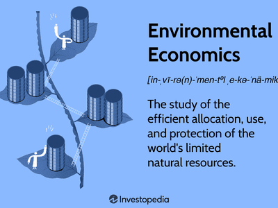

The intersection of sustainable development, green economics, economic critiques, and algorithmic trading represents a complex landscape with significant implications for modern economies. Green economics is an approach that aims to balance human development with the imperative of environmental stewardship by valuing natural and ecological capital as essential components of economic systems. This perspective seeks to address the shortcomings of traditional economic models, which often overlook the finite nature of ecological resources and ecosystem services.

Sustainable development, a closely related concept, focuses on ensuring that the needs of the present are met without compromising the ability of future generations to meet their own needs. It emphasizes the long-term management of resources by integrating environmental, economic, and social development factors. The Sustainable Development Goals (SDGs) established by the United Nations serve as a global framework for promoting this holistic vision.



Economic critiques highlight several challenges faced by green economics and sustainable development initiatives. For instance, the reliance on high-tech solutions and the use of rare earth materials in green technologies raise concerns about accessibility and environmental impact, suggesting the need for more inclusive and practical applications of these concepts.

Algorithmic trading, characterized by the use of sophisticated algorithms to execute trades with high efficiency and speed, is increasingly dominant in financial markets. While it offers improved market efficiency, it can also promote a short-term focus in investments, potentially clashing with the longer-term objectives of green economics and sustainable development. However, integrating sustainable criteria into these trading models offers an avenue to align financial innovation with environmental goals.

This article explores the interplay between these concepts and examines how they can be harmonized to address global economic and environmental challenges. It also considers the economic critiques and the potential role of algorithmic trading in fostering sustainable and environmentally conscious economic developments.

## Table of Contents

## Understanding Green Economics

Green economics is an approach that aims to balance economic growth with environmental sustainability. Unlike traditional economic models, which often prioritize short-term profits and cost minimization, green economics seeks to incorporate ecological considerations into economic decision-making processes. The core philosophy of green economics revolves around the integration of sustainable practices that value natural capital, which includes resources such as forests, waterways, and clean air, and ecological services like pollination, climate regulation, and nutrient cycling.

One of the fundamental concepts in green economics is natural capital accounting. This approach seeks to assign a monetary value to the natural resources and services provided by ecosystems. The intention behind this is to provide a clearer picture of economic costs and benefits that include environmental impacts. Incorporating natural capital into economic systems encourages conservation and sustainable resource management, promoting policies that align economic activities with ecological health.

Implementation of green economic principles often involves the adoption of practices that minimize environmental degradation. For example, renewable energy usage, waste reduction techniques, and sustainable agricultural methods are endorsed to decrease ecological footprints. Businesses and governments are encouraged to support technologies and innovations that reduce carbon emissions and waste while encouraging resource efficiency.

Prominent theories supporting green economics emphasize the role of policy interventions in guiding economic development toward sustainability. For instance, carbon pricing, whether through taxes or cap-and-trade systems, is advocated as a mechanism to internalize environmental costs and incentivize reductions in greenhouse gas emissions. Similarly, subsidies for renewable energy projects and investments in green infrastructure are promoted to stimulate a transition to a low-carbon economy.

Overall, green economics provides a framework for transforming traditional economic systems to prioritize long-term ecological health alongside economic prosperity. By valuing natural capital and aligning development with sustainability, green economics seeks to create resilient economies that benefit people and the planet.

## Sustainable Development Goals (SDGs)

Sustainable development is a multifaceted approach that seeks to fulfill present needs while safeguarding the ability of future generations to meet their own needs. Central to this approach is the recognition of the interconnectedness of environmental, economic, and social dimensions. The United Nations Sustainable Development Goals (SDGs) represent a comprehensive blueprint designed to guide global efforts in achieving this balance. 

Adopted in 2015, the 17 SDGs serve as aspirational objectives, each addressing different critical aspects of sustainable development. These goals range from eradicating poverty (Goal 1) and ensuring quality education (Goal 4) to promoting affordable and clean energy (Goal 7) and taking urgent action to combat climate change (Goal 13). Collectively, they emphasize the need for integrative strategies that concurrently advance economic growth, social inclusion, and environmental protection.

The SDGs acknowledge the importance of systemic change and enhanced collaboration between nations, communities, and individuals. For instance, Goal 8 focuses on promoting sustained, inclusive, and sustainable economic growth, which involves fostering productivity and technological innovation while ensuring decent work for all. Meanwhile, Goal 10 tackles inequality by encouraging policies that provide equal opportunities and reduce disparities, both within and among countries.

Achieving these goals requires commitments from all sectors of society, including governments, businesses, and civil societies. Such commitments involve policy reforms, investments in sustainable technologies, and the fostering of partnerships that transcend traditional boundaries. A crucial component of realizing the SDGs is the continuous monitoring and assessment of progress through data-driven insights and scientific research.

The SDGs emphasize that sustainable development cannot be divorced from its economic and social contexts. For example, advancing clean energy (Goal 7) is not just about technological adoption but also about ensuring access and equity, particularly in underserved regions. This integrative vision underscores the necessity for coherent and coordinated policies that leverage synergies and mitigate trade-offs among different development sectors.

In summary, the Sustainable Development Goals propose a holistic framework for envisioning and enacting a sustainable future. They call for transformative changes that prioritize the well-being of both people and the planet, ensuring that progress made today contributes to a more equitable, resilient, and sustainable tomorrow.

## Critiques of Green Economics

Critics of green economics argue that the framework has been largely ineffectual in decoupling economic growth from environmental detriment. A significant challenge is the reliance on advanced technological solutions, which are pivotal to the green economic model yet are not universally accessible. This reliance can exacerbate inequalities, particularly in developing regions where access to cutting-edge technology is limited. Another critical issue is the dependence on rare earth materials essential for many green technologies, such as solar panels and electric vehicle batteries. The extraction and processing of these materials often entail considerable environmental degradation and social injustices, contradicting the core principles of green economics.

Furthermore, the current models of green economics have been critiqued for their inadequate incorporation of diverse socio-economic contexts, leading to approaches that may not be practical or effective globally. There is an increasing call for revising these models to be more inclusive and adaptable to varying regional demands and capabilities. This includes developing methodologies that consider local economic conditions, cultural values, and ecological systems, ensuring that sustainable practices are not only theoretically sound but practically applicable across different settings.

To address these critiques, proponents suggest that green economics should integrate more robust socio-economic impact assessments and foster technological innovations that are both sustainable and accessible. This could be achieved by conducting interdisciplinary research that blends environmental science, economics, and social policy to produce holistic solutions. Encouraging open-source technology and sharing knowledge across borders could democratize access to high-tech solutions necessary for sustainable growth. Revising green economic models to rectify these shortcomings could significantly enhance their effectiveness and global applicability.

## Impact of Algorithmic Trading on Green Economics

Algorithmic trading, a cornerstone of modern financial markets, employs complex algorithms and high-speed computers to automate trading processes. This method has revolutionized trading by enhancing efficiency, reducing transaction costs, and facilitating the swift execution of trades. However, its influence on green economics raises significant considerations, especially regarding its compatibility with sustainable and long-term investment objectives.

The primary critique of [algorithmic trading](/wiki/algorithmic-trading) within the context of green economics is its inherent predisposition towards short-term gains. Algorithms are traditionally designed to exploit momentary market inefficiencies, often prioritizing immediate returns over long-term value creation. This short-termism can deter investments in sustainable ventures, which typically require a longer timeframe to realize their potential environmental and economic returns. Consequently, the prevalent use of algorithmic trading may inadvertently perpetuate investment patterns that are misaligned with the principles of green economics.

Despite this challenge, integrating sustainable criteria into algorithmic trading models presents a viable opportunity for the promotion of green investments. By embedding Environmental, Social, and Governance ([ESG](/wiki/esg-investing)) factors into trading algorithms, investors can shift focus towards sustainability-oriented assets. This integration could be achieved through the development of algorithms that weigh environmental impact alongside financial performance, thereby fostering a more balanced investment strategy that supports sustainable growth.

Python, a versatile programming language frequently used in algorithmic trading, offers the tools to incorporate such sustainable criteria into trading algorithms. For instance, a basic model could be programmed as follows:

```python
def green_investment_algorithm(asset_data, sustainability_threshold):
    green_assets = []
    for asset in asset_data:
        if asset['ESG_score'] > sustainability_threshold:
            green_assets.append(asset)
    return green_assets

# Example usage
assets = [{'name': 'Company A', 'ESG_score': 85}, {'name': 'Company B', 'ESG_score': 75}]
sustainable_portfolio = green_investment_algorithm(assets, 80)
```

This simple algorithm filters assets based on their ESG score, allowing traders to prioritize investments with higher sustainability metrics. By utilizing such strategies, algorithmic trading can align more closely with the objectives of green economics, encouraging investments that are not only financially sound but also environmentally responsible.

In conclusion, while algorithmic trading poses challenges to the core objectives of green economics through its short-term focus, the incorporation of sustainability criteria offers a promising path forward. By leveraging technological advancements, the financial sector can promote sustainable investments that contribute to both market efficiency and environmental stewardship.

## The Green Paradox and Economic Implications

The Green Paradox presents a counterintuitive scenario where attempts to transition away from fossil fuels, through policies aimed at reducing carbon emissions, unintentionally lead to an increase in their consumption in the short term. This phenomenon is driven by the anticipation of stricter future regulations and price increases. Fossil fuel owners, fearing tighter environmental policies, may accelerate extraction and selling of carbon-rich reserves, thus saturating the market with inexpensive oil, gas, and coal.

This paradox reveals the intricate relationship between market expectations and policy implementations, highlighting potential gaps in strategic planning for sustainable energy transitions. Economic models illustrating the Green Paradox often consider variables such as the elasticity of fuel demand, the price path of carbon, and the discount rates applied by resource owners. These models demonstrate how market actors respond to anticipated scarcity or policy constraints in ways that might contradict the intentions of the policies.

Understanding these dynamics is crucial for policymakers to craft effective interventions. One approach is to design policies that include gradual implementation of carbon taxes, thereby reducing abrupt transitions that might trigger the Green Paradox. Additionally, international cooperation can mitigate the paradox by aligning global policy measures, thus reducing the incentive for any single actor to expedite resource extraction.

Addressing the Green Paradox also involves enhancing energy efficiency and investing in renewable energy sources to reduce dependency on fossil fuels. By increasing the elasticity of substitution between fossil fuels and renewable energy, the adverse effects of the paradox can be mitigated. Policymakers need to consider these complex interactions to ensure that environmental regulations lead to genuine reductions in carbon emissions rather than unintended increases.

## Future Prospects for Sustainable Green Economics

Future strategies for sustainable green economics necessitate an integration of technological advancements with ecological awareness. Leveraging technology is pivotal, as it can enhance efficiency, facilitate resource management, and drive innovation in renewable energies. Technological tools such as [artificial intelligence](/wiki/ai-artificial-intelligence) and [machine learning](/wiki/machine-learning) can optimize the use of natural resources, while blockchain technology may enable transparent and verifiable supply chains, promoting accountability in sustainable practices.

Education plays a critical role in fostering a sustainability mindset. By incorporating sustainability principles into curricula at various educational levels, individuals can be better equipped to make informed decisions that prioritize long-term ecological health over short-term gains. Additionally, public awareness campaigns can elucidate the benefits of sustainable practices, altering consumer behavior and encouraging environmentally-friendly choices.

Financial incentives are another powerful mechanism for promoting sustainability. Policymakers can implement tax breaks, subsidies, or grants for companies and individuals that engage in sustainable practices, like utilizing renewable energy or reducing carbon footprints. Green bonds and other sustainable finance instruments can also mobilize capital for eco-friendly projects, offering returns aligned with environmental and social governance (ESG) criteria.

A collaborative effort between governments, businesses, and communities is essential for the successful adoption of green economic practices. Governments can enact and enforce regulations that promote sustainability, support green innovation through research funding, and incentivize both consumers and producers to adopt practices that align with sustainable goals. Businesses can lead by example, integrating sustainability into their models, enhancing corporate social responsibility (CSR), and engaging in partnerships to tackle environmental challenges effectively. Communities, on the other hand, can act as local champions of sustainable initiatives, fostering grassroots movements that endorse and practice sustainability in everyday life.

Harnessing the combined potential of technology, education, finance, and collaborative efforts could lead to a significant shift toward sustainable green economics. This approach ensures that ecological considerations are integrated into the decision-making process, ultimately contributing to a more sustainable future for all.

## Conclusion

Sustainable development and green economics necessitate a comprehensive approach that integrates ethical, technological, and financial elements. These fields strive to reconcile economic progress with environmental preservation and social equity. This multidimensional challenge requires innovative strategies and policies that go beyond traditional economic models.

Critiques of green economics highlight potential shortcomings that must be addressed to enhance its efficacy. Notably, the challenge of decoupling economic growth from environmental degradation remains significant. Green economics often relies heavily on technology-based solutions. However, these can be inaccessible to marginalized populations and rely on scarce resources, such as rare earth materials. Addressing these concerns requires revisions to existing models to ensure inclusivity and practicality. This can involve adopting more flexible and context-specific approaches that consider local capabilities and constraints.

Advancements in algorithmic trading and other financial technologies present opportunities for supporting sustainable and green economic objectives. Algorithmic trading, which uses advanced computational techniques to execute trades at high speed, can be adjusted to incorporate environmental, social, and governance (ESG) criteria. This adjustment can help steer investments toward more sustainable options. For instance, leveraging machine learning algorithms to identify and prioritize green investments can create incentives for businesses to adopt sustainable practices.

By fostering collaborations between governments, businesses, and communities, society can better implement these solutions and align economic incentives with sustainable outcomes. Engagement across these sectors is crucial in driving systemic change and achieving sustainable development goals. Education, policy reforms, and financial incentives will play pivotal roles in shifting behaviors and creating enduring green economic systems.

## References & Further Reading

[1]: Sachs, J. D., Schmidt-Traub, G., Kroll, C., Lafortune, G., Fuller, G., & Woelm, F. (2020). ["The Sustainable Development Goals and COVID-19."](https://onlinelibrary.wiley.com/doi/full/10.1111/padr.12366) Sustainable Development Report 2020.

[2]: Daly, H. E., & Cobb, J. B. (1989). ["For the Common Good: Redirecting the Economy toward Community, the Environment, and a Sustainable Future."](https://archive.org/details/forcommongoodred00daly) Beacon Press.

[3]: Jackson, T. (2009). ["Prosperity Without Growth: Economics for a Finite Planet."](https://www.taylorfrancis.com/books/mono/10.4324/9781849774338/prosperity-without-growth-tim-jackson) Routledge.

[4]: Clarke, R. G. (1988). ["Information Technology and Databases in Algorithmic Trading"](https://typeset.io/papers/information-technology-and-dataveillance-3e6yrurwpn) Wiley.

[5]: United Nations (2015). ["Transforming Our World: The 2030 Agenda for Sustainable Development."](https://sdgs.un.org/publications/transforming-our-world-2030-agenda-sustainable-development-17981) United Nations.