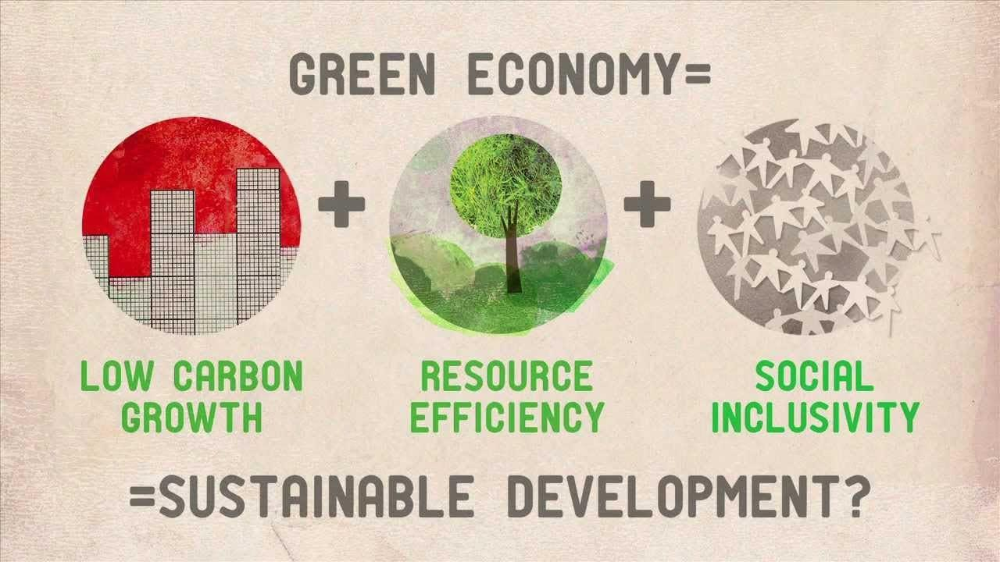

## Table of Contents

## What is green economics?

Green economics is a way of thinking about the economy that focuses on being good to the environment. It's about making money and growing businesses, but also making sure we take care of the earth. People who believe in green economics want to use resources wisely and make sure that the air, water, and land stay clean and healthy for everyone.

In green economics, people try to use less energy and find new ways to make energy that don't harm the environment. They also work on making products that can be reused or recycled, so less waste goes into the trash. The goal is to have an economy that helps the planet instead of hurting it. This way, future generations can have a healthy world to live in.

## How does green economics differ from traditional economics?

Green economics and traditional economics have different main goals. Traditional economics focuses on making money and growing the economy as much as possible. It looks at how to increase production and consumption, often without thinking much about the impact on the environment. The main idea is to make things cheaper and more available, which can lead to using up resources quickly and creating a lot of waste.

On the other hand, green economics cares about the environment as much as it cares about the economy. It wants to make sure that while we are making and using things, we are also protecting the earth. Green economics encourages using resources in a way that they can last longer and be reused or recycled. It aims for a balance where the economy grows but in a way that keeps the planet healthy for future generations.

In summary, the big difference is that traditional economics mainly focuses on economic growth, while green economics focuses on both economic growth and environmental sustainability. Green economics tries to find ways to have a strong economy that also takes care of the environment, which is not always a priority in traditional economics.

## What are the main principles of green economics?

Green economics has some main ideas that guide how it works. One big idea is sustainability, which means using resources in a way that they last a long time and don't harm the environment. Green economics wants to make sure we can keep using the earth's resources without running out of them. Another important idea is that the economy should work in a way that helps the planet, not hurts it. This means finding ways to make and use things that are good for the environment, like using clean energy and making products that can be reused or recycled.

Another principle of green economics is fairness, both for people now and for future generations. It believes that everyone should have a fair chance to live well, and that we should think about how our actions today will affect people in the future. This includes making sure that economic growth does not come at the cost of the environment, so that future generations can also enjoy a healthy planet. Green economics also values community and local economies, encouraging people to work together and support local businesses that care about the environment.

## Can you explain the concept of sustainability in green economics?

Sustainability in green economics means using the earth's resources in a way that they can last a long time. It's about making sure we don't use up all the resources too quickly, so that there will still be enough for people in the future. Green economics encourages using things like water, trees, and minerals wisely, so they don't run out. It also means finding new ways to make energy that don't harm the environment, like using wind or solar power instead of oil or coal.

Another part of sustainability is making sure that what we do today doesn't hurt the planet for future generations. Green economics wants to keep the air, water, and land clean and healthy. This means creating less waste and pollution, and making products that can be reused or recycled. By focusing on sustainability, green economics tries to balance growing the economy with taking care of the environment, so that everyone can have a good life now and in the future.

## What are some common green economic policies?

Green economic policies are rules and plans that help the economy and the environment at the same time. One common policy is putting a price on carbon, which means making companies pay for the pollution they create. This encourages them to find cleaner ways to make things. Another policy is giving money or tax breaks to businesses that use clean energy, like wind or solar power. These incentives help make green energy cheaper and more popular, so more people will use it.

Another type of green economic policy is about recycling and reducing waste. Governments might set rules that make companies use less packaging or make products that can be recycled more easily. They might also pay for recycling programs to make sure less trash ends up in landfills. These policies help save resources and keep the planet cleaner. 

Lastly, green economic policies often focus on making buildings and transportation more eco-friendly. This can mean giving money to people who want to make their homes more energy-efficient, like adding insulation or solar panels. It can also mean building better public transportation systems, like buses and trains, to help people travel without using as many cars that pollute the air. These policies help lower energy use and make cities healthier places to live.

## How do green economists measure economic success?

Green economists measure economic success differently than traditional economists. They don't just look at how much money people make or how fast the economy grows. Instead, they also pay attention to how healthy the environment is. They want to know if the air and water are clean, and if the land is being used in a way that doesn't harm it. They believe that a successful economy should help people live well without hurting the planet.

To measure this, green economists use special tools and indicators. They look at things like how much renewable energy is being used, how much waste is being produced, and how sustainable the use of resources is. They also consider how fair the economy is, making sure everyone has a chance to live well. By using these measures, green economists can see if the economy is growing in a way that helps the environment, instead of just making more money.

## What criticisms are often leveled against green economics?

Some people say green economics is too idealistic and hard to put into practice. They think it's tough to make money while also taking good care of the environment. These critics worry that green policies, like taxes on pollution or rules about recycling, might make things more expensive. They believe this could slow down the economy and make life harder for people, especially those who don't have a lot of money. They also argue that green economics might stop businesses from growing because it puts too many limits on how they can use resources.

Others criticize green economics for not having clear ways to measure success. Traditional economics uses numbers like GDP to show how well an economy is doing. But green economics looks at things like clean air and water, which can be harder to measure. Critics say this makes it difficult to know if green policies are really working. They also point out that green economics might not work the same way in every country, because different places have different needs and resources. This makes it hard to have one set of rules that fits everyone.

## How does green economics address issues like climate change and resource depletion?

Green economics tackles climate change and resource depletion by encouraging ways to use less energy and find new, clean ways to make energy. Instead of using oil and coal, which can harm the environment, green economics pushes for using wind, solar, and other renewable energy sources. This helps lower the amount of greenhouse gases, like carbon dioxide, that go into the air and make the planet warmer. By using clean energy, green economics helps slow down climate change and makes sure we have energy for the future.

Green economics also works to stop resource depletion by using resources more wisely. It encourages recycling and reusing things, so we don't need to take as much from the earth. For example, instead of cutting down more trees for paper, green economics might support making paper from recycled materials. It also supports using products that last longer and can be fixed instead of thrown away. By doing this, green economics helps make sure we have enough resources for everyone, now and in the future.

## What are the economic benefits of transitioning to a green economy?

Moving to a green economy can create a lot of new jobs. When we focus on making clean energy like wind and solar power, we need people to build and take care of these new systems. This means more jobs in these areas. Also, when we recycle more and use things again, we need workers to help with that too. So, a green economy can help more people find work and make money.

A green economy can also save money in the long run. When we use less energy and use it more wisely, we don't have to spend as much on energy bills. For example, if we put solar panels on our homes, we might pay less for electricity over time. Plus, using resources more carefully means we won't run out of them as quickly, which can keep prices stable. This way, a green economy can help everyone save money and live better.

## Can you discuss any successful case studies of green economic practices?

In Germany, they have a program called Energiewende, which means "energy transition." It's about moving from using dirty energy like coal to clean energy like wind and solar. Germany has been very successful at this. They now get a lot of their power from renewable sources. This has created many new jobs in the clean energy industry. It has also helped make the air cleaner and slowed down climate change. People in Germany are happy because they save money on their energy bills, and the country is a leader in showing the world how to use green energy.

Another good example is Costa Rica. They have worked hard to protect their forests and use clean energy. Almost all of their electricity comes from renewable sources like hydroelectric power and geothermal energy. By protecting their forests, they help stop climate change and keep their environment healthy. This has also helped their tourism industry because people like to visit places with beautiful nature. Costa Rica shows that you can have a strong economy and take care of the environment at the same time.

## How do green economics and ecological economics intersect?

Green economics and ecological economics both focus on making the economy good for the environment. They both believe that we need to use resources wisely and keep the earth healthy. Green economics is about finding ways to grow the economy while also protecting nature. It encourages using clean energy, recycling, and making products that last longer. Ecological economics goes a bit further. It looks at how the economy and the environment are connected and tries to put a value on things like clean air and water. It wants to make sure that when we make economic decisions, we think about how they affect the environment.

Both green and ecological economics want to make sure that future generations can live well on a healthy planet. They both care about fairness and making sure everyone has a good life. The big difference is that ecological economics often uses more math and science to understand how the economy and environment work together. It tries to find ways to measure the health of the environment and include that in economic planning. Green economics, on the other hand, focuses more on practical policies and actions that can be taken right away to make the economy greener.

## What are the future challenges and opportunities for green economics?

The future of green economics will face some big challenges. One challenge is getting everyone to agree on green policies. Some people and businesses might not want to change because they think it will cost too much money or slow down the economy. Another challenge is making sure green policies work the same way in different countries. Each country has its own needs and resources, so what works in one place might not work in another. Also, as the world's population grows, it will be harder to use resources wisely and keep the environment clean.

But there are also many opportunities for green economics in the future. One big opportunity is creating new jobs in clean energy and recycling. As more people and businesses use green technology, there will be more work in these areas. Another opportunity is making new inventions and technology that help the environment. For example, better batteries for electric cars or new ways to recycle materials can help the economy grow and keep the planet healthy. If we work together and find ways to make green economics work for everyone, we can build a future where the economy and the environment both do well.

## References & Further Reading

[1]: Sachs, J. D., Schmidt-Traub, G., Kroll, C., Lafortune, G., Fuller, G., & Woelm, F. (2020). ["The Sustainable Development Goals and COVID-19."](https://onlinelibrary.wiley.com/doi/full/10.1111/padr.12366) Sustainable Development Report 2020.

[2]: Daly, H. E., & Cobb, J. B. (1989). ["For the Common Good: Redirecting the Economy toward Community, the Environment, and a Sustainable Future."](https://archive.org/details/forcommongoodred00daly) Beacon Press.

[3]: Jackson, T. (2009). ["Prosperity Without Growth: Economics for a Finite Planet."](https://www.taylorfrancis.com/books/mono/10.4324/9781849774338/prosperity-without-growth-tim-jackson) Routledge.

[4]: Clarke, R. G. (1988). ["Information Technology and Databases in Algorithmic Trading"](https://typeset.io/papers/information-technology-and-dataveillance-3e6yrurwpn) Wiley.

[5]: United Nations (2015). ["Transforming Our World: The 2030 Agenda for Sustainable Development."](https://sdgs.un.org/publications/transforming-our-world-2030-agenda-sustainable-development-17981) United Nations.