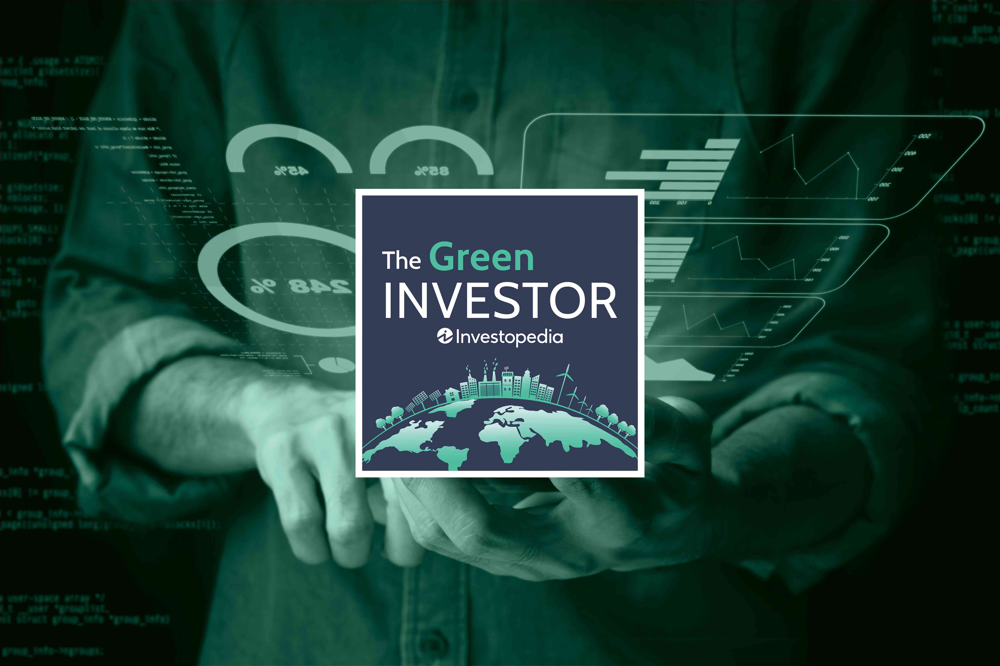

In a rapidly evolving financial landscape, the integration of sustainable investing and algorithmic trading is gaining momentum. Sustainable investing focuses on strategies that prioritize Environmental, Social, and Governance (ESG) criteria alongside financial returns, seeking to address wider societal impacts while achieving market returns. On the other hand, algorithmic trading uses advanced computational methods to automate and optimize trading decisions, leveraging data and technology for efficient market participation.

This article explores the confluence of these two transformative approaches in the investment world, emphasizing the growing synergy between sustainability and advanced trading strategies, as conveyed through insightful podcasts. These audio resources provide a unique platform for experts to share their insights, bridging complex theories with practical applications about topics such as integration of ESG principles into trading algorithms, innovations in green finance, and real-world case studies where these methods converge.

The exploration of sustainable investing and algorithmic trading through podcasts allows investors to gain a deeper understanding of how these themes are shaping the future of investing. Listeners can access expert opinions, innovative strategies, and comprehensive analyses that offer more than just an overview—they unravel change dynamics in financial markets and how best to respond.

Podcasts offer a unique way to stay updated on these trends, presenting expert insights and strategies in an accessible form. In turn, such discussions can greatly enhance one's understanding of both current and future investment landscapes, paving the way for adopting strategies that are both financially rewarding and ethically responsible. The integration of these themes marks a significant shift towards more responsible and efficient financial markets, heralding a new era of investing.

## Table of Contents

## The Rise of Sustainable Investing

Sustainable investing, a rapidly evolving sector within the financial markets, is fundamentally changing the relationship between profit and responsibility. At its core, sustainable investing emphasizes the inclusion of Environmental, Social, and Governance (ESG) criteria and impact investing within investment portfolios. These themes highlight a shift in investment priorities from solely financial returns towards integrating ethical, environmental, and social considerations.

The concept of ESG criteria is instrumental in this transformation. ESG investing involves selecting stocks, bonds, or other financial instruments based on their performance across three key areas: environmental responsibility, social impact, and corporate governance. Investors are increasingly demanding transparency and sustainability from the companies in which they invest, driving a shift towards ESG-compliant business models. This demand is not only changing corporate behavior but also unveiling new market opportunities for investors. For example, companies excelling in ESG performance tend to manage risks more effectively and often benefit from positive consumer sentiment, which can translate into improved financial performance.

Impact investing adds another layer, focusing specifically on generating measurable social or environmental impact alongside financial returns. Investors in this category may prioritize issues such as climate change mitigation, clean energy development, and social justice initiatives. The market dynamics for impact investing are characterized by a robust demand for sustainable investment products, leading to the emergence of new financial instruments such as green bonds and social impact bonds. These instruments provide tangible opportunities for investors to contribute to sustainable development goals while achieving financial gains.

The rise of sustainable investing is also marked by a notable transition toward the integration of sustainability practices in traditional investment portfolios. Asset managers and financial institutions are increasingly incorporating [ESG](/wiki/esg-investing) frameworks into their investment strategies, reflecting a broader recognition of the long-term benefits of sustainable investing. This shift is not merely a trend but a necessity in the context of global environmental challenges and societal expectations.

Podcasts play a pivotal role in promoting sustainable investing by educating investors and fostering responsible investment practices. They serve as an accessible medium for delivering expert insights, market analysis, and thought leadership on sustainable investing. Through interviews with industry leaders and discussions on the latest trends, podcasts provide investors with the knowledge required to navigate the complexities of sustainable investments. They are instrumental in bridging the gap between theoretical concepts and practical application, empowering investors to make informed, responsible investment decisions. Notable podcasts in this domain offer episodes dedicated to unpacking the nuances of ESG criteria, analyzing market trends, and offering strategies to integrate sustainability into portfolios effectively.

By examining these key themes and leveraging resources like podcasts, investors can better understand sustainable investing dynamics and capitalize on the opportunities it presents while contributing towards a more sustainable economy.

## Algorithmic Trading: A Game Changer

Algorithmic trading has become a pivotal component of modern financial markets, fundamentally altering trading dynamics through the integration of complex mathematical models and automated systems. This approach utilizes algorithms, which are precise sets of rules or instructions, to execute trades at speeds and frequencies that would be impossible for a human trader. Essentially, these algorithms can analyze market conditions and make trading decisions within milliseconds, making the trading environment more dynamic and competitive.

### Understanding the Basics

At its core, [algorithmic trading](/wiki/algorithmic-trading) eliminates the manual human decision-making process from trading, relying instead on pre-defined rules dictated by the trading strategy. Algorithms can be based on a variety of metrics and inputs, such as timing, price, quantity, or any mathematical model. Common strategies include [market making](/wiki/market-making), [arbitrage](/wiki/arbitrage), and [trend following](/wiki/trend-following), each designed to capitalize on specific market opportunities.

A simple formula often used in trend-following strategies is moving averages. For instance, an algorithm might be programmed to execute a trade when the short-term moving average crosses above the long-term moving average, signifying a potential upward trend:

$$
\text{Buy when: } MA_{\text{short}} > MA_{\text{long}}
$$

### Benefits of Automated Trading Systems

Algorithmic trading systems offer several advantages. The most notable is efficiency. Algorithms can process vast amounts of data much faster than humans, providing the ability to execute timely trades. This speed not only increases potential profitability but also reduces the risk of adverse market conditions affecting trades.

Another significant benefit is the reduction of bias. Human traders are prone to emotional and psychological biases that can lead to suboptimal trading decisions. By using automated systems, trades are executed strictly according to the predefined criteria, ensuring consistency and objectivity.

### Technological Advancements

The advancement in computing power and [machine learning](/wiki/machine-learning) has further propelled algorithmic trading. Technologies such as neural networks and natural language processing enable algorithms to analyze unstructured data, such as news articles and social media feeds, further enhancing their trading strategies.

High-frequency trading ([HFT](/wiki/high-frequency-trading-strategies)), a subset of algorithmic trading, leverages these technological advancements by executing a high number of orders at extremely high speeds. HFT relies on advanced algorithms and colocated infrastructure near major exchanges to minimize latency—a critical [factor](/wiki/factor-investing) in this form of trading.

### Podcasts: An Educational Resource

For those looking to understand algorithmic trading strategies and applications better, podcasts serve as an invaluable educational resource. They provide direct access to industry experts who share insights into the nuances of algorithmic trading, from the latest developments and strategies to practical advice on implementation.

Popular podcasts in the field often feature interviews with traders, developers, and financial analysts, offering listeners diverse perspectives on how to utilize algorithmic strategies effectively. These audio platforms are crucial for anyone looking to grasp the technical and strategic aspects of algorithmic trading without needing to sift through technical papers or complex datasets. 

By embodying a blend of technological ingenuity and strategic forethought, algorithmic trading stands as a transformative force in financial markets, offering efficiency, precision, and new opportunities for growth and innovation.

## Podcasts: Bridging the Gap Between Information and Execution

Podcasts have emerged as a powerful medium for investors seeking to bridge the gap between theoretical knowledge and practical execution in both sustainable investing and algorithmic trading. By providing direct access to expert advice and market analyses, podcasts serve as an invaluable resource for investors at varying levels of expertise.

Several prominent podcasts cater to different levels of expertise, offering insights into diverse aspects of investing and trading. "Masters in Business" hosted by Barry Ritholtz is renowned for its deep dives into the strategies of leading financial experts, making it ideal for intermediate and advanced listeners. For those new to the concepts of sustainable investing and algorithmic trading, "The Investor's Podcast" often presents episodes that simplify complex subjects, allowing novices to better grasp fundamental ideas and strategies.

Podcasts are particularly adept at keeping listeners informed about the latest trends and strategies. As the finance industry increasingly integrates environmental, social, and governance (ESG) criteria, podcasts like "Sustainable Finance Podcast" provide timely updates on developments in sustainable investing. Likewise, for those interested in the technical intricacies of trading, "Chat With Traders" often features episodes on the latest in algorithmic trading strategies, discussing innovations such as machine learning applications in trading systems.

Interviews and discussions on these platforms broaden investor perspectives by presenting diverse viewpoints and experiences. For instance, guests on podcasts like "Exchanges at Goldman Sachs" and "Bloomberg Masters in Business" routinely discuss the challenges and opportunities in merging sustainability with profitability, offering insights that can significantly enhance decision-making processes.

To specifically focus on sustainability and algorithmic strategies, episodes such as "How ESG Can Shape Your Portfolio" on the "Money Tree Investing" podcast offer targeted information on aligning investment portfolios with ESG criteria. Similarly, the podcast "Algorithmic Trading & Quantitative Finance" investigates into practical applications of algorithmic trading, including the use of [artificial intelligence](/wiki/ai-artificial-intelligence) for market prediction and risk management.

In summary, podcasts stand as an essential tool for investors aiming to enhance their understanding and implementation of sustainable investing and algorithmic trading strategies. Through expert-led discussions, a range of informative episodes, and in-depth analysis, podcasts provide a comprehensive platform for acquiring knowledge that is crucial for modern investing.

## Integrating Sustainability and Algo Trading

The integration of sustainable investing and algorithmic trading represents a promising frontier where technology meets responsibility. As financial markets evolve, investors are increasingly interested in aligning their portfolios with sustainable principles while leveraging the efficiencies offered by algorithmic trading. This synergy is exemplified by several successful case studies where these domains have converged. For instance, some hedge funds and asset managers have developed proprietary algorithms that incorporate Environmental, Social, and Governance (ESG) criteria, ensuring that trades not only aim for financial returns but also uphold sustainability standards.

The benefits of combining sustainable practices with algorithmic trading include enhanced market efficiency, increased transparency, and the potential for improved risk management. Algorithms can process vast amounts of data related to sustainability metrics, allowing traders to make informed decisions that align with ethical imperatives. Additionally, the use of natural language processing and machine learning algorithms can help identify and predict sustainable trends, aiding investors in making proactive investment decisions.

However, integrating sustainability with algorithmic trading is not without challenges. One of the primary issues is the availability and reliability of sustainability data. Unlike traditional financial metrics, ESG data can be inconsistent, unstandardized, and occasionally subjective, posing difficulties for algorithmic processing. Moreover, there is a risk of "greenwashing," where companies might exaggerate their sustainability efforts to appear more attractive to ESG-focused algorithms and investors.

Podcasts have become an invaluable resource for gaining insights into how these two fields can be effectively integrated. Industry experts often discuss strategies for overcoming challenges associated with sustainable algo trading and share their experiences in implementing these systems. For example, interviews with leading quants and sustainable finance experts shed light on how machine learning algorithms are being fine-tuned to assess ESG factors accurately. These discussions highlight the importance of incorporating both qualitative and quantitative data to create more robust and responsible trading strategies.

Looking ahead, there is potential for growth in integrating sustainability and algorithmic trading. Technological advancements, such as artificial intelligence and big data analytics, promise to enhance the capabilities of algorithms in processing and interpreting sustainability data. As investor demand for responsible investment options grows, there will likely be increased pressure on companies to improve their ESG reporting standards, thereby providing more reliable data for algorithmic systems.

The intersection of sustainable practices with algorithmic trading holds promise for responsible and profitable opportunities. By marrying ethical investing with cutting-edge technology, investors can contribute to a more sustainable financial market landscape while achieving their financial goals. This dual approach supports a vision where profitability and responsibility can coexist, driven by informed and strategic investment decisions.

## Conclusion

Sustainable investing and algorithmic trading are now key drivers shaping the future of financial markets. Their integration presents opportunities that combine ethical investing with high-tech trading efficiencies, marking a significant progression towards more responsible investment strategies. Podcasts have proven to be an invaluable medium for gaining insights and staying informed about these topics. They provide expert viewpoints and detailed strategies, allowing investors to align their financial objectives with sustainability goals using advanced trading technologies. 

The interplay between sustainable investing and algorithmic trading not only enhances the potential for financial returns but also supports environmental and social governance objectives. This dual benefit indicates a promising trajectory for both the financial markets and broader environmental efforts. By following insightful podcasts, investors can gain a deeper understanding of these trends and learn how to incorporate such strategies into their portfolios effectively. The recommended podcasts offer a wealth of knowledge, helping to refine investment approaches with both sustainability and algorithmic precision in mind. 

Staying updated through these platforms ensures that investors are well-equipped to navigate the complexities of modern investments, benefiting both their portfolios and the planet.

## References & Further Reading

[1]: Friede, G., Busch, T., & Bassen, A. (2015). ["ESG and financial performance: Aggregated evidence from more than 2000 empirical studies."](https://www.tandfonline.com/doi/full/10.1080/20430795.2015.1118917) Journal of Sustainable Finance & Investment.

[2]: Cartea, Á., Jaimungal, S., & Penalva, J. (2015). ["Algorithmic and High-Frequency Trading."](https://assets.cambridge.org/97811070/91146/frontmatter/9781107091146_frontmatter.pdf) Cambridge University Press.

[3]: ["Principles for Responsible Investment"](https://www.unpri.org/about-us/what-are-the-principles-for-responsible-investment) by the United Nations-supported PRI.

[4]: Haigh, M. S., & Hazelton, J. (2004). ["Financial markets: A tool for social responsibility?"](https://link.springer.com/article/10.1023/B:BUSI.0000033107.22587.0b) Journal of Cleaner Production.

[5]: Narang, R. K. (2013). ["Inside the Black Box: A Simple Guide to Quantitative and High Frequency Trading."](https://onlinelibrary.wiley.com/doi/book/10.1002/9781118662717) John Wiley & Sons.

[6]: Damodaran, A. (2020). ["The Dark Side of Valuation: Valuing Young, Distressed, and Complex Businesses."](https://pages.stern.nyu.edu/~adamodar/pdfiles/country/darkside.pdf) Pearson FT Press.

[7]: Geczy, C., & Stambaugh, R. F. (2019). ["Investing in socially responsible mutual funds."](https://papers.ssrn.com/sol3/papers.cfm?abstract_id=416380) The Journal of Finance.

[8]: ["Sustainable Finance and Investment Possibilities"](https://www.weforum.org/stories/2022/01/what-is-sustainable-finance/) by Karen Wendt

[9]: Lo, A. W., & MacKinlay, A. C. (1997). ["Stock Market Prices Do Not Follow Random Walks: Evidence from a Simple Specification Test."](https://academic.oup.com/rfs/article-abstract/1/1/41/1601244) The Review of Financial Studies.

[10]: ["The Green Finance Imperative: How to Design a Fair and Sustainable Financial System."](https://www.mdpi.com/2071-1050/11/20/5604) by Knut H. Alfsen, Miriam Hulgaard Skaare, et al.
