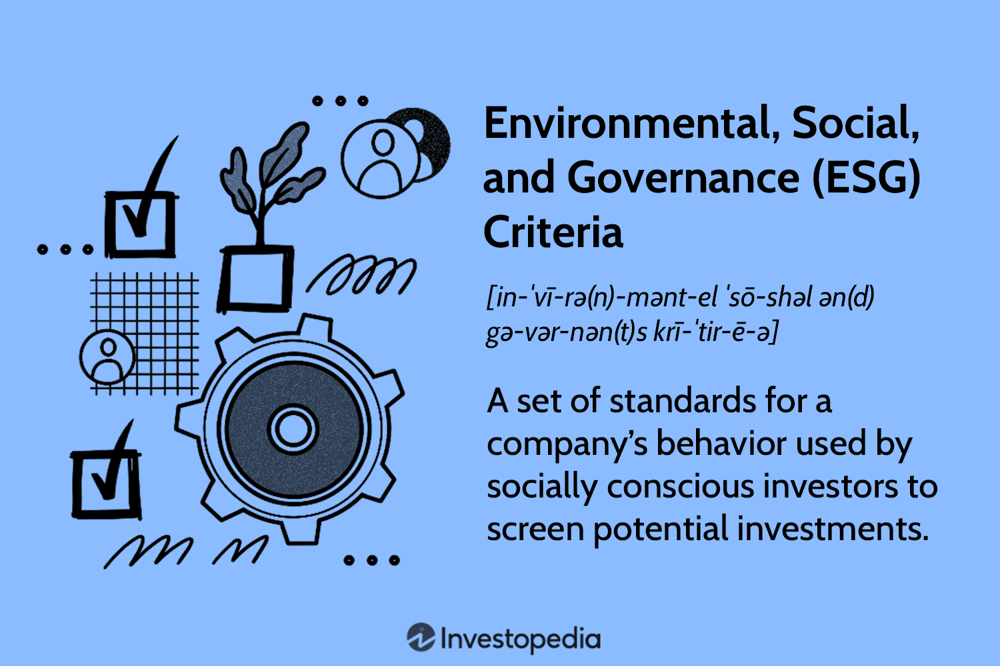

In the modern business landscape, sustainable marketing has emerged as a strategic approach that aligns marketing practices with the growing demand for environmental preservation and social responsibility. The integration of sustainability into marketing strategies not only helps businesses meet eco-conscious consumer expectations but also strengthens brand loyalty and trust. This holistic approach is gaining traction as companies recognize the long-term value of aligning operations with the environmental and social fabric of their communities.

Sustainable marketing involves a range of practices and principles that extend beyond traditional marketing. It requires a commitment to eco-friendly product development, sustainable packaging, and transparent communication with consumers. This strategy prioritizes not only profit but also the welfare of society and the planet, thus incorporating the triple bottom line (TBL) approach—people, planet, and profit—into business objectives.



An integral aspect of sustainable marketing is the intersection with environmental marketing and green marketing. Environmental marketing focuses specifically on promoting a brand's efforts to reduce its environmental impact, while green marketing emphasizes the ecological benefits of products. Both practices are crucial for businesses striving to appeal to the increasing numbers of environmentally conscious consumers who demand accountability and transparency regarding a company’s sustainability efforts.

The addition of algorithmic trading to this mix brings a technological edge to sustainable marketing strategies. Algorithmic trading involves using computer algorithms to make decisions and execute trades, but its principles can be adapted to marketing by analyzing consumer data to optimize strategies. Through machine learning, businesses can gain insights into consumer behavior, allowing them to target their marketing efforts more effectively and efficiently.

For companies aiming to capture the eco-conscious consumer market while maintaining profitability, understanding and implementing sustainable marketing initiatives are critical. With the aid of technologies like algorithmic trading, businesses can navigate this complex landscape, ensuring their marketing campaigns are both effective and in line with consumer demand for sustainability. This strategic approach not only supports environmental and social goals but also secures a competitive edge in the market.

## Table of Contents

## Understanding Sustainable Marketing

Sustainable marketing represents a shift in promotional strategies, where businesses focus on not just economic gains but also on environmental and societal benefits. At its core, it involves crafting a comprehensive, long-term marketing strategy that seeks to balance the three pillars of sustainability: environmental integrity, social equity, and economic viability. This approach is not simply about selling green products but ensuring that the entire business operation aligns with sustainability goals.

A crucial component of sustainable marketing is the development of eco-friendly products. This involves the use of materials and processes that minimize environmental impact, contributing to resource conservation and pollution reduction. It includes the selection of biodegradable, recyclable, or sustainable materials in the product development phase. Companies prioritizing eco-friendly innovation often gain a competitive edge by appealing to conscious consumers who prioritize environmental responsibility in their purchasing decisions.

Equally important is sustainable packaging, which minimizes waste and enhances recyclability. This means reducing packaging materials, opting for reusable solutions, and designing for easy disassembly to facilitate recycling. Studies suggest that consumers increasingly gravitate towards brands that demonstrate a commitment to reducing plastic waste and other environmentally harmful practices. As businesses implement these packaging strategies, they mitigate their environmental footprint and distinguish themselves in a crowded market.

Transparent communication with consumers is another key element of sustainable marketing. Brands must convey their sustainability initiatives clearly and honestly. This includes full disclosure of product ingredients, sourcing practices, and the environmental and social impacts of their operations. By doing so, businesses build trust and foster long-term customer relationships. Transparency also involves educating consumers about the sustainability challenges faced by the industry and providing guidance on how their purchasing choices can make a difference.

In summary, sustainable marketing requires a holistic approach that integrates environmentally friendly product development, sustainable packaging, and transparent consumer communication. As businesses adopt these practices, they not only meet the rising demand for sustainable products but also contribute positively to broader environmental and societal goals, ensuring a sustainable future for generations to come.

## The Role of Environmental Marketing

Environmental marketing, commonly referred to as green marketing, is a strategic approach that emphasizes a brand's commitment to sustainability and ecological responsibility. It involves not only the promotion of eco-friendly products but also the implementation of sustainable processes and practices aimed at minimizing a company's environmental impact. These efforts often encompass a broad range of activities, including the design and manufacturing of products with lower carbon footprints, the use of sustainable packaging, and the adoption of environmentally friendly corporate policies.

A key component of environmental marketing is the transparency and authenticity of a company's sustainability claims. Consumers are increasingly informed and discerning, and they demand genuine commitment to environmental practices from the brands they support. This consumer demand has driven companies to integrate sustainability into their core business models, rather than treat it as a superficial marketing strategy.

Successful environmental marketing campaigns are characterized by clear communication and demonstrable actions that resonate with eco-conscious consumers. By effectively highlighting their sustainability initiatives, companies can enhance their brand image, foster consumer trust, and build long-term loyalty. This is particularly effective when corporations engage in verifiable efforts to reduce their carbon emissions, utilize renewable energy sources, and support sustainability-focused projects.

Furthermore, environmental marketing can extend beyond the direct consumer interaction. It often involves partnerships with environmental organizations, participation in industry-wide sustainability standards, and contributions to broader environmental stewardship causes. These activities not only bolster a company's green credentials but also contribute to the larger societal goal of environmental preservation.

It is important for companies to avoid the pitfall of greenwashing, which involves making misleading claims about the environmental benefits of a product or practice. Greenwashing can damage a brand's reputation and erode consumer trust. Therefore, transparency and honesty in marketing communications are essential to avoid these risks and to effectively engage with the target audience.

Environmental marketing, when executed authentically, can serve as a powerful tool for differentiation in competitive markets. By demonstrating a tangible commitment to sustainability, businesses can attract and retain customers who prioritize ethical consumption, thereby securing a competitive edge while contributing positively to environmental conservation.

## Green Marketing: A Closer Look

Green marketing focuses on highlighting a business's environmental initiatives and promoting products that offer ecological benefits. This marketing strategy is increasingly significant as consumers become more concerned with sustainability and seek out products that align with their values. Companies engaging in green marketing emphasize their commitment to reducing their environmental impact through various initiatives such as sourcing sustainable materials, minimizing waste, and reducing energy consumption.

The targeting of environmentally conscious consumers requires a clear communication of the ecological advantages of a product, such as reduced carbon footprint, use of organic materials, or support for biodiversity. These attributes appeal to a demographic that prioritizes sustainability in their purchasing decisions and is often willing to pay a premium for products that reflect their values.

However, green marketing is not without its challenges. The practice of greenwashing, where businesses make misleading claims about the environmental benefits of their products or services, poses a significant risk. Greenwashing can involve exaggerations or fabrications about a product's sustainability to mislead consumers. This deceptive practice can severely damage a company's reputation if exposed, leading to consumer distrust and backlash.

For instance, a company might claim that its product is "100% environmentally friendly" without providing substantive evidence or certifications to support such claims. To guard against these pitfalls, businesses must ensure that their marketing claims are verifiable and supported by third-party certifications when possible.

In summary, while green marketing provides a strategic avenue to cater to the eco-conscious consumer base, it also requires careful execution to avoid the pitfalls of greenwashing. An authentic approach involves genuine transparency and demonstrable commitment to sustainable practices, which ultimately fosters consumer trust and loyalty.

## Integration with Algorithmic Trading

Algorithmic trading offers a robust mechanism to elevate sustainable marketing efforts through advanced data analysis. This process employs sophisticated algorithms to scrutinize vast amounts of consumer data, identifying trends and patterns that can inform and optimize marketing strategies. The integration of [algorithmic trading](/wiki/algorithmic-trading) with sustainable marketing is particularly beneficial in targeting eco-conscious consumers, aligning promotional activities with sustainability objectives.

The use of [machine learning](/wiki/machine-learning) algorithms allows businesses to dynamically adapt their marketing strategies based on real-time data. By deploying machine learning models, such as clustering or decision trees, companies can segment their consumer base according to sustainability preferences. For example, clustering algorithms can group consumers into clusters based on purchasing behavior and environmental values. This segmentation allows for more personalized marketing campaigns that resonate with the specific sustainability concerns of each group.

```python
from sklearn.cluster import KMeans
import numpy as np

# Example dataset: Consumer Sustainability Scores
data = np.array([
    [65, 80],
    [70, 90],
    [55, 65],
    [68, 85],
    [60, 70]
])

# Apply K-Means Clustering
kmeans = KMeans(n_clusters=2)
kmeans.fit(data)

# Display cluster centers
print("Cluster Centers:", kmeans.cluster_centers_)
```

The above Python code demonstrates using K-Means clustering to segment consumers based on their sustainability scores. Such data-driven insights enable companies to focus their marketing efforts on the most relevant consumer segments, ensuring that their campaigns are not only efficient but also aligned with the sustainability values consumers prioritize.

Furthermore, predictive analytics derived from algorithmic trading can forecast consumer behavior and sustainability trends. This foresight allows companies to pre-emptively adjust their product offerings and marketing messages to better satisfy future consumer demands. For instance, time-series analysis can predict shifts in consumer preferences towards more sustainable products, enabling businesses to adjust their strategies accordingly.

By incorporating algorithmic trading into sustainable marketing practices, businesses benefit from a dual advantage: enhanced marketing effectiveness and heightened alignment with consumer sustainability demands. This approach not only ensures more successful campaigns but also bolsters a company's reputation as a genuine advocate for environmental responsibility.

## Challenges and Criticisms

Adopting green marketing practices poses several challenges, particularly in terms of cost implications, which can be prohibitive for smaller businesses. Implementing sustainable initiatives often requires substantial upfront investments in eco-friendly technologies, resources, and processes. For many small and medium-sized enterprises (SMEs), these costs can be a significant barrier to entry, limiting their ability to compete with larger corporations that have more financial flexibility to incorporate sustainable strategies. This economic hurdle is a prominent constraint in the widespread adoption of sustainable marketing.

Moreover, there is an increasing incidence of greenwashing, where companies make false or exaggerated claims about their environmental efforts to appear more sustainable than they actually are. This trend not only undermines the credibility of authentic sustainability efforts but also increases consumer skepticism towards all eco-friendly marketing claims. When consumers encounter instances of greenwashing, trust erodes, posing significant reputational risks for businesses that are genuinely committed to sustainability.

To address these challenges, businesses must prioritize transparency in their sustainability efforts. This involves clear and honest communication about the environmental impact of their products and operations. Providing verifiable data and third-party certifications can help build consumer trust. Additionally, educating consumers about true sustainability practices is crucial. By enhancing consumer awareness, businesses can foster a knowledgeable customer base that appreciates and understands genuine sustainable efforts.

Implementing educational initiatives could involve activities such as workshops, informational content, and interactive platforms that explain the complexities and challenges of sustainability. These efforts can increase consumer engagement and support the overall goal of promoting authentic sustainable practices. In sum, by embracing transparency and education, businesses can mitigate the adverse effects of cost barriers and greenwashing, ultimately fostering a more credible and impactful green marketing strategy.

## Case Study: Starbucks

Starbucks is widely recognized as a leader in green marketing, primarily through its dedicated implementation of sustainable practices across its operations. The company has consistently demonstrated a commitment to sustainability, which has played a significant role in enhancing its brand value and fostering customer loyalty.

One of Starbucks’ significant investments in sustainability is its focus on renewable energy. The company has aimed to operate with 100% renewable energy and has made substantial progress towards this goal by purchasing renewable energy credits and installing solar panels at various facilities. This commitment not only helps Starbucks reduce its carbon footprint but also supports the global transition towards clean energy sources.

In addition to its renewable energy initiatives, Starbucks actively promotes sustainable farming practices. The company has committed to sourcing its coffee beans through ethical and sustainable channels, primarily via its Coffee and Farmer Equity (C.A.F.E.) Practices program. This program sets stringent standards for economic accountability, social responsibility, and environmental leadership in coffee growing regions. By ensuring that coffee is sourced sustainably, Starbucks supports the livelihoods of farmers and contributes to agricultural practices that conserve natural resources.

Starbucks also implements community-focused social impact projects which further solidify its position in sustainable marketing. These projects include efforts in environmental conservation, community leadership, and education. For example, Starbucks has launched initiatives to reduce waste by encouraging reusable cups and participating in recycling programs. Their Greener Stores initiative seeks to reduce waste, save energy, and conserve water in their retail locations, reflecting an effort to integrate sustainability throughout their operations.

Through these comprehensive strategies, Starbucks not only advances its business objectives but also contributes positively to societal goals such as reducing environmental degradation and supporting community development. These efforts not only reinforce consumer trust but also serve as a model for integrating sustainability in business practices, influencing industry standards and consumer expectations globally.

## Conclusion

Sustainable marketing has emerged as an essential strategic approach in today's business landscape, transcending its label as a mere trend. With increasing awareness of environmental and social issues, businesses are compelled to adopt sustainable practices to remain competitive and appealing to the eco-conscious consumer base. This shift is not only about ethical brand positioning but also about ensuring long-term profitability and relevance in a market where consumer demand for responsibility is growing.

Integrating sustainable practices with advanced technologies such as algorithmic trading can significantly enhance marketing efforts. By leveraging machine learning and big data analytics, businesses can efficiently analyze consumer behavior, identify trends in sustainability preferences, and tailor their marketing strategies accordingly. This tech-driven approach allows for the precise targeting of audiences, optimizing resource allocation, and minimizing environmental impact. Through predictive models, businesses can anticipate market shifts and consumer demands, positioning themselves advantageously while committing to sustainability.

Moreover, sustainable marketing plays a crucial role in constructing a more responsible business world. It supports the dual objectives of meeting consumer demands and preserving our planet's resources, thereby contributing to ecological stability and social welfare. By embedding sustainability into their core operations, companies not only bolster their brand reputation but also inspire industry-wide standards that prioritize planet-friendly practices. As businesses continue to innovate and align with sustainable development goals, they contribute to a collective effort towards environmental conservation and societal progress, ensuring a sustainable future for generations to come.

## References & Further Reading

[1]: Belz, F.-M., & Peattie, K. (2012). ["Sustainability Marketing: A Global Perspective"](https://books.google.com/books/about/Sustainability_Marketing.html?id=ckY3vxiD3JIC). Wiley.

[2]: Ottman, J. A. (2011). ["The New Rules of Green Marketing: Strategies, Tools, and Inspiration for Sustainable Branding"](https://www.taylorfrancis.com/books/mono/10.4324/9781351278683/new-rules-green-marketing-jacquelyn-ottman). Berrett-Koehler Publishers.

[3]: Peattie, K. (1995). ["Environmental Marketing Management: Meeting the Green Challenge"](https://books.google.com/books/about/Environmental_Marketing_Management.html?id=HrUWAQAAMAAJ). Pitman Publishing.

[4]: Parguel, B., Beno\^it-Moreau, F., & Larceneux, F. (2011). ["How Sustainability Ratings Might Deter ‘Greenwashing’: A Closer Look at Ethical Corporate Communication"](https://link.springer.com/content/pdf/10.1007/s10551-011-0901-2.pdf). Journal of Business Ethics.

[5]: Kotler, P., & Armstrong, G. (2018). ["Principles of Marketing"](https://www.pearsonhighered.com/assets/preface/0/1/3/5/0135766605.pdf). Pearson Education.