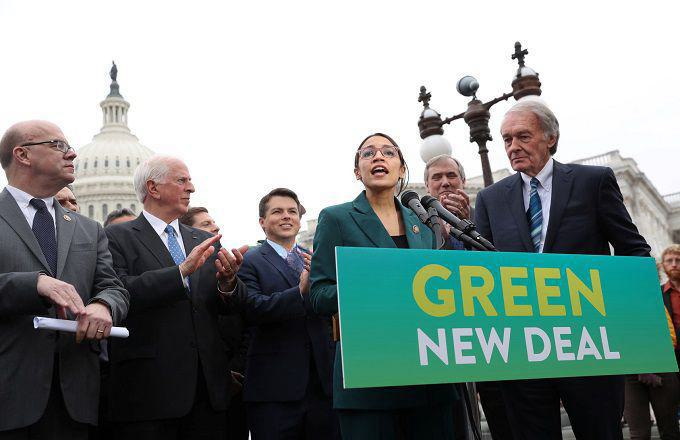

The escalating urgency of addressing climate change has made climate policies a vital component of global political agendas. Nations worldwide are increasingly implementing comprehensive strategies to mitigate the adverse effects of climate change, emphasizing the significance of robust environmental legislation. Among such efforts, the Green New Deal emerges as a transformative piece of environmental legislation, proposing sweeping reforms to achieve net-zero greenhouse gas emissions and promote economic equity. Its comprehensive approach highlights a significant shift towards a sustainable future, focusing on reducing carbon footprints while addressing socio-economic disparities.

Simultaneously, technological advancements in financial markets, particularly algorithmic trading, are reshaping how environmental policies are being formulated and implemented. Algorithmic trading, which involves the use of complex algorithms to automate trading decisions, is gaining traction for its potential to enhance market efficiency and transparency. In the context of climate policy, algorithmic trading can play a pivotal role by optimizing the allocation of resources in environmental markets, such as carbon credits and renewable energy investments. This technological evolution underscores the growing relevance of integrating advanced trading strategies with climate policies to foster sustainable economic growth.



The intersection of the Green New Deal, environmental legislation, and algorithmic trading represents a unique confluence of policy and technology aimed at combating climate change. This article aims to explore this nexus, shedding light on how emerging financial technologies can support legislative objectives to promote environmental sustainability. Understanding these concepts is crucial for policymakers intent on crafting effective climate policies and for investors seeking to align their portfolios with sustainability goals. By examining the synergies between policy frameworks and technological innovations, stakeholders can unlock new opportunities for collaboration and environmental impact.

Throughout this article, we will delve into the historical context and core components of the Green New Deal, analyze the role of legislation in effecting change, and investigate the rise of algorithmic trading in environmental markets. Subsequently, we will discuss how these elements can work in tandem to enhance sustainable investment strategies and ultimately contribute to a greener economy. The convergence of innovative policy and technology offers a promising path forward, urging continuous research and collaboration to secure a sustainable future for generations to come.

## Table of Contents

## Understanding the Green New Deal

The Green New Deal (GND) is a comprehensive framework that aims to address climate change while simultaneously tackling economic inequality. Its origins trace back to the late 2000s, inspired by the 1930s New Deal, which sought to stimulate economic recovery during the Great Depression. The term gained significant traction in the political discourse following a 2018 proposal by U.S. Representative Alexandria Ocasio-Cortez and Senator Ed Markey. The GND combines environmental and economic policies to promote both sustainability and social justice.

The primary components of the Green New Deal include clean energy transition, job creation, and social equity. Its goals are ambitious: to achieve net-zero greenhouse gas emissions by converting 100% of the nation’s electricity demand to renewable and zero-emission sources, decarbonizing key sectors such as transportation and manufacturing, and investing in energy-efficient infrastructure. Additionally, it emphasizes creating high-paying jobs in the green industry, ensuring economic security for all citizens, and prioritizing communities most affected by climate change.

The projected impact of the Green New Deal on the environment and economy could be transformative. Environmentally, it aims to significantly reduce carbon emissions, contributing to the global effort to limit global warming to 1.5°C above pre-industrial levels, as recommended by the Intergovernmental Panel on Climate Change (IPCC) (IPCC, 2018). Economically, the GND envisions the creation of millions of new jobs through investment in green technology and infrastructure. However, the economic impact remains contentious, with debates over the feasibility of funding such an extensive reformation.

Supporters argue that the Green New Deal is essential for mitigating the severe impacts of climate change and for providing an opportunity to redefine economic structures. Organizations like the Sunrise Movement and progressive political figures advocate for the GND as a means to address systemic issues of inequality and environmental degradation. Critics, on the other hand, often focus on the perceived economic risks, labeling it as unrealistic or overly ambitious due to its high cost and extensive overhaul requirements. Business groups and conservative policymakers frequently question the GND's economic implications and its feasibility without imposing significant tax burdens.

Policy plays a crucial role in advancing environmental sustainability by setting legal and institutional frameworks for action. The Green New Deal represents a legislative push towards sustainable development by embedding environmental objectives within economic policy. It underscores the necessity of integrated approaches involving governmental accountability, public-private partnerships, and community engagement to address multifaceted environmental challenges.

In addressing both climate and economic issues, the Green New Deal has sparked vital discussions on how policy can drive substantial progress toward a sustainable future. With its dual focus, it positions itself as a pivotal strategy for redefining the intersection of environmental stewardship and economic practices.

## Climate Policy and Environmental Legislation

Legislation plays a crucial role in combating climate change by establishing frameworks and regulations aimed at reducing carbon emissions and fostering sustainable development. The Green New Deal in the United States is one such legislative initiative, proposing comprehensive steps to address climate change and economic inequality simultaneously. It aims to transform the economy by investing in renewable energy and infrastructure, creating jobs, and promoting social justice.

Comparatively, international climate policies and agreements, such as the Paris Agreement, set global benchmarks for reducing greenhouse gas emissions. The Paris Agreement seeks to limit global temperature rise to below 2 degrees Celsius above pre-industrial levels, primarily through nationally determined contributions (NDCs) submitted by each country. Unlike the Green New Deal, which is a national policy framework with a broad socio-economic scope, the Paris Agreement focuses specifically on climate metrics and targets, allowing for greater flexibility in implementation strategies across countries.

Implementing environmental legislation faces numerous challenges. Political opposition, economic constraints, and the influence of vested interests often hinder progress. Policies like the Green New Deal face criticism for their ambitious scope and potential economic cost, which opponents argue could burden taxpayers and stifle economic growth. Moreover, differing priorities among countries and stakeholders can complicate the alignment of objectives, leading to fragmented or inconsistent approaches.

Despite these challenges, effective climate policies can have significant impacts on industries and communities. For industries, environmental legislation can drive innovation, leading to the development of cleaner technologies and sustainable practices. However, it can also cause short-term disruptions as businesses adapt to new regulations. For communities, particularly those disproportionately affected by climate change, robust policies can enhance resilience and provide opportunities for green jobs, contributing to social and economic equity.

Strategic policy measures to support a green economy include setting clear regulatory standards, providing incentives for clean energy investments, and supporting research and development in sustainable technologies. Policymakers can also facilitate the transition by offering retraining programs for workers displaced by shifts away from fossil fuels, ensuring a just transition.

Overall, the interplay between domestic policies like the Green New Deal and international agreements highlights the complexity of addressing climate change. Effective legislation requires balancing environmental objectives with economic realities, fostering cooperation between governments, industries, and communities to achieve sustainable outcomes.

## The Rise of Algorithmic Trading in Environmental Markets

Algorithmic trading, also known as algo trading, involves using computer algorithms to automate trading strategies based on predefined criteria such as timing, price, or [volume](/wiki/volume-trading-strategy). This method relies heavily on data analysis, quantitative models, and computational technology to execute trades at speeds and frequencies that a human trader cannot match. The core principle of [algorithmic trading](/wiki/algorithmic-trading) is to utilize advanced mathematical models and formulas to make data-driven decisions that enhance trading efficiency and profitability.

In recent years, the application of algorithmic trading has expanded into environmental markets, which focus on trading commodities like carbon credits, renewable energy credits, and other sustainability-related financial instruments. These markets are crucial for advancing climate policy objectives and encouraging sustainable practices worldwide.

One of the primary benefits of algo trading in environmental markets is the optimization of market efficiency and pricing. By processing large volumes of data in real-time, algorithms can identify price discrepancies and execute trades almost instantaneously, leading to more accurate pricing of environmental assets. This increased efficiency helps reduce transaction costs and improves [liquidity](/wiki/liquidity-risk-premium) in the market, making it more attractive for both investors and companies looking to trade environmental commodities.

However, the integration of algorithmic trading in green markets is not without risks and ethical concerns. One significant risk is the potential for increased market [volatility](/wiki/volatility-trading-strategies) due to high-frequency trading, where rapid execution of large-volume trades can lead to sudden price swings. Additionally, the use of complex algorithms raises ethical considerations, particularly regarding transparency and fairness. The lack of oversight and understanding of algorithmic models may create an uneven playing field, favoring those with access to advanced technology and data analytics capabilities.

Despite these challenges, there have been successful implementations of algorithmic trading strategies within environmental sectors. For instance, some companies have developed [machine learning](/wiki/machine-learning)-driven models to predict carbon credit prices based on variables such as energy output, weather conditions, and government policy changes. These predictive models allow traders to make informed decisions, capitalizing on market trends and optimizing investments.

As the environmental markets continue to grow, algorithmic trading is expected to play a crucial role in their development. By enhancing trading efficiency and accuracy, algorithmic models can support the sustainable transformation of financial markets, aligning them more closely with climate policy objectives and promoting a greener future.

## Synergies Between Green New Deal and Algorithmic Trading

The Green New Deal, an ambitious legislative initiative, significantly influences market behavior and trading strategies by realigning investment priorities towards a sustainable and environmentally friendly economy. This shift necessitates the adaptation of trading strategies to accommodate new regulations and opportunities arising from green investments. Algorithmic trading, with its capacity to efficiently process large datasets and execute complex strategies, finds relevance in this evolving market landscape, supporting the objectives of the Green New Deal.

Algorithmic trading has the potential to bolster the Green New Deal's goals by optimizing investment strategies in environmental markets. By incorporating advanced data analytics and machine learning algorithms, traders can better assess environmental, social, and governance ([ESG](/wiki/esg-investing)) factors, enhancing decision-making processes. For example, algorithmic models can evaluate carbon footprints, energy efficiency, and sustainability indices, allowing traders to strategically allocate resources towards green assets.

Technology integration plays a crucial role in achieving enhanced environmental outcomes. The combination of [artificial intelligence](/wiki/ai-artificial-intelligence) (AI) and high-frequency trading systems allows for the rapid assessment of eco-friendly investments, improving market liquidity and pricing efficiency. Moreover, the Green New Deal encourages technological advancements that reduce energy consumption and emissions, aligning with the automated processes employed by algo trading. As a result, there is a symbiotic relationship between policy-driven market changes and technology-driven trading strategies, fostering a more resilient and sustainable financial ecosystem.

Data and analytics are pivotal in shaping sustainable investment strategies. By harnessing big data, traders can identify trends and patterns that signify environmentally conscious market movements. For instance, utilizing Python libraries such as Pandas and NumPy can facilitate the analysis of ESG-related datasets, while machine learning frameworks like TensorFlow can model complex interactions between various market variables and environmental factors, enhancing predictive capabilities:

```python
import pandas as pd
import numpy as np
from sklearn.ensemble import RandomForestRegressor

# Example of loading and preprocessing ESG data
data = pd.read_csv('esg_data.csv')
features = data[['carbon_emission', 'energy_efficiency', 'sustainability_index']]
target = data['investment_return']

# Model training
model = RandomForestRegressor()
model.fit(features, target)

# Predictions
predictions = model.predict(features)
```

Collaboration between policymakers and traders holds significant promise for amplifying environmental benefits. Policymakers can leverage insights from traders to design regulations that incentivize sustainable financial practices, while traders can adapt their strategies to align with policy objectives, thereby facilitating the transition to a green economy. Creating platforms for dialogue and exchange of information fosters mutual understanding and innovation, enabling stakeholders to effectively navigate the complexities of sustainable investing.

In summary, the synergy between the Green New Deal and algorithmic trading presents a transformative opportunity to align market operations with climate policy objectives. By leveraging technology, data, and collaborative efforts, traders and policymakers can drive the shift towards a sustainable future, maximizing both environmental and financial gains.

## Implications for the Future

The Green New Deal (GND) represents a comprehensive effort to address climate change through radical transformation in energy, infrastructure, and economic systems. Its potential long-term impact on global climate change efforts could be profound, serving both as a blueprint for sustainable development and a catalyst for international coordination in combating climate challenges. At its core, the GND aims to drastically reduce greenhouse gas emissions, thereby contributing to the global objective of limiting temperature rise as outlined in international accords like the Paris Agreement.

Future trends in environmental legislation and market trading are likely to be influenced significantly by the principles embodied in the Green New Deal. As the urgency of climate change becomes increasingly apparent, environmental regulations are expected to tighten globally. This may include more stringent emissions standards, the implementation of carbon pricing mechanisms, and enhanced support for renewable energy technologies. In parallel, market trading will likely evolve to accommodate these legislative changes, with carbon markets and green bonds playing a more substantial role in investment strategies.

Technological innovation will be a key driver in influencing environmental policies. The development of advanced technologies, such as blockchain for transparent tracking of carbon credits, or AI-driven analytics for optimizing energy consumption, can lead to more effective policy mechanisms and compliance tools. Moreover, technologies facilitating energy efficiency, carbon capture, and clean energy production will become integral to national and global policy agendas.

The alignment of financial markets with sustainability goals presents a transformative opportunity to leverage capital for environmental benefits. Sustainable finance, through green bonds, ESG (Environmental, Social, and Governance) investing, and other financial instruments, can channel funds towards projects with positive environmental impacts. This alignment is not only beneficial for the planet but also presents opportunities for investors seeking long-term, risk-adjusted returns. By integrating sustainability into financial decision-making, markets can drive change towards lower carbon futures.

Individuals, businesses, and governments all play essential roles in achieving a sustainable future. Individuals can support sustainability through conscious consumption and voicing support for robust climate policies. Businesses can lead by example, integrating sustainability within their operations and supply chains, thereby reducing their carbon footprint and influencing customer and investor expectations. Governments have the authority to legislate and enforce policies that promote sustainable practices, incentivize green innovation, and collaborate internationally to ensure cohesive climate action.

By fostering collaboration across these sectors, the global community can work towards a mutually reinforcing system that balances economic growth with ecological preservation. This holistic approach is necessary not only to mitigate the impacts of climate change but to foster resilience against future environmental challenges. The Green New Deal, with its ambitious vision, could serve as a turning point in these efforts, paving the way for a more sustainable, equitable future.

## Conclusion

The convergence of climate policy, like the Green New Deal, and modern financial mechanisms, such as algorithmic trading, underscores the importance of a comprehensive approach to tackling climate challenges. This article explored how legislative frameworks can drive environmental sustainability while financial innovations enhance market efficiencies and promote sustainable investment practices.

A holistic strategy integrating policy and finance is crucial for addressing the multifaceted nature of climate issues. As demonstrated, the Green New Deal's ambitious targets can influence market behaviors, while algorithmic trading provides tools that might align financial markets with environmental goals. The interplay of these domains highlights the interconnectedness, necessitating collaboration between policymakers and financial professionals to maximize environmental and economic benefits.

Continuous research and development in environmental legislation and trading are essential. Innovations in technology and policy can transform market responses to climate initiatives, enabling more effective strategies for sustainability. Stakeholders are urged to remain proactive, adapting to changes and fostering innovations that will pave the way for a sustainable future. Engaging all sectors of society—individuals, businesses, and governments—will be vital in orchestrating efforts to combat climate change, establishing a resilient and thriving planet for generations to come.

## References & Further Reading

[1]: Intergovernmental Panel on Climate Change (IPCC). (2018). ["Global Warming of 1.5 ºC"](https://www.ipcc.ch/sr15/).

[2]: ["Advances in Financial Machine Learning"](https://www.amazon.com/Advances-Financial-Machine-Learning-Marcos/dp/1119482089) by Marcos Lopez de Prado.

[3]: ["The Green New Deal Report"](https://news.stanford.edu/stories/2019/03/strengths-weaknesses-green-new-deal) by Data for Progress.

[4]: ["Algorithmic Trading: Winning Strategies and Their Rationale"](https://play.google.com/store/books/details/Algorithmic_Trading_Winning_Strategies_and_Their_R?id=CIwCTVqEj4oC&hl=en-US) by Ernie Chan.

[5]: ["Carbon Markets: An International Business Guide"](https://www.taylorfrancis.com/books/mono/10.4324/9781849770699/carbon-markets-arnaud-broh%C3%A9-nicholas-howarth-nick-eyre-nicholas-stern) by Arnaud Brohé.