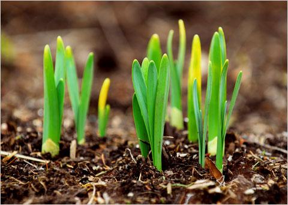

## Table of Contents

## What are 'Green Shoots' in economic terms?

In economic terms, 'Green Shoots' is a phrase used to describe early signs of recovery in an economy that has been struggling. It suggests that the economy is starting to grow again, like new plants growing in the spring. People look for green shoots to feel hopeful that things will get better.

These signs can include things like more people getting jobs, businesses selling more products, or the stock market going up. When economists and business leaders see these green shoots, they start to think that the bad times might be ending and better times are coming. It's important to watch these signs carefully because they can help predict what will happen next in the economy.

## Who is Ben Bernanke and what is his role in economics?

Ben Bernanke is an American economist who used to be the head of the Federal Reserve, which is like the boss of all the banks in the United States. He was in charge from 2006 to 2014. His job was to make sure the economy stayed healthy and that people could trust the money they used. He had a big role in trying to fix the economy during a really tough time called the Great Recession, which started in 2007.

During the Great Recession, lots of people lost their jobs and homes, and many businesses went bankrupt. Ben Bernanke worked hard to help the economy recover. He did things like lowering interest rates to make it easier for people to borrow money and spend more. He also started programs to help banks and businesses. Because of his actions, many people think he helped stop the economy from getting even worse and helped it start to get better.

## How did Ben Bernanke first use the term 'Green Shoots'?

Ben Bernanke first used the term 'Green Shoots' in 2009 during a tough economic time called the Great Recession. He was trying to help people feel better about the economy. He said he saw 'green shoots' of recovery, which meant he saw small signs that the economy might start getting better soon. This was important because people were really worried and needed some hope.

When Bernanke talked about 'green shoots,' he meant things like more people getting jobs and businesses doing a bit better. He wanted everyone to know that even though times were hard, there were signs that things could improve. This helped people feel a little more hopeful about the future of the economy.

## What was the economic context when Bernanke mentioned 'Green Shoots'?

When Ben Bernanke talked about 'Green Shoots' in 2009, the economy was going through a very tough time called the Great Recession. This started in 2007 and caused a lot of problems. Many people lost their jobs and homes, and businesses were struggling. It was a scary time for everyone because it felt like the economy was falling apart.

Bernanke, who was the head of the Federal Reserve, was trying to help the economy get better. When he mentioned 'Green Shoots,' he was pointing out small signs that things might start to improve. These signs included things like a few more people getting jobs and some businesses doing a bit better. By talking about 'Green Shoots,' Bernanke wanted to give people hope that the bad times wouldn't last forever and that the economy could start to recover.

## What impact did the term 'Green Shoots' have on public perception and market sentiment?

When Ben Bernanke talked about 'Green Shoots,' it made a big difference in how people felt about the economy. Before he said this, many people were really worried and scared because of the Great Recession. They didn't know if things would ever get better. But when Bernanke pointed out these early signs of recovery, it gave people hope. They started to believe that maybe the economy was turning around and that the bad times might be ending soon.

This change in how people felt also affected the stock market and other parts of the economy. When people heard about 'Green Shoots,' they felt more confident about investing and spending money. This confidence helped push the stock market up a bit and encouraged businesses to start hiring again. Even though the economy didn't get better right away, Bernanke's words helped change the mood from one of fear to one of cautious optimism, which was an important first step towards recovery.

## How have economists critiqued or supported the use of 'Green Shoots' as an indicator?

Some economists have critiqued the use of 'Green Shoots' because they think it can be too hopeful or misleading. They say that just because there are small signs of improvement, it doesn't mean the whole economy will get better soon. Sometimes, these early signs can disappear, and the economy might stay bad for a long time. These economists worry that talking about 'Green Shoots' might make people think things are better than they really are, which could lead to bad decisions, like spending too much money or investing in risky things.

On the other hand, other economists support the idea of 'Green Shoots' because they believe it's important to notice any signs of recovery, no matter how small. They think that pointing out these early signs can help keep people from getting too discouraged. It can also encourage businesses and governments to keep working on solutions. These economists argue that 'Green Shoots' can be a useful way to talk about the economy because it helps everyone understand that recovery can start slowly and that we need to keep watching and helping the economy grow.

## Can you explain specific examples where 'Green Shoots' were observed following Bernanke's statements?

After Ben Bernanke talked about 'Green Shoots,' people started to see some small signs that the economy was getting better. One example was that the number of people losing their jobs started to go down. Before, lots of people were getting laid off every month, but after Bernanke's statement, the number of job losses started to slow down. This made people feel a bit more hopeful because it meant fewer people were out of work.

Another sign of 'Green Shoots' was that the stock market began to go up a little bit. Before, the stock market had been falling a lot, which made people worried about their money. But after Bernanke's words, the stock market started to recover slowly. This showed that investors were feeling more confident and were starting to put their money back into the market. These small changes helped people believe that the economy might be on its way to getting better.

## What are the limitations of using 'Green Shoots' as a predictor of economic recovery?

Using 'Green Shoots' as a way to predict if the economy will get better has some problems. One big problem is that these early signs can be misleading. Just because there are a few good things happening, it doesn't mean the whole economy will start to recover soon. Sometimes, these 'Green Shoots' can go away, and the economy might stay bad or even get worse. This can make people think things are better than they really are, which can lead to bad choices, like spending too much money or investing in risky things.

Another limitation is that 'Green Shoots' can be hard to spot and measure. Different people might see different things as signs of recovery. What one economist thinks is a 'Green Shoot' might not seem important to another. This makes it tricky to use 'Green Shoots' as a reliable way to predict what will happen next in the economy. It's important to look at many different signs and not just rely on a few small improvements to decide if the economy is really getting better.

## How has the concept of 'Green Shoots' evolved since Bernanke's initial usage?

Since Ben Bernanke first talked about 'Green Shoots' in 2009, the idea has changed a bit. People now use the term more carefully. They know that just because there are some small signs of improvement, it doesn't mean the whole economy will get better right away. Economists and leaders are more aware that 'Green Shoots' can disappear and that the economy might still have a long way to go before it fully recovers. This has made them more cautious about declaring that things are getting better based on just a few signs.

The term 'Green Shoots' is still used today to talk about early signs of recovery, but it's used with more understanding of its limits. People look at many different signs and try to see the bigger picture before deciding if the economy is really improving. They also try to explain to the public that 'Green Shoots' are just the start and that it can take a long time for the economy to get fully back on track. This way, people don't get too hopeful too soon and can make better decisions about their money and future plans.

## What are the key differences between 'Green Shoots' and other economic indicators?

'Green Shoots' are different from other economic indicators because they focus on the very early signs of an economy starting to get better. Other indicators, like unemployment rates, GDP growth, or inflation, give a broader picture of how the economy is doing overall. 'Green Shoots' might be things like a few more people getting jobs or a small increase in business sales, which are tiny hints that things could improve. These early signs are not as solid or complete as other indicators, which can make them less reliable for making big decisions about the economy.

Another difference is that 'Green Shoots' are more about hope and the potential for recovery, while other economic indicators are more factual and based on hard data. For example, the stock market going up or consumer confidence improving can be seen as 'Green Shoots,' but they are more about how people feel than actual numbers. On the other hand, indicators like the unemployment rate or GDP growth are based on detailed [statistics](/wiki/bayesian-statistics) and give a clearer, more measurable view of the economy's health. Because 'Green Shoots' can be subjective and less certain, they are often used alongside other indicators to get a fuller understanding of what's happening in the economy.

## How can policymakers effectively utilize the 'Green Shoots' concept in economic planning?

Policymakers can use the 'Green Shoots' concept to help guide their decisions by looking for early signs of economic recovery. When they see things like more people getting jobs or businesses doing a bit better, they can start to think about what steps to take next. For example, they might decide to keep interest rates low to help businesses borrow money more easily, or they might start programs to help people get back to work. By paying attention to these small signs, policymakers can plan ahead and make sure they're ready to support the economy as it starts to grow again.

However, it's important for policymakers to be careful and not rely only on 'Green Shoots' for their planning. These early signs can be misleading, and the economy might not keep getting better. So, they need to look at many different indicators, like unemployment rates and GDP growth, to get a full picture of what's happening. By using 'Green Shoots' along with other data, policymakers can make smarter decisions and help the economy recover in a steady way, without getting too hopeful too soon.

## What future research directions could enhance the understanding and application of 'Green Shoots' in economic theory?

Future research could help us understand 'Green Shoots' better by looking at more data from past economic recoveries. Researchers could study what kinds of 'Green Shoots' have been the most reliable signs of recovery in the past. They could also look at how long it usually takes for 'Green Shoots' to turn into real, lasting improvements in the economy. By doing this, economists might be able to create better tools and models to predict when 'Green Shoots' are likely to lead to a strong recovery.

Another important area for research is figuring out how to tell the difference between real 'Green Shoots' and false alarms. Sometimes, small signs of improvement can disappear, and the economy might not get better. Researchers could work on finding ways to measure the strength and lasting power of these early signs. They could also study how different parts of the economy, like jobs, spending, and the stock market, connect to each other when 'Green Shoots' appear. This kind of research could help policymakers and economists make better decisions and plans for helping the economy grow.

## References & Further Reading

[1]: Bernanke, B. S. (2013). ["The Federal Reserve and the Financial Crisis"](https://press.princeton.edu/books/paperback/9780691165578/the-federal-reserve-and-the-financial-crisis). Princeton University Press.

[2]: Geithner, T. F. (2014). ["Stress Test: Reflections on Financial Crises"](https://www.amazon.com/Stress-Test-Reflections-Financial-Crises/dp/0804138613). Crown Publishers.

[3]: Shiller, R. J. (2008). ["The Subprime Solution: How Today's Global Financial Crisis Happened, and What to Do About It"](https://www.jstor.org/stable/j.cttq94jd). Princeton University Press.

[4]: Tetlow, R. J., & Ironside, B. T. (2007). ["Real-Time Model Uncertainty in the United States: 'Greenbook' Forecasts and Macro Model Forecasts"](https://www.federalreserve.gov/pubs/feds/2007/200748/200748pap.pdf). International Journal of Central Banking.

[5]: Baker, S. R., Bloom, N., & Davis, S. J. (2016). ["Measuring Economic Policy Uncertainty"](https://academic.oup.com/qje/article/131/4/1593/2468873). The Quarterly Journal of Economics, 131(4), 1593-1636.