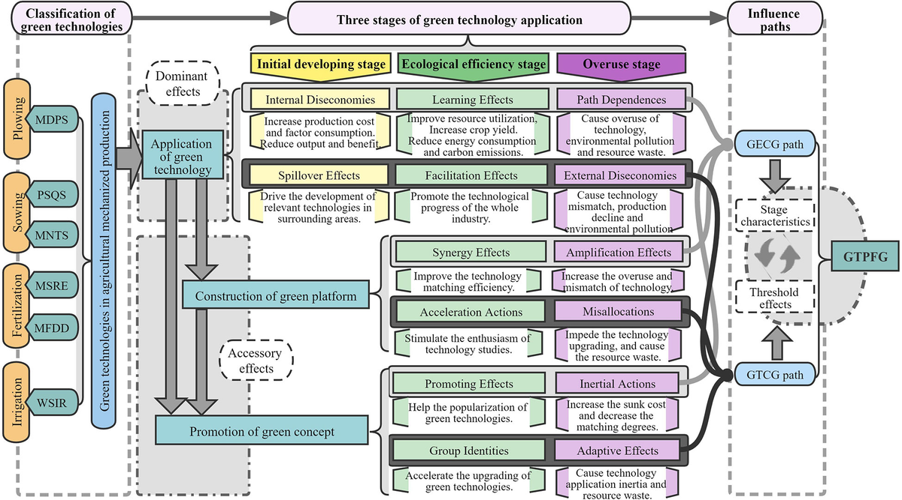

In an era marked by rapid technological advancement, the significance of sustainable practices has never been more evident. Industries are increasingly turning to eco-friendly innovation and green technology to mitigate environmental impacts while enhancing efficiency. These innovations are not mere trends but transformative forces that are reshaping how industries operate. By integrating sustainability into technological progress, businesses can address pressing environmental challenges while reaping economic benefits.

This article aims to explore the dynamic intersection between sustainable technology and algorithmic trading, shedding light on key innovations characterizing this emerging field. The integration of sustainable practices with advanced trading techniques signifies a pivotal shift towards investment strategies that align with environmental values.

Eco-consciousness has witnessed a significant rise among consumers and industries, accelerating green technology's growth. This heightened awareness has not only spurred demand for sustainable products and services but has also driven investment in technologies that support environmental preservation. As a result, green technology is experiencing unprecedented growth and gaining traction across diverse sectors.

Understanding what constitutes green technology and its integration with modern trading practices is vital. Green technology comprises innovations aimed at protecting the environment through the conservation of resources and reduction of pollution. When paired with algorithmic trading, it opens up new avenues for investments that prioritize sustainability. This synergy promises to redefine market dynamics and pave the way for an environmentally resilient economic future.

## Table of Contents

## Understanding Eco-Friendly Innovation

Eco-friendly innovation is the development of products and services designed to promote environmental sustainability. This involves leveraging renewable resources and implementing strategies to reduce carbon footprints. Such innovations address pressing environmental challenges while simultaneously unlocking new market opportunities for businesses.

The implementation of renewable resources is a cornerstone of eco-friendly innovation. By substituting fossil fuels with sustainable alternatives such as solar, wind, and hydroelectric power, industries can significantly reduce their greenhouse gas emissions. According to the International Renewable Energy Agency (IRENA), renewable energy sources accounted for approximately 72% of global electricity generation capacity additions in 2019[^1^]. The continuous improvement in the efficiency of photovoltaic cells and wind turbines has further enabled wider adoption and cost reductions in energy production.

Moreover, advancements in technology play a pivotal role across various sectors in supporting eco-friendly practices. For instance, the integration of smart grid technologies allows for real-time monitoring and optimization of energy consumption, reducing wastage and enhancing the balance between supply and demand. Companies like Tesla have integrated their battery technology into energy storage solutions, further aiding in the stabilization of renewable energy sources[^2^].

In waste management, technological innovations are transforming how waste is processed, recycled, and reused. Modern waste-to-energy plants convert municipal solid waste into useful forms of energy, thus minimizing landfill use. Circular economy models are gaining traction, where waste materials are reintroduced into the production cycle, promoting resource efficiency. Advanced recycling technologies, such as chemical recycling, are increasingly capable of converting plastics back into their original monomers, facilitating high-quality recycling[^3^].

Resource-efficient production processes are another critical aspect of eco-friendly innovation. The utilization of advanced manufacturing techniques, such as additive manufacturing (3D printing), reduces material wastage and energy consumption. The Lean Manufacturing philosophy also emphasizes reducing waste, optimizing processes, and delivering products sustainably.

These innovations are not only environmentally beneficial but also create economic incentives. The growing consumer demand for sustainable products presents businesses with opportunities to differentiate themselves in the market. The Ellen MacArthur Foundation projects that adopting circular economy principles could generate a net economic benefit of €1.8 trillion by 2030 for Europe alone[^4^].

In summary, eco-friendly innovation, through the use of renewable resources and efficiency-enhancing technologies, poses a solution to environmental challenges while offering valuable economic opportunities. As these innovations continue to evolve, they stand to significantly impact industries and contribute to the development of a more sustainable global economy.

[^1^]: International Renewable Energy Agency (IRENA). "Renewable Capacity Statistics 2020."
[^2^]: Tesla. "Energy Products and Services."
[^3^]: Ellen MacArthur Foundation. "Completing the Picture: How the Circular Economy Tackles Climate Change."
[^4^]: Ellen MacArthur Foundation. "Circular Economy in Action: Case Studies and Benefits."

## Green Technology: Key Areas and Types

Green technology is an expansive field of innovation designed to protect and conserve the environment. It encompasses various technological advancements aimed at reducing pollution and conserving resources, thus supporting a more sustainable future. Key areas of green technology include alternative energy sources, electric vehicles, sustainable agriculture, and recycling technologies.

Alternative energy sources are among the most significant contributors to green technology. These include solar, wind, hydroelectric, and geothermal energy, which provide cleaner, renewable energy alternatives to fossil fuels. The deployment of these technologies has significantly increased due to their potential to reduce greenhouse gas emissions and reliance on non-renewable resources. For instance, advancements in solar photovoltaic technology have led to greater efficiency and reduced costs, making solar energy more accessible and widespread.

Electric vehicles (EVs) represent another critical area of green technology. EVs help reduce pollution by decreasing reliance on gasoline and diesel-powered engines. The growing adoption of EVs is supported by improvements in battery technology, charging infrastructure, and government incentives, leading to a reduction in the overall carbon footprint of the transportation sector. Companies like Tesla, Nissan, and many traditional automobile manufacturers have heavily invested in EV technology, pushing the boundaries of performance and efficiency.

Sustainable agriculture is yet another key area, focusing on enhancing productivity while minimizing environmental impact. Techniques such as precision farming, which utilizes GPS and IoT technologies, allow for more efficient use of resources, reducing waste and enhancing crop yields. Organic farming practices minimize chemical inputs, preserve biodiversity, and improve soil health, contributing further to sustainable agricultural practices.

Recycling technologies also play a vital role in green technology by focusing on waste reduction and resource conservation. Innovations in this area include advanced sorting systems, chemical recycling methods, and biodegradable materials, which collectively aid in reducing landfill waste and promoting the circular economy. Improved recycling processes can significantly decrease the demand for virgin materials, leading to less environmental degradation and resource depletion.

Investment in green technology has increased substantially, driven by the growing awareness of climate change impacts and the need for sustainable solutions. Governments, corporations, and investors are recognizing the economic and environmental benefits of green technologies, leading to increased funding and development efforts. Each area of green technology offers distinct solutions to environmental challenges, supporting the transition to a more sustainable global economy while addressing the urgent need for climate action.

## Integration of Sustainable Tech in Business

Businesses are increasingly adopting green technologies to address environmental and sustainability goals, providing a strategic alignment with broader ecological objectives. This integration is often anchored in a company's Environmental, Social, and Governance ([ESG](/wiki/esg-investing)) framework, which serves as a guide for sustainable business practices. The ESG framework emphasizes the importance of incorporating eco-friendly technologies as part of corporate responsibility, thereby enhancing operational efficiency and reducing environmental impact.

Notable sectors leading the adoption of green technology include manufacturing, construction, finance, and agriculture. In manufacturing, companies are implementing energy-efficient processes and utilizing renewable resources to decrease carbon emissions. The construction industry is seeing a surge in the use of sustainable materials and green building techniques, which not only reduce waste but also enhance the energy efficiency of buildings. The finance sector integrates ESG criteria to guide investment decisions, fostering support for sustainable ventures. Agriculture, driven by the need to feed a growing global population, is adopting precision farming and resource-efficient practices to enhance sustainability.

Case studies reveal the successful implementation of sustainable technologies, illustrating tangible benefits such as cost savings and improved brand reputation. For example, the adoption of solar energy systems in manufacturing plants has led to significant reductions in energy costs while simultaneously decreasing reliance on fossil fuels. Similarly, companies that have embraced sustainable packaging solutions have observed a boost in their market image, attracting consumers who prioritize environmental responsibility.

The shift towards eco-friendly policies provides businesses with a competitive edge in markets where consumers are increasingly making purchasing decisions based on environmental considerations. This trend reflects a larger societal movement towards sustainability, with consumers favoring companies that demonstrate a commitment to ecological stewardship. By integrating sustainable technologies, businesses not only contribute to environmental conservation but also position themselves as leaders in a rapidly evolving market landscape.

Overall, the integration of sustainable technology in business practices represents a critical step in transitioning towards a more sustainable economy. As these practices become mainstream, they are expected to foster innovation, drive down costs, and ultimately contribute to a healthier planet.

## Algorithmic Trading in the Green Tech Industry

Algorithmic trading is revolutionizing the green tech industry by employing advanced technology to execute trades based on predefined algorithms. This method allows for significant improvements in speed, accuracy, and efficiency in the trading process. In the context of green technology, [algorithmic trading](/wiki/algorithmic-trading) serves as a pivotal tool for directing investments towards sustainable stocks and funds.

The automation of trading through algorithms enables investors to manage portfolios with a focus on green equities more efficiently. By utilizing sophisticated algorithms, traders can analyze vast amounts of data rapidly, identifying emerging trends and investment opportunities in sustainable markets. This capability is crucial for investors looking to align their financial strategies with environmental values.

Furthermore, algorithmic trading aids in the optimization of energy markets, a major component of the transition to renewable energy. By predicting supply and demand fluctuations and automatically adjusting buy and sell orders, algorithms can enhance market efficiency. This optimization can lead to more stabilized energy prices and a smoother integration of renewable energy sources, which are often characterized by intermittent supply.

The merger of algorithmic trading with sustainability initiatives also plays a crucial role in enhancing transparency and decision-making processes. Automated systems provide consistent and unbiased data analysis, ensuring that investment decisions are based on accurate and comprehensive information. This aspect is particularly valuable in the green tech industry, where transparency can cement investor confidence and encourage more significant financial commitments to sustainable projects.

Overall, the integration of algorithmic trading within the green tech sphere represents an innovative approach to channeling financial resources towards environmentally sustainable initiatives effectively. As technology continues to advance, its role in facilitating a sustainable financial ecosystem is expected to expand, supporting a transition towards greener economic practices.

## Benefits and Challenges of Sustainable Algo Trading

Sustainable algorithmic trading offers numerous benefits, foremost among them the enhancement of market efficiency and the provision of access to investments that prioritize environmental considerations. This allows investors to better align their financial objectives with their environmental values, fostering a synergy between profit-making and sustainability. By automating the trading process, algorithmic trading facilitates the rapid execution of trades, reducing human error and capitalizing on favorable market conditions for green stocks and funds. This can lead to higher [liquidity](/wiki/liquidity-risk-premium) and more accurate pricing, ultimately supporting the financial markets associated with sustainable development.

Algorithmic trading, particularly when applied to green investments, can empower investors to efficiently manage their sustainable portfolios. By using predefined criteria focused on environmental, social, and governance (ESG) factors, investors can ensure that their investment choices reflect their commitment to environmentally friendly practices. Additionally, the ability to analyze large datasets enables investors to identify trends and make informed decisions that support the transition to renewable energy and other green technologies.

However, the integration of sustainable algorithmic trading also presents challenges. One significant hurdle is the initial cost involved in the integration of advanced technologies necessary for implementing algorithmic strategies. This includes expenses related to developing software, securing infrastructure, and hiring skilled personnel to monitor and refine trading algorithms.

Another critical challenge is the availability and reliability of data on sustainable operations. Accurate and comprehensive data is essential for the effective execution of algorithmic trading strategies, especially those based on ESG criteria. The lack of standardized and transparent data in some cases can complicate the identification of truly sustainable investments.

Moreover, the risk of "greenwashing" poses a threat to sustainable algorithmic trading. Greenwashing occurs when companies inaccurately represent their sustainability efforts, potentially misleading investors about the environmental impact of their investments. Inaccurate portrayals could undermine the credibility of green investments and skew trading strategies, making it imperative for investors to conduct thorough due diligence.

Despite these challenges, sustainable algorithmic trading holds considerable potential for growth and innovation. As technology evolves and data becomes more accessible and standardized, the efficacy of algorithmic strategies in executing sustainable investments is likely to improve. Over time, these advancements can lead to significant long-term benefits, including enhanced market dynamics, increased investment in green technologies, and a more resilient and sustainable global economy. The potential to contribute to environmental preservation while achieving financial returns makes sustainable algorithmic trading an attractive prospect for forward-thinking investors.

## The Future of Green Technology and Algo Trading

Green technology and algorithmic trading are increasingly vital as environmental challenges become more pressing. Both fields are primed for significant advancements, driven by heightened ecological awareness and technological progress. Several future trends can be anticipated in the integration of these domains, leading to more efficient and sustainable economic practices.

One of the most significant developments is the creation of sophisticated sustainability metrics and data analytics. These tools are essential for evaluating the environmental impact of investments and ensuring that portfolios align with eco-friendly objectives. Enhanced data analytics can provide investors with greater insight into a company's environmental performance, thereby facilitating more informed decision-making processes. This development is expected to become increasingly important as stakeholders demand more accountability and transparency from businesses.

Blockchain technology is also poised to revolutionize green investments by offering improved transparency and traceability. This technology can record and verify transactions in a decentralized, immutable ledger, ensuring that claims of sustainability are credible and can be authenticated by stakeholders. For instance, blockchain could be employed to track the provenance of sustainable goods or to ensure that carbon credits are accurately distributed and accounted for. The establishment of such transparent systems can help to prevent 'greenwashing' and bolster investor confidence in green initiatives.

Regulatory frameworks are anticipated to evolve, fostering the growth of sustainable business models. Governments and international bodies are progressively instituting measures to incentivize green practices and to penalize environmentally harmful activities. For example, carbon pricing and stricter reporting requirements are becoming more common, encouraging companies to adopt more sustainable operations. As regulations continue to develop, businesses engaged in green technology and algorithmic trading will likely benefit from new opportunities and resources.

The fusion of green technology with intelligent trading systems signals a profound transformation in economic practices. By incorporating these advanced technologies, it is possible to achieve more efficient resource utilization, minimize waste, and support renewable energy initiatives. Algorithmic trading systems can optimize energy market dynamics, ensuring that renewable sources are integrated seamlessly into the grid, thus supporting the global transition to sustainable energy.

In summary, the continued evolution of green technology and algorithmic trading represents a pivotal progression towards sustainable economic practices. By embracing innovation and adapting to new regulatory landscapes, businesses and investors can make substantial contributions to environmental preservation while also benefitting from the economic potential of these advancements.

## Conclusion

Eco-friendly innovation and green technology are integral to creating a sustainable future. These advancements lay the groundwork for industries to reduce their environmental footprint while enhancing operational efficiency. The integration of algorithmic trading in the green technology sector exemplifies how cutting-edge technology can align financial goals with environmental priorities. By automating investment strategies, algorithmic trading enables investors to navigate the complexities of sustainable markets with greater transparency and effectiveness. 

Moreover, embracing these technologies contributes to a more resilient global economy by fostering sustainable practices that mitigate environmental impacts. The ripple effect extends beyond the financial markets, influencing production, consumption, and waste management systems across diverse sectors. This transformation underscores the necessity for collaboration among stakeholders, including governments, businesses, and communities, to fully exploit the potential of green technology and sustainable innovation.

A firm commitment to sustainability will be crucial for securing long-term economic growth while preserving our planet's ecological integrity. By championing eco-friendly practices and innovative technologies, industries can not only achieve regulatory compliance but also gain a competitive edge in an increasingly environmentally conscious market. The ongoing evolution of green technology and algorithmic trading signifies a pivotal shift towards harmonizing economic advancement with environmental stewardship, paving the way for a sustainable future.

## References & Further Reading

[1]: International Renewable Energy Agency (IRENA). ["Renewable Capacity Statistics 2020."](https://www.irena.org/publications/2020/Mar/Renewable-Capacity-Statistics-2020)

[2]: Tesla. ["Energy Products and Services."](https://www.tesla.com/energy)

[3]: Ellen MacArthur Foundation. ["Completing the Picture: How the Circular Economy Tackles Climate Change."](https://ellenmacarthurfoundation.org/completing-the-picture)

[4]: Ellen MacArthur Foundation. ["Circular Economy in Action: Case Studies and Benefits."](https://www.amcor.com/it-IT/media/news/amcor-ellen-macarthurfoundation-progress-report-2024)