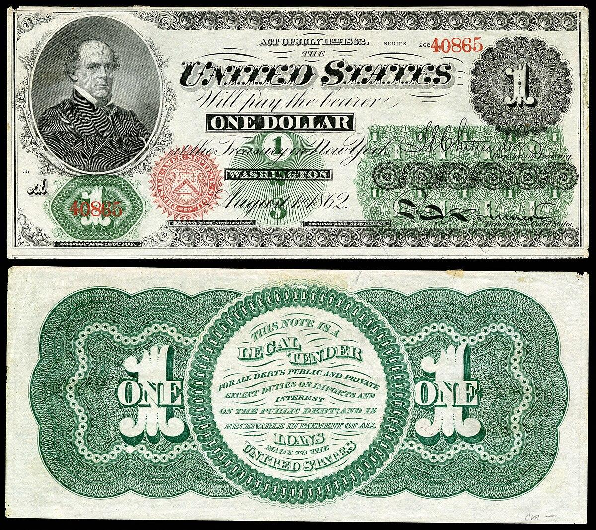

The U.S. dollar, commonly referred to as the greenback, holds a significant place in global finance due to its historical journey from a fledgling currency to a cornerstone of international trade. Originating during the American Civil War, the greenback was initially introduced as a means to finance the war effort without depleting gold reserves. Over time, it transformed into a robust currency, earning its role as the world's primary reserve currency.

This article charts the development of the U.S. dollar, highlighting its profound influence on global economies and examining the emergence of algorithmic trading within the currency market. Historical milestones, such as the adoption of the Bretton Woods system and the subsequent shift to fiat currency, have been pivotal in cementing the dollar's status on the world stage. The exploration of these events provides crucial insights into the currency's enduring impact and its evolution in response to shifting economic landscapes.



As advancements in technology continue to shape financial markets, algorithmic trading has emerged as a vital component of the forex market, where it plays a crucial role in the dynamics of currency trading. The integration of high-frequency trading algorithms, capable of analyzing vast amounts of data in real-time, has introduced new efficiencies and challenges in how currencies, including the U.S. dollar, are traded globally.

The U.S. dollar's journey does not end with its historical achievements. It faces ongoing evaluations in a digital era characterized by the rise of digital currencies and evolving monetary strategies. This article aims to provide a comprehensive understanding of the greenback's storied past, its current influence, and its prospects in an increasingly digitized financial landscape.

## Table of Contents

## The Origins and Evolution of the Greenback

The term 'greenback' initially referred to the paper currency that emerged in the United States during the Civil War era. Facing financial strain, the U.S. government began issuing paper notes, which were called greenbacks because of their green ink. These notes did not have backing by gold or silver, which led to initial skepticism and scrutiny. The absence of secure financial backing caused concerns about inflation and instability as the value of these notes fluctuated significantly against gold-backed currencies.

The Legal Tender Act of 1862 significantly influenced the greenback's transformation and the evolution of the modern U.S. dollar. This act was a legal measure that allowed the U.S. government to issue paper money for the first time as a legal tender accepted for public and private debts. The issuance of these notes aimed to resolve the significant debt and financing challenges faced by the Union during the Civil War. By legitimizing these notes as the national currency, the Act replaced previous demand notes with a standardized form of currency.

In the post-Civil War era, various economic policies were introduced to stabilize the greenback and integrate it into a broader monetary system. One significant development was the shift towards the gold standard, where the value of the U.S. dollar became tied to a specific amount of gold. This shift sought to instill greater confidence in the currency by ensuring its conversion into gold at a consistent rate. It marked a critical transition ensuring monetary stability and reducing inflationary pressures.

Understanding this historical context of the greenback's origin and subsequent evolution is crucial for grasping its impact on the current economic environment and policy formulation. The initial challenges faced during its introduction, coupled with decisive legislative actions like the Legal Tender Act and the adoption of the gold standard, laid the groundwork for the modern U.S. currency system. These events underscore the interplay between fiscal policy, economic imperatives, and public trust in monetary instruments, all of which continue to influence contemporary financial landscapes.

## The Greenback's Role in Global Economics

Post-World War II, the Bretton Woods Agreement significantly altered the global financial landscape by establishing the U.S. dollar as the central reserve currency. This system, initiated in 1944, linked other currencies to the U.S. dollar, with the dollar itself being convertible to gold at a fixed rate of $35 per ounce. This agreement not only facilitated international trade by providing a stable currency for exchange but also positioned the U.S. dollar as a pivotal element in global finance.

In the 1970s, significant changes occurred with the shift towards fiat currency, following the U.S. abandonment of the Bretton Woods system. The Nixon administration's decision to suspend the dollar's convertibility to gold marked the end of the gold standard, leading to the adoption of fiat currency, which is government-issued currency not backed by a physical commodity. This shift was further solidified by the establishment of the petrodollar system. Many oil-exporting countries agreed to trade oil exclusively in U.S. dollars, thus reinforcing the dollar's dominance and demand globally. This system created a cycle where countries needed dollars to purchase oil, consequently supporting its status as the leading reserve currency.

Today, the U.S. dollar's prominence in international trade remains immense, with a significant portion of global transactions being conducted in dollars. According to the International Monetary Fund (IMF) data, the dollar accounts for approximately 60% of global foreign exchange reserves and is involved in about 88% of daily foreign exchange market transactions. This widespread use not only elevates the dollar's demand but also supports its position as the primary currency for international settlements.

The implications of the dollar's central role in international trade extend beyond mere economic transactions, influencing global economic stability and diplomatic relations. Countries often hold extensive reserves of U.S. dollars to manage exchange rates and maintain balance in global trade. This impact on economic stability underscores the importance of the dollar in shaping both international economic policies and bilateral agreements.

Finally, understanding the influence of the greenback on global economics provides valuable insights into current economic strategies and challenges. Nations must navigate the complexities of an interconnected financial system where the U.S. dollar remains a cornerstone. As economic conditions evolve, the resilience of the dollar in maintaining its dominance amidst emerging currencies and shifting political dynamics remains a critical focus for economists and policymakers worldwide.

## Algorithmic Trading and the U.S. Dollar

Algorithmic trading, or algo trading, refers to the use of computer algorithms to automate the trading process in the financial markets, including currencies like the U.S. dollar. This contemporary approach to trading allows for complex computations and the execution of high-frequency and large-[volume](/wiki/volume-trading-strategy) trades. By relying on sophisticated algorithms, traders can swiftly analyze vast datasets comprising economic indicators, historical information, and market trends to optimize currency trades.

The U.S. dollar frequently experiences significant [algorithmic trading](/wiki/algorithmic-trading) activity due to its inherent stability and [liquidity](/wiki/liquidity-risk-premium). This stability stems from its status as a primary global reserve currency and its extensive use in international trade. As such, it attracts institutional investors and high-frequency traders who leverage algorithmic trading to exploit minor price discrepancies and achieve efficient market operations.

Algorithmic trading strategies typically incorporate various mathematical models and statistical techniques. For instance, time-series analysis and [machine learning](/wiki/machine-learning) algorithms are often employed to predict currency price movements and to develop strategies that maximize returns. A simple algorithm for mean reversion strategy in Python could be:

```python
import numpy as np
import pandas as pd

# Sample US dollar price data
data = {'Price': [1.2, 1.19, 1.22, 1.21, 1.23, 1.20]}
df = pd.DataFrame(data)

# Calculate rolling mean
window_size = 3
df['Rolling Mean'] = df['Price'].rolling(window=window_size).mean()

# Define mean reversion strategy
def signal(price, moving_average):
    if price > moving_average:
        return 'Sell'
    elif price < moving_average:
        return 'Buy'
    else:
        return 'Hold'

df['Signal'] = df.apply(lambda row: signal(row['Price'], row['Rolling Mean']), axis=1)
print(df)
```

Despite the advantages of speed and precision that algorithmic trading offers, it also presents challenges, particularly concerning transparency and regulatory oversight. The opacity of algorithmic models can raise concerns about market manipulation and unfair trading practices. Regulators are keen to ensure that such trading does not disrupt market stability or disadvantage any market participants.

Thus, while algorithmic trading of the U.S. dollar is propelled by its market stability and volume, ensuring its ongoing transparency and the effective regulation of these practices remains a priority for financial authorities.

## The Future of the Greenback in a Digital Era

As digital currencies gain traction, the future role of the U.S. dollar is continually being revisited by economists, central banks, and financial analysts. The rise of cryptocurrencies and the exploration of Central Bank Digital Currencies (CBDCs) highlight the evolving landscape of modern finance. Central banks across the globe, including the Federal Reserve, are examining the possibilities and implications of adopting digital currencies. These digital forms of money could potentially reshape traditional currency dynamics and influence the operation of global financial systems.

The U.S. dollar's current dominance is largely attributed to its established role as the world's primary reserve currency, a status supported by its widespread use in international trade and financial transactions. However, the emergence of digital currencies poses challenges to this status. Digital currencies offer the advantages of speed, lower transaction costs, and enhanced financial inclusion, which traditional currencies might struggle to match without significant adaptation.

Algorithmic trading strategies could be significantly affected by the shift toward digital currencies. Currently, algo trading leverages the stability and liquidity of the U.S. dollar to execute voluminous and rapid trading strategies. The advent of digital currencies introduces new variables into the trading environment, such as enhanced data transparency and different [volatility](/wiki/volatility-trading-strategies) profiles. Traders and financial institutions may need to adjust their algorithms to accommodate these new dynamics, potentially altering established trading practices.

Regulatory bodies are crucial in navigating this transition. Institutions like the U.S. Securities and Exchange Commission (SEC) and the Commodity Futures Trading Commission (CFTC) are tasked with ensuring market stability and protecting investor interests as they explore new regulatory frameworks that can accommodate digital currencies. These frameworks need to balance innovation with the mitigation of systemic risks, such as cybersecurity threats and financial fraud, which are particularly pertinent in digital finance.

The adaptability of the greenback is a critical [factor](/wiki/factor-investing) in maintaining its dominance amid these changes. The U.S. dollar must integrate seamlessly into this digital paradigm to retain its competitive edge. This may involve developing instruments that can coexist with digital currencies or enhancing the digital infrastructure supporting dollar transactions. The potential integration of blockchain technology to improve transaction transparency and efficiency might be one such step.

Ultimately, the future of the greenback in this digital era will depend on its ability to evolve alongside technological advancements. As central banks and regulatory bodies continue to experiment and adapt, the U.S. dollar's continued relevance will hinge on strategic innovations that leverage both its historical strengths and new digital opportunities.

## Conclusion

The history of the U.S. dollar as the greenback illustrates a powerful narrative of adaptation and resilience. From its inception during the Civil War to its present role as the world's leading reserve currency, the greenback has consistently demonstrated its ability to adapt to changing economic landscapes. Its continued dominance is largely attributed to strategic economic policies, historical significance, and systemic enablers such as the Bretton Woods Agreement and the petrodollar system.

Algorithmic trading has significantly reshaped the way the U.S. dollar is traded. This modern approach to trading leverages advanced algorithms and high-speed computing to optimize trading strategies, increasing efficiency in the [forex](/wiki/forex-system) market. However, it also presents challenges, including ensuring transparency and navigating the complex regulatory landscape.

As the global economic environment continues to evolve with technological advancements, the role of the U.S. dollar will be influenced by historical legacies and emerging trends in digital finance. Central banks' exploration of digital currencies presents potential shifts in the financial landscape, requiring the dollar to maintain its adaptability. The greenback's ability to integrate within new digital paradigms will be crucial for its continued relevance and dominance on the global stage. Through resilience and adaptation, the future of the U.S. dollar will likely reflect a balance of tradition and innovation, securing its position as a central pillar of the global economy.

## References & Further Reading

[1]: Eichengreen, B. (2011). ["Exorbitant Privilege: The Rise and Fall of the Dollar and the Future of the International Monetary System."](https://www.jstor.org/stable/26227197) Oxford University Press.

[2]: Klein, L. (2002). ["What is the Real Story of Bretton Woods?"](https://en.wikipedia.org/wiki/Bretton_Woods_system) Challenge, 45(4), 61-82.

[3]: [Federal Reserve Bank of New York.](https://www.newyorkfed.org/) "The Bretton Woods System."

[4]: Murphy, J. J. (1999). ["Technical Analysis of the Financial Markets: A Comprehensive Guide to Trading Methods and Applications."](https://archive.org/details/technicalanalysi0000murp) New York Institute of Finance.

[5]: ["The Alchemy of Finance"](https://www.amazon.com/Alchemy-Finance-George-Soros/dp/0471445495) by George Soros

[6]: ["Flash Boys: A Wall Street Revolt"](https://en.wikipedia.org/wiki/Flash_Boys) by Michael Lewis

[7]: [International Monetary Fund (IMF) Currency Composition of Official Foreign Exchange Reserves (COFER).](https://betadata.imf.org/Datasets/COFER)