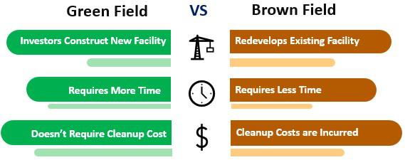

Foreign direct investments (FDIs) play a crucial role in global business expansion, facilitating the flow of capital across borders and contributing to economic growth and job creation. FDIs occur when a company or individual acquires a lasting interest in a foreign business entity, typically signifying a level of control or significant influence over the enterprise. This form of investment is pivotal not only for the capital infusion it provides but also for the transfer of technology, management skills, and enhanced market access that often accompany it.

There are two primary types of FDIs: greenfield and brownfield investments. A greenfield investment involves the establishment of a new operational facility from the ground up in a foreign country. This approach allows investors full control over the venture, enabling them to tailor operations to their specifications, from design to corporate culture, aligning closely with their strategic objectives. On the other hand, a brownfield investment entails the acquisition or leasing of existing facilities to launch production activities. This method often offers the advantage of faster market entry, with the added benefit of utilizing established infrastructure and potentially circumventing some regulatory barriers associated with new construction.

In recent years, the landscape of investment strategies has been significantly influenced by advancements in technology, particularly through algorithmic trading. This involves the use of computational algorithms to automate trading decisions, optimizing the timing, price, and quantity of trades. Algorithmic trading can enhance investment strategies by processing vast amounts of data rapidly, identifying trends and patterns that may not be immediately evident to human analysts. This technological edge allows investors to make data-driven decisions, potentially leading to more effective allocation of resources between greenfield and brownfield projects based on real-time market insights and predictive analytics.

## Table of Contents

## Understanding Greenfield Investments

Greenfield investments are a form of foreign direct investment (FDI) where a parent company begins a new venture in a foreign country by constructing new operational facilities from the ground up. This type of investment is characterized by the establishment of entirely new production or service capabilities, typically in regions that are deemed strategically advantageous for the company's global expansion. Companies engage in greenfield investments to gain complete control over the operations, allowing for customization and design flexibility.

Greenfield investments are often pursued in scenarios where companies aim to infiltrate new markets where existing infrastructure is insufficient or incompatible with the firm's operational requirements. Additionally, they are chosen when a company intends to leverage local resources or proximity to a particular market that shows high growth potential. Multinational corporations, especially those in the manufacturing and technology sectors, may opt for greenfield investments to enhance their global production network.

One of the primary advantages of greenfield investments is the significant degree of control they afford over the project's planning and execution. Companies can tailor their facilities to align with specific operational needs, integrate cutting-edge technologies, and implement rigorous quality standards. This flexibility fosters innovation and maximizes operational efficiency, which can be crucial in gaining competitive advantage in the new market. Furthermore, by starting anew, companies are able to establish a brand presence and foster positive relationships with the local community from the onset.

Despite these advantages, greenfield investments come with their share of challenges. The initial capital costs are typically high, as they involve funding construction, infrastructure, and the procurement of new equipment. In addition to monetary investment, greenfield projects require substantial time to develop, often leading to delayed market entry compared to other forms of FDI. Furthermore, companies may face significant regulatory barriers, as navigating the permitting and compliance landscape in a foreign country can be arduous. These regulatory challenges can vary widely depending on the host country's laws and stability of the legal framework, making thorough market research and legal assessment imperative.

Overall, greenfield investments provide a strategic path for companies seeking to expand their international footprint by establishing new capabilities tailored to specific market needs. However, they require careful consideration of the associated financial, regulatory, and operational challenges to ensure successful implementation.

## Exploring Brownfield Investments

Brownfield investments refer to the financial commitment by a company or investor to purchase, lease, or develop existing infrastructure or facilities within a foreign country. This type of investment is characterized by the acquisition of already operational or defunct properties, contrasting with greenfield investments, where new infrastructure is built from scratch.

Companies often opt for brownfield investments when they aim to expand their operations into a new market with reduced time and risk compared to constructing new facilities. Brownfield investments have become particularly attractive in industries such as manufacturing, energy, and telecommunications, where existing plants, networks, or equipment can be leveraged for immediate or near-term use.

One of the primary advantages of brownfield investments is the presence of existing infrastructure. This can offer a strategic advantage by allowing the investor to start operations quickly, thereby capturing market opportunities faster than setting up new facilities from scratch. The availability of utilities, transport links, and workforce within the area can significantly reduce operational costs and logistical challenges.

Moreover, brownfield investments can present opportunities for swift financial returns. The time and cost savings from utilizing pre-existing facilities allow businesses to focus on efficiency improvements and market penetration, often leading to quicker profitability. Additionally, governments may offer tax incentives to attract investors to revitalize and bring economic activity to underutilized sites, further enhancing the financial attractiveness of brownfield projects.

However, brownfield investments are not without challenges. A significant concern is the potential for environmental issues, as many brownfield sites may have contamination due to past industrial activities. Investors must conduct thorough environmental assessments and may need to undertake remediation efforts, which can be costly and time-consuming. 

The presence of pre-existing structures can also impose restrictions on the site's utilization. Modifying or upgrading facilities to meet contemporary standards and requirements can be technically challenging and may incur substantial additional expenses.

Additionally, engaging in brownfield projects often involves navigating a complex regulatory landscape. Compliance with local zoning laws, building codes, and environmental regulations can delay project timelines and increase bureaucratic overheads.

Despite these drawbacks, brownfield investments remain a viable and often preferred option for companies looking to expand with an emphasis on speed, cost efficiency, and minimizing initial risk exposure.

## Comparison of Greenfield and Brownfield Investments

Foreign Direct Investments (FDIs) facilitate global business expansion through mechanisms such as greenfield and brownfield investments. Each approach offers unique benefits and risks, requiring businesses to carefully evaluate factors based on their goals and market conditions.

Greenfield investments involve establishing new operations in a foreign country, generally when a company seeks to fully customize its infrastructure to fit specific needs. This approach is favored in scenarios where a business aims to enter new markets with tailor-made facilities, ensuring design flexibility and full control over operations. The ability to build state-of-the-art infrastructure is a primary advantage, allowing companies to implement the latest technologies and processes from the ground up. However, greenfield investments [carry](/wiki/carry-trading) significant drawbacks, including high initial costs, potential regulatory hurdles, and prolonged development timelines. The time and resources required to build a new facility from scratch can impede quick market entry and financial return.

Conversely, brownfield investments entail acquiring or leasing existing facilities in a foreign location for business operations. This strategy is often pursued when companies aim to leverage existing infrastructure for quicker market entry and potential financial returns. Brownfield investments benefit from reduced setup times and expenses since they capitalize on already developed sites. Additional advantages include possible tax incentives and a reduced environmental footprint. However, they also present challenges, such as environmental risks linked to pre-existing conditions, potential restrictions due to existing structural designs, and the complexity of navigating inherited regulatory frameworks.

Choosing between greenfield and brownfield investments necessitates a thorough analysis of various factors. Businesses must weigh their long-term strategic goals against current market conditions, availability of resources, and risk tolerance. For instance, a company prioritizing rapid market access and resource efficiency might lean towards brownfield investment, whereas an organization focused on bespoke production or advanced technological deployment might opt for a greenfield project.

A practical case highlighting a successful greenfield investment is seen with the entry of Japanese carmaker Toyota into the U.S. market. The company established a wholly-owned manufacturing facility in Kentucky, allowing it to cater specifically to American consumer preferences with the Toyota Camry. This plant provided Toyota with complete control over production processes and quality, boosting the company's competitiveness.

In contrast, the acquisition of Cadbury by Kraft Foods serves as an exemplar for a successful brownfield investment. Kraft's purchase of an established confectionery brand enabled it to expand its global footprint efficiently, leveraging Cadbury's existing distribution network and brand recognition while avoiding the lengthy processes and high costs involved in building new infrastructure from scratch.

In conclusion, the decision to pursue greenfield or brownfield investments should align with the company's strategic objectives, cost considerations, and preferred timelines for achieving market goals. Careful assessment ensures that the chosen pathway supports sustainable growth and competitive advantage.

## The Role of Algorithmic Trading in Investment Decisions

Algorithmic trading refers to the use of computer algorithms to automate trading decisions in financial markets. These algorithms can analyze vast amounts of data at high speed, allowing for precise and efficient investment strategies. The significance of [algorithmic trading](/wiki/algorithmic-trading) has been rising over the years due to its ability to eliminate human emotions from trading, improve the accuracy of trades, and enhance the speed of execution.

In the context of Foreign Direct Investments (FDIs), algorithmic trading provides valuable insights into selecting between greenfield and brownfield investments. While these investment types traditionally rely on comprehensive market analysis and strategic planning, algorithmic models can significantly enhance decision-making processes by identifying patterns, trends, and risks that may not be immediately apparent to human investors.

Algorithmic trading algorithms can incorporate data such as economic indicators, market conditions, company performance metrics, and geopolitical factors to predict the potential success of greenfield versus brownfield investments. For instance, an algorithm might evaluate the regulatory environment, infrastructure status, and market demand in various regions to determine the most promising investment location. Moreover, the ability to simulate various scenarios allows investors to weigh the potential returns and risks associated with each investment type.

Case studies exemplify the impact of algorithmic trading on optimizing investment portfolio decisions. For example, investors may use algorithmic tools to backtest historical data, revealing the potential outcomes of different FDI strategies under similar market conditions. Algorithms can also adjust their parameters dynamically in response to changing market trends, providing a flexible and responsive approach to investment.

Overall, the integration of algorithmic trading in FDI decision-making processes not only augments the traditional investment analysis framework but also offers a robust mechanism to adapt to swiftly changing market dynamics, ultimately guiding investors towards more informed and strategic investment choices.

## Conclusion

In conclusion, foreign direct investments (FDIs) remain pivotal in driving global business expansion, with greenfield and brownfield investments representing two primary strategies each with distinct advantages and disadvantages. Greenfield investments offer the benefits of customization, design flexibility, and the establishment of new markets, allowing companies to create purpose-built facilities tailored to their specific needs. However, these investments can incur high initial costs, face substantial regulatory challenges, and require longer development times.

Conversely, brownfield investments capitalize on existing infrastructure, providing companies with the potential for quick returns and possibly benefiting from tax incentives. Yet, they may encounter issues such as environmental concerns and restrictions from existing structures, accompanied by intricate regulatory requirements. When choosing between these two types of investments, businesses must weigh these pros and cons in light of their strategic goals and the prevailing market environment.

The emergence of algorithmic trading highlights the ongoing innovation in investment strategies. This technology enhances decision-making processes by efficiently analyzing large data sets, potentially influencing choices between greenfield and brownfield investments. Algorithmic trading's ability to optimize investment portfolio decisions showcases its increasing significance.

Looking ahead, FDIs will continue to shape global markets, with technological advancements likely playing a critical role. As businesses and investors adapt to evolving economic landscapes, the integration of innovative strategies, such as algorithmic trading, will be essential in maximizing investment outcomes and sustaining competitive advantages in the global arena.

## References & Further Reading

[1]: Caves, R. E. (1996). ["Multinational Enterprise and Economic Analysis,"](https://www.cambridge.org/core/books/multinational-enterprise-and-economic-analysis/360FF700D9C3BA605E68F0EDE350D427) Cambridge University Press.

[2]: Dunning, J. H. (1992). ["Multinational Enterprises and the Global Economy,"](https://www.jstor.org/stable/25483338) Addison-Wesley.

[3]: Lopez de Prado, M. (2018). ["Advances in Financial Machine Learning,"](https://www.amazon.com/Advances-Financial-Machine-Learning-Marcos/dp/1119482089) Wiley.

[4]: Vernon, R. (1979). ["The Product Cycle Hypothesis in a New International Environment,"](https://onlinelibrary.wiley.com/doi/abs/10.1111/j.1468-0084.1979.mp41004002.x) Oxford University Press.

[5]: Buckley, P. J., & Casson, M. C. (1985). ["The Economic Theory of the Multinational Enterprise,"](https://link.springer.com/book/10.1007/978-1-349-05242-4) Palgrave Macmillan.