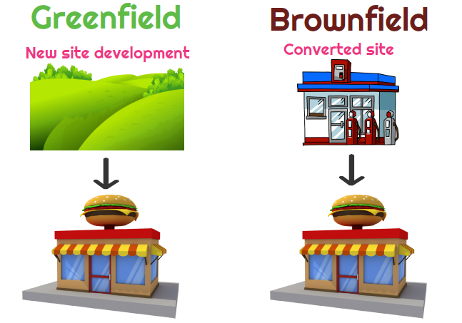

## Table of Contents

## What is a greenfield investment?

A greenfield investment is when a company decides to build a new business or factory from scratch in a different country. It's called "greenfield" because it's like starting on a fresh, green field where nothing was built before. This kind of investment can be exciting because the company gets to design everything the way they want. However, it can also be challenging because it involves a lot of planning and can be expensive and time-consuming.

Companies choose greenfield investments for many reasons. They might want to get closer to new customers, take advantage of lower costs in another country, or enter a market that's growing quickly. But, there are risks too. The company has to learn about new laws, cultures, and ways of doing business. Despite these challenges, a successful greenfield investment can help a company grow and become more competitive around the world.

## What is a brownfield investment?

A brownfield investment is when a company buys or leases an existing facility in another country instead of building a new one from scratch. This could be a factory, office, or any other type of business property that's already been used before. The main idea is to take over something that's already there and make it work for the new owner's needs.

Brownfield investments can save time and money because the company doesn't have to start from zero. They can use the existing buildings and sometimes even the equipment. But, there are challenges too. The facility might need repairs or updates, and there could be problems with pollution or old waste that need to be cleaned up. Still, for many companies, the benefits of a quicker start and lower initial costs make brownfield investments a good choice.

## What are the main differences between greenfield and brownfield investments?

The main difference between greenfield and brownfield investments is that a greenfield investment involves building a new facility from scratch, while a brownfield investment means taking over an existing one. With a greenfield investment, a company starts with a blank slate and can design everything exactly how they want. This can be exciting but also takes a lot of time and money. On the other hand, a brownfield investment lets a company use what's already there, which can save time and money because they don't have to build everything new.

Another key difference is the level of control and the risks involved. In a greenfield investment, the company has total control over the design and development of the new facility, but they face risks like not knowing the local market well or dealing with long construction times. With a brownfield investment, the company can start operating faster and might already have some customers or employees in place. However, they might have to deal with old equipment, pollution, or the need for renovations, which can be costly and time-consuming.

Overall, the choice between greenfield and brownfield investments depends on what the company wants to achieve and how much risk they are willing to take. Greenfield investments offer more control and the chance to build something exactly as envisioned, but they come with higher initial costs and longer timelines. Brownfield investments can be quicker and less expensive to start, but they come with their own set of challenges like dealing with existing issues at the facility.

## What are the advantages of greenfield investments?

Greenfield investments let a company start fresh. They can build a new factory or business exactly how they want it. This means they can use the latest technology and design everything to fit their needs perfectly. It's like getting a new toy where you can decide everything about it. This can make the business run better and be more efficient because everything is new and made just for them.

Another big advantage is that the company can choose the best location. They can pick a spot that's close to their customers or where it's cheaper to do business. This can help them save money and reach more people. Plus, starting from scratch can help the company learn about the new country and its culture. This can make them more successful in the long run because they understand the local market better.

## What are the disadvantages of greenfield investments?

Greenfield investments can be really expensive and take a long time. When a company decides to build a new factory or business from scratch, they have to pay for everything new. This includes the land, building materials, and all the equipment. It can take years to finish building everything, and during that time, the company isn't making any money from the new place. This can be a big problem if they need to start [earning](/wiki/earning-announcement) money quickly.

Another challenge is that the company might not know the local market very well. When they build something new in a different country, they have to learn about new laws, cultures, and ways of doing business. This can be hard and can lead to mistakes. If the company doesn't understand the local market, they might not attract as many customers as they hoped. This can make it harder for their new business to be successful.

## What are the advantages of brownfield investments?

Brownfield investments can save a company a lot of time and money. Instead of starting from scratch, they can use a building that's already there. This means they don't have to spend as much money on building new things, and they can start their business faster. It's like moving into a house that's already built instead of waiting to build your own. This can be really helpful if the company needs to start making money quickly.

Another big advantage is that the company might already have some customers or employees in place. When they take over an existing business, they can keep the people who know the local market well. This can make it easier for them to fit into the new country and start making money right away. Plus, they might not have to spend as much time learning about the new place because they can use what's already there.

## What are the disadvantages of brownfield investments?

One problem with brownfield investments is that the building or factory might need a lot of repairs or updates. When a company takes over something that's already been used, they might find that it's old or broken. This can cost a lot of money to fix and can take time. It's like buying a used car that needs a lot of work before you can drive it. This can be a big challenge for the company because they might not have planned for these extra costs.

Another issue is that there might be pollution or old waste at the site. When a company takes over an old factory, they might have to clean up things like chemicals or trash that were left behind. This can be expensive and can take a long time. It's like moving into a house and finding out you need to clean up a big mess before you can live there comfortably. This can make it harder for the company to start their new business quickly and can add to their costs.

## In which industries are greenfield investments most common?

Greenfield investments are often seen in the manufacturing industry. Companies might want to build new factories in different countries to be closer to their customers or to take advantage of lower costs. For example, a car company might build a new plant in another country where they can make cars cheaper and sell them to people nearby. This helps them save money and grow their business.

Another industry where greenfield investments are common is the energy sector. Companies might build new power plants or wind farms in places where they can get the resources they need. For example, a company might build a new solar farm in a sunny country to make electricity from the sun. This can help them provide energy to new areas and meet the growing demand for clean energy.

Greenfield investments are also popular in the technology industry. Tech companies often build new data centers or research facilities in different countries to be closer to their users and to tap into local talent. For example, a tech giant might build a new research lab in a country known for its skilled engineers. This helps them innovate faster and serve their global customers better.

## In which industries are brownfield investments most common?

Brownfield investments are often seen in the real estate industry. Companies might buy old buildings or shopping centers and fix them up to use them again. This can be a good way to save money because they don't have to build everything new. For example, a company might buy an old office building, fix it up, and then rent it out to other businesses. This can help them start making money faster than if they had to build a new building from scratch.

Another industry where brownfield investments are common is the manufacturing sector. Companies might take over old factories and update them to make new products. This can be cheaper and quicker than building a new factory. For example, a car company might buy an old factory, fix the machines, and start making cars there. This way, they can start production faster and don't have to spend as much money on new buildings and equipment.

## How do government policies affect greenfield and brownfield investments?

Government policies can have a big impact on greenfield and brownfield investments. For greenfield investments, governments might offer tax breaks or other incentives to encourage companies to build new factories or businesses in their country. These incentives can make it cheaper for companies to start fresh and can help them decide to invest. However, governments might also have strict rules about building new things, like environmental regulations or zoning laws, which can make greenfield investments more complicated and expensive. Companies have to follow these rules, which can slow down their plans and add to their costs.

For brownfield investments, government policies can also make a big difference. Governments might offer special programs to help companies clean up old sites and make them usable again. This can make brownfield investments more attractive because the government is helping with the costs of fixing up the old buildings or dealing with pollution. On the other hand, governments might have strict rules about what can be done with old sites, especially if they are polluted. These rules can make brownfield investments more challenging and expensive because companies have to follow them carefully. So, government policies can either help or hinder both types of investments, depending on what the rules are.

## What are some real-world examples of successful greenfield investments?

One example of a successful greenfield investment is when Toyota built a new factory in Georgetown, Kentucky, in the United States. In the 1980s, Toyota decided to make cars in America to be closer to their customers and save on shipping costs. They picked a spot in Kentucky and built a big factory from scratch. This helped Toyota sell more cars in the U.S. and also created a lot of jobs for people in Kentucky. Today, the Georgetown plant is one of Toyota's biggest factories and makes many popular car models.

Another example is when Samsung built a new semiconductor plant in Austin, Texas. In the 1990s, Samsung wanted to grow its business in the United States and decided to build a new factory for making computer chips. They chose Austin because it had good schools and a lot of smart engineers. Building the new plant helped Samsung become a big player in the U.S. market for semiconductors. The Austin plant has been very successful and has helped Samsung keep up with the growing demand for technology.

## What are some real-world examples of successful brownfield investments?

One successful brownfield investment was when Ford bought an old factory in Chicago. The factory used to make cars for another company, but it was old and needed a lot of work. Ford decided to buy it and fix it up instead of building a new factory from scratch. They spent money to clean up the old factory and update the machines. Now, Ford makes cars there and it has helped them save money and start making cars faster than if they had built a new factory.

Another example is when Google bought an old shopping center in Mountain View, California. The shopping center was not being used much and needed repairs. Google saw it as a chance to save money and time. They bought the shopping center and turned it into a new office space for their employees. Now, it's called the GooglePlex and it's a big part of Google's headquarters. This brownfield investment helped Google grow their business without spending as much time and money on building something new.

## References & Further Reading

[1]: Caves, R. E. (1996). ["Multinational Enterprise and Economic Analysis,"](https://www.cambridge.org/core/books/multinational-enterprise-and-economic-analysis/360FF700D9C3BA605E68F0EDE350D427) Cambridge University Press.

[2]: Dunning, J. H. (1992). ["Multinational Enterprises and the Global Economy,"](https://www.jstor.org/stable/25483338) Addison-Wesley.

[3]: Lopez de Prado, M. (2018). ["Advances in Financial Machine Learning,"](https://www.amazon.com/Advances-Financial-Machine-Learning-Marcos/dp/1119482089) Wiley.

[4]: Vernon, R. (1979). ["The Product Cycle Hypothesis in a New International Environment,"](https://onlinelibrary.wiley.com/doi/abs/10.1111/j.1468-0084.1979.mp41004002.x) Oxford University Press.

[5]: Buckley, P. J., & Casson, M. C. (1985). ["The Economic Theory of the Multinational Enterprise,"](https://link.springer.com/book/10.1007/978-1-349-05242-4) Palgrave Macmillan.