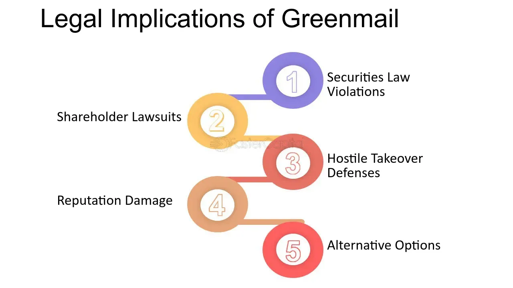

## Table of Contents

## What is greenmail?

Greenmail is when a person or company buys a lot of shares in another company to scare them. They threaten to take over the company unless they are paid to go away. The company being threatened might pay them to sell back the shares at a higher price than they bought them for. This is a quick way for the person or company to make money, but it can hurt the company that pays them.

This practice is not liked by many people because it can be seen as a form of blackmail. It can make the company's stock price go down and upset other shareholders. Because of this, greenmail is now illegal in some places, and companies often have rules to stop it from happening.

## How does the mechanism of greenmail work?

Greenmail happens when someone buys a big chunk of a company's shares. They do this to scare the company and make it think they might try to take over. The person or group then threatens to do a hostile takeover, which means they will try to control the company without the current leaders wanting it. This makes the company's leaders worried and scared.

To stop the takeover, the company might decide to pay the person or group to go away. They do this by buying back the shares at a price higher than what the person or group paid for them. This payment is like a bribe to make them leave the company alone. It's called greenmail because it's like blackmail, but with money from the company's profits. This can hurt the company because it uses up money that could have been used for other things, and it can make the stock price go down, which is bad for other shareholders.

## Can you provide a simple example of greenmail?

Imagine there's a small company called Happy Toys. A person named Sam buys a lot of shares in Happy Toys. He now owns a big part of the company. Sam tells Happy Toys that if they don't pay him more money, he will try to take over the company and change everything.

Happy Toys doesn't want Sam to take over. They are scared and decide to pay Sam to go away. They buy back the shares from Sam at a higher price than what he paid. Sam makes a quick profit, but Happy Toys loses money that could have been used to make better toys.

## What are the motivations behind greenmail?

The main reason someone might use greenmail is to make quick money. By buying a lot of shares in a company and then threatening to take it over, the person can scare the company into buying back those shares at a higher price. This means the person can sell the shares back to the company for more than they paid, making a profit without having to do much work. It's like a shortcut to making money, but it's not fair to the company or other shareholders.

Another motivation could be to gain some control or influence over the company without fully taking it over. By threatening a takeover, the person can push the company to make changes or decisions that they want. This could be about changing the way the company is run or getting it to do something specific. Even if the person doesn't actually want to run the company, they can use the threat to get what they want.

## How does greenmail affect the target company?

Greenmail can hurt the target company a lot. When a company pays to stop someone from taking it over, it uses up money that could have been used for other important things, like making the business better or paying workers more. This can make the company weaker and less able to grow or compete with others. Also, when the news gets out that the company paid to stop a takeover, it can make people think the company is in trouble, which can make the stock price go down. This is bad for other people who own shares in the company because their shares are now worth less.

On top of that, greenmail can make people lose trust in the company's leaders. If shareholders see that the company paid someone to go away instead of standing up to them, they might think the leaders are not strong or smart enough to handle problems. This can make it hard for the company to get more money from investors in the future because people might not want to put their money into a company that seems weak or unsure. In the end, greenmail can leave the company in a worse spot than it was before, both in terms of money and how people see it.

## What are the potential benefits for the greenmailer?

The main benefit for the greenmailer is making quick money. By buying a lot of shares in a company and then threatening to take it over, the greenmailer can scare the company into buying back those shares at a higher price. This means the greenmailer can sell the shares back and make a profit without having to do much work. It's like finding a shortcut to making money, which is why some people are tempted to use greenmail.

Another benefit for the greenmailer could be gaining some control or influence over the company without fully taking it over. By threatening a takeover, the greenmailer can push the company to make changes or decisions that they want. This could be about changing how the company is run or getting it to do something specific. Even if the greenmailer doesn't actually want to run the company, they can use the threat to get what they want, which gives them power over the company's actions.

## Are there any historical cases of greenmail that illustrate its impact?

One famous example of greenmail happened with the company Disney in the 1980s. A man named Saul Steinberg bought a lot of Disney shares and threatened to take over the company. Disney didn't want this to happen, so they paid Steinberg to go away. They bought back the shares at a higher price than he paid, which cost Disney a lot of money. This made Disney's stock price go down, and it upset a lot of other people who owned Disney shares because their shares were now worth less.

Another example is when the company Goodyear faced greenmail from a man named James Goldsmith in the 1980s. Goldsmith bought a big part of Goodyear and threatened to take it over. Goodyear paid him to leave them alone by buying back the shares at a higher price. This used up a lot of Goodyear's money that could have been used to make their business better. It also made people think Goodyear was in trouble, which hurt their stock price and made it harder for them to grow and compete with other companies.

## What are the legal considerations surrounding greenmail in the United States?

In the United States, greenmail is not illegal everywhere, but many states have laws to stop it. Some states have rules that make it harder for companies to pay greenmailers. For example, they might need to get approval from shareholders before they can buy back shares at a higher price. This helps protect the company and other shareholders from losing money. Also, the U.S. tax code used to treat greenmail payments as capital gains, which meant the greenmailer had to pay less tax on the money they made. But in 1986, the tax code changed, and now greenmail payments are treated as regular income, which means the greenmailer has to pay more tax.

Companies can also use something called "poison pills" to stop greenmail. A poison pill is a rule that makes it very expensive for someone to take over the company. If someone tries to buy a lot of shares, the company can give more shares to other shareholders for free, which makes it harder for the person to get control. This can scare off greenmailers because it makes their plan less likely to work. Many companies have these rules in place to protect themselves from greenmail and other kinds of hostile takeovers.

## How have laws and regulations evolved to address greenmail?

Laws and rules about greenmail have changed over time to make it harder for people to do it. In the United States, some states made new laws that say companies need to get permission from their shareholders before they can buy back shares at a higher price. This helps stop companies from paying greenmailers without thinking about what it means for everyone else who owns shares. Also, in 1986, the U.S. tax code changed. Before, greenmailers only had to pay a small amount of tax on the money they made from greenmail. But after the change, they have to pay more tax because greenmail payments are now treated like regular income, not special gains.

Companies have also come up with their own ways to fight greenmail. One way is by using something called a "poison pill." This is a rule that makes it very expensive for someone to take over the company. If someone buys a lot of shares, the company can give more shares to other shareholders for free. This makes it harder for the person trying to take over to get control. Many companies now have these poison pill rules to protect themselves from greenmail and other kinds of hostile takeovers. These changes in laws and company rules have made it much harder for greenmail to happen.

## What are the ethical implications of engaging in greenmail?

Engaging in greenmail raises big ethical questions. It's like a form of blackmail where someone threatens to take over a company unless they get paid to go away. This can hurt the company and other people who own shares in it. It's not fair because the person doing greenmail is trying to make quick money in a way that can harm others. It goes against the idea of treating everyone fairly and can make people lose trust in the business world.

On top of that, greenmail can make a company weaker by using up money that could have been used for good things like making the business better or helping workers. When a company pays to stop a takeover, it can also make the stock price go down, which is bad for other shareholders. Ethically, it's wrong because it puts the greenmailer's greed ahead of what's best for the company and its people. It's a selfish act that can have big negative effects on many people.

## How can companies defend themselves against greenmail threats?

Companies can defend themselves against greenmail by using something called a "poison pill." This is a rule that makes it very hard for someone to take over the company. If someone buys a lot of shares and tries to take over, the company can give more shares to other shareholders for free. This makes it more expensive and harder for the person trying to take over to get control. Many companies have these rules to protect themselves from greenmail and other kinds of hostile takeovers.

Another way companies can protect themselves is by having rules that need shareholder approval before they can buy back shares at a higher price. This stops the company from paying greenmailers without thinking about what it means for everyone else who owns shares. It's a way to make sure the company thinks about what's best for all shareholders, not just the person trying to make quick money. These rules can make it much harder for greenmail to happen and help keep the company safe.

## What are the expert views on the future of greenmail in corporate governance?

Experts think that greenmail might become less common in the future because of stronger laws and company rules. Many states now have laws that make it hard for companies to pay greenmailers without getting permission from shareholders first. This means companies have to be more careful and think about what's best for everyone who owns shares, not just the person trying to make quick money. Also, changes in the tax code have made greenmail less attractive because the person doing it has to pay more taxes on the money they make. These changes make it harder for greenmail to happen and might make it less of a problem in the future.

Even though greenmail might happen less often, experts say that companies still need to be ready for it. They can use things like poison pills to make it hard for someone to take over the company. A poison pill is a rule that gives more shares to other shareholders if someone tries to buy a lot of shares, making it more expensive for the person trying to take over. Companies also need to keep their shareholders happy and informed so they can get their support if they need to fight off a greenmail threat. By staying alert and using smart rules, companies can protect themselves from greenmail and keep their business strong.

## References & Further Reading

[1]: Lipton, A. (2002). ["Mathematical Methods for Foreign Exchange: A Financial Engineer's Approach."](https://www.amazon.com/MATHEMATICAL-METHODS-FOREIGN-EXCHANGE-FINANCIAL/dp/9810248237) World Scientific Publishing Company. 

[2]: Manne, H. (1965). ["Mergers and the Market for Corporate Control."](https://publics22.classes.ryansafner.com/readings/Manne-1965.pdf) Journal of Political Economy.

[3]: Ruback, R. S. (1988). ["An Overview of Takeover Defenses."](https://www.nber.org/system/files/chapters/c5821/c5821.pdf) In A. J. Auerbach (Ed.), Corporate Takeovers: Causes and Consequences. University of Chicago Press.

[4]: Schwert, G. W. (2000). ["Hostility in Takeovers: In the Eyes of the Beholder?"](https://onlinelibrary.wiley.com/doi/10.1111/0022-1082.00301) The Journal of Finance, 55(6), 2599-2640.

[5]: Mulherin, J. H., & Boone, A. L. (2000). ["Comparing Acquisitions and Divestitures."](https://www.sciencedirect.com/science/article/pii/S0929119900000109) Journal of Corporate Finance, 6(2), 117-139. 

[6]: Shleifer, A., & Vishny, R. W. (1997). ["A Survey of Corporate Governance."](https://onlinelibrary.wiley.com/doi/abs/10.1111/j.1540-6261.1997.tb04820.x) The Journal of Finance.