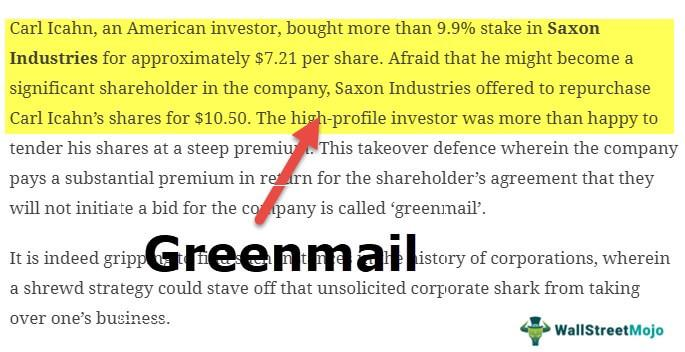

Greenmail is a notable strategy within corporate finance that has been influential in shaping business strategies, particularly in the context of hostile takeovers. It involves a tactic where a large block of a company's stock is purchased by an entity, often with the implicit or explicit threat of a takeover. To avert this, the target company may buy back the shares at a premium, resulting in a substantial profit for the purchaser. This maneuver is primarily associated with aggressive investment behavior seen in corporate finance during the 1980s, a period marked by numerous hostile takeover attempts.

### Brief Overview of Terms

1. **Greenmail**: An aggressive investment practice involving purchasing enough shares in a company to challenge a takeover. The threat of the takeover compels the company to repurchase shares at a higher price, akin to a shareholder payoff to abandon the takeover threat.

2. **Business Strategy**: A roadmap outlining how a company intends to achieve its objectives, enhance growth, and manage threats. Greenmail can significantly influence a company's strategic decisions, particularly in thwarting unfriendly takeovers.

3. **Corporate Finance**: This encompasses the financial activities related to managing and funding a corporation. Key decisions involve investment appraisal, capital structuring, and the distribution of dividends. Greenmail activities are a component of how corporate finance strategies are implemented to maximize shareholder wealth.

4. **Algorithmic Trading (Algo Trading)**: A method of executing stock orders using automated, pre-programmed trading instructions accounting for variables such as time, price, and volume. Algo trading plays a role in modern corporate finance, potentially impacting strategies concerning greenmail by optimizing the timing and execution of stock trades.

### Significance of Greenmail in Hostile Takeovers

Greenmail serves as a defense mechanism within hostile takeovers, enabling companies to deter unsolicited acquisition attempts. By repurchasing stock from a potential acquirer at a premium, the target company retains control, protecting its strategic vision and operations. Although this action may temporarily inflate stock valuation and enrich specific stakeholders, it also raises governance and ethical questions.

### Purpose of the Article

This article aims to explore the intersection of greenmail and corporate strategies, shedding light on its historical context, implications for corporate governance, and the evolving landscape of business tactics. By examining [algorithmic trading](/wiki/algorithmic-trading) within this framework, the discussion will provide insights into potential strategic advantages and ethical challenges faced by modern corporations in an increasingly digital and automated financial environment.

## Table of Contents

## Understanding Greenmail

Greenmail is a tactical maneuver in corporate finance, often employed during hostile takeovers. At its core, greenmail involves the purchase of a substantial block of a company's stock, followed by a threat of a hostile takeover. The target company, in an effort to avert this takeover, repurchases the stock at a premium, often resulting in substantial profits for the initial investor. This tactic is reminiscent of traditional extortion but operates within legal boundaries when executed carefully.

The term "greenmail" gained prominence in the 1980s, during a period marked by aggressive corporate takeovers and leveraged buyouts. Notable figures such as T. Boone Pickens and Carl Icahn were associated with greenmail strategies at the time. For example, Icahn famously utilized greenmail in several high-profile takeover bids, [earning](/wiki/earning-announcement) millions in the process. The method became a symbol of the hostile takeover era and reflective of the aggressive investment tactics of the decade. 

Greenmail functions within corporate takeovers by leveraging the threat of disruption. An investor purchases enough stock to become a significant shareholder, posing as a potential hostile bidder. The mere possibility of a takeover can cause turmoil within the target company, often leading to strategic negotiations. To eliminate the threat, the target company makes a repurchase offer at a premium, essentially paying the initial bidder to withdraw their takeover intent.

The financial

## Impact of Greenmail on Corporate Strategy

Greenmail, a practice rooted in corporate finance and hostile takeovers, exerts a significant influence on corporate strategy and decision-making. Typically, greenmail occurs when an entity purchases a substantial block of a company's shares and uses the threat of a hostile takeover to compel the target company to repurchase the shares at a premium. This tactic can deeply impact shareholder value and corporate governance, creating nuanced strategic implications that companies must navigate.

Regarding shareholder value, greenmail can have both immediate and far-reaching consequences. In the short term, companies may pay a premium to buy back shares, providing an immediate financial outflow that impacts cash reserves and potentially jeopardizes other investments or growth initiatives. For example, if a corporation has to divert resources to repurchase shares at a premium of 20% above the market price, its cash flow and balance sheet strength could be adversely affected. This temporary decrease in available capital can lead to reduced investor confidence and potential declines in stock price as the market reacts to what might be perceived as a defensive or panic-driven strategy.

On the subject of corporate governance, greenmail poses a challenge by forcing management and boards to prioritize the immediate threat over longer-term strategic vision. The presence of an aggressive shareholder often leads to changes in governance practices, as companies might implement defensive mechanisms like poison pills, staggered board elections, or shareholder rights plans. These interventions can alter how control is exercised within the company, sometimes leading to conflicts of interest or ethical concerns related to management's alignment with shareholder interests.

Strategically, the implications of greenmail must be addressed on both short-term and long-term fronts. Short-term strategies focus on neutralizing the immediate threat posed by an activist investor, usually involving financial maneuvers such as share repurchase or negotiating strategic buyouts. Long-term strategies, however, demand more comprehensive adjustments, like revisiting the company's core objectives, investment priorities, and risk management protocols to mitigate future hostile actions.

To counteract potential greenmail threats, companies deploy various defense mechanisms. A prevalent tactic is the adoption of a poison pill strategy, where existing shareholders receive rights to purchase additional shares at a discount, diluting the ownership percentage of the threatening party. This not only makes a takeover less attractive financially but also ensures that any acquirer has to negotiate directly with the board. Other defenses include white knight strategies, where a more favorable company is encouraged to merge with the target firm to counteract the hostile approach, or recapitalization efforts that reconfigure the company's financial structure to make a takeover less appealing.

In summary, while greenmail poses significant challenges to corporate strategy, it also acts as a crucible for testing the robustness of governance practices and strategic foresight. Balancing between immediate defense and strategic long-term planning is crucial for companies aiming to maintain their competitive edge and preserve shareholder value. The evolving field of corporate finance continues to explore and adapt to these challenges, emphasizing the need for innovative strategies and comprehensive governance frameworks.

## Algorithmic Trading and Its Role in Modern Corporate Finance

Algorithmic trading, commonly known as algo trading, leverages computational algorithms to automate trading processes. These algorithms are designed to execute orders based on predefined criteria including timing, price, or [volume](/wiki/volume-trading-strategy), thus enabling high-speed and high-frequency trading. The primary functionalities of algorithmic trading include trade execution, market analysis, and risk management. By automating these processes, algorithmic trading not only enhances efficiency but also reduces the incidence of human error.

Integration of algorithmic trading in corporate finance strategies is becoming increasingly prevalent. Corporations utilize these algorithms to optimize their trading strategies, manage portfolios, and execute large trades with minimal market impact. By analyzing vast datasets, algo trading models can detect patterns and predict market trends, allowing firms to make informed financial decisions.

In the context of greenmail scenarios, algorithmic trading presents significant potential. During hostile takeover attempts, companies can use algorithms to swiftly adjust their stock positions or deploy counterstrategies. For instance, algorithms can help a company monitor stock price movements in real-time, effectively enabling them to respond quickly to any accumulation of shares by potential greenmailers. By analyzing trading patterns, these algorithms can predict hostile moves and automate defensive measures such as share buybacks or strategic acquisitions.

Numerous case studies have demonstrated the strategic advantages of algorithmic trading. For example, hedge funds and investment banks have employed sophisticated algorithms to anticipate market shifts and capitalize on [arbitrage](/wiki/arbitrage) opportunities. Companies have reported increased profitability and reduced transaction costs as a result of integrating algo trading in their operations. Moreover, algorithms have been used to simulate various market scenarios, giving firms an edge in strategizing against potential threats like greenmail.

In summary, algorithmic trading offers a powerful toolset for modern corporate finance, providing the agility and precision needed to navigate complex market dynamics and defend against strategic threats such as greenmail. As technology continues to advance, its role in shaping corporate finance strategies will only become more pronounced.

## Legal and Ethical Considerations

Greenmail, as a strategic financial maneuver in corporate takeovers, involves significant legal and ethical scrutiny. The tactic generally entails a company repurchasing its stock at a premium from an aggressive investor who threatens a hostile takeover. This raises several questions about legality and morality in business practices.

**Legal Examination**

The legality of greenmail has been contentious. In several jurisdictions, regulations have evolved to address greenmail's implications, aiming to protect the interests of minority shareholders and ensure fair play in corporate takeovers. In the United States, for instance, Section 5881 of the Internal Revenue Code imposes a penalty tax on greenmail, effectively deterring companies from engaging in this practice. This regulation reflects a broader legislative effort to curb tactics perceived as detrimental to equitable corporate conduct.

**Ethical Debates**

Ethically, greenmail stands on a fine line between strategy and extortion. Proponents argue that it serves as a legitimate defense mechanism, allowing target companies to maintain autonomy and fend off hostile actors. Detractors, however, liken greenmail to extortion, as it often benefits the greenmailer at the expense of the company's long-term health and minority shareholders. This ethical debate underscores the conflict between immediate strategic advantages and the broader implications for corporate governance and stakeholder equity.

**Regulations and Legislative Responses**

The development of regulations governing greenmail stems from a necessity to balance corporate freedom with ethical business practices. Legislative actions, such as anti-greenmail provisions in corporate charters and state laws in various U.S. states, aim to prevent companies from succumbing to what is considered a coercive strategy. These legal frameworks attempt to ensure that corporate acquisitions and defenses align with fair market principles and transparent corporate governance.

**Corporate Governance's Role**

In the context of greenmail, corporate governance plays a crucial role in making ethically sound decisions. A robust governance framework can help navigate the complexities of defending against hostile takeovers while maintaining ethical standards. This involves creating policies that prevent the abuse of greenmail, fostering a corporate culture that prioritizes long-term growth over short-term gains, and ensuring that board decisions are made in the best interests of all shareholders.

Overall, the legal and ethical considerations surrounding greenmail highlight the need for a balanced approach that respects both strategic business imperatives and ethical norms. As corporate finance continues to evolve, these considerations will remain central to discussions on sustainable and fair business practices.

## Alternatives and Future Outlook

Alternatives to greenmail for defending against hostile takeovers have gained prominence as corporate landscapes evolve. Companies have developed innovative strategies to discourage unsolicited bids while maintaining ethical standards. One such approach is the adoption of the "poison pill" strategy, formally known as a shareholder rights plan. This allows existing shareholders to purchase additional shares at a discount, effectively diluting the stake of a potential acquirer and making the takeover more expensive. This method does not inherently require a direct payoff to potential aggressors, unlike greenmail, thereby avoiding potential ethical complications.

Another strategic defense is the "white knight" approach. In this scenario, a friendly company, the "white knight," is sought to acquire the target company instead of the hostile bidder. This tactic can preserve the management's position and is often seen as a more palatable solution for stakeholders compared to engaging in greenmail negotiations. Additionally, companies have strengthened their corporate charters with staggered board elections, making it more challenging for hostile parties to quickly gain control.

Looking towards the future of greenmail in corporate finance, the landscape is likely to continue evolving with advancements in technology and governance practices. With the increasing integration of [artificial intelligence](/wiki/ai-artificial-intelligence) and [machine learning](/wiki/machine-learning) in business operations, automatic monitoring systems could be developed to detect early signs of hostile takeover attempts, allowing for proactive defense strategies without the ethical quandaries associated with greenmail.

Moreover, regulatory frameworks continue to adapt, with a trend towards increased transparency and shareholder involvement in major corporate decisions. These changes could limit the effectiveness of greenmail as a hostile takeover tactic by empowering shareholders to have a greater say in the company's defenses and strategic direction.

Balancing business strategies and ethical considerations remains a critical challenge. While greenmail has offered a strategic advantage in the past, its ethical shortcomings have prompted a shift towards more equitable practices. The development of robust corporate governance policies and the emphasis on stakeholder value have redefined the defensive strategies available to companies. As corporate finance continues to adapt to new challenges and opportunities, the ongoing dialogue between innovation and ethics will shape the ways in which companies safeguard their interests while upholding corporate responsibility.

## Conclusion

The concept of greenmail, explored through the intersections of corporate finance and business strategy, offers significant insights into the tactics used during hostile takeovers. Greenmail underscores the delicate balance between exercising strategic advantage and adhering to ethical standards. In understanding its impact and functionality, it becomes evident that while the practice can occasionally serve short-term interests, it often raises ethical questions and can influence long-term shareholder value and corporate governance in adverse ways.

The relationship between greenmail strategies and corporate tactics highlights a complex dynamic wherein companies must continually innovate and adapt to emerging threats and opportunities. The rise of algorithmic trading encapsulates this evolution, providing companies with advanced tools to potentially counteract greenmail situations more effectively. Through streamlined data analytics and real-time decision-making capabilities, algo trading has transformed how companies prepare for and react to financial maneuvers, supporting a shift towards more transparent and strategically astute approaches in corporate finance.

Yet, while technological advancements offer more options, they also underscore the pressing need for robust regulatory frameworks and ethical guidelines. This necessity calls for further research and analysis to address and mitigate the potential misuse of such strategic moves, ensuring that the interests of all stakeholders are protected without stifling legitimate business strategies. The ongoing development of corporate governance, alongside legislative measures, must continually adapt to balance innovation with moral imperatives.

As corporate finance evolves further in the digital age, the core challenge remains: achieving strategic growth and competitive advantage while upholding ethical integrity. Innovation will undoubtedly reshape the landscape, demanding constant vigilance and adaptability from corporations. Consequently, it is imperative to continue investing in research and strategies that foster sustainable and ethically sound financial practices, particularly as the tools and technologies at the disposal of corporate leaders grow increasingly sophisticated.

## References & Further Reading

[1]: Lipton, A. (2002). ["Mathematical Methods for Foreign Exchange: A Financial Engineer's Approach."](https://www.amazon.com/MATHEMATICAL-METHODS-FOREIGN-EXCHANGE-FINANCIAL/dp/9810248237) World Scientific Publishing Company. 

[2]: Manne, H. (1965). ["Mergers and the Market for Corporate Control."](https://publics22.classes.ryansafner.com/readings/Manne-1965.pdf) Journal of Political Economy.

[3]: Ruback, R. S. (1988). ["An Overview of Takeover Defenses."](https://www.nber.org/system/files/chapters/c5821/c5821.pdf) In A. J. Auerbach (Ed.), Corporate Takeovers: Causes and Consequences. University of Chicago Press.

[4]: Schwert, G. W. (2000). ["Hostility in Takeovers: In the Eyes of the Beholder?"](https://onlinelibrary.wiley.com/doi/10.1111/0022-1082.00301) The Journal of Finance, 55(6), 2599-2640.

[5]: Mulherin, J. H., & Boone, A. L. (2000). ["Comparing Acquisitions and Divestitures."](https://www.sciencedirect.com/science/article/pii/S0929119900000109) Journal of Corporate Finance, 6(2), 117-139. 

[6]: Shleifer, A., & Vishny, R. W. (1997). ["A Survey of Corporate Governance."](https://onlinelibrary.wiley.com/doi/abs/10.1111/j.1540-6261.1997.tb04820.x) The Journal of Finance.