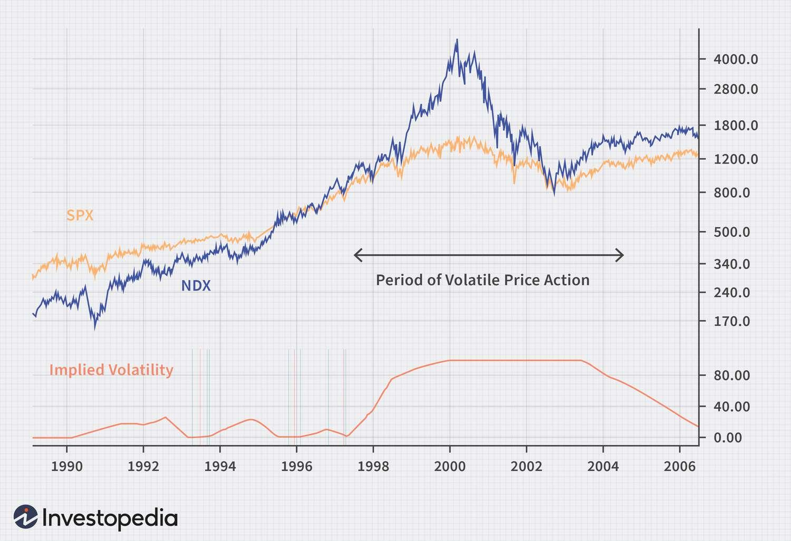

In the world of finance and economics, the terms 'Fed Put' and 'Greenspan Put' have gained significant recognition. These concepts are linked to the Federal Reserve's actions during periods of market turmoil, characterized by interventions to prevent severe market declines. Such interventions aim to stabilize the financial markets by instilling confidence among investors that the central bank will step in to mitigate risks, reminiscent of the protective nature of financial derivatives like put options.

The 'Greenspan Put' originated during the tenure of Alan Greenspan as Chair of the Federal Reserve from 1987 to 2006. His policies suggested a willingness to lower interest rates or introduce other measures to support the economy following market turbulence, thereby creating an implicit safety net for investors. This policy framework fostered a perception of reduced downside risk, encouraging more aggressive risk-taking and contributing to the development of speculative bubbles.

In contrast, the 'Fed Put' is a broader concept encompassing similar interventionist policies by Greenspan’s successors, including Ben Bernanke, Janet Yellen, and Jerome Powell. These policies have extended into recent times, particularly in response to financial crises and economic downturns. The implications of such policies are profound, influencing investor behavior and broader economic conditions.

Simultaneously, the advent of algorithmic trading has transformed market dynamics, adding layers of complexity to how such monetary policies play out. Algorithms now execute trades at speeds and volumes far beyond human capabilities, reacting to market signals, including those originating from central bank actions. The interaction between these advanced trading systems and Federal Reserve policies has further complicated the landscape, leading to questions about whether algorithmic trading amplifies or dampens the effects of these interventions.

This article examines the intersection of the Fed Put, Greenspan Put, and algorithmic trading to understand their significance in modern financial markets. We explore historical contexts, analyze the implications, and discuss strategic insights related to these phenomena. The aim is to unravel the complexities surrounding these pivotal economic concepts, providing a thorough understanding for investors and policymakers looking to navigate contemporary financial market challenges.

## Table of Contents

## Understanding the Greenspan Put

The term "Greenspan Put" gained notoriety during the tenure of Alan Greenspan as the Chair of the Federal Reserve from 1987 to 2006. It refers to the Federal Reserve's perceived monetary policy approach under Greenspan, which was seen as a mechanism for providing a safety net against significant stock market declines. This approach is analogous to the concept of a put option in financial markets, which provides the buyer the right, but not the obligation, to sell an asset at a predetermined price, effectively setting a floor on potential losses.

During Greenspan's leadership, the Federal Reserve frequently lowered interest rates in response to financial market fluctuations, most notably following the stock market crash of 1987, the savings and loan crisis, and the Asian financial crisis of the late 1990s. These interventions were intended to stabilize markets and prevent further declines, fostering an environment where investors believed that the central bank would act as a backstop for market downturns. Such actions by the Fed contributed to a phenomenon known as "moral hazard," where investors were incentivized to take on greater risks, expecting that the Federal Reserve’s policies would rescue them in adverse scenarios.

The impact of Greenspan's policies on investor sentiment and financial markets was profound. The reassurance of a Fed intervention created an underlying confidence that emboldened market participants, potentially inflating asset bubbles due to the perceived reduction in downside risk. As markets began to perceive the Fed as a continuous support, this led to more aggressive investment strategies, relying on the Fed's readiness to lower interest rates or implement other monetary tools during market turbulence.

Greenspan's approach to monetary policy during times of financial stress has been both praised and criticized. Proponents argue that, during his tenure, these measures helped avert deeper recessions and supported economic recoveries. Critics, however, contend that such policies may have laid the groundwork for successive economic bubbles, particularly the dot-com bubble in the late 1990s and the housing bubble in the mid-2000s, which eventually led to severe economic downturns.

The concept of the Greenspan Put highlights the complex relationship between central bank policies and market dynamics, challenging the Federal Reserve to balance short-term market stabilizations with long-term economic stability. The implications of Greenspan's policies continue to influence how investors and policymakers understand and react to the Federal Reserve's actions today, setting a precedent for subsequent Fed chairs in navigating economic crises.

## The Fed Put: Evolution and Impact

The term 'Fed Put' refers to the implicit guarantee by the Federal Reserve to provide monetary support in times of financial distress, a concept that has evolved significantly post-Greenspan. During Ben Bernanke's tenure as Federal Reserve Chair, from 2006 to 2014, the 'Fed Put' sentiment was notably reinforced. Bernanke responded to the 2008 financial crisis with unprecedented monetary policies, including reducing the federal funds rate to near zero and implementing quantitative easing (QE) programs. These actions reassured markets of Fed support, aiming to stabilize the financial system and stimulate economic recovery.

Janet Yellen, who served as Chair from 2014 to 2018, maintained a stance of gradual normalization of monetary policy while ensuring that measures were in place to support the economy if necessary. Though the intensity of interventions was lesser compared to the 2008 crisis, her approach was in line with the 'Fed Put' paradigm, emphasizing caution and support as needed.

Jerome Powell's leadership, commencing in 2018, faced unique challenges, including market [volatility](/wiki/volatility-trading-strategies) and economic disruptions caused by the COVID-19 pandemic. Powell's Fed acted swiftly in 2020, cutting interest rates to near zero again and launching extensive QE programs to support [liquidity](/wiki/liquidity-risk-premium) and confidence in financial markets. These efforts highlighted the ongoing relevance of the 'Fed Put', reinforcing its role in maintaining market stability.

Notably, Powell's Fed introduced new tools such as direct lending to businesses and municipalities, expanding the central bank's intervention toolkit. This was integral during the pandemic-induced downturn, illustrating the 'Fed Put's' adaptability to evolving economic conditions.

Key moments reflecting the impact of the 'Fed Put' include the immediate aftermath of the 2008 financial crisis, highlighting the criticality of central bank interventions, and the strategic moves during the pandemic, which underscored the Fed's commitment to market stabilization. As financial markets continue evolving, the 'Fed Put' remains a significant [factor](/wiki/factor-investing) in shaping investor expectations and strategies, reflecting its enduring influence in economic policy and market dynamics.

## Algorithic Trading in the Context of Fed Policies

Algorithmic trading employs sophisticated algorithms to execute trades, leveraging speed and precision that surpass human capabilities. These algorithms analyze vast datasets, identify trading opportunities, and execute orders in fractions of a second. The integration of [algorithmic trading](/wiki/algorithmic-trading) with Federal Reserve policies, such as the Fed Put, influences market dynamics, prompting questions about its role in enhancing or diminishing market volatility.

The Fed Put refers to the tendency of the Federal Reserve to intervene in financial markets to curb drastic declines. This reassurance often encourages investors to adopt riskier positions, knowing the Fed may provide support in turbulent times. Algorithmic trading systems respond dynamically to these market cues, incorporating expectations of Fed interventions into their strategies. For instance, algorithms might detect patterns from historical Fed actions and adjust trading signals accordingly.

The interaction between algo trading and Fed actions can exacerbate market volatility. Algorithms can trigger rapid asset price movements by executing large volumes of trades based on perceived shifts in Fed policy. This scenario unfolded during the "Flash Crash" of May 6, 2010, when a confluence of high-frequency trading algorithms led to a dramatic, albeit temporary, drop in the U.S. stock market. Such instances highlight the potential for algorithms to amplify market responses to Fed interventions.

Conversely, algorithmic trading can also stabilize markets by providing liquidity. During periods of Fed intervention, algorithms can absorb selling pressure from panicked investors, offering counter-trades that help normalize prices. This liquidity provision can dampen extreme price swings, mitigating the immediate impact of dramatic market movements.

The dual nature of algorithmic trading's interaction with Fed policies illustrates the complexity of its influence on markets. While algos can enhance volatility through rapid trading responses to policy shifts, they can also mitigate volatility by ensuring continuous market functioning. The net effect of algo trading on market volatility in the context of Fed actions depends on factors such as the design of trading algorithms, market conditions, and the scale of algorithm-driven trading activities.

Understanding these nuances is critical for regulators and market participants. Ensuring that algorithms are designed with mechanisms to prevent destabilizing feedback loops and providing oversight to monitor their market impact are essential steps toward balancing innovation with market stability. As algorithmic trading continues to evolve, its interplay with central bank interventions like the Fed Put will remain a focal point in discussions about the future of financial markets.

## Comparative Analysis: Greenspan Put vs. Fed Put

The Greenspan Put and the Fed Put, while closely related, exhibit distinct characteristics that have influenced investor strategy and market dynamics. Both terms represent the Federal Reserve's implied commitment to stabilizing financial markets, yet they differ in scope, execution, and historical context.

The Greenspan Put emerged during Alan Greenspan's tenure as Federal Reserve Chair from 1987 to 2006. This concept refers specifically to Greenspan's tendency to lower interest rates or implement accommodating monetary policy in response to stock market declines. For instance, following the 1987 stock market crash, the Federal Reserve, under Greenspan's leadership, swiftly enacted policy measures to inject liquidity, reinforcing market confidence. This behavior led investors to anticipate similar interventions in subsequent downturns, fostering risk-taking as they perceived a safety net against potential losses.

In contrast, the Fed Put encompasses a broader range of interventions by subsequent Federal Reserve Chairs, including Ben Bernanke, Janet Yellen, and Jerome Powell. While the fundamental notion of providing market support remains, the Fed Put extends beyond mere [interest rate](/wiki/interest-rate-trading-strategies) adjustments. It includes diverse tools such as quantitative easing and forward guidance, particularly evident during the 2008 financial crisis and the COVID-19 pandemic. This evolution signifies a more comprehensive and systematic approach to market stabilization across varying economic conditions.

The differences between the Greenspan Put and the Fed Put have shaped investor strategies significantly. The Greenspan Put established a precedent for anticipating Federal Reserve interventions, encouraging investments in higher-risk assets during periods of economic stress. Conversely, the Fed Put has introduced more nuanced expectations, as investors now consider a broader range of potential policy responses and their implications.

Additionally, market perceptions of these policies vary. The Greenspan Put is often associated with moral hazard, where investors engage in riskier behavior, assuming the Fed will prevent severe losses. In contrast, the Fed Put, with its diverse toolkit, aims to address deeper systemic issues, though it still faces criticism regarding long-term market imbalances and the distortion of asset prices.

Ultimately, both policies have played pivotal roles in shaping economic landscapes. The Greenspan Put highlighted the Federal Reserve's willingness to intervene during crises, setting a foundation of expectations for future policy actions. The Fed Put, building on this legacy, reflects an adaptive strategy that responds to evolving market and economic conditions, emphasizing the central bank's role in fostering financial stability. These dynamics continue to influence investor behavior and remain central to discussions on monetary policy and market regulation.

## The Role of Algo Trading Strategies

Algorithmic trading strategies have significantly influenced the behavior of financial markets, especially in the context of anticipated interventions by the Federal Reserve. These strategies rely heavily on technological advancements, leveraging complex algorithms to make rapid trading decisions and adapt to changing market conditions. When traders expect the Federal Reserve to implement a policy that affects asset prices, such as interest rate changes or quantitative easing, they may adjust their algorithmic strategies accordingly.

One common strategy influenced by Fed interventions is statistical [arbitrage](/wiki/arbitrage). This approach uses statistical models and historical data to exploit price inefficiencies across a basket of securities. When the Fed signals potential interventions, algos can recalibrate their models to anticipate changes in asset correlations and volatility, capitalizing on expected market movements. These strategies often employ techniques like mean reversion, assuming that the intervention will prompt prices to adjust back toward historical averages.

Algorithmic strategies also play a crucial role in hedging against anticipated Fed policy actions. For instance, when there is speculation about interest rate cuts, algorithms can be programmed to hedge interest rate exposure by trading interest rate futures or options. This involves creating a portfolio that offsets potential losses from rate changes, thereby stabilizing returns. Algorithms can quickly adjust positions in response to Fed announcements, optimizing the hedge as new information becomes available.

Machine learning models are increasingly employed in algorithmic trading to predict the Fed's actions based on macroeconomic indicators and policy statements. These models can analyze vast datasets to uncover patterns that human analysts might miss, providing a competitive edge in predicting market reactions to Fed policy shifts. By training algorithms on historical data where similar conditions prevailed, traders can preemptively position themselves for anticipated outcomes.

Real-world applications of algorithmic trading in the context of Fed interventions include the use of trend-following algorithms. These strategies aim to capitalize on the [momentum](/wiki/momentum) generated by Fed actions, such as a significant asset purchase program. By identifying when the market begins to exhibit upward or downward trends following a Fed announcement, these algorithms initiate trades that align with the prevailing direction, maximizing profit opportunities as the market absorbs the new policy information.

In conclusion, algorithmic trading strategies have become integral to navigating financial markets, especially when anticipating Federal Reserve interventions. By strategically adjusting trading models and leveraging data-driven insights, traders can effectively respond to policy changes, ensuring that their trading activities are aligned with broader economic shifts. These capabilities underscore the importance of algorithm-driven approaches in modern finance, where speed and accuracy are paramount.

## Market Risks and Future Implications

The belief in the Fed Put, a perception that the Federal Reserve will intervene to support markets during downturns, has notable market risks, primarily encouraging excessive risk-taking among investors. This safety net perception can lead to moral hazard, where market participants engage in riskier investment strategies, under the assumption that adverse outcomes would be mitigated by Fed actions. This risk-taking culture can result in overvaluations and inflated asset bubbles, which, when burst, may lead to economic downturns necessitating further intervention.

Continuing reliance on this belief could propel asset prices to unsustainable levels, creating potential instability in financial markets. If the Fed were to shift its stance or if its interventions were less effective or delayed due to unforeseen circumstances, such shifts might result in rapid market corrections, exacerbating financial instability.

Moreover, algorithmic trading amplifies these dynamics by enabling rapid and large-scale trading activities. Traders leverage complex algorithms to predict and respond to Fed actions, which can lead to exaggerated short-term market movements. Algorithmic trading, in its constant quest for arbitrage opportunities, could intensify the effects of Fed policy changes on market volatility. For instance, if algorithmic strategies anticipate a Fed intervention, they may bid up asset prices swiftly, contributing to a sharp rise, followed by equally swift downturns if expectations are not met.

The future implications of the Fed Put, intertwined with algorithmic trading, point to a need for careful assessment of how such dynamics can be monitored and potentially regulated. A critical question is how Federal Reserve policies could evolve to balance market support with limiting systemic risks. The risk of persistent inflation and asset bubbles, as seen in past episodes, underscores the importance of exploring policy tools that both stabilize markets and prevent moral hazard.

Additionally, as algorithms become more sophisticated, concerns regarding market manipulation, flash crashes, and liquidity shortfalls could arise. One approach to mitigate these risks is to enhance transparency and oversight of algorithmic trading practices, ensuring that these automated systems do not inadvertently destabilize markets during periods of rapid intervention or policy shifts.

Ultimately, the future landscape will hinge on the interplay between central bank policy and technological advancements. If the Fed Put continues to influence monetary policy, there must be strategic foresight to address the broader economic implications and ensure a resilient financial system. This calls for a calibrated approach where interventions are clearly communicated, markets are transparently regulated, and both investors and automation technologies are aligned towards sustainable growth and stability.

## Conclusion

In this exploration, we have traversed the intricate landscape of the Fed Put and the Greenspan Put, highlighting their historical significance and evolving roles in financial markets. These economic policies have not only left an indelible mark on the psyche of investors but have also intertwined with modern algorithmic trading to influence market dynamics profoundly. 

The interaction between these Federal Reserve interventions and algorithmic trading is pivotal in shaping today's trading environment. As algorithmic trading strategies grow increasingly sophisticated, understanding how they react to, and potentially amplify, monetary policy interventions becomes crucial. The computational prowess of algo trading can either stabilize or exacerbate market reactions, depending on the design and objectives of the algorithms. This adds an additional layer of complexity to assessing the effectiveness of the Fed's interventions, whether intended to underpin market confidence during financial upheavals or to correct speculative excesses.

For investors seeking to navigate contemporary financial markets, a comprehensive grasp of these concepts—the Fed Put and Greenspan Put—is imperative. Such understanding aids in anticipating the Federal Reserve's potential responses to market conditions and the ensuing effects on asset prices. Algorithmic trading, when aligned with insights into Fed policies, can serve as a significant strategic tool, whether for hedging risks or exploiting short-term opportunities.

However, the persistent challenge lies in balancing intervention with market freedom—a dynamic aspect that persists in economic policy discourse. Central banks, while striving to maintain economic stability, must also consider the unintended consequences of their actions on market behavior. Excessive reliance on the perceived safety nets provided by the Fed Put could lead to moral hazard, encouraging risk-taking that could jeopardize the very stability these policies aim to protect. 

In conclusion, the interplay between Federal Reserve policies and algorithmic trading strategies continues to evolve, requiring investors and policymakers alike to stay informed and adaptable. As markets advance and technology reshapes the trading landscape, the core principles governing these interactions will remain a critical area of focus for the foreseeable future.

## References & Further Reading

[1]: Plosser, C. I. (2017). ["What Is the Greenspan Put?"](https://scholar.google.com/citations?user=0bThpp8AAAAJ) In Business Economics, Springer.

[2]: Mishkin, F. S. (2007). ["Housing and the monetary transmission mechanism."](https://www.nber.org/papers/w13518) National Bureau of Economic Research.

[3]: Bernanke, B. S., & Gertler, M. (2001). ["Should Central Banks Respond to Movements in Asset Prices?"](https://www.aeaweb.org/articles?id=10.1257/aer.91.2.253)

[4]: Greenspan, A. (2008). ["The Age of Turbulence: Adventures in a New World."](https://www.amazon.com/Age-Turbulence-Adventures-New-World/dp/0143114166) Penguin Books.

[5]: ["High-Frequency Trading: A Practical Guide to Algorithmic Strategies and Trading Systems"](https://www.ahmetbeyefendi.com/wp-content/uploads/2020/07/High-Frequency-Trading-Irene-Aldridge.pdf) by Irene Aldridge

[6]: ["The Alchemy of Finance: Reading the Mind of the Market"](https://www.amazon.com/Alchemy-Finance-Reading-Mind-Market/dp/0471042064) by George Soros

[7]: ["Adaptive Markets: Financial Evolution at the Speed of Thought"](https://www.amazon.com/Adaptive-Markets-Financial-Evolution-Thought/dp/0691135142) by Andrew Lo