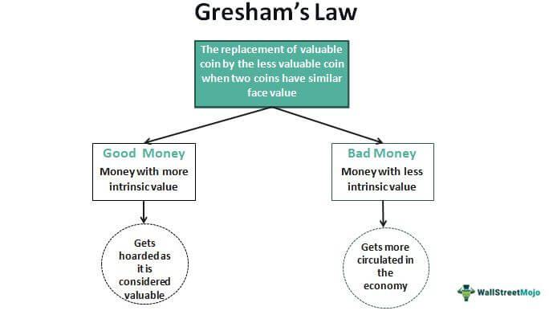

Understanding the dynamics of currency and trading is crucial in today's global economy as they form the backbone of international financial interactions. The study of these dynamics can be significantly enhanced by examining Gresham's Law, a monetary principle that originally addressed the circulation of different forms of currency. This law, often encapsulated by the phrase "bad money drives out good," sheds light on the behavior and circulation of money, especially when different currencies coexist within the same economic system.

Gresham's Law is not merely a historical concept but has pertinent implications for modern financial markets, particularly in the context of algorithmic trading. As trading technologies evolve, understanding how currency values fluctuate and respond to various economic conditions becomes indispensable for devising effective trading strategies. Gresham's Law provides a lens through which we can better comprehend these fluctuations, especially in scenarios where legal tender laws and market forces dictate currency preference and retention.



In today's financial ecosystems, algorithmic trading has become increasingly dominant. These algorithms rely on precise data analysis and predictive modeling to execute trades that capitalize on currency movements. The principles underlying Gresham's Law can inform and refine these algorithmic approaches by equipping traders with insights into how perceived currency quality affects market behavior and valuations.

This article aims to explore the interactions between Gresham's Law and current currency markets, alongside its implications for algorithmic trading strategies. By doing so, it seeks to provide a foundation for understanding the broader economic and technological forces that influence currency valuation and trading practices.

## Table of Contents

## Understanding Gresham's Law

Gresham's Law articulates the principle that "bad money drives out good money" when both types are considered legal tender. This monetary concept, first coined by Sir Thomas Gresham in the 16th century, originally explained the dynamics observed in ancient economies that used coinage made of precious metals. When coins of equal face value contained different amounts of valuable metal—for instance, due to wear or deliberate debasement—those with lesser metal content tended to remain in circulation while more valuable coins were hoarded or melted down for their intrinsic value. 

The principle operates under the assumption that people in a market seek to spend the monetary units perceived as less valuable while retaining those with a higher inherent worth. Hence, when both "good" and "bad" money are in circulation, the "bad" money is used for transactions, pushing "good" money out of everyday economic systems.

In modern economic contexts, Gresham's Law extends beyond coinage to understanding currency depreciation and inflationary movements in global markets. It addresses how fiat money can be favored over currencies perceived as more stable or valuable, based on people's perception of their future purchasing power. As contemporary economies rarely use precious metals, the principle highlights how inflationary currency, or "bad money," continues to circulate, while potentially deflationary "good money" is kept out of the everyday economy. 

Analyzing currency value stability—a concern for policymakers and economic analysts—can benefit from insights provided by Gresham's Law. By observing how different currencies react under various economic pressures, one can better predict currency movement and stability. Such analysis is crucial in today’s interconnected global economy, where exchange rates and inflation play pivotal roles in shaping international trade and investment. Understanding this principle aids in forecasting currency trends and devising strategies to mitigate economic risks linked to inflation and currency depreciation.

## Application of Gresham's Law in Currency Markets

Gresham's Law maintains its relevance in modern currency markets, particularly in situations where currencies face inflation and overvaluation pressures. A classic illustration of such a scenario is the hyperinflation in Zimbabwe, where the national currency suffered severe devaluation. When a currency becomes overvalued or loses trust due to inflation, market participants favor more stable and reliable currencies. Thus, in practice, these so-called 'good' currencies tend to drive out 'bad' currencies, appearing to contradict Gresham's original assertion that less valuable currency would prevail in circulation. Instead, the situation reflects a more nuanced reality where market forces and consumer preferences dictate currency usage.

In Zimbabwe, as the local currency lost value rapidly, both businesses and individuals began to use more stable foreign currencies such as the US dollar or the South African rand for transactions. This shift was not enforced through legal tender laws but rather emerged as an adaptive response to economic instability. Here, the market forces successfully bypassed the intended effect of Gresham's Law due to the substantial difference in perceived value between the domestic currency and foreign alternatives. This phenomenon can be observed in currency substitution instances where trust in the domestic currency erodes, leading people to adopt foreign currencies for day-to-day transactions.

Legal tender laws, which require the acceptance of specified currencies for the payment of debts, significantly influence currency circulation. However, in environments where these laws are either weak or inadequately enforced, the market may self-correct, resulting in the reverse of Gresham's Law. Known as Thiers' Law, this principle indicates that in the absence of compelling legal reasons or when enforcement is lacking, 'good' money will replace 'bad' money naturally due to its inherent value stability.

In assessing the dynamics of currency circulation, it becomes evident that while legal tender laws can mandate the use of a particular currency, the ultimate determinant of currency usage is predicated on market confidence and perceived value. Market forces have the capability to override statutory requirements, allowing currencies that better preserve value to dominate. Therefore, Gresham's Law, in its application to currency markets, offers a critical lens through which to examine the interactions between legal frameworks and economic behaviors.

## Impact on Algorithmic Trading

Algorithmic trading has revolutionized currency markets by enabling rapid execution and systematic trading strategies driven by computer algorithms. These algorithms use predefined criteria to execute orders based on various factors, including price changes, timing, and historical statistical data. The influence of Gresham's Law on [algorithmic trading](/wiki/algorithmic-trading) is particularly significant as it affects both [liquidity](/wiki/liquidity-risk-premium) and the valuation of currencies.

Gresham's Law, which posits that "bad money drives out good," implies that in periods of high [volatility](/wiki/volatility-trading-strategies) or inflation, traders might pivot towards less stable currencies. This behavior alters liquidity patterns and can impact valuation strategies implemented within algorithms. Algorithmic systems designed to exploit small price differentials, such as those used in [arbitrage](/wiki/arbitrage), require a nuanced understanding of how currencies are valued and might be affected by prevailing economic conditions.

In volatile or inflationary environments, understanding Gresham's Law can offer valuable insights for crafting robust trading algorithms. These environments tend to cause shifts in which currencies are most actively traded, affecting spreads and transaction volumes. By anticipating such shifts, traders can optimize algorithmic strategies to better capture potential profit opportunities. This could involve adjusting parameters in high-frequency trading ([HFT](/wiki/high-frequency-trading-strategies)) systems to account for increased volatility in 'bad' currencies or leveraging [machine learning](/wiki/machine-learning) models to predict when a currency may start losing its stability.

A practical approach involves using historical data to identify patterns correlated with Gresham's Law scenarios. For instance, analyzing historical periods of inflation or significant currency devaluation can provide actionable insights. Traders could use machine learning algorithms to process this data, identifying predictors of currency instability. Here's a simple example of how machine learning could be applied to historical trading data using Python:

```python
import pandas as pd
from sklearn.model_selection import train_test_split
from sklearn.ensemble import RandomForestClassifier
from sklearn.metrics import classification_report

# Load historical trading data from a CSV file
# Ensure the dataset contains relevant features (e.g., inflation rates, currency circulation volumes)
data = pd.read_csv('historical_currency_data.csv')

# Define features and target variable
X = data.drop('currency_stability', axis=1)  # Features
y = data['currency_stability']  # Target variable indicating 'good' or 'bad' money

# Split data into training and testing sets
X_train, X_test, y_train, y_test = train_test_split(X, y, test_size=0.2, random_state=42)

# Initialize and train a Random Forest Classifier
model = RandomForestClassifier(n_estimators=100, random_state=42)
model.fit(X_train, y_train)

# Predict and evaluate
predictions = model.predict(X_test)
print(classification_report(y_test, predictions))
```

This simplified example demonstrates how historical analysis can aid in determining which currencies might be more stable ('good money') or less stable ('bad money') under future market conditions. By deploying algorithms that incorporate this analysis, traders can better navigate liquidity changes driven by Gresham's Law, thus enhancing trade execution and profitability.

## Good Money vs. Bad Money in Trading

In trading terms, distinguishing between "good money" and "bad money" is vital for developing effective algorithmic trading strategies. "Good money" refers to currencies or assets that are stable and less susceptible to rapid devaluation, providing traders with a reliable store of value. Conversely, "bad money" is characterized by its tendency to lose value quickly due to inflation, economic instability, or other factors, making it less desirable as a trading asset.

Algorithmic traders benefit from being able to accurately identify and categorize these assets, allowing them to adjust their strategies accordingly. Leveraging algorithmic precision, traders can employ various methods to assess the quality of currencies within a volatile market environment. One essential method involves analyzing historical data patterns and current economic indicators to predict future currency performance. Machine learning and [artificial intelligence](/wiki/ai-artificial-intelligence) techniques can be used to enhance this analysis, offering data-driven predictions about currency stability.

For example, consider the following Python code snippet utilizing a simple moving average approach to identify currency trends:

```python
import pandas as pd
import numpy as np

def moving_average(data, window_size):
    return data.rolling(window=window_size).mean()

# Example data: daily exchange rates for a currency pair
exchange_rates = pd.Series([1.2, 1.19, 1.21, 1.22, 1.18, 1.25, 1.3, 1.15, 1.2, 1.17])

# Calculate the 3-day moving average
ma = moving_average(exchange_rates, 3)

print(ma)
```

This simple analysis can be extended with machine learning models to classify currencies as "good" or "bad" based on predictive indicators. Features such as interest rates, inflation data, and geopolitical stability can be included in the algorithmic models to assess the long-term stability of currencies.

Moreover, high-frequency trading algorithms can take advantage of price discrepancies between different currencies, exploiting the fast-paced nature of [forex](/wiki/forex-system) markets. These algorithms require continuous real-time data feeds and sophisticated processing capabilities to make rapid buy or sell decisions. The precision of these technologies allows traders to optimize their portfolios, minimizing exposure to "bad money" risk while capitalizing on "good money" opportunities.

In summary, identifying "good" trading assets within a volatile market using algorithmic precision hinges on the effective use of historical data analysis and real-time market monitoring. By combining statistical methods with advanced computing techniques, algorithmic traders can make informed decisions, thereby refining their strategies and enhancing their trading outcomes.

## Legal Tender and Gresham's Law Reversal

Legal tender laws serve as the statutory regulations that mandate the acceptance of certain currencies within an economy. They are designed to ensure that creditors receive an officially recognized form of currency, thus providing stability and predictability in financial transactions. Despite their stabilizing intent, these laws can inadvertently lead to economic distortions. When legal tender laws are strong, they guarantee the circulation of currency regardless of its perceived intrinsic value, which can enforce the use of "bad" money over "good" money, aligning with Gresham's Law. However, when such laws are weak or absent, economic actors might opt to use money with stable value, leading to the phenomenon known as Thiers' Law, the reverse of Gresham's Law.

In the case of Gresham's Law, weak legal tender laws or their complete absence may enable currencies with real, tangible value (often considered "good" money) to circulate more freely, as economic actors gravitate towards assets that retain or appreciate in value. This situation can be especially pronounced when fiat money is perceived to be unstable or depreciative due to inflationary pressures. Consequently, "good" money, such as gold or stable foreign currencies, might become more prevalent in transactions.

The implications of Gresham's Law and its reversal are significant in the context of modern economic policies. Policymakers must consider the potential repercussions of enforcing or relaxing legal tender regulations. The choice influences not just the currency in circulation, but also inflation rates, public trust in monetary systems, and international competitiveness. Furthermore, digital currencies present new challenges and opportunities, as they often exist outside traditional legal tender frameworks. Cryptocurrencies like Bitcoin can become preferred mediums of exchange in unstable economies, sidestepping weak fiat currencies and challenging existing legal tender laws. This is emblematic of Thiers' Law, where the subjective value ascribed to digital currencies by their users enables them to function as "good" money in lieu of depreciating legal tender.

In summary, legal tender laws and their strength profoundly affect the performance and preference of currencies. While Gresham's Law suggests that poorly valued money can dominate when protected by such laws, the absence or weakening of these laws allows Thiers' Law to surface, where superior currencies can claim prominence. As economies incorporate digital currencies, the dynamics between legal tender enforcement and currency preference continue to evolve, offering complex considerations for both policymakers and market participants.

## Conclusion

Gresham's Law continues to shape both economic theory and practical applications, especially in the field of currency algo trading. This timeless principle, which highlights the tendency for inferior currency to circulate while superior currency is hoarded, offers critical insights into currency valuation and the creation of robust trading algorithms. Understanding these fundamental concepts aids in discerning which currencies hold their value under varying economic conditions, thereby informing trading strategies that capitalize on market movements.

As global financial systems face rapid transformations propelled by technological advancements and shifts in regulatory landscapes, the relevance of Gresham's Law remains undiminished. Algorithmic traders, in particular, can benefit greatly from integrating insights derived from this law into their models. For example, recognizing patterns indicative of bad money driving out good money can refine algorithms to better anticipate currency depreciation and inflationary pressures. This improves risk assessment and enhances decision-making processes.

The practical implications of Gresham's Law also extend to digital currencies, where the dynamics of currency valuation challenge traditional legal tender concepts. As such, it fosters innovation in algorithmic design, allowing for more nuanced assessments of currency strength and trading viability.

In sum, Gresham's Law serves as a foundational pillar not only for understanding historical economic behaviors but also for navigating contemporary currency markets. Investors and traders can leverage its principles to develop strategies that adapt to continually evolving financial environments, securing a competitive advantage in the fast-paced world of algorithmic trading.

## References & Further Reading

[1]: Selgin, G. (2003). ["Gresham's Law."](https://www.jstor.org/stable/2078075) The Concise Encyclopedia of Economics.

[2]: Ferguson, N. (2008). ["The Ascent of Money: A Financial History of the World."](https://archive.org/details/ascentofmoneyfin0000ferg_l8i7) New York: Penguin Press.

[3]: Krugman, P. (1998). ["It's Baaaack: Japan's Slump and the Return of the Liquidity Trap."](https://www.brookings.edu/wp-content/uploads/1998/06/1998b_bpea_krugman_dominquez_rogoff.pdf) Brookings Papers on Economic Activity, 1998(2), 137-205.

[4]: Kindleberger, C. P., & Aliber, R. Z. (2011). ["Manias, Panics, and Crashes: A History of Financial Crises."](https://link.springer.com/book/10.1057/9780230628045) Palgrave Macmillan.

[5]: Lintner, G. (1998). ["The Effect of Gresham's Law on Currency Substitution"](https://en.wikipedia.org/wiki/Gresham%27s_law). Journal of Money, Credit and Banking, 30(4), 914-919.