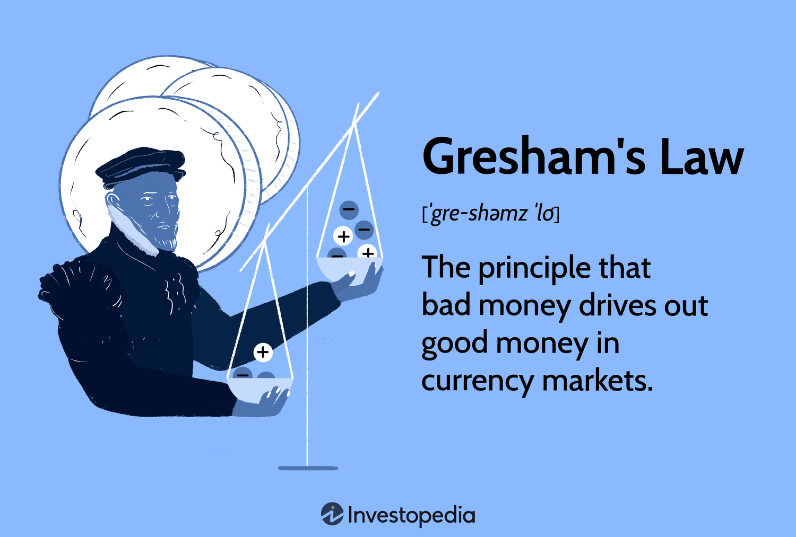

## Table of Contents

## What is Gresham's Law?

Gresham's Law is a theory about money that says when there are two types of money in use, people will use the one that is worth less to buy things and save the one that is worth more. This idea was named after Thomas Gresham, who lived a long time ago and noticed this happening. The law is often summed up as "bad money drives out good money."

This can happen when a government says that two different types of money are worth the same, even though one is made of something more valuable, like gold. People will spend the money that is worth less and keep the money that is worth more, like gold coins. Over time, the money that is worth less gets used more and more, while the money that is worth more disappears from everyday use. This is why Gresham's Law is important in understanding how money works in an economy.

## Who was Thomas Gresham and how did he contribute to this law?

Thomas Gresham was a man who lived a long time ago, in the 1500s. He was from England and worked with money and trading. He was very good at his job and even helped start a big trading company called the Royal Exchange. Gresham was smart about money and noticed something interesting happening with it.

Gresham saw that when there were two types of money being used, one that was worth less and one that was worth more, people would spend the money that was worth less. They would save the money that was worth more, like gold coins. He talked about this with the queen of England, and later, people named this idea Gresham's Law. It means "bad money drives out good money," showing how the less valuable money gets used more while the more valuable money disappears from everyday use.

## Can you explain Gresham's Law in simple terms?

Gresham's Law is a rule about money that says when there are two kinds of money, people will spend the money that is worth less and save the money that is worth more. Imagine you have two types of coins: one made of gold and one made of a cheaper metal. If the government says both coins are worth the same, you would use the cheaper coin to buy things and keep the gold coin because it's more valuable.

This happens because people want to keep the money that is worth more. Over time, the cheaper money gets used more and more, while the valuable money, like gold coins, disappears from everyday use. This is why Gresham's Law is called "bad money drives out good money." It explains how the less valuable money pushes out the more valuable money in an economy.

## What is the historical context in which Gresham's Law was observed?

Gresham's Law was first noticed during the time when Thomas Gresham lived, in the 1500s. Back then, England was using different kinds of money, including coins made of gold and silver. The problem started when the government decided that all these coins should be worth the same amount, even though some were made of more valuable metals. This meant that people could use a less valuable coin to buy things and keep the more valuable coins, like gold, for themselves.

This situation was what Thomas Gresham saw happening around him. He worked with money and trading, so he understood what was going on. Gresham talked about this problem with Queen Elizabeth I, explaining how people were using the less valuable money and hiding away the more valuable money. This observation led to what we now call Gresham's Law, which explains how "bad money drives out good money" when people have a choice between the two.

## How does Gresham's Law apply to modern economies?

Gresham's Law can still be seen in modern economies, even though we don't use gold and silver coins as much anymore. Today, it can apply to things like different kinds of currency or even digital money. For example, if a country has both its own money and a foreign currency that people trust more, they might use the local money for everyday purchases and save the foreign currency. This is because they think the foreign currency is worth more or safer to keep. Over time, the local money might become more common in everyday use, while the trusted foreign currency gets saved or used less.

Another way Gresham's Law can show up today is with things like cryptocurrencies. If people think one type of digital money is less valuable or risky, they might use it to buy things and save another type that they think is more valuable or stable. This can lead to the less trusted digital money being used more often, while the more trusted one gets saved or used less. So, even though the world of money has changed a lot since Thomas Gresham's time, the idea of "bad money drives out good money" can still help us understand what happens in modern economies.

## What are some real-world examples where Gresham's Law has been observed?

One real-world example of Gresham's Law happened in the United States during the Civil War. Back then, the government issued paper money called "greenbacks." These greenbacks were not backed by gold, unlike the gold coins that were also in use. People trusted gold more, so they started using the greenbacks for everyday purchases and saved their gold coins. Over time, the greenbacks became more common in use, while gold coins were kept out of circulation, showing how "bad money drives out good money."

Another example can be seen in Zimbabwe in the early 2000s. The government was printing a lot of money, which made the local currency, the Zimbabwean dollar, lose value very quickly. At the same time, people could use the US dollar, which they trusted more. So, people started using the Zimbabwean dollars for everyday buying and saving their US dollars. This led to the local currency being used more and more, while the US dollars were kept out of circulation, illustrating Gresham's Law in action.

## What are the conditions under which Gresham's Law operates?

Gresham's Law works when there are two types of money in use, and the government says they are worth the same, even though one is worth less. This can happen with different kinds of coins or even different currencies. For example, if a government says a gold coin and a cheaper metal coin are worth the same, people will use the cheaper coin to buy things and save the gold coin because it's more valuable. They do this because they want to keep the money that is worth more.

The other important thing for Gresham's Law to happen is that people need to be able to tell the difference between the two types of money. If they can't tell which money is worth more or less, the law won't work. So, when people know which money is the "good" money and which is the "bad" money, they will use the bad money for buying things and keep the good money. This is why Gresham's Law is all about how "bad money drives out good money" in an economy.

## How does Gresham's Law differ from the reverse Gresham's Law?

Gresham's Law says that when there are two types of money in use and the government says they are worth the same, people will use the money that is worth less to buy things and save the money that is worth more. This happens because people want to keep the more valuable money, like gold coins, and use the less valuable money, like cheaper metal coins, for everyday purchases. Over time, the less valuable money gets used more and more, while the more valuable money disappears from everyday use. This is why Gresham's Law is known as "bad money drives out good money."

The reverse Gresham's Law, on the other hand, happens when people use the more valuable money and save the less valuable money. This can happen when the government doesn't say the two types of money are worth the same, or when people trust the more valuable money more. In this case, people might use gold coins for buying things because they trust them more, and save the less valuable money. So, instead of "bad money drives out good money," the reverse Gresham's Law is like "good money drives out bad money."

## What are the economic implications of Gresham's Law?

Gresham's Law can cause big problems in an economy. When people start using the less valuable money more and saving the more valuable money, it can make the less valuable money the main type of money used. This can make the economy unstable because the less valuable money might lose its value even more over time. If people don't trust the money they are using, they might stop spending as much, which can slow down the economy. Businesses might have a hard time because people are not buying as much, and this can lead to fewer jobs and less growth.

On the other hand, Gresham's Law can also help explain why some economies have trouble when they have two types of money. If a country is using both its own money and a foreign currency, and people trust the foreign currency more, they might use the local money for buying things and save the foreign currency. This can make the local money less valuable and harder to use, which can hurt the economy. Understanding Gresham's Law can help governments and economists figure out how to manage money better and keep the economy stable.

## How can policymakers mitigate the negative effects of Gresham's Law?

Policymakers can help stop the bad effects of Gresham's Law by making sure people trust their money. They can do this by not making too much money, which can make it lose value. If the government keeps the amount of money steady and backs it up with something valuable, like gold, people will trust it more. This way, people won't feel the need to use the less valuable money for buying things and save the more valuable money. By making sure the money is worth something and people trust it, policymakers can keep the economy stable.

Another way to deal with Gresham's Law is to stop using two types of money that are supposed to be worth the same but aren't. If a country is using its own money and a foreign currency, the government can try to make sure people trust their own money more. They can do this by making the economy strong and keeping the value of their money stable. If people trust their own money, they won't need to use it for buying things and save the foreign currency. This can help keep the local money in use and make the economy healthier.

## What are the criticisms and limitations of Gresham's Law?

One big criticism of Gresham's Law is that it doesn't always happen the way it says. Sometimes, people use the more valuable money instead of the less valuable money. This can happen if the government doesn't say the two types of money are worth the same, or if people just trust the more valuable money more. For example, if people think gold coins are safer and more trustworthy, they might use them for buying things instead of saving them. This goes against what Gresham's Law says should happen.

Another limitation of Gresham's Law is that it only works when people can tell the difference between the good money and the bad money. If they can't tell which money is worth more or less, they won't use the bad money more and save the good money. Also, Gresham's Law doesn't explain everything about how money works in an economy. There are other things that can affect what money people use, like how easy it is to use different types of money or what the government does with money rules. So, while Gresham's Law can help explain some things, it's not the whole story.

## How has Gresham's Law influenced monetary policy and currency valuation theories?

Gresham's Law has had a big impact on how governments and economists think about money. It has shown them that when there are two types of money that people can use, and one is worth less, people will use the less valuable money for buying things and save the more valuable money. This can make the less valuable money the main type of money used in the economy, which can cause problems. Because of this, policymakers try to make sure that people trust their money and don't make too much of it, which can make it lose value. They also try to keep the amount of money steady and back it up with something valuable, like gold, so people will trust it more.

Gresham's Law has also helped shape theories about how much money is worth. It has shown that if people don't trust their money, they might stop using it as much, which can make the economy slow down. This has led economists to think about how to keep money stable and trusted. They look at things like how much money the government makes and how it manages the economy. Understanding Gresham's Law helps them see why having two types of money can cause problems and how to make sure people keep using and trusting the money the government wants them to use.

## References & Further Reading

[1]: Selgin, G. (2003). ["Gresham's Law."](https://www.jstor.org/stable/2078075) The Concise Encyclopedia of Economics.

[2]: Ferguson, N. (2008). ["The Ascent of Money: A Financial History of the World."](https://archive.org/details/ascentofmoneyfin0000ferg_l8i7) New York: Penguin Press.

[3]: Krugman, P. (1998). ["It's Baaaack: Japan's Slump and the Return of the Liquidity Trap."](https://www.brookings.edu/wp-content/uploads/1998/06/1998b_bpea_krugman_dominquez_rogoff.pdf) Brookings Papers on Economic Activity, 1998(2), 137-205.

[4]: Kindleberger, C. P., & Aliber, R. Z. (2011). ["Manias, Panics, and Crashes: A History of Financial Crises."](https://link.springer.com/book/10.1057/9780230628045) Palgrave Macmillan.

[5]: Lintner, G. (1998). ["The Effect of Gresham's Law on Currency Substitution"](https://en.wikipedia.org/wiki/Gresham%27s_law). Journal of Money, Credit and Banking, 30(4), 914-919.