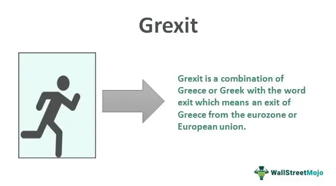

## Table of Contents

## What is Grexit?

Grexit is a term that means Greece leaving the Eurozone. The Eurozone is a group of countries that use the euro as their money. People started talking about Grexit a lot during Greece's big money problems in the 2010s. Greece was having trouble paying its debts, and some thought it might have to leave the Eurozone to fix its money issues.

If Greece left the Eurozone, it would start using its own money again, called the drachma. This could make things in Greece cheaper for people from other countries, which might help their economy. But it could also make things more expensive for people living in Greece. There was a lot of worry about what would happen if Greece left, so many people and countries worked hard to keep Greece in the Eurozone.

## Why was Grexit considered?

Grexit was considered because Greece was having big money problems in the 2010s. The country had borrowed a lot of money and was struggling to pay it back. This caused a lot of worry in the Eurozone, which is a group of countries that use the same money, the euro. Some people thought that if Greece left the Eurozone, it could solve its money problems by using its own money again, called the drachma. This could make things in Greece cheaper for people from other countries, possibly helping their economy.

However, leaving the Eurozone could also cause big problems. If Greece started using the drachma again, things might become more expensive for people living in Greece. This could make life harder for them. There was a lot of worry about what would happen if Greece left, so many people and countries worked hard to keep Greece in the Eurozone. In the end, Greece stayed in the Eurozone, but the idea of Grexit showed how serious their money problems were.

## What are the economic implications of a Grexit for Greece?

If Greece left the Eurozone and went back to using the drachma, it could help their economy in some ways. The drachma might be worth less than the euro, which would make Greek things cheaper for people from other countries. This could mean more people would want to buy Greek products, like food or holidays, which could help Greek businesses. Also, Greece could print more drachmas to pay off their debts more easily, which would help them get out of their money problems.

But there are also big problems that could come from leaving the Eurozone. If the drachma was worth less, things from other countries would become more expensive for people living in Greece. This could make life harder for them because things like food, medicine, and fuel would cost more. Also, if Greece left the Eurozone, it might be harder for them to borrow money in the future because other countries might not trust them as much. This could make it harder for Greece to fix their economy in the long run.

## How would a Grexit affect the European Union?

If Greece left the Eurozone, it could cause big problems for the European Union. Other countries in the Eurozone might start worrying about their own money problems. They might think that if Greece can leave, maybe they should too. This could make the euro weaker because people might not trust it as much. The European Union might have to spend a lot of money and time to help other countries and stop them from leaving.

It could also make it harder for the European Union to work together. If one country leaves, it might make other countries feel less like a team. This could slow down decisions and make it harder to solve problems together. The European Union might have to find new ways to keep countries happy and working together, which could take a lot of effort and money.

## What political factors contributed to the possibility of a Grexit?

The possibility of a Grexit was influenced by political factors both inside and outside of Greece. Inside Greece, there was a lot of disagreement about how to handle the country's big money problems. Some politicians wanted to stay in the Eurozone and follow the strict rules set by other countries. Others thought that leaving the Eurozone might be better for Greece, even if it was risky. This disagreement made it hard for Greece to make a clear plan to fix their money problems.

Outside of Greece, other countries in the Eurozone were worried about what would happen if Greece left. Some countries, like Germany, were strict and wanted Greece to follow tough rules to get help with their money problems. Other countries were more understanding and wanted to help Greece stay in the Eurozone. These different views made it hard for the European Union to agree on a plan to help Greece. The political tension between Greece and other countries in the Eurozone added to the possibility of a Grexit.

## What were the key events leading up to the Grexit discussions?

The key events leading up to the Grexit discussions started with Greece's big money problems in the late 2000s. Greece had borrowed a lot of money and was having trouble paying it back. In 2010, the European Union and the International Monetary Fund (IMF) gave Greece a big loan to help them. But in return, Greece had to follow strict rules to fix their money problems. These rules were hard for Greece to follow, and it caused a lot of problems and disagreements.

As Greece struggled to follow the rules, the country's money problems got worse. In 2015, the disagreements between Greece and the European Union got very serious. Greece's new government, led by Alexis Tsipras, wanted to change the rules to make them easier. But other countries in the Eurozone, like Germany, did not want to change the rules. This led to a lot of tension and talk about whether Greece should leave the Eurozone. The possibility of a Grexit became a big topic and caused a lot of worry in Europe.

## What role did the European Central Bank play in the Grexit scenario?

The European Central Bank (ECB) played a big role in the Grexit scenario. The ECB is in charge of the money in the Eurozone, and it helped Greece with loans when they were having money problems. But as Greece struggled to pay back the loans and follow the rules, the ECB became worried. They started to control how much money Greek banks could get, which made it harder for Greece to pay its bills. This put a lot of pressure on Greece and made people talk more about Grexit.

The ECB's actions were important because they showed how serious the situation was. If the ECB stopped helping Greece completely, it could have forced Greece to leave the Eurozone. The ECB had to balance helping Greece with making sure the whole Eurozone stayed stable. This made the ECB a key player in the Grexit discussions, and their decisions affected what happened next.

## How did public opinion in Greece influence the Grexit debate?

Public opinion in Greece played a big role in the Grexit debate. Many people in Greece were very unhappy with the strict rules they had to follow to get help with their money problems. They felt that these rules were too hard and made life worse for them. Some Greeks thought that leaving the Eurozone might be better, even if it was risky. They hoped it could help fix their money problems and make life better. This made the idea of Grexit more popular among some people.

On the other hand, many Greeks were scared of what would happen if they left the Eurozone. They worried that things would become more expensive and life would get harder. They wanted to stay in the Eurozone and work with other countries to fix their money problems. This split in public opinion made it hard for the Greek government to decide what to do. It also made the Grexit debate more intense because both sides had strong feelings about it.

## What were the proposed processes for Greece exiting the Eurozone?

If Greece decided to leave the Eurozone, they would have to go through a big process to make it happen. First, Greece would have to tell the European Union that they want to leave. Then, they would have to change their money back to the drachma. This would mean making new money and getting it ready for people to use. They would also have to set up a new central bank to control their money. This would take a lot of time and planning to make sure everything went smoothly.

Once Greece had their new money and central bank ready, they would have to figure out how to change all the euros in the country into drachmas. This could be hard because people would need to know how much their money was worth in the new currency. Greece would also have to make new rules about money and trade to help their economy. It would be a big change, and Greece would need to work hard to make sure it did not cause too many problems for people living there.

## What alternative solutions were considered to avoid a Grexit?

To avoid a Grexit, one big idea was to give Greece more time to pay back their loans. This would mean Greece could follow the rules set by the European Union, but they would not have to pay back the money as quickly. This could help Greece fix their money problems without leaving the Eurozone. Another idea was to change the rules to make them easier for Greece. This could mean less strict rules about how much money Greece had to save or how they had to spend their money. If the rules were easier, Greece might be able to stay in the Eurozone and still fix their money problems.

Another solution that was talked about was to give Greece more money to help them. This could come from other countries in the Eurozone or from big organizations like the International Monetary Fund. If Greece got more money, they could use it to pay their bills and keep their economy going. This would help them stay in the Eurozone and avoid the big problems that could come from leaving. All these ideas were about finding a way to help Greece without them having to leave the Eurozone, which was a big worry for everyone involved.

## How did international financial markets react to the possibility of a Grexit?

The possibility of a Grexit made international financial markets very worried. People who invest money were scared that if Greece left the Eurozone, it could cause big problems for other countries too. They thought the euro might become weaker, and this could make their investments worth less money. Because of this, many investors started selling their investments, which made stock markets go down. The worry about Grexit caused a lot of ups and downs in the markets, and it made it harder for everyone to know what would happen next.

To try to calm things down, other countries and big organizations like the International Monetary Fund worked hard to help Greece stay in the Eurozone. They gave Greece loans and tried to make the rules easier for them. This helped a bit, but the markets were still nervous until it was clear that Greece would stay in the Eurozone. The whole situation showed how connected the world's economies are and how one country's problems can affect everyone else.

## What long-term effects could a Grexit have had on global economics?

If Greece had left the Eurozone, it could have caused big problems for the global economy. People all over the world were worried that if Greece left, other countries might want to leave too. This could make the euro weaker, which is the money used by many countries in Europe. A weaker euro could make things from Europe cheaper for other countries, but it could also make it harder for European countries to buy things from the rest of the world. This could cause a lot of ups and downs in the markets and make it hard for everyone to know what would happen next.

In the long run, a Grexit might have made people trust the Eurozone less. If people did not trust the Eurozone, it could be harder for countries to borrow money and work together. This could slow down the global economy because countries might not want to invest in Europe as much. It could also make other countries think about their own money problems and what they should do about them. The whole situation would show how connected the world's economies are and how one country's problems can affect everyone else.

## References & Further Reading

[1]: Armingeon, K., & Baccaro, L. (2012). ["Political Economy of the Sovereign Debt Crisis: The Limits of Internal Devaluation."](https://www.unige.ch/sciences-societe/socio/files/4214/8542/0406/Armingeon_Baccaro_ILJ_2012.pdf) European Journal of Industrial Relations, 18(3), 327-341.

[2]: Eichengreen, B. (2010). ["The Breakup of the Euro Area."](https://www.nber.org/papers/w13393) National Bureau of Economic Research. 

[3]: Lapavitsas, C. et al. (2012). ["Crisis in the Eurozone."](https://www.gbv.de/dms/sub-hamburg/715912356.pdf) Verso Books.

[4]: Dodd, R. (2012). ["Sovereign Debt Crises and Debt Restructuring: Lessons Learned and Proposals for Reforms."](https://www.imf.org/external/pubs/ft/wp/2013/wp13266.pdf) UN Conference on Trade and Development.

[5]: Jones, C. (2013). ["Financial Markets and Algorithmic Trading."](https://www.cambridge.org/core/journals/journal-of-financial-and-quantitative-analysis/article/abs/algorithmic-trading-and-the-market-for-liquidity/C1A34D3767436529EA4F23DB1780273C) The Oxford Handbook of Banking, 2nd edition.