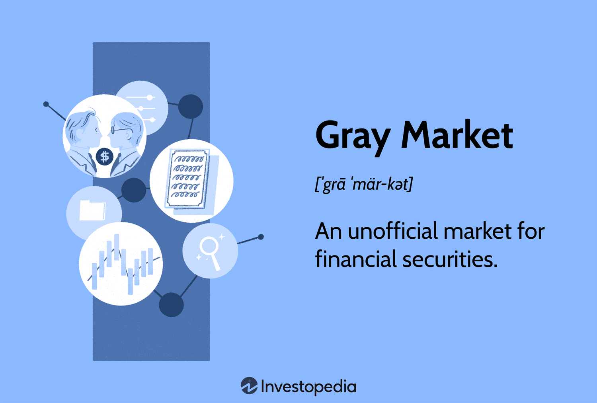

## Table of Contents

## What is the grey market?

The grey market refers to the trading of goods through channels that are not authorized by the original manufacturer or trademark holder. These goods are not illegal, but they are sold outside of the official distribution networks. For example, a product might be bought in one country where it's cheaper and then sold in another country where it's more expensive, even though the manufacturer didn't approve this resale.

People often use the grey market to buy things like electronics, luxury goods, and pharmaceuticals at lower prices. However, buying from the grey market can be risky. The products might not come with the same warranties or guarantees as those bought through official channels. There's also a chance that the goods could be counterfeit or of lower quality. So, while the grey market can offer savings, it's important to be careful and understand the risks involved.

## How does the grey market differ from the black market?

The grey market and the black market are different in some big ways. The grey market is about selling things that are not illegal, but they are sold in ways the maker did not plan. For example, someone might buy a camera in one country and sell it in another where it costs more. The maker did not say it was okay to do this, but it's not against the law. On the other hand, the black market is all about selling things that are illegal. This can include drugs, fake money, or stolen goods. These things are against the law to buy and sell.

Another difference is how safe it is to buy from these markets. When you buy from the grey market, you might not get the same guarantees or service as you would from an official store. There's a chance the product could be fake or not as good, but it's not illegal to buy it. With the black market, it's much riskier. Not only can the products be dangerous or fake, but buying them can get you in trouble with the law. So, while both markets can offer things at lower prices, the risks are much higher with the black market.

## What types of products are commonly found in the grey market?

You can find many different things in the grey market. Electronics like cameras, phones, and computers are very common. People buy these items where they are cheaper and sell them in places where they cost more. Luxury goods like watches, handbags, and designer clothes are also often sold in the grey market. These items can be bought in one country and resold in another for a profit.

Pharmaceuticals are another big category in the grey market. People might buy medicine in countries where it's cheaper and then sell it in places where it's more expensive. This can help people save money, but it can also be risky because the medicine might not be as safe or effective. Other products you might see include car parts, cosmetics, and even toys. The grey market is all about finding a way to sell things that are not illegal but are sold outside the official channels.

## What are the legal implications of buying from the grey market?

Buying from the grey market is not illegal, but there are some things to think about. The products are not fake, but they are sold in ways the maker did not plan. This means you might not get the same guarantees or service as you would from an official store. If something goes wrong with the product, you might not be able to get it fixed or replaced easily.

There can also be issues with taxes and customs. If you buy something from another country, you might have to pay extra money when it arrives. Some countries have rules about importing certain goods, and you could get in trouble if you don't follow these rules. So, while it's not against the law to buy from the grey market, it's important to know the risks and be careful.

## How does the grey market affect manufacturers and official distributors?

The grey market can cause a lot of problems for manufacturers and official distributors. When products are sold through the grey market, manufacturers lose control over where and how their products are sold. This can hurt their brand because the products might be sold in places where the manufacturer does not want them to be. It can also lead to lower profits because grey market sellers often sell the products for less than the official price. This makes it hard for official distributors to compete, and they might lose customers to the grey market.

Another issue is that grey market sales can make it hard for manufacturers to manage their supply and demand. If a lot of products are being sold through the grey market, it can be tough for the manufacturer to know how many products to make. This can lead to too many or too few products on the market, which can mess up their business plans. Official distributors also have to deal with unhappy customers if they find out they paid more for the same product that others bought cheaper on the grey market. So, the grey market can really shake things up for manufacturers and official distributors.

## What are the benefits of purchasing goods from the grey market?

Buying from the grey market can save you money. Products on the grey market are often cheaper than in official stores. This is because people buy them where they cost less and sell them where they cost more. So, if you want to get a good deal on things like electronics, luxury goods, or medicine, the grey market can be a good place to look. You might find a camera or a watch for a lot less than you would pay at a regular store.

Another benefit is that the grey market can give you access to products that are hard to find in your area. Sometimes, a product might not be sold officially in your country, but you can still get it through the grey market. This means you can buy things that you wouldn't be able to get otherwise. While there are risks, the grey market can offer savings and access to more products.

## What are the risks associated with grey market purchases?

Buying from the grey market can be risky. One big risk is that you might not get the same guarantees or service as you would from an official store. If something goes wrong with the product, you might not be able to get it fixed or replaced easily. The product could also be fake or not as good as the one sold in official stores. This means you could end up with something that doesn't work well or breaks quickly.

Another risk is that you might have to deal with taxes and customs. If you buy something from another country, you might have to pay extra money when it arrives. Some countries have rules about importing certain goods, and you could get in trouble if you don't follow these rules. So, while buying from the grey market can save you money, it's important to know the risks and be careful.

## How can consumers identify grey market products?

Consumers can spot grey market products by looking at a few things. One way is to check the price. If a product is a lot cheaper than what you see in official stores, it might be from the grey market. Another clue is the packaging. Grey market products might come in different boxes or without the usual instructions and warranties. Also, if you're buying something online, look at where the seller is located. If it's from a different country, it could be a grey market item.

Another way to tell is by looking at the seller. Official sellers usually have a good reputation and clear information about where they are and how to contact them. Grey market sellers might not have as much information or might be harder to reach. It's also a good idea to check the product's serial number or model number. Sometimes, official websites let you check if a product is real or if it's meant to be sold in your country. By paying attention to these things, you can figure out if you're looking at a grey market product.

## What strategies do companies use to combat the grey market?

Companies use different ways to fight the grey market. One way is to control where their products are sold. They might only let certain stores sell their products and make sure these stores follow strict rules. This helps stop people from buying the products in one place and selling them somewhere else for more money. Companies also use special codes or serial numbers on their products. This makes it easier to track where the products go and stop them from ending up in the grey market.

Another strategy is to change prices in different countries. If a product is much cheaper in one country, people might buy it there and sell it somewhere else. To stop this, companies might make the prices more similar around the world. They also work hard to tell customers about the risks of buying from the grey market. By letting people know they might not get the same service or guarantees, companies hope to keep customers buying from official stores.

## How does the grey market impact the global economy?

The grey market can affect the global economy in big ways. When products are sold through the grey market, it can mess up how much money companies make. This is because grey market sellers often sell things for less than the official price. This can make it hard for official stores to sell their products and can lead to less money for the companies that make the products. When companies make less money, they might have to cut jobs or raise prices, which can affect the whole economy.

The grey market can also change how products move around the world. If a lot of products are bought in one country and sold in another, it can make it hard for companies to know how many products to make. This can lead to too many or too few products in different places, which can mess up the supply and demand. When this happens, it can affect prices and how well the economy is doing. So, while the grey market can help some people save money, it can also cause big problems for the global economy.

## What role does technology play in the expansion of the grey market?

Technology has made the grey market bigger and easier to use. The internet lets people buy and sell things from all over the world. Websites and online marketplaces make it simple to find grey market products. People can look at different sellers and compare prices without leaving their homes. This means more people know about the grey market and can buy from it. Also, technology like smartphones and apps makes it even easier to buy and sell things quickly.

Technology also helps grey market sellers reach more people. Social media and online ads can show grey market products to lots of people. This can make more people interested in buying from the grey market. Plus, technology helps with things like shipping and payments. It's easier to send products to different countries and pay for them online. All of this means the grey market can grow and affect more parts of the world.

## How have grey market trends evolved over the past decade?

Over the past ten years, the grey market has grown a lot because of the internet. It's easier for people to find and buy grey market products online. Websites and apps let people from different countries buy and sell things easily. This has made the grey market bigger and more popular. Also, more people know about the grey market now because of social media and online ads. These tools help sellers reach more buyers and show them what they can buy.

Another big change is that grey market sellers are selling more types of products. Before, it was mostly electronics and luxury goods, but now you can find medicine, car parts, and even toys. This is because technology makes it easier to ship things all over the world. But, as the grey market grows, companies are trying harder to stop it. They are using new ways to control where their products are sold and are telling people about the risks of buying from the grey market. Even with these efforts, the grey market keeps growing and changing.

## References & Further Reading

[1]: Ganslandt, M., & Maskus, K. E. (2004). ["Parallel Imports and the Pricing of Pharmaceutical Products: Evidence from the European Union."](https://www.sciencedirect.com/science/article/abs/pii/S0167629604000670) Journal of Health Economics.

[2]: Maskus, K. E. (2000). ["Parallel Imports."](https://onlinelibrary.wiley.com/doi/abs/10.1111/1467-9701.00329) In *Intellectual Property Rights in the Global Economy* (pp. 110-144). Institute for International Economics.

[3]: Ganslandt, M., & Maskus, K. E. (2004). ["Trade Related Aspects of Intellectual Property Rights."](https://www.ifn.se/Wfiles/wp/WP622.pdf) Handbook of International Economics, Elsevier.

[4]: Kirtsaeng v. John Wiley & Sons, Inc., 568 U.S. 519 (2013). U.S. Supreme Court.

[5]: Clubb, C., & Noyes, C. (2020). ["Algorithmic Trading: A Comprehensive Overview."](https://www.pnnl.gov/publications/parametric-behaviors-clubb-simulations-low-clouds-community-atmosphere-model-cam) arXiv preprint.

[6]: Davidson, A., & Levin, A. (2010). ["The Historical Role of Algorithmic Trading in Market Development."](https://www.researchgate.net/publication/325171537_The_role_of_play_in_children's_development_a_review_of_the_evidence) Management Science.

[7]: Maskus, K. E. (2001). ["Parallel Imports and Intellectual Property Policy in Developing Countries."](https://illinoislawreview.org/wp-content/uploads/2000/12/Maskus.pdf) The World Bank Discussion Paper.

[8]: Yee Wah Chin (2002). ["Antitrust Analysis of Horizontal Restraints: Grey Markets, Leegin, and Dr. Miles"](https://papers.ssrn.com/sol3/papers.cfm?abstract_id=3323551). Journal of Law and Economics.