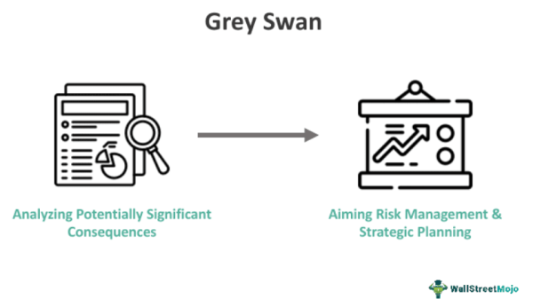

In the fast-paced world of algorithmic trading, managing risks associated with grey swan and unforeseen events is crucial to maintaining profitable and stable trading operations. Algorithmic trading, characterized by its reliance on automated and pre-programmed trading instructions, necessitates robust risk management strategies to address uncertainties in financial markets. While traders often prepare for known risks, grey swan events—those that are unlikely but well within possibility—present a unique challenge.

The primary objective of this article is to explore the importance of integrating effective risk management practices specific to algorithmic trading, with a particular focus on grey swan events. These occurrences, though identified and understood in theory, have the potential to disrupt market conditions significantly and can lead to substantial financial loss if not anticipated adequately.



Grey swan events, unlike their black swan counterparts, offer an opportunity for traders to implement preemptive measures. By understanding the factors that contribute to such events and their potential impact on market dynamics, traders can better position their algorithms to cope with unexpected disruptions. Therefore, recognizing the nuances of grey swan events and developing comprehensive strategies to reduce their adverse effects is vital for traders who aim to preserve capital and achieve long-term success.

Furthermore, this article will examine various risk management techniques that can enhance trading resilience against unforeseen events in the financial markets. These may include strategies such as diversification, hedging, and dynamic position management, which collectively contribute to a more robust, adaptive trading environment.

In summary, effective risk management in algorithmic trading is not solely about safeguarding against evident threats but also about preparing for and mitigating the effects of less predictable but significant grey swan events. Through this discussion, we aim to highlight the importance of anticipating potential risks and equipping traders with tools to navigate the complexities of algorithmic trading in the face of uncertainty.

## Table of Contents

## Understanding Grey Swan Events

Grey swan events represent unlikely but foreseeable disruptions in financial markets. Unlike black swan events, which are entirely unpredictable, grey swans are identifiable risks that market participants can brace for. Such anticipation allows traders to formulate strategies to mitigate potential adverse effects.

Understanding grey swan events requires a recognition of their potential impact and likelihood. These events are characterized by their significant market ramifications despite their initial improbability. Traders and analysts often attempt to identify elements that qualify as grey swan events to better prepare their trading systems.

Several categories define potential grey swan events. Geopolitical tensions are prime examples, such as heightened conflict risks or significant policy shifts that can drastically alter market sentiments and economic stability. Technological breakthroughs also fall within this category, where innovations could disrupt industries, alter supply chains, or change consumer behaviors in unexpected ways. For example, advancements in [artificial intelligence](/wiki/ai-artificial-intelligence) or renewable energy can influence various market segments and trading strategies. Environmental issues, including major climate anomalies or rapid regulatory changes aimed at combating global warming, can exert profound effects on markets by altering resource availability and pricing structures.

Recognizing the implications of these potential events, it is critical for traders to incorporate them into risk assessment models. By integrating grey swan analysis into their strategies, traders enhance their ability to withstand shocks and adjust to unexpected market movements, thus ensuring more resilient trading operations.

## The Role of Risk Management in Algo Trading

Risk management in [algorithmic trading](/wiki/algorithmic-trading) is a critical component that centers around identifying, analyzing, and mitigating risks to safeguard trading portfolios. The core objective is to maintain the integrity and performance of trading strategies amidst the dynamic nature of financial markets. One of the fundamental aspects of risk management is the preservation of capital, which involves implementing measures to prevent significant financial losses that could jeopardize a trader's overall portfolio. This can be achieved through a variety of techniques, such as setting strict stop-loss limits, which automatically close a position if it reaches a predetermined loss level, thereby preventing further losses.

Adapting to dynamic markets is another crucial facet of risk management. Financial markets are inherently volatile, with prices fluctuating due to numerous factors, including economic data releases, geopolitical events, and market sentiment. Traders need to develop adaptable strategies that can respond to changing market conditions, ensuring that they remain effective in both stable and volatile periods. This requires continuous monitoring of market trends and real-time adjustment of trading parameters.

Mitigating market [volatility](/wiki/volatility-trading-strategies) is essential for maintaining the stability of trading strategies. Volatility, although a potential opportunity for gains, can also lead to significant losses if not properly managed. Employing techniques such as diversification, where investments are spread across different assets to reduce exposure to any single asset's risk, can help in minimizing the impact of market swings. Additionally, utilizing hedging strategies, such as options or futures contracts, can protect against adverse price movements.

Effective risk management enhances the stability of algorithmic trading strategies by limiting exposures to potential market disruptions. This stability is achieved through various analytical tools and strategies that assess and quantify risks. For instance, Value at Risk (VaR) models can estimate the potential loss in value of a portfolio under normal market conditions within a specific time frame and confidence level. Stress testing, which simulates extreme market conditions, helps traders understand potential vulnerabilities in their strategies and make necessary adjustments to fortify their risk management framework.

By proactively managing risks, traders can shield their portfolios from abrupt market shifts and maintain a competitive edge in algorithmic trading, ultimately increasing the likelihood of achieving consistent, long-term profitability.

## Types of Risks in Algorithmic Trading

Algorithmic trading, while offering numerous advantages such as speed and efficiency, also presents specific risks that need proper management to ensure effective trading outcomes. These risks can be broadly categorized into Technical, Market, Operational, and Behavioral risks.

**Technical Risks** involve issues arising from the technology underpinning algorithmic trading systems. This encompasses software glitches, hardware failures, and connectivity problems that can disrupt trading activities. For instance, an algorithm might malfunction due to coding errors, which can lead to unintended trading behavior or failure to execute trades as planned. To mitigate technical risks, robust testing and validation of algorithms are essential before deployment. Additionally, implementing failover systems and regular updates can enhance system reliability.

**Market Risks** are associated with fluctuations in market prices, which can affect the performance of trading strategies. These risks arise from unexpected economic events, geopolitical developments, or sudden market movements that the algorithm may not have predicted. Market risks are inherent to all trading activities, but in algorithmic trading, they are often exacerbated by the high-speed execution. Techniques such as diversification, hedging, and the use of advanced predictive models can help manage market risks by spreading exposure and anticipating potential market changes.

**Operational Risks** pertain to the internal processes, systems, and people involved in algorithmic trading. This includes risks related to regulatory compliance, management of data, and execution of trades. For example, failure to comply with trading regulations can result in legal penalties, while errors in trade execution can lead to financial losses. Effective operational risk management involves maintaining strong internal controls, ensuring compliance with applicable regulations, and continually monitoring operational processes for inefficiencies or vulnerabilities.

**Behavioral Risks** involve psychological factors that can influence trading decisions, even in automated systems. These risks stem from human biases that may be inadvertently embedded into the design and programming of algorithms. For example, over-optimistic assumptions about future market conditions or reliance on historical data without considering future uncertainties can lead to poor trading decisions. Mitigating behavioral risks requires a critical evaluation of algorithm design and the inclusion of checks and balances to counteract potential biases.

In conclusion, effective management of these four categories of risks—Technical, Market, Operational, and Behavioral—can significantly enhance the resilience and success of algorithmic trading strategies. Regular assessment, optimization, and adaptation of trading systems are crucial to navigate the complexities and uncertainties inherent in algorithmic trading environments.

## Implementing Risk Management Techniques

Effective risk management in algorithmic trading is essential to mitigate potential losses and optimize returns. Various techniques have been developed to address the inherent risks associated with this form of trading.

Stop-loss and take-profit orders are fundamental tools that allow traders to automatically execute trades when prices hit predefined levels. A stop-loss order is designed to limit an investor’s loss on a position in a security, while a take-profit order ensures the locking in of profits when the market moves favorably.

Portfolio diversification spreads investments across various financial instruments, sectors, or markets, thereby reducing exposure to any single asset or risk. This strategy helps to dampen the impact of adverse market movements on the overall portfolio performance.

Hedging strategies involve taking positions in financial instruments that are inversely correlated with the positions held in the primary portfolio. For example, traders may use derivatives such as options or futures contracts to offset potential losses.

Dynamic position sizing is another technique that helps in managing risk by adjusting the amount of capital allocated to a specific trade based on current market conditions and volatility. This approach ensures that the risk taken is aligned with the overall investment strategy and market dynamics.

Trailing stops are flexible stop orders that adjust dynamically with favorable price movements, allowing traders to protect gains while retaining the potential for future profits. They follow the market price at a specified distance and are activated when the market reverses direction.

Quantitative risk assessment tools, such as stress testing and Value at Risk (VaR), are essential for evaluating potential losses under extreme market conditions. Stress testing simulates various hypothetical scenarios to assess the robustness of trading strategies against unlikely but possible events. The VaR metric provides an estimate of the maximum expected loss over a defined period, given a specified confidence level. It is calculated as follows:

$$
\text{VaR} = \Phi^{-1}(1-\alpha) \cdot \sigma \cdot \sqrt{t}
$$

where $\Phi^{-1}$ is the inverse of the standard normal cumulative distribution function, $\alpha$ is the confidence level, $\sigma$ is the portfolio standard deviation, and $t$ is the time period.

Such tools and techniques are critical in developing robust algorithmic trading systems that can withstand market volatility and unexpected events, ensuring sustained profitability and capital preservation.

## Case Studies of Grey Swan Events Affecting Algo Trading

Analyzing the impacts of specific grey swan events on algorithmic trading strategies provides critical insights into the importance of robust risk management. Two notable examples include Brexit and the COVID-19 pandemic, both of which significantly affected financial markets and trading behaviors.

Brexit, the United Kingdom's decision to leave the European Union, profoundly impacted global financial markets due to its complex economic and political ramifications. The referendum result on June 23, 2016, led to immediate market volatility, with the British pound experiencing its largest one-day loss in history. Algorithmic trading strategies that were optimized for more stable market conditions faced significant challenges. The unexpected nature of the market reaction underscored the necessity for adaptive risk management strategies that can respond to rapid changes in market sentiment and pricing structures. Traders utilizing algorithms had to incorporate real-time risk analysis tools to adjust their positions swiftly and mitigate losses arising from the extreme volatility.

The COVID-19 pandemic presented another grey swan event with far-reaching economic impacts. The initial outbreak in early 2020 led to unprecedented market conditions, characterized by extreme volatility and rapid shifts in market trends as global economies were shut down and then slowly reopened. Algorithmic traders who relied on historical data and pre-pandemic market conditions found their models insufficient in predicting market behavior during the pandemic. The pandemic emphasized the importance of incorporating flexibility within trading models and the ability to adapt to new market paradigms. It prompted the development of more resilient algorithms that included real-time data analysis, sudden spike volatility adaptation techniques, and comprehensive stress testing against similar unexpected shocks.

Learning from these cases, algorithmic traders are encouraged to implement enhanced risk management techniques, including diversification of trading strategies and real-time monitoring systems. These approaches can detect anomalies and adjust trading behaviors proactively. Through scenario analysis and incorporating [machine learning](/wiki/machine-learning) models to predict potential grey swan events, traders can develop strategies resilient to market shocks that are known but occur infrequently.

In essence, the experiences of Brexit and the COVID-19 pandemic underscore the necessity of preemptive risk management strategies. By understanding and learning from these grey swan events, traders can enhance their preparedness for future occurrences, thereby stabilizing their operations in volatile market environments.

## Conclusion

Incorporating robust risk management strategies is vital for mitigating unforeseen risks in algorithmic trading, especially those arising from grey swan events. Grey swan events, while rare, can have significant impacts on financial markets, making preparedness key to maintaining trading stability and safeguarding investments. The ability to anticipate and adapt to potential risks is crucial. Traders must develop methodologies that allow for real-time analysis and adjustment of trading algorithms in response to dynamic market signals.

This involves using sophisticated tools and techniques, such as stress testing and Value at Risk (VaR) models, to simulate various market scenarios and assess potential losses. Consider the following Python snippet as a simple demonstration of how traders might simulate potential market scenarios. This fictional example uses historical data to estimate possible outcomes:

```python
import numpy as np

# Simulate potential daily returns based on historical returns data
def simulate_returns(historical_data, num_simulations, num_days):
    mean_return = np.mean(historical_data)
    std_dev = np.std(historical_data)
    simulations = np.random.normal(mean_return, std_dev, (num_simulations, num_days))
    return simulations

# Example usage
historical_returns = np.array([0.001, 0.002, -0.001, 0.002, -0.002, 0.0005])  # Sample historical returns data
simulated_scenarios = simulate_returns(historical_returns, 10000, 250)  # Simulate 10,000 scenarios over a 250-day trading year
```

Traders should also employ measures like stop-loss and trailing stop orders to limit potential losses preemptively. Adapting strategies in light of evolving market conditions is a critical component of a resilient risk management framework. This requires ongoing scrutiny and adjustment of protocols to account for new data, insights, and threats that may not have been previously considered. This iterative refinement process ensures that trading strategies remain robust and effective against unforeseen market events.

By continuously evaluating and enhancing risk management protocols, traders can better navigate the complexities and uncertainties inherent in algorithmic trading. This proactive approach to risk management not only contributes to individual success but also promotes market stability by mitigating the systemic risks associated with grey swan events.

## References & Further Reading

[1]: Bergstra, J., Bardenet, R., Bengio, Y., & Kégl, B. (2011). ["Algorithms for Hyper-Parameter Optimization."](https://papers.nips.cc/paper/4443-algorithms-for-hyper-parameter-optimization) Advances in Neural Information Processing Systems 24.

[2]: ["Advances in Financial Machine Learning"](https://www.amazon.com/Advances-Financial-Machine-Learning-Marcos/dp/1119482089) by Marcos Lopez de Prado

[3]: ["Evidence-Based Technical Analysis: Applying the Scientific Method and Statistical Inference to Trading Signals"](https://www.amazon.com/Evidence-Based-Technical-Analysis-Scientific-Statistical/dp/0470008741) by David Aronson

[4]: ["Machine Learning for Algorithmic Trading"](https://github.com/stefan-jansen/machine-learning-for-trading) by Stefan Jansen

[5]: ["Quantitative Trading: How to Build Your Own Algorithmic Trading Business"](https://www.amazon.com/Quantitative-Trading-Build-Algorithmic-Business/dp/1119800064) by Ernest P. Chan